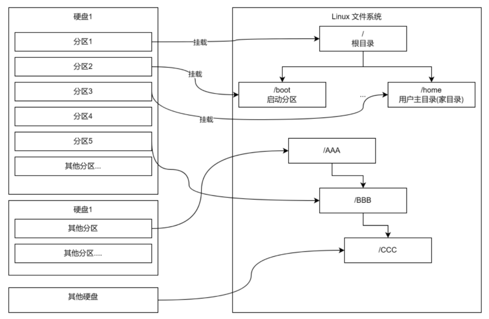

# Linux磁盘分区机制
## 磁盘分区和linux文件系统的关系
1. Linux 系统中的文件系统的总体结构是一定的：只有一个根目录，根目录下的目录结构独立且唯一（如 /boot、/dev、/bin、/etc 目录等都是唯一的），Linux 中的磁盘分区都是文件系统中的一部分。

2. 计算机的硬盘可以有多个、磁盘上的分区也可以有多个。但每个磁盘要想连接到 Linux 系统中，需要将分区“映射”到文件系统的某一个目录下，这样访问目录即可访问对应硬盘分区，这种映射称为“挂载”。

3. 任何目录或其父目录都要挂载到硬盘的某个分区下。如需要将某一分区挂载到根目录下，Linux 系统才能正常工作。

4. 某个分区所挂载的目录，称为此分区的挂载点。

5. 磁盘的不同分区可以挂载到 Linux 文件系统的不同分区下，但不能同时挂载到一个相同的目录。

| ##container## |
|:--:|
||

### lsblk
`lsblk`: 该命令可以查看详细的磁盘分区信息.

示例:
```Shell
[root@hxlinux dev]# lsblk 
NAME   MAJ:MIN RM  SIZE RO TYPE MOUNTPOINT
sda      8:0    0   60G  0 disk 
├─sda1   8:1    0    3G  0 part /boot
├─sda2   8:2    0    6G  0 part [SWAP]
└─sda3   8:3    0   51G  0 part /
sr0     11:0    1 1024M  0 rom  
sr1     11:1    1 1024M  0 rom 
```

### Linux硬盘标识

Linux 硬盘有两种：**IDE 硬盘** 和 **SCSI 硬盘**.

- 对于 IDE 硬盘：驱动器标识为： `hdx~`
  - `hd` 表示分区所在设备的类型，这里 hd = IDE 硬盘
  - `x` 为盘号，区分不同硬盘间的功能

|标识|功能|
|:---:|:---:|
| b |基本从属盘|
| c |辅助主盘|
| d |辅助从属盘|

- - `~` 为分区号，区分同一硬盘上不同分区的功能

|标识|功能|
|:-:|:-:|
|1-4|主分区 或 扩展分区|
|5|逻辑分区|

- 对于 SCSI 硬盘：驱动器标识为： `sdx~`
  - `sd` 表示分区所在设备的类型，这里 sd = SCSI 硬盘
  - `x` 为盘号，区分不同硬盘间的功能（盘号功能标识同 IDE 硬盘 a代表第一块硬盘 b代表第二块硬盘c代表第三块硬盘 d代表第四块硬盘）
  - `~` 为分区号，区分同一硬盘上不同分区的功能（分区号功能标识同 IDE 硬盘）

---
使用 参数`-f` 可以查看详细信息:


`NAME`: 驱动器标识

`FSTYPE`: 文件系统类型

`LABLE`: 文件系统 LABLE

`UUID`: 分区唯一标识符，格式化磁盘后，会给分区分配一个32位的唯一的字符串

`MOUNTPOINT`: 挂载点

```Shell
[root@hxlinux dev]# lsblk -f
NAME   FSTYPE LABEL UUID                                 MOUNTPOINT
sda                                                      
├─sda1 xfs          4c71ca25-3c9f-4f98-b19d-0923529a91c9 /boot
├─sda2 swap         415e55e2-832e-4e37-b71f-a625247e10f6 [SWAP]
└─sda3 xfs          c20fab58-ed93-4717-8fee-6fc19537d6a4 /
sr0                                                      
sr1  
```