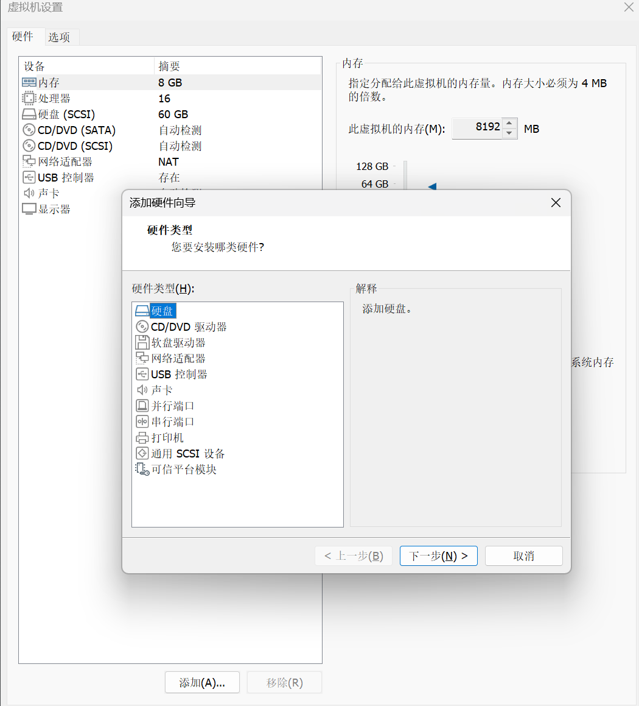
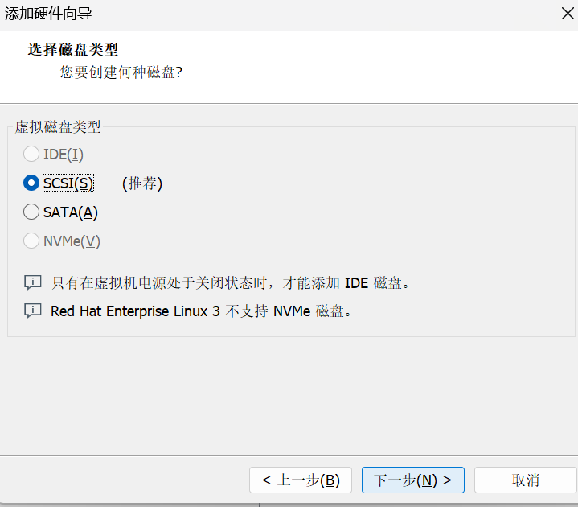
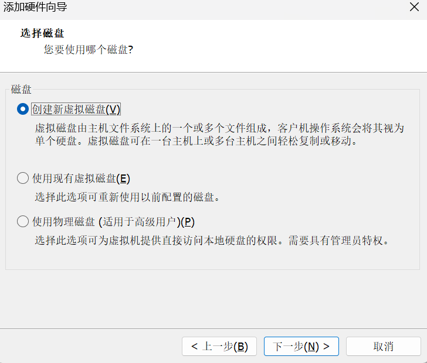
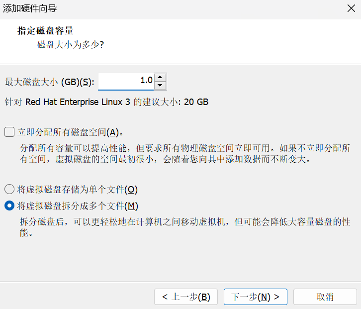
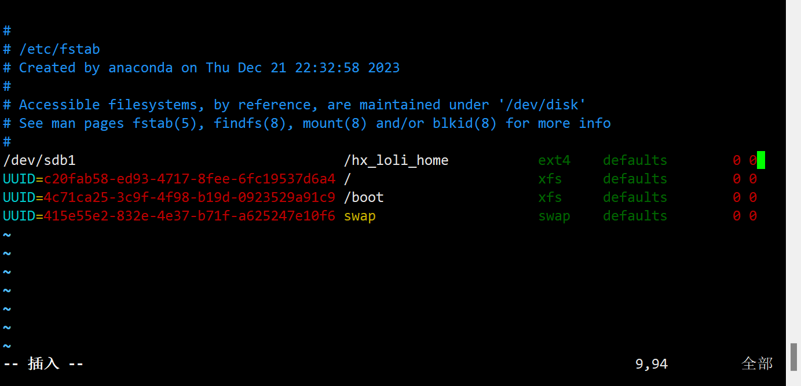

# 磁盘挂载的案例
需求：下面我们以增加一块硬盘来熟悉磁盘的相关指令，深入理解磁盘分区、卸载、挂载的概念。

## 新增硬盘
我们右键虚拟机，点击设置。

| ##container## |
|:--:|
||
|  |

添加成功后, 我们**重启**一下Linux.

然后, 通过`lsblk`可以看到新安装的硬盘:
```Shell
[root@hxlinux ~]# lsblk
NAME   MAJ:MIN RM  SIZE RO TYPE MOUNTPOINT
sda      8:0    0   60G  0 disk 
├─sda1   8:1    0    3G  0 part /boot
├─sda2   8:2    0    6G  0 part [SWAP]
└─sda3   8:3    0   51G  0 part /
sdb      8:16   0    1G  0 disk 
sr0     11:0    1 1024M  0 rom  
sr1     11:1    1 1024M  0 rom 
```

这个 `sdb` 就是我们刚刚添加的硬盘.

## 给新增的硬盘分区

接下来，我们需要给这块硬盘进行分区操作(我们就分1个分区)。我们知道，Linux会把设备映射成文件，并将文件保存在`/dev`目录下面。

```Shell
[root@hxlinux ~]# find / -name sdb
/dev/sdb
```

接下来我们就进行分区的具体操作:

```Shell
[root@hxlinux ~]# fdisk /dev/sdb
欢迎使用 fdisk (util-linux 2.23.2)。

更改将停留在内存中，直到您决定将更改写入磁盘。
使用写入命令前请三思。

Device does not contain a recognized partition table
使用磁盘标识符 0x7bea2371 创建新的 DOS 磁盘标签。

命令(输入 m 获取帮助)：n # 输入 n 即 new 一个分区
Partition type:
   p   primary (0 primary, 0 extended, 4 free)
   e   extended
Select (default p): p # p 即 主分区
分区号 (1-4，默认 1)：1 # 分区数量
起始 扇区 (2048-2097151，默认为 2048)： # 默认值回车
将使用默认值 2048
Last 扇区, +扇区 or +size{K,M,G} (2048-2097151，默认为 2097151)： # 默认值回车
将使用默认值 2097151
分区 1 已设置为 Linux 类型，大小设为 1023 MiB

命令(输入 m 获取帮助)：w # 输入 w 保存所有配置, 如果不想保存就输入 q, 这样就不会执行操作
The partition table has been altered!

Calling ioctl() to re-read partition table.
正在同步磁盘。
```

此时再次查看硬盘, 就发现:

```Shell
[root@hxlinux ~]# lsblk
NAME   MAJ:MIN RM  SIZE RO TYPE MOUNTPOINT
sda      8:0    0   60G  0 disk 
├─sda1   8:1    0    3G  0 part /boot
├─sda2   8:2    0    6G  0 part [SWAP]
└─sda3   8:3    0   51G  0 part /
sdb      8:16   0    1G  0 disk 
└─sdb1   8:17   0 1023M  0 part 
sr0     11:0    1 1024M  0 rom  
sr1     11:1    1 1024M  0 rom  
```

并且, 也可以发现对应的文件描述 `sdb1`.
```Shell
[root@hxlinux ~]# find / -name sdb1
/dev/sdb1
```

现在的分区可以挂载吗？不可以，因为我们的磁盘分区还没有**格式化**！

即, 此时还没有 UUID(格式化才有) :

```Shell
[root@hxlinux ~]# lsblk -f
NAME   FSTYPE LABEL UUID                                 MOUNTPOINT
sda                                                      
├─sda1 xfs          4c71ca25-3c9f-4f98-b19d-0923529a91c9 /boot
├─sda2 swap         415e55e2-832e-4e37-b71f-a625247e10f6 [SWAP]
└─sda3 xfs          c20fab58-ed93-4717-8fee-6fc19537d6a4 /
sdb                                                      
└─sdb1                                                   
sr0                                                      
sr1    
```

## 格式化磁盘分区
接下来，我们使用格式化命令`mkfs -t [文件系统类型] [对应描述文件]`<sup>[1]</sup>来对磁盘分区进行格式化:

```Shell
[root@hxlinux ~]# mkfs -t ext4 /dev/sdb1
mke2fs 1.42.9 (28-Dec-2013)
文件系统标签=
OS type: Linux
块大小=4096 (log=2)
分块大小=4096 (log=2)
Stride=0 blocks, Stripe width=0 blocks
65536 inodes, 261888 blocks
13094 blocks (5.00%) reserved for the super user
第一个数据块=0
Maximum filesystem blocks=268435456
8 block groups
32768 blocks per group, 32768 fragments per group
8192 inodes per group
Superblock backups stored on blocks: 
    32768, 98304, 163840, 229376

Allocating group tables: 完成                            
正在写入inode表: 完成                            
Creating journal (4096 blocks): 完成
Writing superblocks and filesystem accounting information: 完成

[root@hxlinux ~]# lsblk -f
NAME   FSTYPE LABEL UUID                                 MOUNTPOINT
sda                                                      
├─sda1 xfs          4c71ca25-3c9f-4f98-b19d-0923529a91c9 /boot
├─sda2 swap         415e55e2-832e-4e37-b71f-a625247e10f6 [SWAP]
└─sda3 xfs          c20fab58-ed93-4717-8fee-6fc19537d6a4 /
sdb                                                      
└─sdb1 ext4         3991da64-d912-4108-aba6-50aa5c6b3856 
sr0                                                      
sr1  
```

发现存在 UUID 说明格式化成功! (但是还没有挂载点)

## 挂载分区
接下来，我们要将分区进行挂载，挂载到哪里去，挂载到指定的目录下面。所以我们需要先创建一个目录。我们在根目录下面创建一个目录`hx_loli_home`(当前我们可以在任意地方定义需要被挂载的目录，并不一定在根目录(这个只是案例需要))。

```Shell
[root@hxlinux ~]# cd /
[root@hxlinux /]# mkdir hx_loli_home
[root@hxlinux /]# mount /dev/sdb1 /hx_loli_home/ # 设置挂载
[root@hxlinux /]# lsblk -f
NAME   FSTYPE LABEL UUID                                 MOUNTPOINT
sda                                                      
├─sda1 xfs          4c71ca25-3c9f-4f98-b19d-0923529a91c9 /boot
├─sda2 swap         415e55e2-832e-4e37-b71f-a625247e10f6 [SWAP]
└─sda3 xfs          c20fab58-ed93-4717-8fee-6fc19537d6a4 /
sdb                                                      
└─sdb1 ext4         3991da64-d912-4108-aba6-50aa5c6b3856 /hx_loli_home
sr0                                                      
sr1 
```

查看`lsblk -f`, 发现对应`MOUNTPOINT`有内容, 就说明挂载成功.

如果我们不想让当前分区`sdb`1和`hx_loli_home`目录挂载了。我们可以**卸载分区**:

命令: `umount /dev/sdb1` 或者 `umount hx_loli_home`

<b style="color:red">注意: 用命令行挂载的方式重启后会失效!!!, 也就是说这种挂载关系是临时的。</b>

## 永久挂载

如果我们想实现永久挂载呢？我们可以通过修改`/etc/fstab`文件实现永久挂载。添加完成后，执行

`mount -a`（或者`reboot`）即刻生效。

| ##container## |
|:--:|
||
|编辑如上, 然后保存并退出|


```Shell
[root@hxlinux /]# vim /etc/fstab 
[root@hxlinux /]# cat /etc/fstab 

#
# /etc/fstab
# Created by anaconda on Thu Dec 21 22:32:58 2023
#
# Accessible filesystems, by reference, are maintained under '/dev/disk'
# See man pages fstab(5), findfs(8), mount(8) and/or blkid(8) for more info
#
/dev/sdb1                                 /hx_loli_home           ext4    defaults        0 0
UUID=c20fab58-ed93-4717-8fee-6fc19537d6a4 /                       xfs     defaults        0 0
UUID=4c71ca25-3c9f-4f98-b19d-0923529a91c9 /boot                   xfs     defaults        0 0
UUID=415e55e2-832e-4e37-b71f-a625247e10f6 swap                    swap    defaults        0 0
```

## 注解
### [1]

在Linux系统中，常见的文件系统类型有以下几种：

1. ext2：是Linux系统最早的第二扩展文件系统，已经逐渐被后续的ext3和ext4所取代。
2. ext3：是ext2文件系统的一种升级版本，支持日志（journaling）功能，提供更好的文件系统一致性和恢复能力。
3. ext4：是ext3文件系统的下一代，也是当前广泛使用的Linux文件系统。它具有更高的性能、更大的文件和分区大小限制，并支持更快的文件系统检查和修复。
4. XFS：是由SGI开发的高性能日志文件系统，能够处理大型文件和大容量存储设备。
5. Btrfs：是一个复杂的文件系统，具有许多先进的特性，如快照、数据压缩、在线数据校验等。
6. JFS：是IBM开发的日志文件系统，具有高性能和可靠性。
7. ReiserFS：是一个支持日志和B+树的高性能文件系统，但在最近的Linux内核中已经不再得到广泛支持。

除了这些常见的文件系统类型外，还有一些其他的文件系统类型，如FAT32、NTFS（用于Windows系统）、ZFS（用于Solaris和FreeBSD系统）等。

每种文件系统类型都有其特定的优势和适用场景，你可以根据自己的需求选择适合的文件系统类型来格式化设备。