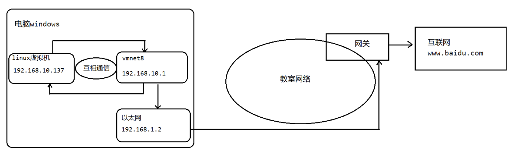
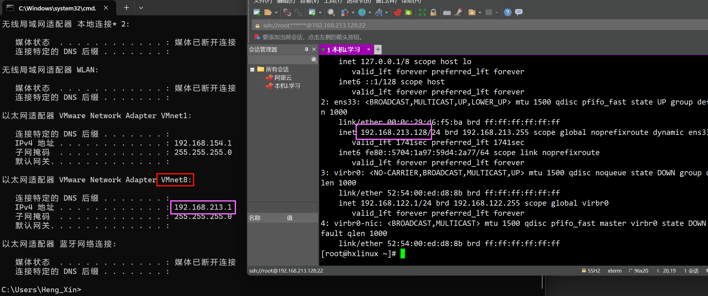
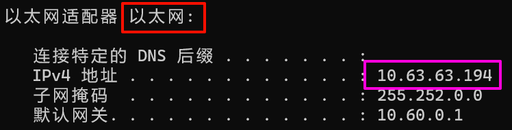

# Linux NAT网络原理
前面我们在安装linux的时候，我们指定网络的连接方式是NAT模式，那么这一节，我们就来研究NAT网络模式的原理。

现在大家思考一个问题，为什么我们可以在linux操作系统里面访问外网(比如访问百度)?

接下来我们通过一幅图来理解:

| ##container## |
|:--:|
||

解读:

首先我们查看虚拟机上linux操作系统的地址(`ip arr`指令) 和 (在windows操作系统里面使用`ipconfig`命令)查看vmnet8的ip地址


以及以太网ip地址:


接下来我们来互相ping一下，看能否ping通。

在windows操作系统里面ping linux的ip地址:

```CMD
C:\Users\Heng_Xin>ping 192.168.213.128

正在 Ping 192.168.213.128 具有 32 字节的数据:
来自 192.168.213.128 的回复: 字节=32 时间<1ms TTL=64
来自 192.168.213.128 的回复: 字节=32 时间<1ms TTL=64
来自 192.168.213.128 的回复: 字节=32 时间<1ms TTL=64
来自 192.168.213.128 的回复: 字节=32 时间<1ms TTL=64

192.168.213.128 的 Ping 统计信息:
    数据包: 已发送 = 4，已接收 = 4，丢失 = 0 (0% 丢失)，
往返行程的估计时间(以毫秒为单位):
    最短 = 0ms，最长 = 0ms，平均 = 0ms
```

我们发现可以ping通过，接下来我们在linux操作系统里面ping wmnet8的ip地址:
```Shell
[root@hxlinux ~]# ping 192.168.213.1
PING 192.168.213.1 (192.168.213.1) 56(84) bytes of data.
64 bytes from 192.168.213.1: icmp_seq=1 ttl=128 time=0.652 ms
64 bytes from 192.168.213.1: icmp_seq=2 ttl=128 time=0.902 ms
64 bytes from 192.168.213.1: icmp_seq=3 ttl=128 time=0.886 ms
64 bytes from 192.168.213.1: icmp_seq=4 ttl=128 time=0.863 ms
^C
--- 192.168.213.1 ping statistics ---
4 packets transmitted, 4 received, 0% packet loss, time 3005ms
rtt min/avg/max/mdev = 0.652/0.825/0.902/0.107 ms
```

*如果ping不通，就是windows防火墙的问题，我们关闭防火墙即可。*

我们在linux操作系统里面也可以直接ping通以太网，说明linux和vmnet8之间是可以互通的。

我们可以在linux里面ping通 以太网的地址:
```Shell
[root@hxlinux ~]# ping 26.56.151.120
PING 26.56.151.120 (26.56.151.120) 56(84) bytes of data.
64 bytes from 26.56.151.120: icmp_seq=1 ttl=128 time=1.25 ms
64 bytes from 26.56.151.120: icmp_seq=2 ttl=128 time=1.64 ms
64 bytes from 26.56.151.120: icmp_seq=3 ttl=128 time=1.64 ms
^C
--- 26.56.151.120 ping statistics ---
3 packets transmitted, 3 received, 0% packet loss, time 2003ms
rtt min/avg/max/mdev = 1.256/1.514/1.646/0.182 ms
```

由于以太网可以通过网关连接外部的互联网，所以我们通过linux操作系统可以连接外部的网络了。