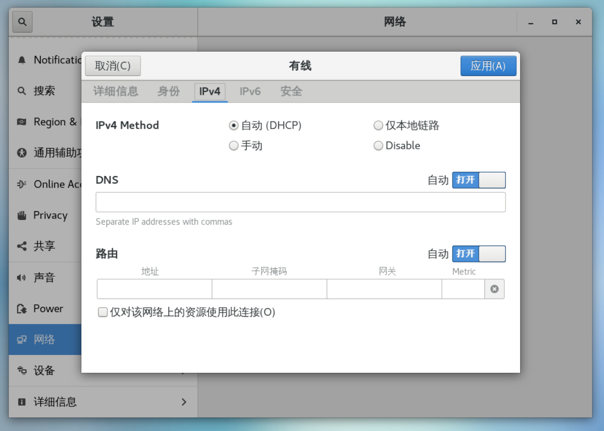
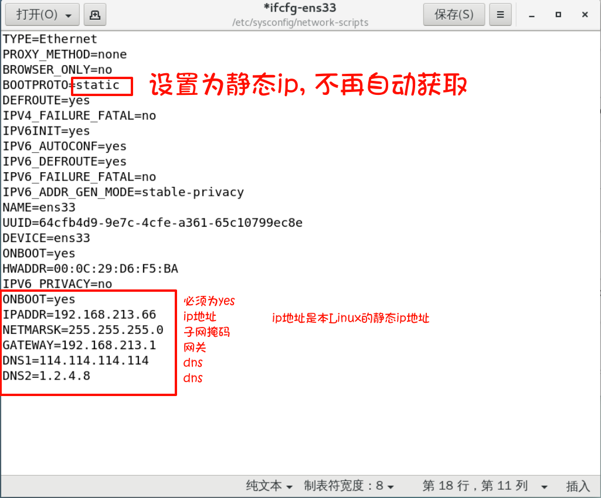
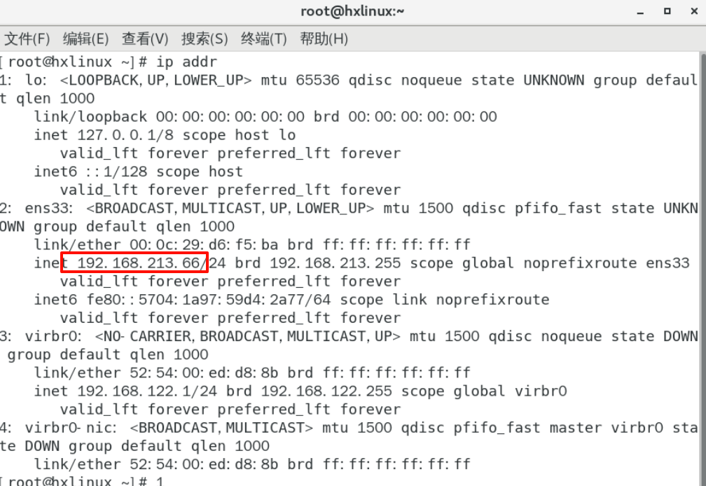

# Linux网络环境配置(固定ip)
## Linux网络配置的指令

```命令
ipaddr   在linux查看ip地址
ifconfig 在linux查看ip地址
ping     是否ping通指定的ip地址
ipconfig 在windows操作系统里面查看网络的ip地址
```

## 固定ip

默认情况下，我们linux操作系统ip获取的方式是自动获取的方式，我们可以查看自己linux操作系统，看看ip的获取方式：

| ##container## |
|:--:|
||

这种自动获取ip的方式不需要任何设置就可以实现，但是非常容易造成ip冲突，而且在公司里面，我们一般都会将linux操作系统的ip地址固定下来，所以接下来我们需要手动固定linux操作系统的ip地址。

### 第一步 编辑我们linux的网卡文件
这个网卡文件在`/etc/sysconfig/network-scripts/ifcfg-ens33`
打开这个文件，进行编辑

| ##container## |
|:--:|
||
|编辑网卡文件 `ifcfg-enss33`|
|(注: *具体要编辑哪个文件还得看你的网卡是什么(有的是ens33 有的是 ens32)*)|

注意: 上面图片有错误 在设置`网关`的地方, 其ip地址是异于当前win的`VM8的ip` 和 当前`Linux ip` 的 一个ip才行!(比如: 192.168.213.2)

- 重启网络服务(`systemctl restart network`)或者重启系统(`reboot`)

| ##container## |
|:--:|
||
|可以看到ip已经变了|

如果可以 ping www.baidu.com , 那么就是配置成功...