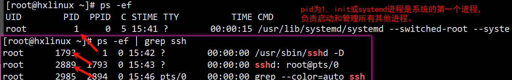
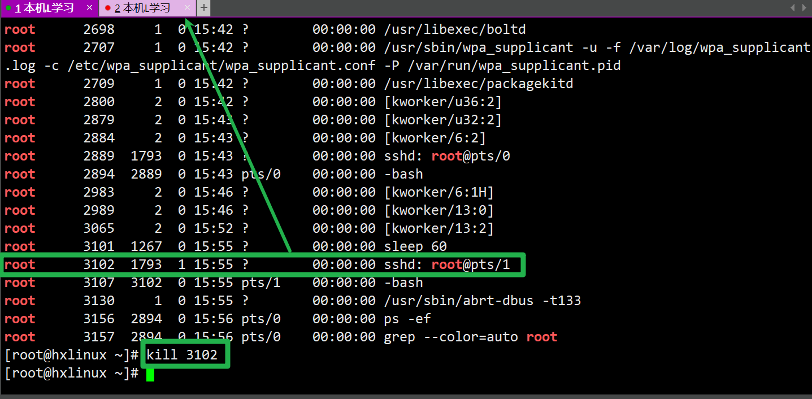
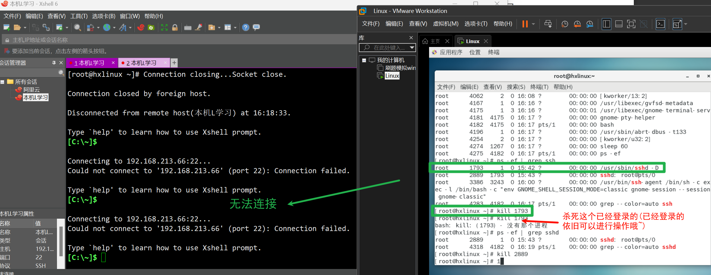
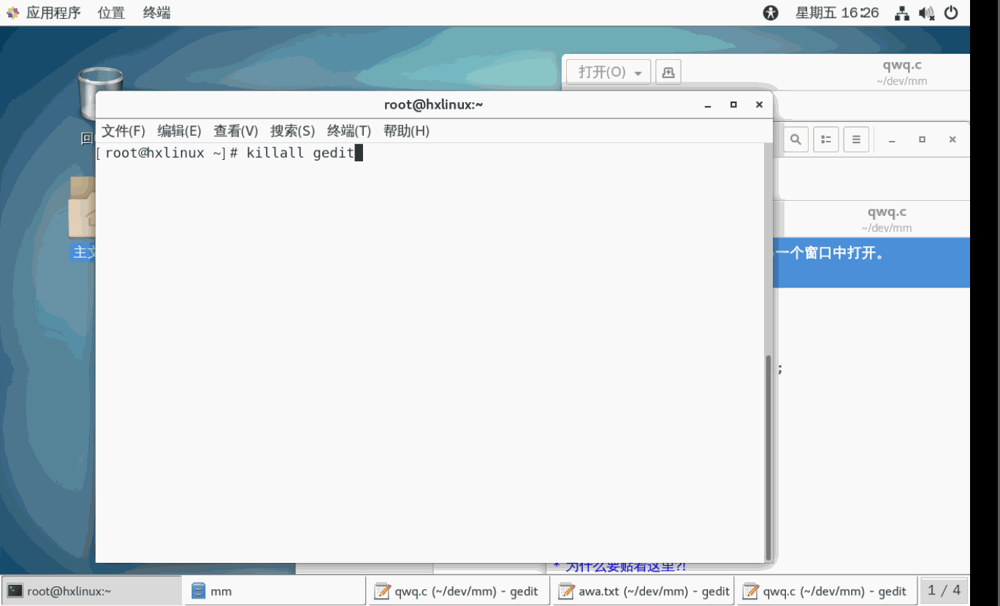
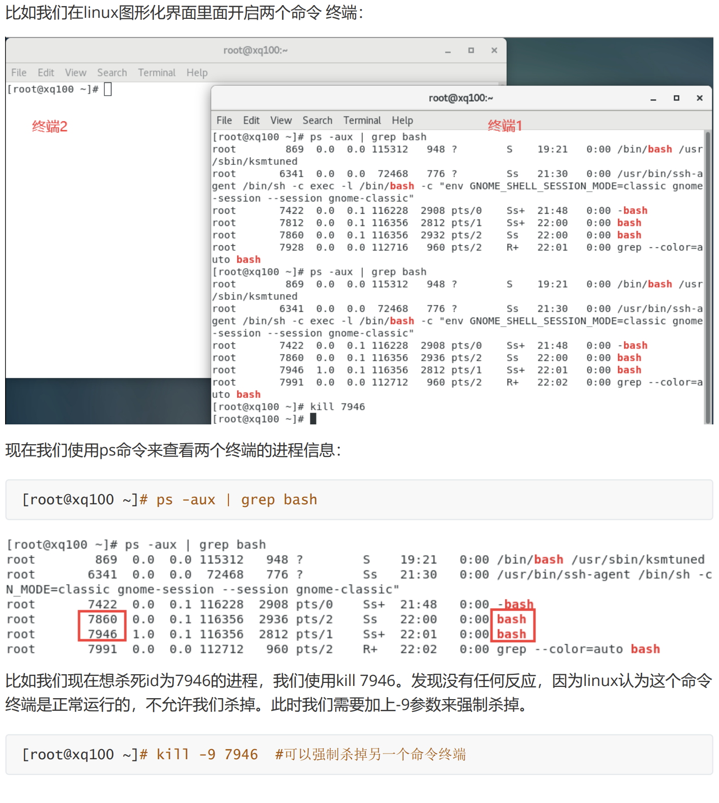

# Linux进程相关指令

## 查看父子进程

`ps -ef`: 以全格式显示当前的所有进程，查看进行的父进程.

- `-e`: 显示所有进程
- `-f`: 全格式显示

示例: 查看指定进程信息(使用了grep过滤)

*`ssh`为管理远程连接的进程*
```Shell
[root@hxlinux ~]# ps -ef | grep ssh
# 所属用户 进程id 父进程id 占用 时间
root      1793     1      0 15:42 ?        00:00:00 /usr/sbin/sshd -D
root      2889  1793      0 15:43 ?        00:00:00 sshd: root@pts/0
root      2985  2894      0 15:46 pts/0    00:00:00 grep --color=auto ssh
```

| ##container## |
|:--:|
||

## 终止进程

若是某个进程执行一半需要停止时候，或是已经消耗了很大的系统资源时候,可以考虑停止该线程。

基本语法：
```Bash
kill [选项] [pid]    # 过进程号杀死/终止进程。
killall             # 会杀死当前进程和其子进程。
```

常用选项:

`-9`: 表示强迫进程立即停止

示例1: 终止远程用户链接:
| ##container## |
|:--:|
||

示例2: 终止远程登录服务sshd。不允许远程登录。然后重启sshd服务，允许远程登录。

| ##container## |
|:--:|
||

此时我们可以使用`/bin/systemctl start sshd.service`重启`ssd`服务，这样就可以再次远程登录了。

```Shell
[root@hxlinux ~]# /bin/systemctl start sshd.service
[root@hxlinux ~]# ps -ef | grep sshd
root      4435     1  1 16:23 ?        00:00:00 /usr/sbin/sshd -D
root      4443  4182  0 16:23 pts/1    00:00:00 grep --color=auto sshd
```

示例3: 终止多个gedit（记事本打开文件的进程），演示`killall`.

| ##container## |
|:--:|
||

示例4: 强制杀死

| ##container## |
|:--:|
||
