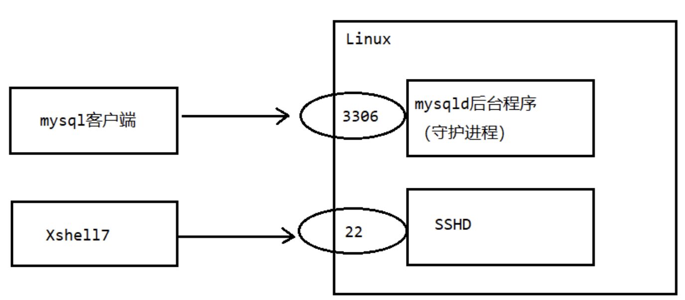
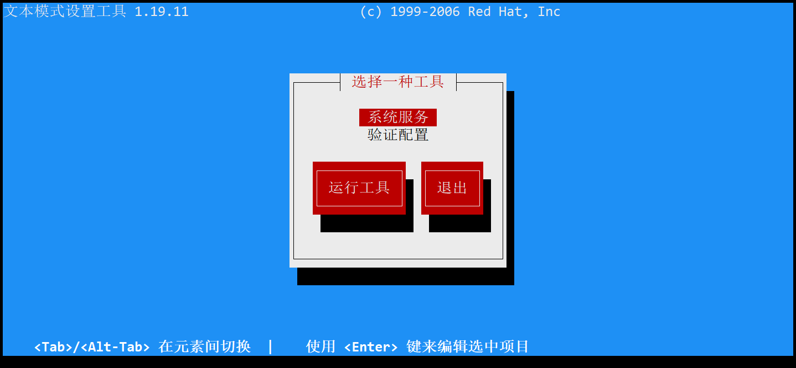
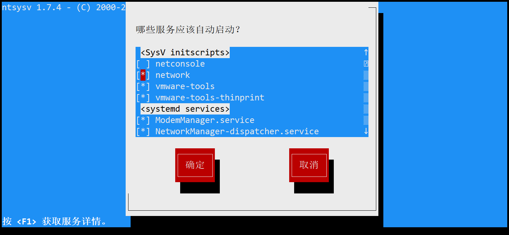

# Linux服务管理之service指令

## 基础知识--service

service(本质)就是进程，但是是运行在后台的，通常都会**监听某个端口**，等待其他程序的请求，比如说（mysql3306，sshd222，redis6379)，因为我们又称为**守护进程**，在Linux中是重要的知识点。

下面我们用一幅图来解释什么是守护进程:

| ##container## |
|:--:|
||

## service管理 指令

- 语法: `service [服务名] [start|stop,reload,status]`
- service 指令管理的服务在`/etc/init.d`查看
- <span style="color:red">**注意**：在 $Centos 7.0$ 以后，很多服务使用`systemctl`管理。</span>

```Shell
[root@hxlinux ~]# cd /etc/init.d/
[root@hxlinux init.d]# ll
总用量 100
-rw-r--r--. 1 root root 18281 3月  29 2019 functions
-rwxr-xr-x. 1 root root  4569 3月  29 2019 netconsole
-rwxr-xr-x. 1 root root  7923 3月  29 2019 network
-rw-r--r--. 1 root root  1160 8月   8 2019 README
-rwxr-xr-x. 1 root root 44263 1月   3 05:35 vmware-tools
-rwxr-xr-x. 1 root root 15721 1月   3 05:35 vmware-tools-thinprint
```

我们可以简单使用一下，比如查看network服务的状态:

```Shell
[root@hxlinux init.d]# service network status 
已配置设备：
lo ens33 eth0
当前活跃设备：
lo ens33 virbr0
```

案例: 使用service指令，查看，关闭启动network *[注意在虚拟系统演示时:因为网络连接会关闭]*

```Shell
[root@hxlinux ~]# service network stop  # 此时Xshell连接linux会连接不上
[root@hxlinux ~]# service network start # 重启网络服务 此时Xshell会连接上linux
```

## 更多的系统服务

我们可以通过`setup`指令去查看

| ##container## |
|:--:|
||
||
|可以通过[空格]来选择是否自启动(有`*`则`是`), [TAB]可以切换操作界面按键|
