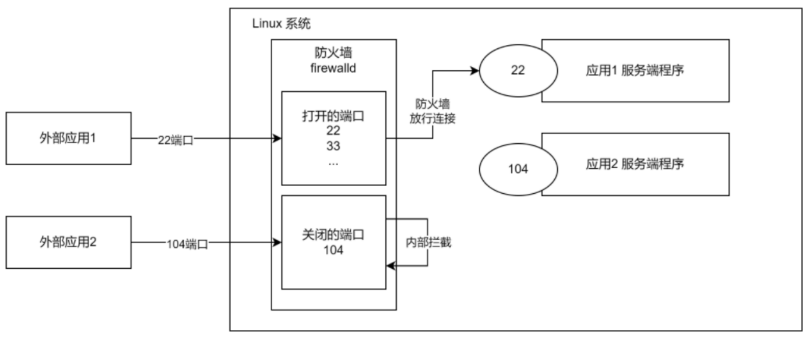

# Linux服务指令之防火墙指令
防火墙的核心功能: 打开或关闭对应端口。关闭端口，则外部的数据请求不能通过对应的端口，与服务器上的程序进行通信

在真正的生产环境，为保证安全，需要启动防火墙并配置打开和关闭的端口。

| ##container## |
|:--:|
||

基本语法：
- 打开端口/允许协议

`firewall-cmd --permanent --add-port=端口号/协议`

- 关闭端口/禁用协议

`firewall-cmd --permanent --remove-port=端口号/协议`

- 查询端口/协议是否开启

`firewall-cmd --query-port=端口/协议`

- 查询防火墙所有开放的端口/协议配置

`firewall-cmd --list-ports`

- 重载防火墙 (开放/关闭后需要重载才能生效)

`firewall-cmd --reload`

示例:

```Shell
[root@hxlinux ~]# firewall-cmd --permanent --add-port=11451/tcp # 开放11451端口, 并且指定传输协议为tcp
success
[root@hxlinux ~]# firewall-cmd --query-port=11451/tcp # 查询11451端口是否开放
no
[root@hxlinux ~]# firewall-cmd --reload # 重载防火墙
success
[root@hxlinux ~]# firewall-cmd --query-port=11451/tcp # 再次查询11451端口
yes
[root@hxlinux ~]# firewall-cmd --list-ports # 查看开放的所有端口
11451/tcp
```