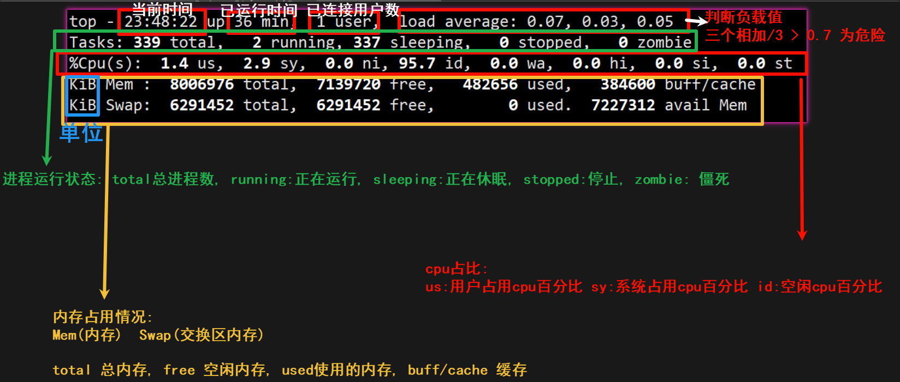

# Linux进程管理top指令

## 动态监控

top与ps命令一样，它们都用来显示正在执行的进程。top与ps最大的不同之处，在于top在执行一段时间可以**更新**正在运行的进程。

基本语法：
top [选项]

|选项|功能|
|:-:|:-|
|`-d秒数`|指定top命令每隔几秒刷新，默认3秒|
|`-i`|使用top不显示任何闲置或者僵死的进程|
|`-p`|通过指定监控ID来仅仅监控某个进程的状态|

## top指令详解

```Shell
[root@hxlinux ~]# top -d10
top - 23:47:58 up 36 min,  1 user,  load average: 0.01, 0.02, 0.05
Tasks: 339 total,   1 running, 338 sleeping,   0 stopped,   0 zombie
%Cpu(s):  0.3 us,  0.7 sy,  0.0 ni, 99.0 id,  0.0 wa,  0.0 hi,  0.0 si,  0.0 st
KiB Mem :  8006976 total,  7138588 free,   483796 used,   384592 buff/cache
KiB Swap:  6291452 total,  6291452 free,        0 used.  7226176 avail Mem 

  PID USER      PR  NI    VIRT    RES    SHR S  %CPU %MEM     TIME+ COMMAND                          
 3482 root      20   0  162152   2408   1556 R  11.8  0.0   0:00.04 top                              
    9 root      20   0       0      0      0 S   5.9  0.0   0:02.06 rcu_sched                        
    1 root      20   0  194312   7416   4192 S   0.0  0.1   0:11.93 systemd                          
    2 root      20   0       0      0      0 S   0.0  0.0   0:00.35 kthreadd                         
    4 root       0 -20       0      0      0 S   0.0  0.0   0:00.00 kworker/0:0H                     
    5 root      20   0       0      0      0 S   0.0  0.0   0:00.00 kworker/u32:0                    
    6 root      20   0       0      0      0 S   0.0  0.0   0:00.12 ksoftirqd/0                      
    7 root      rt   0       0      0      0 S   0.0  0.0   0:00.40 migration/0                      
    8 root      20   0       0      0      0 S   0.0  0.0   0:00.00 rcu_bh                           
   10 root       0 -20       0      0      0 S   0.0  0.0   0:00.00 lru-add-drain                    
   11 root      rt   0       0      0      0 S   0.0  0.0   0:00.12 watchdog/0                       
   12 root      rt   0       0      0      0 S   0.0  0.0   0:00.10 watchdog/1                       
   13 root      rt   0       0      0      0 S   0.0  0.0   0:00.28 migration/1   
```

|说明|
|:--:|
||

## top指令的交互操作
当我们输入top命令之后，我们可以按下面的字符来进行对应的交互操作。

交互操作说明:

|操作|功能|
|:-|:-|
|P|以CPU使用率来排序，默认就是此项|
|M|以内存使用来排序|
|N|以PID排序|
|q|退出top|

### 实例
#### 监听用户

输入`top`, 按 小写`u`, 再输入 `heng_xin`用户名(前提是该用户已经登录了)
```Shell
[root@hxlinux ~]# top
top - 00:05:19 up 53 min,  2 users,  load average: 0.02, 0.02, 0.05
Tasks: 345 total,   1 running, 344 sleeping,   0 stopped,   0 zombie
%Cpu(s):  0.0 us,  0.1 sy,  0.0 ni, 99.9 id,  0.0 wa,  0.0 hi,  0.0 si,  0.0 st
KiB Mem :  8006976 total,  7126812 free,   493324 used,   386840 buff/cache
KiB Swap:  6291452 total,  6291452 free,        0 used.  7216540 avail Mem 
Which user (blank for all) heng_xin
  PID USER      PR  NI    VIRT    RES    SHR S  %CPU %MEM     TIME+ COMMAND                          
 3775 heng_xin  20   0  116344   2896   1664 S   0.0  0.0   0:00.07 bash    
```

#### 杀死进程

输入`top`, 按 `k`, 然后输入**进程号(PID)**, 回车后, 输入9, 强制删除.

这里我们把`heng_xin`用户的进程号 3775 杀死, 以下是该用户(被杀死的)看到的内容:(前提是从其他用户登录, 而不是直接连接, 不然就是断开连接了!)
```Shell
[root@hxlinux ~]# su heng_xin
[heng_xin@hxlinux root]$ 已杀死
[root@hxlinux ~]# 
```