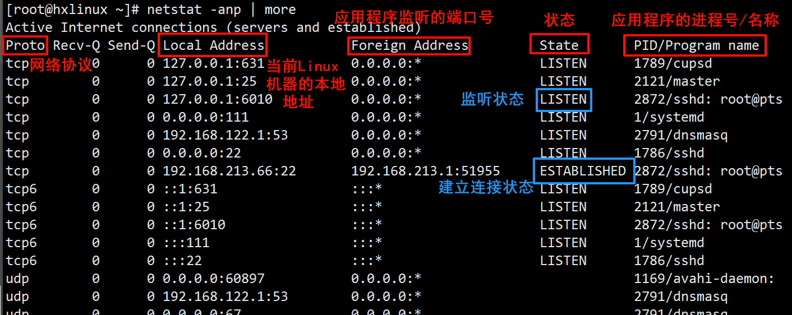
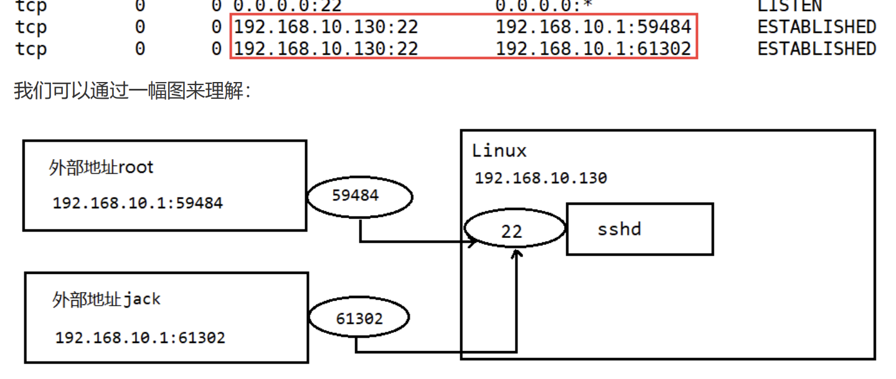

# Linux网络监控指令netstat
## 监控网络状态

基本语法:

```Bash
netstat [选项]
```

选项说明:
- `-an`: 按照一定的属性排列输出
- `-p`: 显示哪个进程在调用

示例:

```Shell
[root@hxlinux ~]# netstat -anp
Active Internet connections (servers and established)
Proto Recv-Q Send-Q Local Address           Foreign Address         State       PID/Program name    
tcp        0      0 127.0.0.1:631           0.0.0.0:*               LISTEN      1789/cupsd          
tcp        0      0 127.0.0.1:25            0.0.0.0:*               LISTEN      2121/master         
tcp        0      0 127.0.0.1:6010          0.0.0.0:*               LISTEN      2872/sshd: root@pts 
tcp        0      0 0.0.0.0:111             0.0.0.0:*               LISTEN      1/systemd           
tcp        0      0 192.168.122.1:53        0.0.0.0:*               LISTEN      2791/dnsmasq        
tcp        0      0 0.0.0.0:22              0.0.0.0:*               LISTEN      1786/sshd           
tcp        0      0 192.168.213.66:22       192.168.213.1:51955     ESTABLISHED 2872/sshd: root@pts 
tcp6       0      0 ::1:631                 :::*                    LISTEN      1789/cupsd          
tcp6       0      0 ::1:25                  :::*                    LISTEN      2121/master         
tcp6       0      0 ::1:6010                :::*                    LISTEN      2872/sshd: root@pts 
tcp6       0      0 :::111                  :::*                    LISTEN      1/systemd           
tcp6       0      0 :::22                   :::*                    LISTEN      1786/sshd     
```

|说明|
|:--:|
||

如何理解Foreign Address呢?

| ##container## |
|:--:|
||

### 示例

#### 查看指定服务名称的服务信息
(不就是过滤嘛qwq)
```Shell
[root@hxlinux ~]# netstat -anp | grep ssh
tcp        0      0 127.0.0.1:6010          0.0.0.0:*               LISTEN      2872/sshd: root@pts 
tcp        0      0 0.0.0.0:22              0.0.0.0:*               LISTEN      1786/sshd           
tcp        0      0 192.168.213.66:22       192.168.213.1:51955     ESTABLISHED 2872/sshd: root@pts 
tcp6       0      0 ::1:6010                :::*                    LISTEN      2872/sshd: root@pts 
tcp6       0      0 :::22                   :::*                    LISTEN      1786/sshd           
unix  2      [ ]         DGRAM                    38947    2872/sshd: root@pts  
unix  3      [ ]         STREAM     CONNECTED     19067    1786/sshd
```