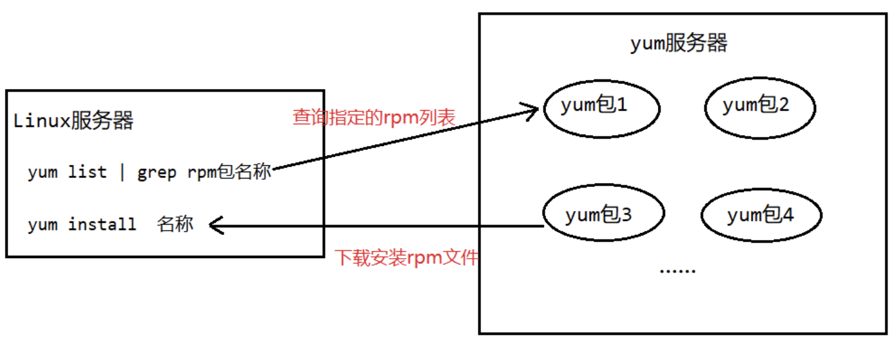

# Linux yum指令

Yum是一个Shell前端软件包管理器，基于RPM包管理，能够从指定的服务器自动下载RPM包并安装，并且可以**自动处理依赖性关系**，并且一次安装所有的依赖软件包。下面我们用一副图来理解yum命令:

| ##container## |
|:--:|
||

## 基本指令

### 查询yum服务器上是否有需要安装的软件

```Bash
yum list | grep [软件包名称]
```

### 下载并安转指定的yum包

```Bash
yum install [rpm包全名]
```

## 案例: 使用yum命令安装firefox

```Shell
[root@hxlinux ~]# rpm -e firefox # 先删除
[root@hxlinux ~]# rpm -q firefox
未安装软件包 firefox

[root@hxlinux ~]# yum list | grep firefox # 查询
firefox.i686                                102.15.0-1.el7.centos      updates  
firefox.x86_64                              102.15.0-1.el7.centos      updates

[root@hxlinux ~]# yum install firefox.x86_64 # 下载包并安装
已加载插件：fastestmirror, langpacks
Loading mirror speeds from cached hostfile
 * base: ftp.sjtu.edu.cn
 * extras: ftp.sjtu.edu.cn
 * updates: mirror.lzu.edu.cn
已终止
[root@hxlinux ~]# yum install firefox.x86_64
已加载插件：fastestmirror, langpacks
Loading mirror speeds from cached hostfile
 * base: ftp.sjtu.edu.cn
 * extras: ftp.sjtu.edu.cn
 * updates: mirror.lzu.edu.cn
base                                                                           | 3.6 kB  00:00:00     
extras                                                                         | 2.9 kB  00:00:00     
updates                                                                        | 2.9 kB  00:00:00     
updates/7/x86_64/primary_db                                                    |  24 MB  00:00:30     
正在解决依赖关系
--> 正在检查事务
---> 软件包 firefox.x86_64.0.115.6.0-1.el7.centos 将被 安装
--> 正在处理依赖关系 nss >= 3.90，它被软件包 firefox-115.6.0-1.el7.centos.x86_64 需要
--> 正在处理依赖关系 nspr >= 4.35，它被软件包 firefox-115.6.0-1.el7.centos.x86_64 需要
--> 正在处理依赖关系 libssl3.so(NSS_3.80)(64bit)，它被软件包 firefox-115.6.0-1.el7.centos.x86_64 需要
--> 正在处理依赖关系 libnss3.so(NSS_3.79)(64bit)，它被软件包 firefox-115.6.0-1.el7.centos.x86_64 需要
--> 正在处理依赖关系 libnss3.so(NSS_3.58)(64bit)，它被软件包 firefox-115.6.0-1.el7.centos.x86_64 需要
--> 正在处理依赖关系 libnss3.so(NSS_3.55)(64bit)，它被软件包 firefox-115.6.0-1.el7.centos.x86_64 需要
--> 正在处理依赖关系 libnss3.so(NSS_3.52)(64bit)，它被软件包 firefox-115.6.0-1.el7.centos.x86_64 需要
--> 正在处理依赖关系 libnss3.so(NSS_3.47)(64bit)，它被软件包 firefox-115.6.0-1.el7.centos.x86_64 需要
--> 正在处理依赖关系 libnss3.so(NSS_3.45)(64bit)，它被软件包 firefox-115.6.0-1.el7.centos.x86_64 需要
--> 正在检查事务
---> 软件包 nspr.x86_64.0.4.21.0-1.el7 将被 升级
---> 软件包 nspr.x86_64.0.4.35.0-1.el7_9 将被 更新
---> 软件包 nss.x86_64.0.3.44.0-4.el7 将被 升级
--> 正在处理依赖关系 nss = 3.44.0-4.el7，它被软件包 nss-sysinit-3.44.0-4.el7.x86_64 需要
--> 正在处理依赖关系 nss(x86-64) = 3.44.0-4.el7，它被软件包 nss-tools-3.44.0-4.el7.x86_64 需要
---> 软件包 nss.x86_64.0.3.90.0-2.el7_9 将被 更新
--> 正在处理依赖关系 nss-util >= 3.90.0-1，它被软件包 nss-3.90.0-2.el7_9.x86_64 需要
--> 正在处理依赖关系 nss-softokn(x86-64) >= 3.90.0-1，它被软件包 nss-3.90.0-2.el7_9.x86_64 需要
--> 正在处理依赖关系 libnssutil3.so(NSSUTIL_3.82)(64bit)，它被软件包 nss-3.90.0-2.el7_9.x86_64 需要
--> 正在处理依赖关系 libnssutil3.so(NSSUTIL_3.59)(64bit)，它被软件包 nss-3.90.0-2.el7_9.x86_64 需要
--> 正在检查事务
---> 软件包 nss-softokn.x86_64.0.3.44.0-5.el7 将被 升级
---> 软件包 nss-softokn.x86_64.0.3.90.0-6.el7_9 将被 更新
--> 正在处理依赖关系 nss-softokn-freebl(x86-64) >= 3.90.0-6.el7_9，它被软件包 nss-softokn-3.90.0-6.el7_9.x86_64 需要
---> 软件包 nss-sysinit.x86_64.0.3.44.0-4.el7 将被 升级
---> 软件包 nss-sysinit.x86_64.0.3.90.0-2.el7_9 将被 更新
---> 软件包 nss-tools.x86_64.0.3.44.0-4.el7 将被 升级
---> 软件包 nss-tools.x86_64.0.3.90.0-2.el7_9 将被 更新
---> 软件包 nss-util.x86_64.0.3.44.0-3.el7 将被 升级
---> 软件包 nss-util.x86_64.0.3.90.0-1.el7_9 将被 更新
--> 正在检查事务
---> 软件包 nss-softokn-freebl.x86_64.0.3.44.0-5.el7 将被 升级
---> 软件包 nss-softokn-freebl.x86_64.0.3.90.0-6.el7_9 将被 更新
--> 解决依赖关系完成

依赖关系解决

======================================================================================================
 Package                      架构             版本                           源                 大小
======================================================================================================
正在安装:
 firefox                      x86_64           115.6.0-1.el7.centos           updates           113 M
为依赖而更新:
 nspr                         x86_64           4.35.0-1.el7_9                 updates           128 k
 nss                          x86_64           3.90.0-2.el7_9                 updates           905 k
 nss-softokn                  x86_64           3.90.0-6.el7_9                 updates           383 k
 nss-softokn-freebl           x86_64           3.90.0-6.el7_9                 updates           321 k
 nss-sysinit                  x86_64           3.90.0-2.el7_9                 updates            67 k
 nss-tools                    x86_64           3.90.0-2.el7_9                 updates           557 k
 nss-util                     x86_64           3.90.0-1.el7_9                 updates            80 k

事务概要
======================================================================================================
安装  1 软件包
升级           ( 7 依赖软件包)

总计：115 M
总下载量：113 M
Is this ok [y/d/N]: y
Downloading packages:
No Presto metadata available for updates
firefox-115.6.0-1.el7.centos.x86_64.rpm                                        | 113 MB  00:02:06     
Running transaction check
Running transaction test
Transaction test succeeded
Running transaction
警告：RPM 数据库已被非 yum 程序修改。
  正在更新    : nspr-4.35.0-1.el7_9.x86_64                                                       1/15 
  正在更新    : nss-util-3.90.0-1.el7_9.x86_64                                                   2/15 
  正在更新    : nss-softokn-freebl-3.90.0-6.el7_9.x86_64                                         3/15 
  正在更新    : nss-softokn-3.90.0-6.el7_9.x86_64                                                4/15 
  正在更新    : nss-sysinit-3.90.0-2.el7_9.x86_64                                                5/15 
  正在更新    : nss-3.90.0-2.el7_9.x86_64                                                        6/15 
  正在安装    : firefox-115.6.0-1.el7.centos.x86_64                                              7/15 
  正在更新    : nss-tools-3.90.0-2.el7_9.x86_64                                                  8/15 
  清理        : nss-tools-3.44.0-4.el7.x86_64                                                    9/15 
  清理        : nss-sysinit-3.44.0-4.el7.x86_64                                                 10/15 
  清理        : nss-3.44.0-4.el7.x86_64                                                         11/15 
  清理        : nss-softokn-3.44.0-5.el7.x86_64                                                 12/15 
  清理        : nss-softokn-freebl-3.44.0-5.el7.x86_64                                          13/15 
  清理        : nss-util-3.44.0-3.el7.x86_64                                                    14/15 
  清理        : nspr-4.21.0-1.el7.x86_64                                                        15/15 
  验证中      : firefox-115.6.0-1.el7.centos.x86_64                                              1/15 
  验证中      : nss-tools-3.90.0-2.el7_9.x86_64                                                  2/15 
  验证中      : nss-softokn-3.90.0-6.el7_9.x86_64                                                3/15 
  验证中      : nss-util-3.90.0-1.el7_9.x86_64                                                   4/15 
  验证中      : nspr-4.35.0-1.el7_9.x86_64                                                       5/15 
  验证中      : nss-sysinit-3.90.0-2.el7_9.x86_64                                                6/15 
  验证中      : nss-softokn-freebl-3.90.0-6.el7_9.x86_64                                         7/15 
  验证中      : nss-3.90.0-2.el7_9.x86_64                                                        8/15 
  验证中      : nss-tools-3.44.0-4.el7.x86_64                                                    9/15 
  验证中      : nss-3.44.0-4.el7.x86_64                                                         10/15 
  验证中      : nspr-4.21.0-1.el7.x86_64                                                        11/15 
  验证中      : nss-softokn-freebl-3.44.0-5.el7.x86_64                                          12/15 
  验证中      : nss-softokn-3.44.0-5.el7.x86_64                                                 13/15 
  验证中      : nss-util-3.44.0-3.el7.x86_64                                                    14/15 
  验证中      : nss-sysinit-3.44.0-4.el7.x86_64                                                 15/15 

已安装:
  firefox.x86_64 0:115.6.0-1.el7.centos                                                               

作为依赖被升级:
  nspr.x86_64 0:4.35.0-1.el7_9                   nss.x86_64 0:3.90.0-2.el7_9                          
  nss-softokn.x86_64 0:3.90.0-6.el7_9            nss-softokn-freebl.x86_64 0:3.90.0-6.el7_9           
  nss-sysinit.x86_64 0:3.90.0-2.el7_9            nss-tools.x86_64 0:3.90.0-2.el7_9                    
  nss-util.x86_64 0:3.90.0-1.el7_9              

完毕！
[root@hxlinux ~]# rpm -q firefox # 再次确认
firefox-115.6.0-1.el7.centos.x86_64
```