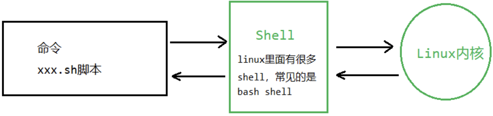
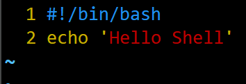

# 第一个shell程序
## 什么是shell
Shell 是一个命令行解释器，它为用户提供了一个向 Linux 内核发送请求以便运行程序的界面系统级程序，用户可以用 Shell 来启动、挂起、停止甚至是编写一些程序。下面我们用一幅图来解释什么是shell。

| ##container## |
|:--:|
||

## 为什么要学习shell
- Linux 运维工程师在进行服务器集群管理时，需要编写 Shell 程序来进行服务器管理。
- 对于 JavaEE 和 Python 程序员来说，工作的需要，会要求你编写一些 Shell 脚本进行程序或者是服务器的维护，比如编写一个定时备份数据库的脚本。
- 对于大数据程序员来说，需要编写 Shell 程序来管理集群。

## shell脚本的编写执行方式
- 脚本格式要求
    - 脚本以`#!/bin/bash`开头
    - 脚本需要有可执行权限

- 脚本的常用执行方式
    - 给要执行的脚本文件，添加可执行权限
    - 直接用 sh 脚本文件名 命令执行，可以`不用赋予脚本可执行权限`

示例:

| ##container## |
|:--:|
||
|打印一个`Hello Shell`|

可以看到我们还没有可执行权限的:
```bash
[root@localhost shellCode]# ll
总用量 4
-rw-r--r-- 1 root root 31 4月  20 14:08 01_hello.sh
[root@localhost shellCode]# ./01_hello.sh
-bash: ./01_hello.sh: 权限不够
```

方法一: 添加权限
```bash
[root@localhost shellCode]# chmod u+x 01_hello.sh 
[root@localhost shellCode]# ll
总用量 4
---x---rw- 1 root root 31 4月  20 14:08 01_hello.sh
[root@localhost shellCode]# ./01_hello.sh 
Hello Shell
```

方法二: 使用`sh`命令

```bash
[root@localhost shellCode]# sh 01_hello.sh 
Hello Shell
```
