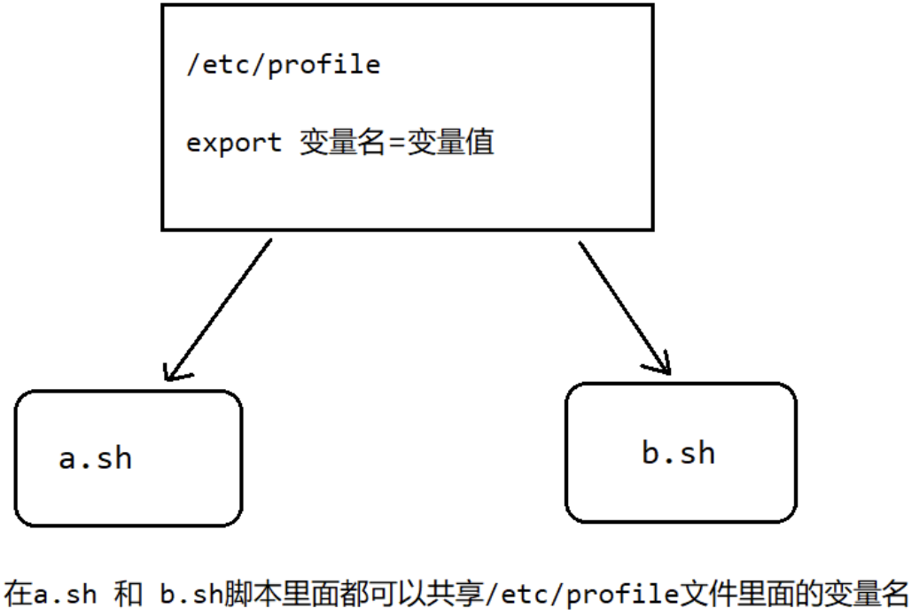
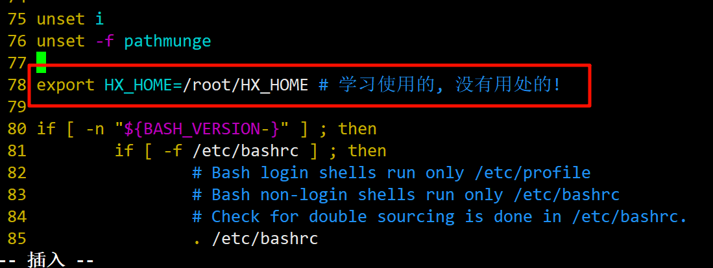

# shell的变量
Linux 中 Shell 的变量分为系统变量和用户自定义变量。系统变量: $HOME、PWD、 SHELL、USER$ 等等，比如: echo $HOME 等等。我们可以使用set命令显示当前 Shell 中所有变量。

示例:
```bash
[root@localhost shellCode]# echo $HOME
/root
[root@localhost shellCode]# echo $PWD
/root/shellCode
[root@localhost shellCode]# echo $SHELL
/bin/bash
[root@localhost shellCode]# echo $USER
root
```

查询所有的系统变量:

```bash
[root@localhost shellCode]# set | more # 分页查看
```

## 定义用户变量
我们在开发中，绝大多数使用的是用户自定义的变量。那么自定义变量该如何定义呢?
- 定义变量: `变量=值` （注意等号两侧没有空格）
- 撤销变量: `unset 变量`
- 声明静态变量: `readonly 变量`。注意: *该变量不能 unset*

变量的快速入门:

### 案例1: 定义变量A

Code:
```bash
#!\bin\bash
# 定义变量A
A='Hello BianLian'

# 输出变量A (加上$符号）
echo A=$A
echo "A=$A"

# 这样不能输出变量
echo 'A=$A'
```

cout:

```bash
[root@localhost shellCode]# sh 02_bianlian.sh 
A=Hello BianLian
A=Hello BianLian
A=$A
```

### 案例2: 撤销变量A

Code:
```bash
#!\bin\bash
A='Hello BianLian'
echo A=$A

unset A

echo "A=$A"
echo 'A=$A'
```

cout:
```bash
[root@localhost shellCode]# sh 02_bianlian.sh 
A=Hello BianLian
A=
A=$A
```

### 案例3: 声明静态的变量B=2,不能unset

Code:
```bash
#!\bin\bash
A='Hello BianLian'
readonly B='awa'
echo "A=$A, B=$B"

unset B

echo "A=$A"
```

cout: 会报错
```bash
[root@localhost shellCode]# sh 02_bianlian.sh 
A=Hello BianLian, B=awa
02_bianlian.sh: 第 6 行:unset: B: 无法取消设定: 只读 variable
A=Hello BianLian
```

### 案例4: 将指令返回的结果赋给变量

Code:
```bash
#!\bin\bash
A='Hello BianLian'
readonly B='awa'
echo "A=$A, B=$B"

# 两种方法, 都可以获取到指令的返回结果并且赋值给变量
C=`date`
D=$(date)
echo "现在是 $C 的 $D"

echo "A=$A"
```

cout:
```bash
[root@localhost shellCode]# sh 02_bianlian.sh 
A=Hello BianLian, B=awa
现在是 2024年 04月 20日 星期六 14:33:13 CST 的 2024年 04月 20日 星期六 14:33:13 CST
A=Hello BianLian
```

## Shell中变量命名规则
- 变量名称可以由字母、数字和下划线组成，但是不能以数字开头。
- 等号两侧不能有空格。
- 变量名称一般习惯为大写，这是一个规范，大家遵守即可。

## 设置环境变量
- 基本语法
    - `export 变量名=变量值`: 将 Shell 变量输出为`环境变量/全局变量`。我们通过一幅图来解释什么是环境变量/全局变量。

| ##container## |
|:--:|
||

- source 配置文件: 让修改后的配置文件立即生效
- `echo $变量名`: 查询环境变量的值

示例:

| ##container## |
|:--:|
|添加一个环境变量|
||

```bash
[root@localhost shellCode]# vim /etc/profile # 添加环境变量
[root@localhost shellCode]# echo $HX_HOME # 输出环境变量  (没有内容)

[root@localhost shellCode]# source /etc/profile # 刷新配置文件
[root@localhost shellCode]# echo $HX_HOME # 再次输出 (有值了)
/root/HX_HOME
```

(当然在.sh里面也是可以用的, 此处就不演示了)

## 位置参数变量
当我们执行一个 Shell 脚本时，如果希望获取到命令行的参数信息，就可以使用到位置参数变量，比如`./myshell.sh 100 200`, 这个就是一个执行 shell 的命令行，可以在 myshell 脚本中获取到参数信息。

- 基础语法:
    - `$n`: `n`为数字, `0`代表命令本身, `1`-`9`代表第一到第九个参数, 十以上的参数需要这样写: `${10}`
    - `$*`: 代表命令行中所有的参数，`*`把所有的参数看成一个整体
    - `$@`: 代表命令行中所有的参数，不过该命令是把每个参数区分对待
    - `$#`: 代表命令行中所有参数的个数

示例:
```bash
#!\bin\bash
echo "使用了命令: [$0], 第一个参数是 $1, 第二个参数是 $2"
echo "全部参数: $*"
echo "全部参数: $#"
echo "参数个数: $@"
```

```bash
[root@localhost shellCode]# sh 03_weizhicansu.sh -awa 2 --qwq
使用了命令: [03_weizhicansu.sh], 第一个参数是 -awa, 第二个参数是 2
全部参数: -awa 2 --qwq
全部参数: 3
参数个数: -awa 2 --qwq
```

## 预定义变量
Shell 设计者事先已经定义好的变量，可以直接在 Shell 脚本中使用。

- 基本语法
    - `$$`: 当前进程的进程号。
    - `$!`: 后台运行的最后一个进程的进程号。
    - `$?`: 最后一次执行的命令的返回状态。如果这个变量的值为 0，证明上一个命令正确执行；如果这个变量的值为非 0（具体是哪个数，由命令自己来决定），则证明上一个命令执行不正确。

示例:

```bash
#!\bin\bash
echo "当前进程PID=$$"

sh ./01_hello.sh &
echo "最后一个进程的PID=$!"
echo "最后一次执行命令的返回值: $?"
```

```bash
[root@localhost shellCode]# sh 04_yudinyibianlian.sh 
当前进程PID=3313
最后一个进程的PID=3314
最后一次执行命令的返回值: 0
[root@localhost shellCode]# Hello Shell
```
