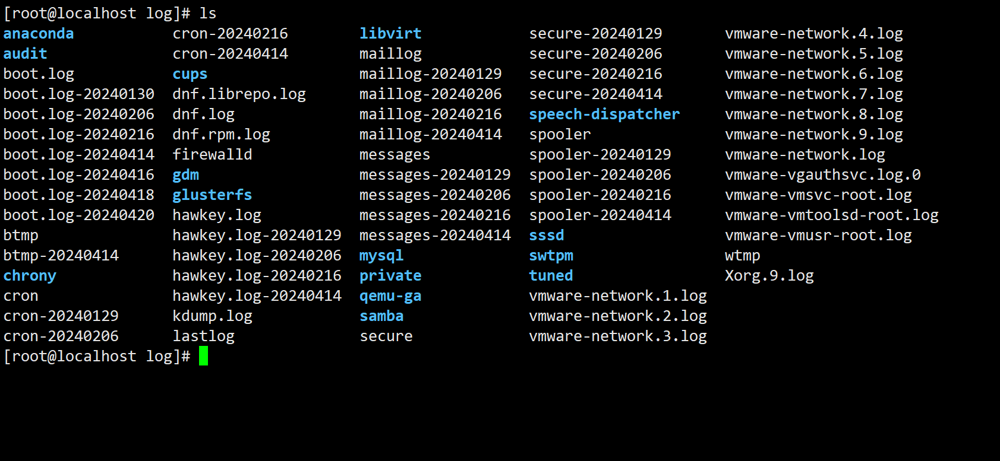
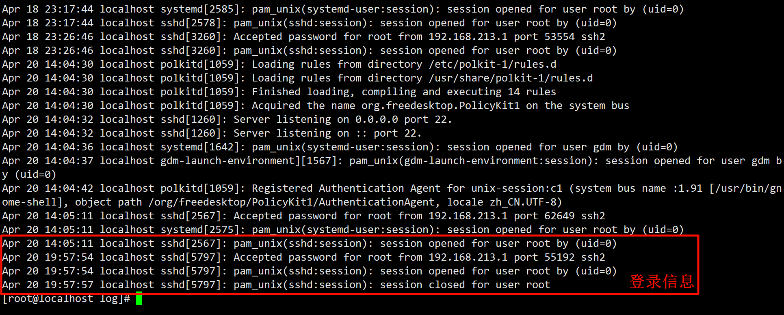

# Linux 日志的基本介绍
日志的基本介绍:

日志文件是重要的系统信息文件，其中记录了很多重要的系统事件，包括用户的登录信息、系统的启动信息、系统的安全信息、邮件相关信息、各种服务相关信息等。

日志对于安全来说也很重要，它记录了系统每天发生的各种事情，通过日志来检查错误发生的原因，或者受到攻击时攻击者留下的痕迹。

一句话理解日志: **日志是用来记录重大事件的工具**。

那么 Linux 系统中的日志信息保存在哪里呢?绝大多数的日志文件保存在`/var/log`目录中。

| ##container## |
|:--:|
||

下面我们看看系统中的常用日志: (红色为比较重要的)

|日志文件|描述|查看方式|
|--|-|-|
|/var/log/boot.log|系统启动日志。|直接查看|
|/var/log/cron|记录与系统定时任务相关的日志。|直接查看|
|/var/log/cups|记录打印信息的日志。|直接查看|
|/var/log/dmesg|记录了系统在开机时内核自检的信息，也可以使用dmesg命令直接查询内核自检信息。|直接查看或使用dmesg命令|
|/var/log/btmp|记录错误登录的目志。这个是二进制的文件，不能直接使用catvi命令查看。而要使用lastab命令查看。|使用lastab命令查看|
|/var/log/lastlog|记录系统中所有用户最后一次登录的时间的目志。这个文件也是二进制文件。要使用lastlog命令打开。|使用lastlog命令打开|
|/var/log/mailog|记录邮件信息的目志。|直接查看|
|/var/log/message|记录系统重要消息的日志。这个日志文件中会记录Linux系统的绝大多数重要信息。如果系统出现问题，首先要检查的就是这个日志文件。|直接查看|
|/var/log/secure|记录验证和授权方面的信息。只要涉及账户和密码的程序都会记录。比如系统/var/log/secure的登录、ssh的登录、su切换用户、sudo授权、甚至添加用户和修改用户密码都会记录在这个日志文件中。|直接查看|
|/var/log/wtmp|永久记录所有用户的登录、注销信息。同时记录系统的启动、重启、关机事件。是二进制文件，要使用last命令查看。|使用last命令查看|
|/var/log/ulmp|记录当前已经登录的用户信息。这个文件会随着用户的登录和注销而不断的变化，只记录当前登录用户的信息。这个文件不能使用vi查看，而使用w、who、users命令查看。|使用w、who、users命令查看|

| ##container## |
|:--:|
||
