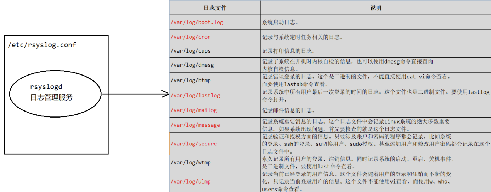
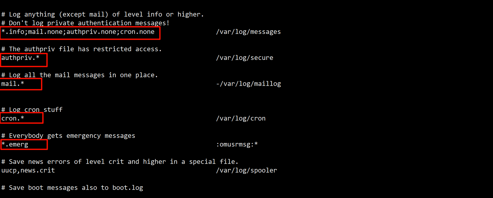
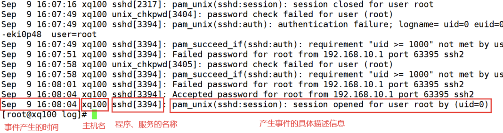

# Linux 日志管理服务
centos7日志服务是rsyslogd, centos6日志服务是syslogd。rsyslogd日志服务功能更加强大。rsyslogd的使用、日志文件的格式和syslogd是兼容的。

现在，我们思考一个问题，就是在linux系统中是谁帮助我们将日志信息记录在不同的日志文件里面去的?我们通过一幅图就能理解linux进行日志管理的原理。

| ##container## |
|:--:|
||

所以 Linux 日志服务帮助我们进行日志管理，是借助了`/etc/rsyslog.conf`配置文件来实现的。

我们可以去查看这个日志文件:
```bash
more /etc/rsyslog.conf
```
查询linux的rsyslogd服务是否启动
```bash
ps aux | grep "rsyslog" | grep -v "grep"
```

查询rsyslogd服务的启动状态
```bash
systemctl list-unit-files | grep rsyslog
```

# 日志服务管理的配置文件
管理日志的配置文件`/etc/rsyslog.conf`。那么我们应该怎么去理解这个配置文件里面的内容？

日志文件的格式是`*.*`存放的日志文件

| ##container## |
|:--:|
||

这里的两个`*`是什么意思?

第一个`*`: 代表日志类型
日志类型可以分为:

|日志类型|日志描述|
|:-:|:-:|
|auth|pam产生的日志|
|authpriv|ssh|ftp等登陆信息的验证信息|
|corn|时间任务相关的信息|
|kern|内核相关|
|lpr|打印相关的信息|
|mail|邮件相关的信息|
|mark(syslog)-rsyslog|服务内部信息|
|news|新闻组|
|user|用户程序产生的相关信息|
|local|1-7 自定义日志设备|

第二个`*`: 代表日志级别
|日志级别|日志级别的描述信息|
|-|-|
|debug|有调试信息的，记录的日志信息最多|
|info|一般日志信息，最常用|
|notice|提醒信息，需要检查一下程序了，不理会可能会出现错误。|
|warning|警告信息,当出现警告时，你的程序可能已经出现了问题,但不影响程序正常运行,尽快进行处理，以免导致服务宕掉。|
|err|错误信息，出现这一项时，已经挑明服务出现了问题,服务都无法确认是否能正常运行。|
|crit|严重级别，阻止整个系统或程序不能正常工作的信息|
|alert|需要立即修改的信息|
|emerg|记录内核崩溃等信息|
|none|什么都不记录|

注意: 从上到下，日志级别从低到高，记录的信息也越来越少。

由日志服务`rsyslogd`记录的日志文件，日志文件的格式包含以下4列:
1. 事件产生的时间
2. 产生事件的服务器(主机名)
3. 产生事件的服务名和程序名
4. 事件的具体信息

日志查看实例：查看一下`/var/log/secure`日志，这个日志记录的是用户验证和授权方面的信息，来分析如何查看:

| ##container## |
|:--:|
||
