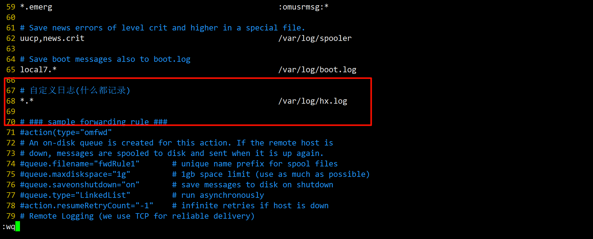

# Linux 自定义日志服务
自定义日志服务管理实例:
在`/etc/rsyslog.conf`中添加一个日志文件`/var/log/hx.log`，当有事件发生时(比如sshd相关服务的事件)。该文件会接收到信息并保存。比如我们登录 重启linux系统的时候，看看对应的日志信息是否成功保存。

进入日志服务的配置文件:
```bash
[root@localhost log]# vim /etc/rsyslog.conf
```

| ##container## |
|:--:|
|写入以下内容|
||

然后创建日志文件:
```bash
[root@localhost log]# vim hx.log
```

重启一下:
```bash
[root@localhost log]# reboot
```

可以发现成功记录了:

```bash
[root@localhost log]# cat hx.log | grep sshd
Apr 20 20:32:39 localhost systemd[1]: Reached target sshd-keygen.target.
Apr 20 20:32:41 localhost sshd[1209]: Server listening on 0.0.0.0 port 22.
Apr 20 20:32:41 localhost sshd[1209]: Server listening on :: port 22.
Apr 20 20:44:04 localhost sshd[2619]: Accepted password for root from 192.168.213.1 port 56843 ssh2
Apr 20 20:44:04 localhost sshd[2619]: pam_unix(sshd:session): session opened for user root by (uid=0)
```
