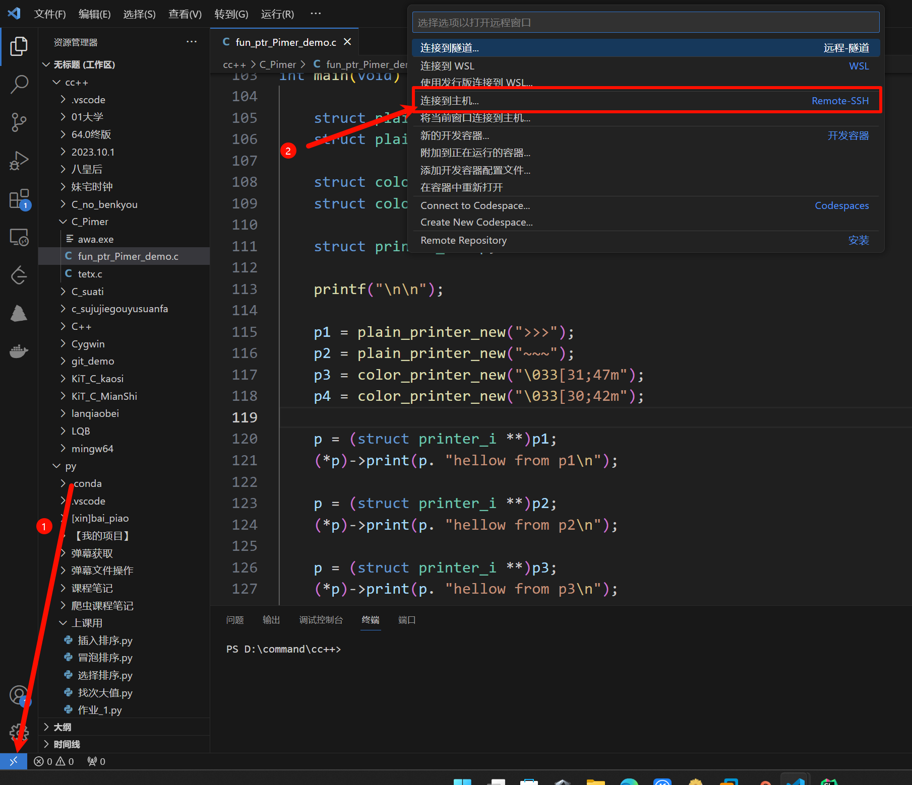
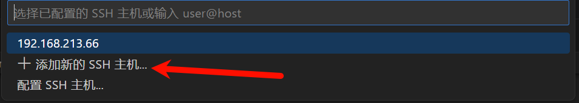
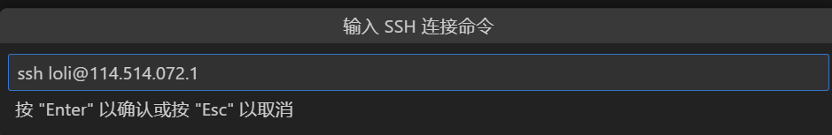

# 使用VSCode远程连接到Linux并实现免密码登录

参考文献:

[VSCode - 使用VSCode远程连接到Linux并实现免密码登录](https://blog.csdn.net/weixin_42490414/article/details/117750075)

## 一、安装VSCode扩展

在商店找到 `Remote Development`插件, 直接点击 Install 安装即可.

## 二、Linux那边的工作
### 为Linux安装ssh服务

- 执行命令即可安装
```Bash
sudo apt install openssh-server -y

# 或者 (龙蜥 / centOS)
yum -y update                 # 更新
yum -y install openssh-server # 安装
```

- 检查服务是否在运行
```Bash
ps -e | grep sshd
```

### 确定Linux的IP地址

- `ip addr`

## 三、使用VSCode远程连接到Linux

| ##container## |
|:--:|
|第一步: 如下|
||
|第二步: 添加主机|
||
|第三步: 写 `ssh 账户名@ip`|
||
|确认后, 再次打开`第二次`的界面, 就发现已经添加了|
|点击进入, 然后选择 `Linux` -> `继续` -> `输入密码`, 即可|
