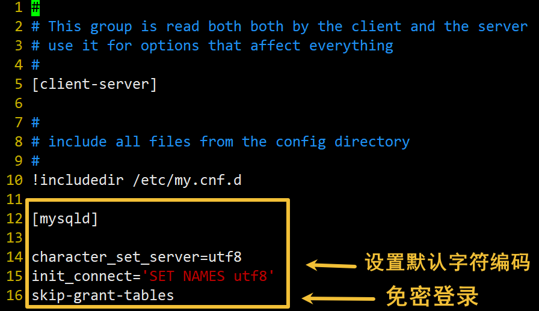

# Linux安装mysql8.0

请看: [Linux系统下MySQL 8.0安装](https://zhuanlan.zhihu.com/p/141772012)

---

```shell
# 安装前，我们可以检测系统是否自带安装 MySQL
rpm -qa | grep mysql

# 普通删除模式
rpm -e mysql
# 强力删除模式，如果使用上面命令删除时，提示有依赖的其它文件，则用该命令可以对其进行强力删除
rpm -e --nodeps mysql
```

---

## 安装
```shell
# 下载
wget https://repo.mysql.com//mysql80-community-release-el7-1.noarch.rpm

# 如果没有 wget 命令 请先安装它
# yum -y install wget

# 安装
rpm -ivh mysql80-community-release-el7-1.noarch.rpm
yum install mysql-server
```

---

## 分组

在安装 MySQL 时，通常会创建一个专用的 MySQL 用户和组，用于运行 MySQL 服务并管理相关文件和目录。这种做法有以下几个原因：

1. 安全性：为了增加系统的安全性，最佳实践是将 MySQL 服务运行在一个专用的用户下，限制其对系统其他部分的访问权限。如果使用 root 用户来运行 MySQL 服务，可能会带来安全风险，因为 root 用户具有系统上最高的权限。

2. 权限管理：通过为 MySQL 创建专用用户和组，可以更好地管理 MySQL 数据目录、日志文件等重要文件的访问权限。这样可以确保只有授权的用户才能访问和修改这些关键文件，从而降低出现错误或被恶意利用的风险。

3. 遵循最佳实践：在安装和配置软件时，按照最佳实践设置用户和组是一种良好的做法，有助于提高系统的整体安全性和稳定性。

如果你发现在安装 MySQL 时没有创建专用的 MySQL 用户和组，你可以手动创建它们，并将 MySQL 相关文件的所有权分配给这个新创建的用户和组。这样可以提高系统的安全性，并遵循最佳实践来管理 MySQL 服务。

```shell
# 创建新的 MySQL 用户组
sudo groupadd mysql

# 创建新的 MySQL 用户，并将其添加到上面创建的用户组中
sudo useradd -r -g mysql -s /bin/false mysql
# 这里的选项 -r 表示创建一个系统用户（系统级别的用户），
# -g mysql 表示将该用户添加到 mysql 用户组中，
# -s /bin/false 表示禁止该用户登录系统。
```

### 转移文件权限

```shell
# 将 MySQL 数据目录的所有权转移给新创建的用户和组
sudo chown -R mysql:mysql /var/lib/mysql

# 将 MySQL 日志文件的所有权也转移给新创建的用户和组
sudo chown mysql:mysql /var/log/mysql/mysqld.log
```

### 重新启动 MySQL 服务

```shell
# 重新启动 MySQL 服务，让它以新创建的用户和组身份运行
sudo systemctl restart mysqld
```

---

## mysql 启动

```shell
# 启动mysql服务
systemctl start mysqld

# 查看mysql状态
systemctl status mysqld

# 查看mysql版本信息
mysqladmin --version

# 设置mysql服务开机自启动
systemctl enable mysqld
systemctl daemon-reload
```

## 修改root登录密码
`mysql`安装完成之后，会在`/var/log/mysqld.log`文件中给`root`生成了一个临时的默认密码

```shell
vi /var/log/mysqld.log
```

## 开放端口以远程连接

```shell
firewall-cmd --permanent --add-port=3306/tcp # 开放防火墙对
3306端口的权限
firewall-cmd --reload # 重载防火墙服务
firewall-cmd --list-ports # 查看防火墙开发的端口有哪些
```

## 报错解决
### 修改密码
ERROR 1045 (28000): Access denied for user ‘root’@’localhost’ (using password: NO) 错误

```shell
# 停止mysql服务
service mysqld stop

# 修改配置文件无密码登录
vi /etc/my.cnf
```



```shell
# 复制下面4行
[mysqld]
character_set_server=utf8
init_connect='SET NAMES utf8'
skip-grant-tables

# 重启mysql服务
service mysqld restart

# 查看当前数据库密码
SELECT user, authentication_string FROM user WHERE user = 'root';

# 更新密码
mysql -u root -p # 直接回车, 登录mysql
use mysql;    # 选择数据库
update user set authentication_string='你的密码' where user='root';
```

# 卸载

```bash
sudo systemctl stop mysql

sudo yum remove mysql-community-server mysql-community-client mysql-community-common
sudo yum autoremove
```


```C++
rpm -ev mysql-server-8.0.32-1.0.1.module+an8.7.0+11036+04d53067.x86_64
rpm -ev mysql-errmsg-8.0.32-1.0.1.module+an8.7.0+11036+04d53067.x86_64
rpm -ev mysql-8.0.32-1.0.1.module+an8.7.0+11036+04d53067.x86_64
rpm -ev mysql-common-8.0.32-1.0.1.module+an8.7.0+11036+04d53067.x86_64

```

# 龙蜥8 的蜜汁操作

```bash
## 1 mysql8.0.x安装

在安装mysql之前先卸载mariadb,以免冲突造成mysql无法启动
rpm -qa|grep -i mariadb
rpm -qa|grep mariadb|xargs rpm -e --nodeps

### 1.1 防火墙配置
#关闭防火墙
systemctl stop firewalld.service 
systemctl disable firewalld.service

#开启3306、22端口
systemctl start firewalld.service
systemctl enable firewalld.service
firewall-cmd --zone=public --add-port=3306/tcp --permanent
firewall-cmd --zone=public --add-port=22/tcp --permanent
firewall-cmd --reload
firewall-cmd --zone=public --list-ports
systemctl status firewalld.service

### 1.2 关闭selinux
sed -i '/SELINUX/s/enforcing/disabled/g;/SELINUX/s/permissive/disabled/g'   /etc/selinux/config
setenforce 0
getenforce


## 2、开始安装
dnf install mysql-server
systemctl start mysqld #启动MYSQL 服务
systemctl enable mysqld #将MYSQL 服务设置为开机启动
systemctl status mysqld #查看MYSQL状态

### 2.1 修改数据库root密码
mysql -uroot #新安装MYSQL 可以使用ROOT 无密码直接登录
use mysql; #选择系统数据库
alter user 'root'@'localhost' identified by '自定义密码'; #修改root用户密码
flush privileges; #刷新权限表
mysql -uroot -p #再次登录提示输入密码，使用密码登录系统

### 2.2 设置远程访问
show databases;
use mysql;
select host,user from user \G;
update user set host= '%' where user = 'root';
flush privileges;
ALTER USER 'root'@'%' IDENTIFIED WITH mysql_native_password BY 'Abc123!@#' PASSWORD EXPIRE NEVER; ##修改密码永不过期

## 3、数据库备份脚本
1） root 用户登录服务器 
mkdir -p /databack/mysqldata/sql_package 
2) 编辑自动备份脚本 （注意先修改脚本中现场数据库的密码）
vi /databack/mysqldata/mysql_backup.sh
#!/bin/bash
username="root"    #备份用户名
mypasswd="123456"    #密码
base_dir="/databack/mysqldata" #日志地址
mysql_backup_log="${base_dir}/mysql_backup.log" #备份地址
backup_path="${base_dir}/sql_package"
#当前日期 date=$(date +"%Y-%m-%d") #备份的文件名
filename=$backup_path/$(date +%Y%m%d_%H%M%S).sql #打印日志
echo "开始备份，备份日期: $(date +'%Y-%m-%d %H:%M:%S')" >> "$mysql_backup_log"
#back up 备份全部
/usr/bin/mysqldump -u${username} -p${mypasswd} --quick --events --all-databases --master-data=2 --single-transaction --set-gtid-purged=OFF  > $filename
#打印日志
echo "备份成功，备份路径： $filename" >> "$mysql_backup_log"
echo "Delete the file bakup before 6 days..." >> "$mysql_backup_log"
find /databack/mysqldata/sql_package -mtime +6 -name "*.sql" -exec rm -rf '{}' \;
echo "Delete the file bakup successfully. " >> "$mysql_backup_log"
给脚本授权： 
chmod +x /databack/mysqldata/mysql_backup.sh #添加脚本执行权限 
3) 设置系统自动定时执行备份脚本 
vi /etc/crontab 
#编辑系统任务计划
将下面的代码写入最后一行（备份一般设置为晚上12点自动备份）： 
30 2 * * * root /databack/mysqldata/mysql_backup.sh
即每天凌晨 2 点 30 分进行备份，如需每天备份多次，可设置不同时间段备份： 
例如：* 3,13,18 * * * oracle /backup/oracledata/oradatabak.sh 
即每天 3 点、13 点、18 点进行备份。
[root@hx sql_package]# systemctl restart crond.service
[root@hx sql_package]# systemctl enable crond.service
```
