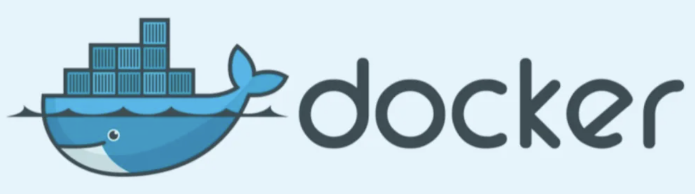
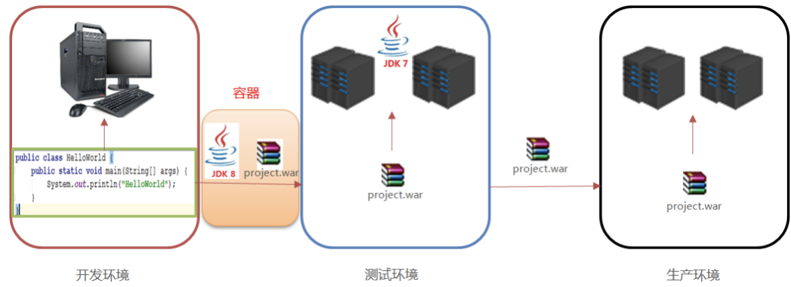
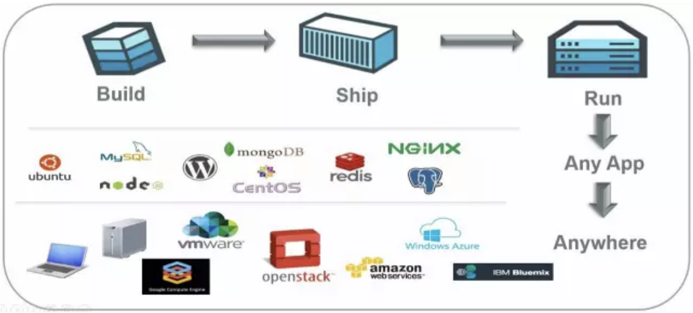
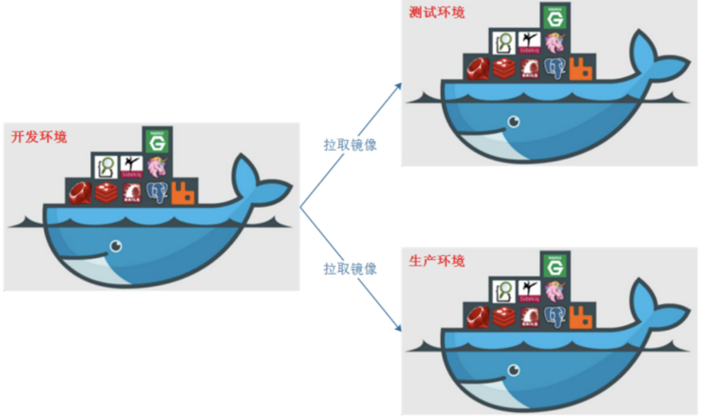
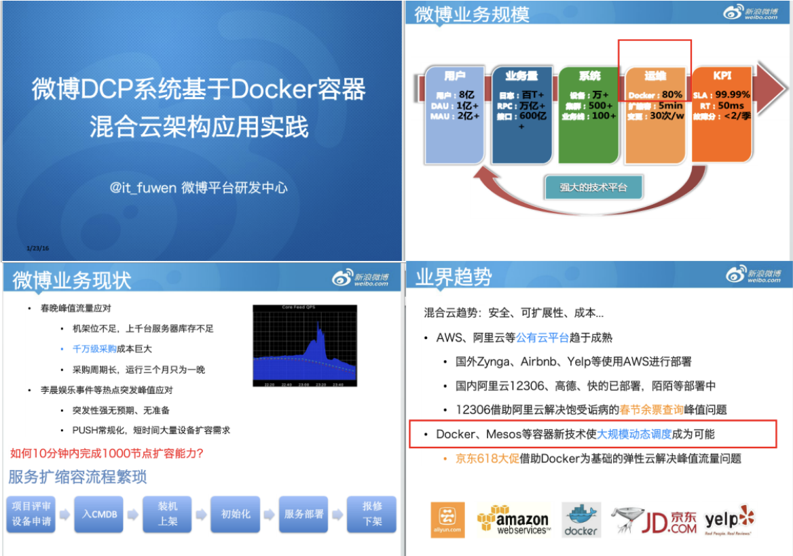
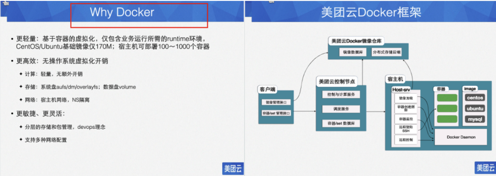
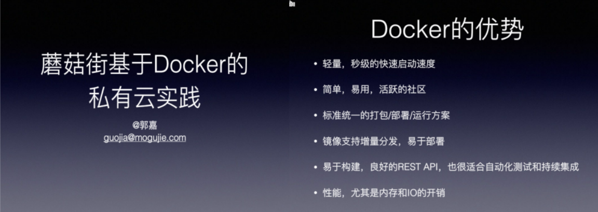

# 一、Docker的简介

| ##container## |
|:--:|
||

省流: Docker 可以 **秒级** 的轻量化, 自动化的部署你的代码, 并且附带上了你**所需要的环境**, 这个就是容器(集装箱); 而容器可以部署在任何另一个安装了Docker的操作系统上, 并且可以运行你的代码. (就和上面的图一样)

优秀参考: [什么是Docker？看这一篇干货文章就够了！](https://zhuanlan.zhihu.com/p/187505981)

## 1.1 Docker的基本概述
### 1.1.1 为什么要学习Docker
我们写的代码会接触到好几个环境: 开发环境、测试环境以及生产环境。在实施的过程中，经常会出现一些问题。比如我们开发环境使用的是 jdk1.8 的版本，而测试环境还是用 的 jdk1.7 的版本。如果我们在开发环境上编写的代码，放在测试环境上面运行，由于开发环境的差异，代码测试可能会出现意想不到的错误，这就是我们所说的代码的"水土不服"。

我们需要如何确保应用能够在这些环境中运行和通过质量检测？并且在部署过程中不出现令人头疼的版本、配置问题，也无需重新编写代码和进行故障修复？

答案就是使用容器。Docker之所以发展如此迅速，也是因为它对此给出了一个标准化的解决方案-----<span style="color:red">系统平滑移植，容器虚拟化技术</span>。

环境配置相当麻烦，换一台机器，就要重来一次，费力费时。很多人想到，能不能从根本上解决问题，软件可以带环境安装？也就是说，安装的时候，把原始环境一模一样地复制过来。开发人员利用 Docker 可以消除协作编码时“在我的机器上可正常工作”的问题。

| ##container## |
|:--:|
||

之前在服务器配置一个应用的运行环境，要安装各种软件，就拿现在大型的电商项目环境来说，Java/RabbitMQ/MySQL/JDBC驱动包等。安装和配置这些东西有多麻烦就不说了，它还不能跨平台。假如我们是在 Windows 上安装的这些环境，到了Linux 又得重新装。况且就算不跨操作系统，换另一台同样操作系统的服务器，要移植应用也是非常麻烦的。

传统上认为，软件编码开发/测试结束后，所产出的成果即是程序或是能够编译执行的二进制字节码等(java为例)。而为了让这些程序可以顺利执行，开发团队也得准备完整的部署文件，让维运团队得以部署应用程式，开发需要清楚的告诉运维部署团队，用的全部配置文件+所有软件环境。不过，即便如此，仍然常常发生部署失败的状况。Docker的出现使得Docker得以打破过去「程序即应用」的观念。透过镜像(images)将作业系统核心除外，运作应用程式所需要的系统环境，由下而上打包，达到应用程式跨平台间的无缝接轨运作。

### 1.1.2 Docker的概念
<span style="color:red">Docker是基于Go语言实现的云开源项目</span>。Docker的主要目标是“Build，Ship and Run Any App,Anywhere”，也就是通过对应用组件的封装、分发、部署、运行等生命周期的管理，使用户的APP（可以是一个WEB应用或数据库应用等等）及其运行环境能够做到“一次镜像，处处运行”。

| ##container## |
|:--:|
||

Linux容器技术的出现就解决了这样一个问题，而 Docker 就是在它的基础上发展过来的。将应用打成镜像，通过镜像成为运行在Docker容器上面的实例，而 Docker容器在任何操作系统上都是一致的，这就实现了跨平台、跨服务器。<span style="color:red">只需要一次配置好环境，换到别的机子上就可以一键部署好，大大简化了操作</span>。

一句话: **解决了运行环境和配置问题的软件容器，方便做持续集成并有助于整体发布的容器虚拟化技术**。

## 1.2 容器与虚拟机比较
### 1.2.1 传统的虚拟机
虚拟机（virtual machine）就是带环境安装的一种解决方案。它可以在一种操作系统里面运行另一种操作系统，比如在Windows10系统里面运行Linux系统CentOS7。应用程序对此毫无感知，因为虚拟机看上去跟真实系统一模一样，而对于底层系统来说，虚拟机就是一个普通文件，不需要了就删掉，对其他部分毫无影响。这类虚拟机完美的运行了另一套系统，能够使应用程序，操作系统和硬件三者之间的逻辑不变。 

传统的虚拟机技术基于安装在主操作系统上的虚拟机管理系统(入virtual box、vmware等)，在虚拟机上再安装操作系统，最后在操作系统里面安装部署各种应用。

传统的虚拟机也有一些缺点: 资源占用多、冗余步骤多、启动慢

### 1.2.2 容器化虚拟技术
由于前面虚拟机存在某些缺点，Linux发展出了另一种虚拟化技术: **Linux容器(LinuxContainers，缩写为 LXC)**。

Linux容器是与系统其他部分隔离开的一系列进程，从另一个镜像运行，并由该镜像提供支持进程所需的全部文件。容器提供的镜像包含了应用的所有依赖项，因而在从开发到测试再到生产的整个过程中，它都具有可移植性和一致性。

<span style="color:red">Linux 容器不是模拟一个完整的操作系统而是对进程进行隔离</span>。有了容器，就可以将软件运行所需的所有资源打包到一个隔离的容器中。<span style="color:red">容器与虚拟机不同，不需要捆绑一整套操作系统，只需要软件工作所需的库资源和设置</span> 。系统因此而变得高效轻量并保证部署在任何环境中的软件都能始终如一地运行。

Docker容器是在操作系统层面上实现虚拟化，直接复用本地主机的操作系统。而传统虚拟机直接在硬件层面实现虚拟化。与传统的虚拟机相比，Docker体现的优势是启动速度快，占用体积小。

### 1.2.3 比较
||传统虚拟机|Docker|
|:-:|:-:|:-:|
|大小|大(几个G)|小|
|部署速度|慢(手动可能要一天)|秒级|
|资源消耗|大(需要模拟一个操作系统)|小(只需要需要的东西)|

- 传统虚拟机技术是虚拟出一套硬件后，在其上运行一个完整操作系统，在该系统上再运行所需应用进程；

- 容器内的应用进程直接运行于宿主的内核，容器内没有自己的内核且也没有进行硬件虚拟。因此容器要比传统虚拟机更为轻便。

- 每个容器之间互相隔离，每个容器有自己的文件系统 ，容器之间进程不会相互影响，能区分计算资源。

## 1.3 Docker的优势
### 1.3.1 一次构建 处处运行
- **更快速的应用交付和部署**

    传统的应用开发完成后，需要提供一堆安装程序和配置说明文档，安装部署后需    根据配置文档进行繁杂的配置才能正常运行。Docker化之后只需要交付少量容器镜    像文件，在正式生产环境加载镜像并运行即可，应用安装配置在镜像里已经内置好，大大节省部署配置和测试验证时间。

- **更便捷的升级和扩缩容**

    随着微服务架构和Docker的发展，大量的应用会通过微服务方式架构，应用的开发构建将变成搭乐高积木一样，每个Docker容器将变成一块“积木”，应用的升级将变得非常容易。当现有的容器不足以支撑业务处理时，可通过镜像运行新的容器进行快速扩容，使应用系统的扩容从原先的天级变成分钟级甚至秒级。

- **更简单的系统运维**

    应用容器化运行后，生产环境运行的应用可与开发、测试环境的应用高度一致，容器会将应用程序相关的环境和状态完全封装起来，不会因为底层基础架构和操作系统的不一致性给应用带来影响，产生新的BUG。当出现程序异常时，也可以通过测试环境的相同容器进行快速定位和修复。

- **更高效的计算资源利用**

    Docker是内核级虚拟化，其不像传统的虚拟化技术一样需要额外的Hypervisor支持，所以在一台物理机上可以运行很多个容器实例，可大大提升物理服务器的CPU和内存的利用率。

| ##container## |
|:--:|
||

Docker借鉴了标准的集装箱概念。集装箱将装好的货物运送到世界各地。Docker将这个模型运用到自己的设计中，唯一不同的是集装箱运送的是货物，Docker运输的是软件。

### 1.3.2 大型互联网企业都在使用

| ##container## |
|:--:|
||
||
||

## 1.4 Dcoker与podman的比较
### 1.4.1 podman是什么
Podman是RedHat的一款产品。Podman是一个无守护进程的容器引擎，用于在Linux系统上开发、管理和运行OCI容器。容器既可以以root身份运行，也可以在无root模式下运行。

Podman是一款集合了命令集的工具，设计初衷是为了处理容器化进程的不同任务，可以作为一个模块化框架工作。它的工具集包括:


```Podman
Podman: Pod和容器镜像管理器
Buildah: 容器镜像生成器
Skopeo: 容器镜像检查管理器
Runc: 容器运行器和特性构建器，并传递给Podman和Buildah
Crun: 可选运行时，为Rootless容器提供更大的灵活性、控制和安全
```

### 1.4.2 Podman和Docker的主要区别
1. 守护进程

    Docker使用守护进程，一个正在后台运行的程序，来创建镜像和运行容器。Podman是无守护进程的架构，这意味着它可以在启动容器的用户下运行容器。

2. 安全性

    Podman允许容器使用Rootless特权。Rootless容器被认为比Root特权的容器更安全。在Docker中，守护进程拥有Root权限，这使得它们易成为攻击者的首选入侵点。


    Podman中的容器默认情况下不具有Root访问权限，这在Root级别和Rootless级别之间添加了一个自然屏障，提高了安全性。不过，Podman可以同时运行Root容器和Rootless容器。

3. 镜像构建

    作为一款自给自足的工具，Docker可以自己构建容器镜像。Podman则需要另一种名为Buildah的工具的辅助。


4. 多合一和模块化

    Docker是一个独立的、强大的工具，在整个循环中处理所有的容器化任务，有优点也有缺点。Podman采用模块化的方法，依靠专门的工具来完成特定的任务。
