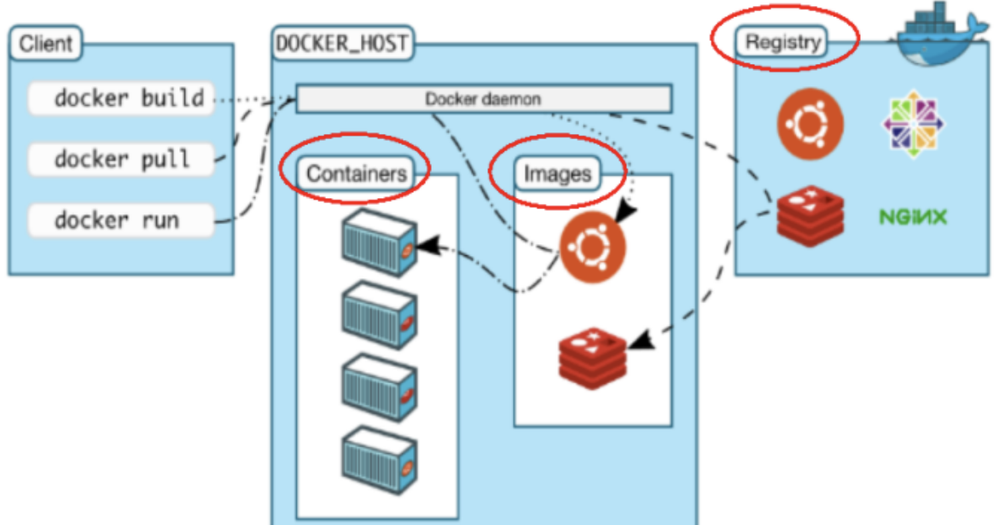
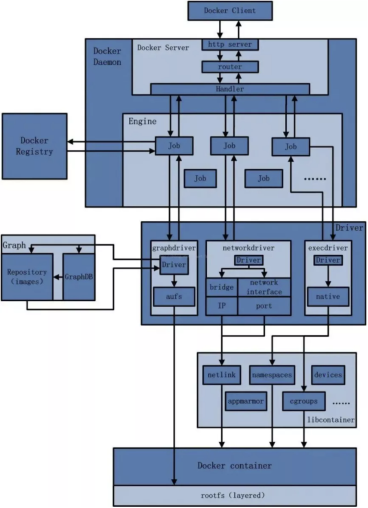
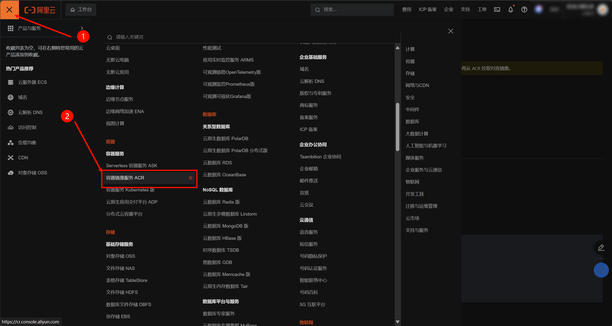
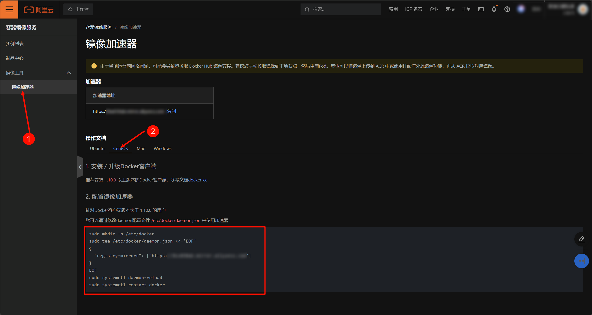
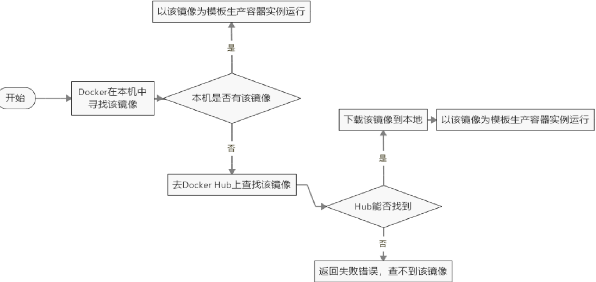
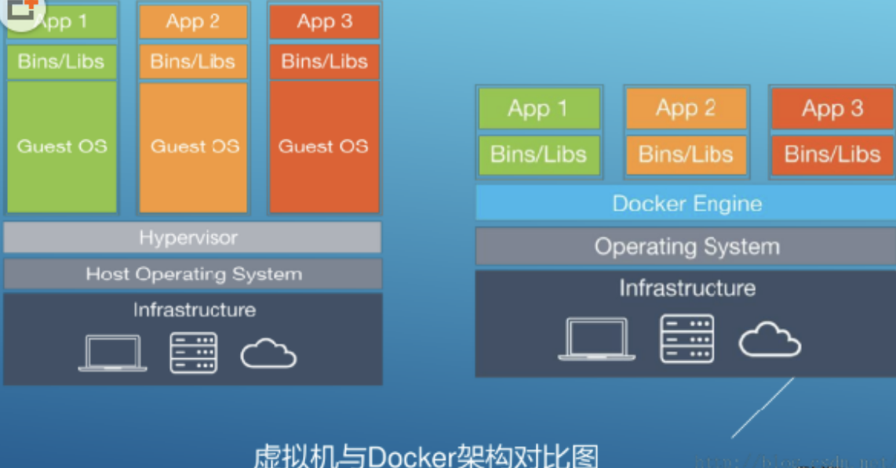

# 二、Docker下载与安装

- [Docker官网](http://www.docker.com)
- [Docker Hub](https://hub.docker.com/)官网

前提说明:
- Docker并非是一个通用的容器工具，它依赖于已存在并运行的linux内核环境。
- Docker实质上是在已经运行的Linux下制造了一个隔离的文件环境，因此它执行的效率几乎等同于所部署的linux主机。因此`Docker必须部署在Linux内核的系统上`。如果其它系统想部Docker，必须安装一个虚拟的Linux环境。


## 2.1 Docker的基本组成
- **镜像(image)**

    Docker 镜像（Image）就是一个只读的模板。镜像可以用来创建 Docker 容器，一个镜像可以创建很多容器。它也相当于是一个root文件系统。比如官方镜像centos:7 就包含了完整的一套 centos:7 最小系统的 root 文件系统。相当于容器的“源代码”，docker镜像文件类似于Java的类模板，而docker容器实例类似于java中new出来的实例对象。

    容器与镜像的关系就类似于Java面向编程中的类与对象的关系:

  |Docker|Java|
  |:-:|:-:|
  |镜像|类|
  |容器|对象(实例)|

- **容器(container)**

    1. 从面向对象角度

    Docker 利用容器（Container）独立运行的一个或一组应用，应用程序或服务运行在容器里面，容器就类似于一个虚拟化的运行环境，容器是用镜像创建的运行实例。就像是Java中的类和实例对象一样，镜像是静态的定义，容器是镜像运行时的实体。容器为镜像提供了一个标准的和隔离的运行环境，它可以被启动、开始、停止、删除。每个容器都是相互隔离的、保证安全的平台。

    2. 从镜像容器角度

    可以把容器看做是一个简易版的 Linux 环境（包括root用户权限、进程空间、用户空间和网络空间等）和运行在其中的应用程序。

- **仓库(repository)**

    仓库（Repository）是集中存放镜像文件的场所。类似于Maven仓库，存放各种jar包的地方；github仓库，存放各种git项目的地方；Docker公司提供的官方registry被称为Docker Hub，存放各种镜像模板的地方。仓库分为公开仓库（Public）和私有仓库（Private）两种形式。最大的公开仓库是[Docker Hub](https://hub.docker.com/)，存放了数量庞大的镜像供用户下载。国内的公开仓库包括阿里云 、网易云等。

**小结**:

需要正确的理解仓库/镜像/容器这几个概念: Docker 本身是一个容器运行载体或称之为管理引擎。我们把应用程序和配置依赖打包好形成一个可交付的运行环境，这个打包好的运行环境就是image镜像文件。只有通过这个镜像文件才能生成Docker容器实例(类似Java中new出来一个对象)。

image文件可以看作是容器的模板。Docker 根据 image 文件生成容器的实例。同一个 image 文件，可以生成多个同时运行的容器实例。

> 镜像文件
> - image 文件生成的容器实例，本身也是一个文件，称为镜像文件。
>
> 容器实例
> - 一个容器运行一种服务，当我们需要的时候，就可以通过docker客户端创建一个对应的运行实例，也就是我们的容器。
>
> 仓库
> - 就是放一堆镜像的地方，我们可以把镜像发布到仓库中，需要的时候再从仓库中拉下来就可以了。

## 2.2 Docker的架构图解
| ##container## |
|:--:|
||

Docker是一个`Client-Server`结构的系统，**Docker守护进程**运行在主机上，然后通过Socket连接从客户端访问，守护进程从客户端接受命令并管理运行在主机上的容器。 容器，是一个运行时环境，就是我们前面说到的集装箱。

基于这幅架构图，我们可以进一步分析Docker底层的运行流程:
1. 用户是使用 DockerClient 与 DockerDaemon(Docker守护进程) 建立通信，并发送请求给后者。

2. DockerDaemon 作为 Docker 架构中的主体部分，首先提供 Docker Server 的功能使其可以接受 Docker Client 的请求。

3. Docker Engine 执行 Docker 内部的一系列工作，每一项工作都是以一个 Job 的形式的存在。

4. Job 的运行过程中，当需要容器镜像时，则从 Docker Registry 中下载镜像，并通过镜像管理驱动 Graph driver 将下载镜像以 Graph 的形式存储。

5. 当需要为 Docker 创建网络环境时，通过网络管理驱动 Networkdriver 创建并配置 Docker 容器网络环境。

6. 当需要限制 Docker 容器运行资源或执行用户指令等操作时，则通过 Exec driver 来完成。

7. Libcontainer 是一项独立的容器管理包，Networkdriver 以及 Execdriver 都是通过 Libcontainer 来实现具体对容器进行的操作。

| ##container## |
|:--:|
||

## 2.3 在Centos7上安装Docker
前提: 首先请确保本地的Linux环境是centos7及以上的版本。(此处我使用的是[龙蜥操作系统(Anolis OS)](../../../001-Linux/004-Linux环境配置/001-操作系统丶/001-龙蜥操作系统【AnolisOS】/index.md)(是兼容centos7的))

1. 安装gcc环境

```bash
yum -y install gcc

yum -y install gcc-c++
```

2. 安装需要的软件包

```bash
yum install -y yum-utils
```

3. 设置镜像仓库

```bash
yum-config-manager --add-repo http://mirrors.aliyun.com/docker-ce/linux/centos/docker-ce.repo
```

4. 更新yum软件包索引

```bash
yum makecache fast

yum makecache # 龙蜥使用这个
```

5. 安装Docker

```bash
yum -y install docker-ce docker-ce-cli containerd.io

# 如果出现问题, 可以使用 --allowerasing 来移除冲突的软件包
yum -y install docker-ce docker-ce-cli containerd.io --allowerasing
```

6. 启动Docker

```bash
systemctl start docker
```

7. (可选)设置开机docker自启动

```bash
systemctl enable docker
```

- 安装完毕我们可以看看版本信息:

```bash
[root@localhost ~]# docker version
Client: Docker Engine - Community
 Version:           26.0.2
 API version:       1.45
 Go version:        go1.21.9
 Git commit:        3c863ff
 Built:             Thu Apr 18 16:28:46 2024
 OS/Arch:           linux/amd64
 Context:           default

Server: Docker Engine - Community
 Engine:
  Version:          26.0.2
  API version:      1.45 (minimum version 1.24)
  Go version:       go1.21.9
  Git commit:       7cef0d9
  Built:            Thu Apr 18 16:27:41 2024
  OS/Arch:          linux/amd64
  Experimental:     false
 containerd:
  Version:          1.6.31
  GitCommit:        e377cd56a71523140ca6ae87e30244719194a521
 runc:
  Version:          1.1.12
  GitCommit:        v1.1.12-0-g51d5e94
 docker-init:
  Version:          0.19.0
  GitCommit:        de40ad0
```

- 测试是否安装成功: 运行`hello-world`容器, 如果没有它会去云端拉取:

```bash
[root@localhost ~]# docker run hello-world
Unable to find image 'hello-world:latest' locally
latest: Pulling from library/hello-world
c1ec31eb5944: Pull complete 
Digest: sha256:a26bff933ddc26d5cdf7faa98b4ae1e3ec20c4985e6f87ac0973052224d24302
Status: Downloaded newer image for hello-world:latest

Hello from Docker!
This message shows that your installation appears to be working correctly.

To generate this message, Docker took the following steps:
 1. The Docker client contacted the Docker daemon.
 2. The Docker daemon pulled the "hello-world" image from the Docker Hub.
    (amd64)
 3. The Docker daemon created a new container from that image which runs the
    executable that produces the output you are currently reading.
 4. The Docker daemon streamed that output to the Docker client, which sent it
    to your terminal.

To try something more ambitious, you can run an Ubuntu container with:
 $ docker run -it ubuntu bash

Share images, automate workflows, and more with a free Docker ID:
 https://hub.docker.com/

For more examples and ideas, visit:
 https://docs.docker.com/get-started/
```

- 卸载Docker:

```bash
systemctl stop docker # 停止软件
yum remove docker-ce docker-ce-cli containerd.io
rm -rf /var/lib/docker
rm -rf /var/lib/containerd
```

## 2.4 安装镜像加速器
如何获取加速器地址？我们只需按照以下的步骤操作即可。

| ##container## |
|:--:|
|登陆阿里云开发者平台, 找到:|
||
|直接复制粘贴这里的内容即可, 可以不写`sudo`, 这个是使用管理员权限, 因为我们是root用户, 可以不用|
||

把之前下载的镜像删除掉:

```bash
docker rmi -f hello-world # -f 是强制删除(因为它还在运行)
```

然后再下载, 测试是否配置好镜像了, (此时会发现速度比没有配置的时候快)

```bash
docker run hello-world
```

| ##container## |
|:--:|
|docker run 命令的运行过程|
||

## 2.5 为什么Docker会比VM虚拟机快
1. **docker 有着比虚拟机更少的抽象层**

    由于 docker 不需要 Hypervisor(虚拟机) 实现硬件资源虚拟化,运行在 docker 容器上的程序直接使用的都是实际物理机的硬件资源。因此在CPU、内存利用率上 docker 将会在效率上有明显优势。

2. **docker利用的是宿主机的内核,而不需要加载操作系统OS内核**

    当新建一个容器(docker run)时,docker不需要和虚拟机一样重新加载一个操作系统内核。进而避免引寻、加载操作系统内核返回等比较费时费资源的过程,当新建一个虚拟机时,虚拟机软件需要加载OS,返回新建过程是分钟级别的。而docker由于直接利用宿主机的操作系统,则省略了返回过程,因此新建一个docker容器只需要几秒钟。

| ##container## |
|:--:|
||

| 特征         | Docker容器                  | 虚拟机（VM）             |
|--------------|---------------------------|------------------------|
| 操作系统      | 与宿主机共享OS            | 宿主机OS上运行虚拟机OS |
| 存储大小      | 镜像小，便于存储与传输    | 镜像庞大（vmdk、vdi等） |
| 运行性能      | 几乎无额外性能损失         | 操作系统额外的CPU、内存消耗 |
| 移植性        | 轻便、灵活，适应于LinuX    | 笨重，与虚拟化技术耦合度高 |
| 硬件亲和性    | 面向软件开发者             | 面向硬件运维者         |
| 部署速度      | 快速，秒级                 | 较慢，10s以上          |