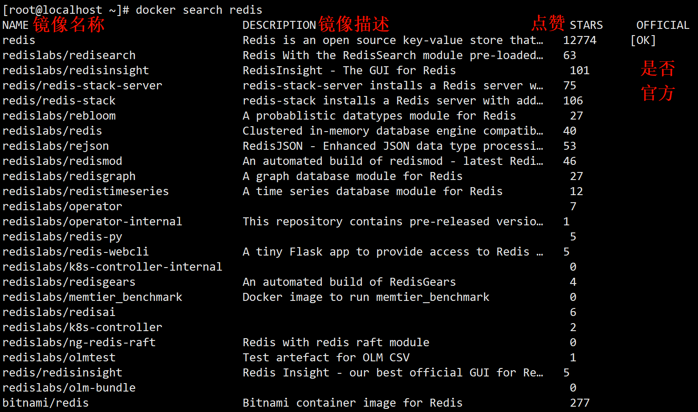
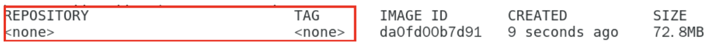
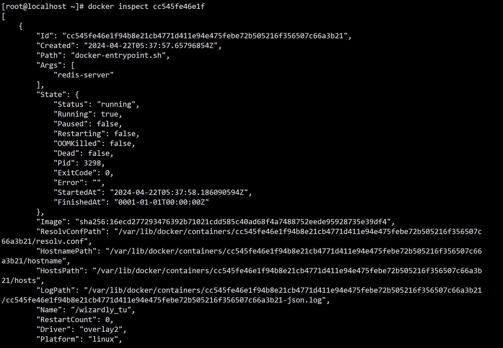

# 三、Docker的常用命令

<style>
/* Markdown风格的样式 */

/* h1的样式 */
h1 {
    color: yellow;
    margin-top: 1.5em; /* 顶部间距 */
    margin-bottom: 0.5em; /* 底部间距 */
}

/* h2的样式 */
h2 {
    color: rgb(100,233,233);
    margin-top: 1.25em; /* 顶部间距 */
    margin-bottom: 0.5em; /* 底部间距 */
}

/* h3的样式 */
h3 {
    color: rgb(250, 100, 200);
    margin-top: 1.25em; /* 顶部间距 */
    margin-bottom: 0.5em; /* 底部间距 */
}

/* h4的样式 */
h4 {
    color: rgb(75,250,75);
    margin-top: 1.25em; /* 顶部间距 */
    margin-bottom: 0.5em; /* 底部间距 */
}

/* h5的样式 */
h5 {
    color: #CC0055;
    margin-top: 1.25em; /* 顶部间距 */
    margin-bottom: 0.5em; /* 底部间距 */
}

/* 段落样式 */
p {
    margin-top: 1em; /* 顶部间距 */
    margin-bottom: 1em; /* 底部间距 */
    text-indent: 1.5em; /* 首行缩进 */
}
</style>

## 3.1 帮助启动类命令
### 启动docker

```bash
systemctl start docker # 启动docker
```

### 查看docker的运行状态

```bash
systemctl status docker # 查看docker的运行状态
```

示例:

```bash
[root@localhost ~]# systemctl status docker # 查看docker的运行状态
● docker.service - Docker Application Container Engine
   Loaded: loaded (/usr/lib/systemd/system/docker.service; disabled; vendor preset: disabled)
   Active: active (running) since Sun 2024-04-21 23:10:09 CST; 31s ago # active (running) 就是正在运行
     Docs: https://docs.docker.com
 Main PID: 2878 (dockerd)
    Tasks: 17
   Memory: 121.3M
   CGroup: /system.slice/docker.service
           └─2878 /usr/bin/dockerd -H fd:// --containerd=/run/containerd/containerd.sock
```


### 重启docker服务

```bash
systemctl restart docker # 重启docker服务
```

### 停止docker服务

```bash
systemctl stop docker # 停止docker服务
```

### 查看docker帮助文档

```bash
docker --help # 查看docker帮助文档
```

- 想查看指定某条docker命令的帮助信息

```bash
docker [具体命令] --help
```

例如: 查看`docker cp`命令的帮助信息

```bash
[root@localhost ~]# docker cp --help

Usage:  docker cp [OPTIONS] CONTAINER:SRC_PATH DEST_PATH|-
    docker cp [OPTIONS] SRC_PATH|- CONTAINER:DEST_PATH

Copy files/folders between a container and the local filesystem

Use '-' as the source to read a tar archive from stdin
and extract it to a directory destination in a container.
Use '-' as the destination to stream a tar archive of a
container source to stdout.

Aliases:
  docker container cp, docker cp

Options:
  -a, --archive       Archive mode (copy all uid/gid information)
  -L, --follow-link   Always follow symbol link in SRC_PATH
  -q, --quiet         Suppress progress output during copy. Progress output is automatically suppressed if no terminal is
                      attached
```

## 3.2 docker的镜像命令
### docker images 列出本地主机上的镜像

```bash
docker images
```

示例:

```bash
[root@localhost ~]# docker images
REPOSITORY    TAG       IMAGE ID       CREATED       SIZE
hello-world   latest    feb5d9fea6a5   2 years ago   13.3kB
```
上面展示镜像列表的各个选项信息是什么意思?
- **REPOSITORY**: 表示镜像的仓库源
- **TAG**: 镜像的标签版本号。在下载镜像的时候，如果默认不加版本号，就会下载默认最新版本的镜像。如果加上指定版本号的镜像，下载的就是对应版本的镜像。
- **IMAGE ID**: 镜像ID
- **CREATED**: 镜像创建时间
- **SIZE**: 镜像大小

**注意: 同一仓库源可以有多个 TAG 版本，代表这个仓库源的不同个版本，我们使用`REPOSITORY:TAG`来定义不同的镜像。**

常用选项:
- `-a`: 列出本地所有的镜像（含历史映像层）
- `-q`: 只显示镜像ID。

### docker search [name] 指定搜索某个镜像的名称

```bash
docker search <name> # 在网络仓库中搜索镜像
```

示例:

| ##container## |
|:--:|
||

### docker pull [name] 拉取指定的镜像到本地(下载镜像)

```bash
docker pull <镜像名字>[:TAG]
```

示例:

```bash
docker pull mysql       # 没有带标签，就下载的是最新版本的mysql镜像

docker pull redis:6.0.8 # 下载指定标签的redis镜像
```

演示: 下载 ubuntu(乌班图) 镜像

```bash
[root@localhost ~]# docker pull ubuntu # 默认下载最新版本的镜像
Using default tag: latest
latest: Pulling from library/ubuntu
7b1a6ab2e44d: Pull complete 
Digest: sha256:626ffe58f6e7566e00254b638eb7e0f3b11d4da9675088f4781a50ae288f3322
Status: Downloaded newer image for ubuntu:latest
docker.io/library/ubuntu:latest

[root@localhost ~]# docker images -aq # 两个参数可以一起使用
ba6acccedd29
feb5d9fea6a5
```

### docker system df 查看镜像/容器/数据卷所占的空间

```bash
docker system df # 查看镜像/容器/数据卷所占的空间
```

示例:
```bash
[root@localhost ~]# docker system df 
TYPE            TOTAL     ACTIVE    SIZE      RECLAIMABLE
Images          2         1         72.79MB   72.77MB (99%)
Containers      5         0         0B        0B
Local Volumes   0         0         0B        0B
Build Cache     0         0         0B        0B
```

### docker rmi [name/ID] 删除某个镜像

```bash
docker rmi <镜像名字/ID> # 删除某个镜像, 不能删除正在运行容器的镜像
```

示例:

```bash
[root@localhost ~]# docker images # 查看本机有哪些镜像
REPOSITORY    TAG       IMAGE ID       CREATED       SIZE
ubuntu        latest    ba6acccedd29   2 years ago   72.8MB
hello-world   latest    feb5d9fea6a5   2 years ago   13.3kB
[root@localhost ~]# docker rmi feb5d9fea6a5 # 通过id删除
Error response from daemon: conflict: unable to delete feb5d9fea6a5 (must be forced) - image is being used by stopped container ed85c3bf48f1
[root@localhost ~]# docker rmi hello-world # 通过镜像名称删除
Error response from daemon: conflict: unable to remove repository reference "hello-world" (must force) - container f5a371e66ed2 is using its referenced image feb5d9fea6a5
[root@localhost ~]# docker rmi -f hello-world # -f 强制删除
Untagged: hello-world:latest
Untagged: hello-world@sha256:2498fce14358aa50ead0cc6c19990fc6ff866ce72aeb5546e1d59caac3d0d60f
Deleted: sha256:feb5d9fea6a5e9606aa995e879d862b825965ba48de054caab5ef356dc6b3412
```

删除多个指定镜像:
```bash
docker rmi -f <镜像名1>:TAG <镜像名2>:TAG ... # 删除多镜像可以使用这个命令
```

删除全部镜像: (谨慎使用!!!)

```bash
docker rmi -f $(docker images -qa) # 先查找出所有镜像的id, 然后删除
```

**这里有个面试题，大家需要留意一下: 什么是虚悬镜像?**

仓库名、标签都是`<none>`的镜像，俗称虚悬镜像。

| ##container## |
|:--:|
||

这种经常一般没啥用，我们直接删除即可。

深入了解: [【Docker】虚悬镜像(Dangling Image)介绍和处理方法](https://blog.csdn.net/Sihang_Xie/article/details/128319227)

## 3.3 docker的容器命令
docker的容器命令我们用ubuntu演示, 所以先`pull`它!

### 3.3.1 容器的基本命令
#### docker run 启动容器
启动容器命令的语法格式是:

```bash
docker run [OPTIONS] IMAGE [COMMAND] [ARG...]
```

OPTIONS 参数说明(有些是一个减号，有些是两个减号):

> ##red##
> - `--name="容器新名字"`: 为容器指定一个名称；
> - `-d`: 后台运行容器并返回容器ID，也即启动守护式容器(后台运行)；
> - `-i`: 以交互模式运行容器，通常与 -t 同时使用；
> - `-t`: 为容器重新分配一个伪输入终端，通常与 -i 同时使用；也即启动交互式容器(前台有伪终端，等待交互)；
> - `-P`: 随机端口映射，大写P
> - `-p`: 指定端口映射，小写p

| 参数                | 说明                        |
|---------------------|-----------------------------|
| -p phostPort:containerPort  | 端口映射-p8080:80       |
| -p ip:hostPort:containerPort | 配置监听地址-p10.0.0.100:8080:80 |
| -p ip::containerPort         | 随机分配端口-p10.0.0.100::80  |
| -p hostPort:containerPort:udp| 指定协议-p8080:80:udp        |
| -p hostPort:containerPort:tcp| 指定协议-p8080:80:tcp        |
| -p 81:80                    | 指定多个端口-p 81:80         |
| -p 443:443                  | 指定多个端口-p 443:443       |


示例:

现在我们如何启动一个 Ubuntu 容器呢？使用`docker run ubuntu`吗？我们可以试一下:

```bash
[root@localhost ~]# docker run ubuntu
[root@localhost ~]# 
```

我们发现启动之后，没有任何反应，因为我们希望启动的是一个交互式的容器，也就是用户可以在终端输入命令的容器。那如何启动一个交互式的容器呢？

根据上面的语法规则我们可以这样启动:

```bash
[root@localhost ~]# docker run -it ubuntu /bin/bash
root@f7d4d1a826d4:/# 
```

> [!TIP]
> 参数说明：
> - `-i`: 交互式操作。
> - `-t`: 终端。
> - `ubuntu`: ubuntu镜像。
> - `/bin/bash`: 放在镜像名后的是命令，这里我们希望有个交互式 Shell，用来解释执行linux指令。因此用的是 /bin/bash。
> - 要退出终端，直接输入`exit`。

#### docker ps 列出正在运行的容器

```bash
docker ps
```

示例:

```bash
[root@localhost ~]# docker ps
CONTAINER ID   IMAGE     COMMAND       CREATED         STATUS         PORTS     NAMES
f701e6b21f90   ubuntu    "/bin/bash"   6 seconds ago   Up 5 seconds             vigorous_torvalds
```

- `NAMES`: 指的启动的容器名字，如果你不指定，系统就会给你随机指的一个名字。如何在启动容器的时候也指定容器的名字呢？
    - 我们可以使用`--name`参数指定。

```bash
[root@localhost ~]# docker run -it --name=Heng_Xin_Linux ubuntu /bin/bash

[root@localhost ~]# docker ps
CONTAINER ID   IMAGE     COMMAND       CREATED              STATUS              PORTS     NAMES
7d7283003119   ubuntu    "/bin/bash"   5 seconds ago        Up 5 seconds                  Heng_Xin_Linux
f701e6b21f90   ubuntu    "/bin/bash"   About a minute ago   Up About a minute             vigorous_torvalds
```

> ##red##
> 这个命令还可以携带一些常用的参数:
> - `-a`: 列出当前所有正在运行的容器+历史上运行过的
> - `-l`: 显示最近创建的容器。
> - `-n`: 显示最近n个创建的容器。
> - `-q`: 只显示正在运行的容器编号。

示例:
```bash
[root@localhost ~]# docker ps -an 3 # 命令都是可以组合使用的
CONTAINER ID   IMAGE     COMMAND       CREATED         STATUS                     PORTS     NAMES
7d7283003119   ubuntu    "/bin/bash"   2 minutes ago   Up 2 minutes                         Heng_Xin_Linux
f701e6b21f90   ubuntu    "/bin/bash"   3 minutes ago   Up 3 minutes                         vigorous_torvalds
f7d4d1a826d4   ubuntu    "/bin/bash"   5 minutes ago   Exited (0) 4 minutes ago             mystifying_mendel
```

#### 退出容器的命令
上面提到，要退出容器终端，可以使用`exit`命令，但是使用`exit`命令退出会导致容器终止执行！

如果退出容器终端，不影响容器正在运行可以吗，答案是可以的。这个也是退出容器的两种机制。

> `exit`: run进去容器，`exit`退出，容器停止
>
> `ctrl+p+q`: run进去容器，`ctrl+p+q`退出，容器**不停止**

#### docker start [name/id] 启动已停止运行的容器

```bash
docker start <容器ID/容器名> # 启动已停止运行的容器
```

示例:

```bash
[root@localhost ~]# docker ps -an 3
CONTAINER ID   IMAGE     COMMAND       CREATED         STATUS                     PORTS     NAMES
7d7283003119   ubuntu    "/bin/bash"   2 minutes ago   Up 2 minutes                         Heng_Xin_Linux
f701e6b21f90   ubuntu    "/bin/bash"   3 minutes ago   Up 3 minutes                         vigorous_torvalds
f7d4d1a826d4   ubuntu    "/bin/bash"   5 minutes ago   Exited (0) 4 minutes ago             mystifying_mendel # 停止运行
[root@localhost ~]# docker start f7d4d1a826d4 # 启动它
f7d4d1a826d4
[root@localhost ~]# docker ps
CONTAINER ID   IMAGE     COMMAND       CREATED         STATUS         PORTS     NAMES
7d7283003119   ubuntu    "/bin/bash"   6 minutes ago   Up 6 minutes             Heng_Xin_Linux
f701e6b21f90   ubuntu    "/bin/bash"   7 minutes ago   Up 7 minutes             vigorous_torvalds
f7d4d1a826d4   ubuntu    "/bin/bash"   9 minutes ago   Up 7 seconds             mystifying_mendel # 已经在运行了
```

#### docker restart [name/id] 重启容器

```bash
docker restart <容器ID/容器名> # 重启容器
```

#### docker stop [name/id] 停止容器

```bash
docker stop <容器ID/容器名> # 停止容器
```

#### docker kill [name/id] 强制停止容器

```bash
docker kill <容器ID/容器名> # 强行停止容器
```

#### docker rm [id] 删除已停止的容器

```bash
docker rm <id>
```

删除正在运行的容器:

```bash
docker rm -f <id>
```

删除所有容器实例: (谨慎使用!!!)

```bash
docker rm -f $(docker ps -aq)

# 或者
docker ps -a -q | xargs docker rm # xargs 是 linux 里的一个显式参数
```

现在我们思考几个问题，上面我们启动了前台交互式的容器，如果我们想以后台守护式的方式启动容器应该怎么做?还有，我们从一个正在运行中的容器退出来了以后，我们又如何进入这个容器呢？接下来我们就来解决这几个问题。

### 3.3.2 启动守护式容器与进入容器
这里我们用Redis6.0.8镜像演示。

在大部分的场景下，我们希望 docker 的服务是在后台运行的，我们可以过`-d`指定容器的后台运行模式。为了显示区别，我们先用前台交互的方式启动容器:

此时会以前台运行redis的方式显示:
```bash
[root@localhost ~]# docker run -it redis:6.0.8
1:C 22 Apr 2024 05:36:40.243 # oO0OoO0OoO0Oo Redis is starting oO0OoO0OoO0Oo
1:C 22 Apr 2024 05:36:40.243 # Redis version=6.0.8, bits=64, commit=00000000, modified=0, pid=1, just started
1:C 22 Apr 2024 05:36:40.243 # Warning: no config file specified, using the default config. In order to specify a config file use redis-server /path/to/redis.conf
                _._                                                  
           _.-``__ ''-._                                             
      _.-``    `.  `_.  ''-._           Redis 6.0.8 (00000000/0) 64 bit
  .-`` .-```.  ```\/    _.,_ ''-._                                   
 (    '      ,       .-`  | `,    )     Running in standalone mode
 |`-._`-...-` __...-.``-._|'` _.-'|     Port: 6379
 |    `-._   `._    /     _.-'    |     PID: 1
  `-._    `-._  `-./  _.-'    _.-'                                   
 |`-._`-._    `-.__.-'    _.-'_.-'|                                  
 |    `-._`-._        _.-'_.-'    |           http://redis.io        
  `-._    `-._`-.__.-'_.-'    _.-'                                   
 |`-._`-._    `-.__.-'    _.-'_.-'|                                  
 |    `-._`-._        _.-'_.-'    |                                  
  `-._    `-._`-.__.-'_.-'    _.-'                                   
      `-._    `-.__.-'    _.-'                                       
          `-._        _.-'                                           
              `-.__.-'                                               

1:M 22 Apr 2024 05:36:40.245 # Server initialized
1:M 22 Apr 2024 05:36:40.245 # WARNING overcommit_memory is set to 0! Background save may fail under low memory condition. To fix this issue add 'vm.overcommit_memory = 1' to /etc/sysctl.conf and then reboot or run the command 'sysctl vm.overcommit_memory=1' for this to take effect.
1:M 22 Apr 2024 05:36:40.245 # WARNING you have Transparent Huge Pages (THP) support enabled in your kernel. This will create latency and memory usage issues with Redis. To fix this issue run the command 'echo madvise > /sys/kernel/mm/transparent_hugepage/enabled' as root, and add it to your /etc/rc.local in order to retain the setting after a reboot. Redis must be restarted after THP is disabled (set to 'madvise' or 'never').
1:M 22 Apr 2024 05:36:40.246 * Ready to accept connections
```
但是这种启动方式会霸占我们整个linux终端，导致我们不能做其他的事情。所以我们应该以后台的形式启动守护式容器。如何启动?

我们可以使用docker run -d 容器名 这个命令:

```bash
[root@localhost ~]# docker run -d redis:6.0.8
cc545fe46e1f94b8e21cb4771d411e94e475febe72b505216f356507c66a3b21
```

然后查看容器是否成功启动:

```bash
[root@localhost ~]# docker ps
CONTAINER ID   IMAGE         COMMAND                   CREATED          STATUS          PORTS      NAMES
cc545fe46e1f   redis:6.0.8   "docker-entrypoint.s…"   17 seconds ago   Up 16 seconds   6379/tcp   wizardly_tu
```

我们如何进入到redis容器的内部，我们马上说到。现在我们再看几个和容器相关的其他命令。

#### docker logs [id] 查看容器日志

```bash
docker logs <容器id> # 查看容器日志
```

示例:
```bash
[root@localhost ~]# docker logs cc545fe46e1f
1:C 22 Apr 2024 05:37:58.212 # oO0OoO0OoO0Oo Redis is starting oO0OoO0OoO0Oo
1:C 22 Apr 2024 05:37:58.212 # Redis version=6.0.8, bits=64, commit=00000000, modified=0, pid=1, just started
1:C 22 Apr 2024 05:37:58.212 # Warning: no config file specified, using the default config. In order to specify a config file use redis-server /path/to/redis.conf
1:M 22 Apr 2024 05:37:58.214 * Running mode=standalone, port=6379.
1:M 22 Apr 2024 05:37:58.214 # Server initialized
1:M 22 Apr 2024 05:37:58.214 # WARNING overcommit_memory is set to 0! Background save may fail under low memory condition. To fix this issue add 'vm.overcommit_memory = 1' to /etc/sysctl.conf and then reboot or run the command 'sysctl vm.overcommit_memory=1' for this to take effect.
1:M 22 Apr 2024 05:37:58.214 # WARNING you have Transparent Huge Pages (THP) support enabled in your kernel. This will create latency and memory usage issues with Redis. To fix this issue run the command 'echo madvise > /sys/kernel/mm/transparent_hugepage/enabled' as root, and add it to your /etc/rc.local in order to retain the setting after a reboot. Redis must be restarted after THP is disabled (set to 'madvise' or 'never').
1:M 22 Apr 2024 05:37:58.216 * Ready to accept connections
```
我们发现容器启动的日志信息全部被封装起来了。

#### docker top [id] 查看容器内运行的进程
在 Linux 里面，我们可以使用`top`命令动态查看进程信息，在 docker 里面我们可以使用`docker top`命令查看指定容器的进程信息。

```bash
docker top <容器id> # 查看容器内运行的进程
```

示例:

```bash
[root@localhost ~]# docker top cc545fe46e1f
UID                 PID                 PPID                C                   STIME               TTY                 TIME                CMD
systemd+            3298                3272                0                   13:37               ?                   00:00:00            redis-server *:6379
```

#### docker inspect [id] 查看容器内部具体细节 

```bash
docker inspect <容器id> # 查看容器内部具体细节 
```

示例:

| ##container## |
|:--:|
||

接下来我们讨论如何进入正在运行的容器并以命令行交互。我们先以前面运行的 ubuntu 容器为例:

#### docker exec 进入容器内部

```bash
docker exec [OPTIONS] <容器id> COMMAND [ARG...] # 进入容器内部
```

> ##red##
> `OPTIONS`说明:
> - `-d`: 分离模式: 在后台运行
> - `-i`: 即使没有附加也保持 STDIN 打开
> - `-t`: 分配一个伪终端
>
> 注: *COMMAND 为必填内容, 只有`[]`才是可选的!*

示例:

```bash
# 先启动一个乌班图, 然后 ctrl + p + q 使其后台运行
[root@localhost ~]# docker run -it ubuntu /bin/bash
root@ef2d80ca7573:/# [root@localhost ~]# 
[root@localhost ~]# docker ps
CONTAINER ID   IMAGE         COMMAND                   CREATED          STATUS          PORTS      NAMES
ef2d80ca7573   ubuntu        "/bin/bash"               5 seconds ago    Up 4 seconds               charming_lalande

# 进入容器内部
[root@localhost ~]# docker exec -it ef2d80ca7573 /bin/bash
root@ef2d80ca7573:/# 

# 使用 exit 退出, 容器仍然在运行 (ctrl + p + q 就更不用说了)
root@ef2d80ca7573:/# exit
exit
[root@localhost ~]# docker ps
CONTAINER ID   IMAGE         COMMAND                   CREATED          STATUS          PORTS      NAMES
ef2d80ca7573   ubuntu        "/bin/bash"               53 seconds ago   Up 52 seconds              charming_lalande

```

#### docker attach [id] 进入容器内部

```bash
docker attach <容器id> # 进入容器内部
```

但是<span style="color:red">它使用`exit`退出, 会导致容器停止!</span>

**所以, 推荐大家使用`docker exec`命令, 因为退出容器终端, 不会导致容器的停止。**

那我们现在如何进入到redis容器的内部呢？<sup>(回答之前的问题)</sup>

```bash
[root@localhost ~]# docker exec -it cc545fe46e1f /bin/bash
root@cc545fe46e1f:/data# redis-cli
127.0.0.1:6379> set username Heng_Xin
OK
127.0.0.1:6379> get username
"Heng_Xin"
127.0.0.1:6379> 
```

### 3.3.3 备份容器
#### docker cp 从容器内拷贝文件到主机上

```bash
docker cp <容器ID>:<容器内路径> <目的主机路径> # 从容器内拷贝文件到主机上
```

注意: <span style="color:red">`:`不能省略!!!</span>

示例:

启动 ubuntu容器, 然后把创建的`hx.cpp`移动到主机里面:

```bash
[root@localhost data]# docker run -it ubuntu /bin/bash
root@60f35c9f8f7e:/# cd ~
root@60f35c9f8f7e:~# touch hx.cpp
root@60f35c9f8f7e:~# ls
hx.cpp
root@60f35c9f8f7e:~# [root@localhost data]# # 使用 ctrl + p + q 退出
[root@localhost data]# docker cp 60f35c9f8f7e:root/hx.cpp ./hx.cpp
Successfully copied 1.54kB to /root/data/hx.cpp
[root@localhost data]# ll
总用量 0
-rw-r--r-- 1 root root 0 4月  22 14:13 hx.cpp
```

#### 导入和导出容器
##### docker export 导出容器
```bash
docker export 容器id > 文件名.tar.gz # 导出整个容器为tar.gz文件
```

示例:

```bash
[root@localhost data]# docker export 60f35c9f8f7e > ubt.tar.gz
[root@localhost data]# ll
总用量 73400
-rw-r--r-- 1 root root 75158016 4月  22 14:17 ubt.tar.gz
```

接下来我们分别删除运行的 ubuntu镜像和运行的 ubuntu容器。

```bash
[root@localhost data]# docker rm -f 60f35c9f8f7e
60f35c9f8f7e
[root@localhost data]# docker rmi -f ubuntu:latest 
Untagged: ubuntu:latest
Untagged: ubuntu@sha256:626ffe58f6e7566e00254b638eb7e0f3b11d4da9675088f4781a50ae288f3322
Deleted: sha256:ba6acccedd2923aee4c2acc6a23780b14ed4b8a5fa4e14e252a23b846df9b6c1
```

##### docker import 导入镜像

现在我们通过`ubt.tar.gz`来导入一个新镜像(之所以说是镜像而不是容器, 是因为这个镜像是以被导入容器为初始状态(类似于`new`的对象实例都是一样的))

导入镜像语法:
```bash
cat 文件名.tar | docker import - 镜像用户/镜像名:镜像版本号
```

示例:

```bash
[root@localhost data]# cat ubt.tar.gz | docker import - hx/ubuntu:0.7.2.1
sha256:1d27d1980d2cc10c82247bb1dceba53ae0be34c9e2cf874d4dfe292299d4c5c1
[root@localhost data]# docker images
REPOSITORY   TAG       IMAGE ID       CREATED          SIZE
hx/ubuntu    0.7.2.1   1d27d1980d2c   10 seconds ago   72.8MB

# 启动容器, 可以发现之前的文件都还在
[root@localhost data]# docker run -it hx/ubuntu:0.7.2.1 /bin/bash
root@8f09a8db8be6:/# cd ~
root@8f09a8db8be6:~# ls
hx.cpp
```