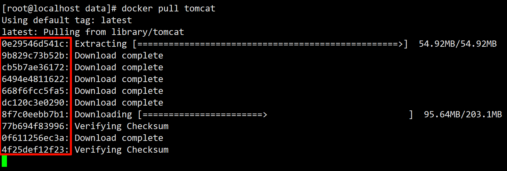
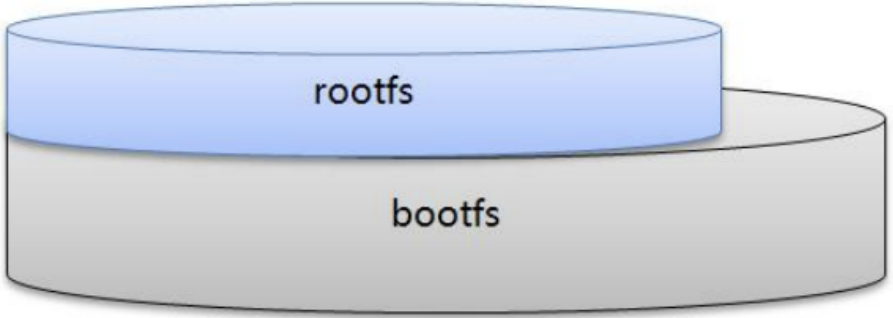
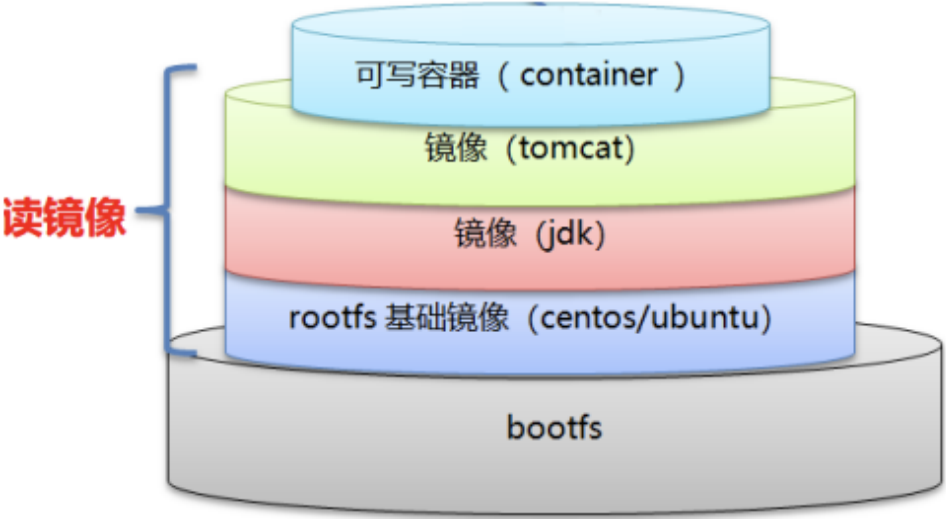
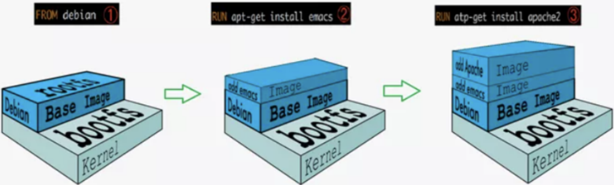

# 四、Docker镜像的底层原理
## 4.1 Docker镜像是分层的文件系统
首先我们需要明白docker镜像是什么?

以我们的pull为例，在下载的过程中我们可以看到docker的镜像好像是在一层一层的在下载。

| ##container## |
|:--:|
||

这种分层的镜像就好像分层的蛋糕。每个分层的镜像都有单独的功能，然后汇聚成一起对外暴露成一个整体的镜像。这种分层的镜像我们又称为 **联合文件系统(UnionFS)**。

**联合文件系统(UnionFS)** 是一种分层、轻量级并且高性能的文件系统，它支持对文件系统的修改作为一次提交来一层层的叠加，同时可以将不同目录挂载到同一个虚拟文件系统下(unite several directories into a single virtual filesystem)。Union 文件系统是 Docker 镜像的基础。镜像可以通过分层来进行继承，基于基础镜像（类似于JAVA中的Object类），可以制作各种具体的应用镜像。

特性: 一次同时加载多个文件系统，但从外面看起来，只能看到一个文件系统，联合加载会把各层文件系统叠加起来，这样最终的文件系统会包含所有底层的文件和目录。

## 4.2 Docker镜像的加载原理
**bootfs(boot file system)** 主要包含`bootloader`和`kernel`, `bootloader`主要是引导加载`kernel`, Linux 刚启动时会加载`bootfs`文件系统，在Docker镜像的最底层是引导文件系统`bootfs`。这一层与我们典型的 Linux/Unix 系统是一样的，包含`boot`加载器和内核。当`boot`加载完成之后整个内核就都在内存中了，此时内存的使用权已由`bootfs`转交给内核，此时系统也会卸载`bootfs`。

**rootfs (root file system)**，在bootfs之上。包含的就是典型 Linux 系统中的 /dev, /proc, /bin, /etc 等标准目录和文件。rootfs就是各种不同的操作系统发行版，比如 Ubuntu，Centos等等。

| ##container## |
|:--:|
||

> - `bootfs`: 包含 bootloader（引导加载程序）和 kernel（内核） 。
> - `rootfs`: root 文件系统，包含的就是典型 Linux 系统中的 /dev，/proc，/bin，/etc 等标准目录和文件。

那为什么Docker镜像要设计成这种分层的镜像呢?

其实就是为了复用！做到资源共享！比如我们安装 nginx 也需要 jdk镜像。如果我们之前下载过 tomcat，tomcat 下载是需要 jdk 镜像 的。由于 jdk 镜像之前已经下载过，所以下载 nginx 镜像就不要再下载 jdk 了。

需要注意的是: Docker**镜像层都是只读的, 容器层是可写的**。当容器启动时，一个新的可写层被加载到镜像的顶部。这一层通常被称作“容器层”，“容器层”之下的都叫“镜像层”。

**所以，所有对容器的改动 -- 无论添加、删除、还是修改文件都只会发生在容器层中。只有容器层是可写的，容器层下面的所有镜像层都是只读的。**

| ##container## |
|:--:|
||

## 4.3 Docker镜像commit操作案例
基于上面的结论，我们可以对正在运行的容器进行修改，自定义一些功能，然后我们再打成新的镜像。这样新的镜像就有新的功能了。

我们运行一个ubuntu镜像，我们发现在镜像里面无法使用vim命令，因为这个ubuntu镜像只是包括了其最基本的内核命令。

```bash
[root@localhost data]# docker run -it hx/ubuntu:0.7.2.1 /bin/bash
root@4fe2f7b5046a:/# vim awa.qwq
bash: vim: command not found
root@4fe2f7b5046a:/# apt-get update
root@4fe2f7b5046a:/# apt-get -y install vim
root@4fe2f7b5046a:/# vim awa.qwq
root@4fe2f7b5046a:/# cat awa.qwq 
hello Docker no UBT!
```

接下来我们需要将这个运行的容器重新制作成一个带有vim功能的ubuntu镜像。

### docker commit 提交容器副本为新镜像

我们使用`docker commit`命令实现。`docker commit`命令的作用就是提交容器副本使之成为一个新的镜像。

语法:
```bash
docker commit -m="提交的描述信息" -a="作者" 容器ID 要创建的目标镜像名:[标签名]
```

示例:

```bash
[root@localhost data]# docker commit -m="add vim" -a="Heng_Xin" 4fe2f7b5046a ubt:114.514
sha256:3263294e2af3b0431b66ca225979b27f47a659a49aa35b1f14db4b73e81d3b99
[root@localhost data]# docker images
REPOSITORY   TAG       IMAGE ID       CREATED          SIZE
ubt          114.514   3263294e2af3   7 seconds ago    192MB
hx/ubuntu    0.7.2.1   1d27d1980d2c   53 minutes ago   72.8MB
```

我们发现我们的镜像制作成功，并且相对于原来的ubuntu镜像，大了不少，为什么？因为我们加了vim功能，相当于又加了一层新的镜像，所以变大了。

接下来我们运行我们自己做的镜像, 发现我们自己制作的镜像确实带有vim功能了:
```bash
[root@localhost data]# docker run -it ubt:114.514 /bin/bash
root@59dd5c21ce11:/# vim awa.cpp
root@59dd5c21ce11:/# cat awa.cpp 
int main() {
    return 0;
}
```

**总结**: Docker中的镜像分层，支持通过扩展现有镜像，创建新的镜像。类似Java继承于一个Base基础类，自己再按需扩展。新镜像是从 base 镜像一层一层叠加生成的。每安装一个软件，就在现有镜像的基础上增加一层。

| ##container## |
|:--:|
||
