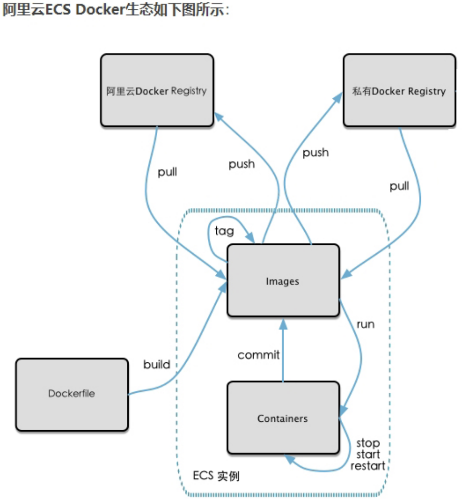
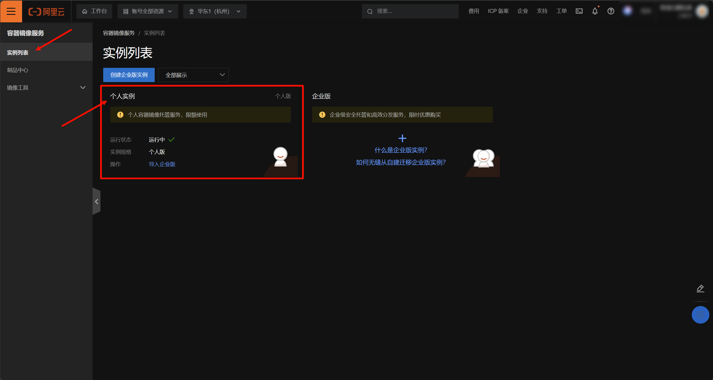
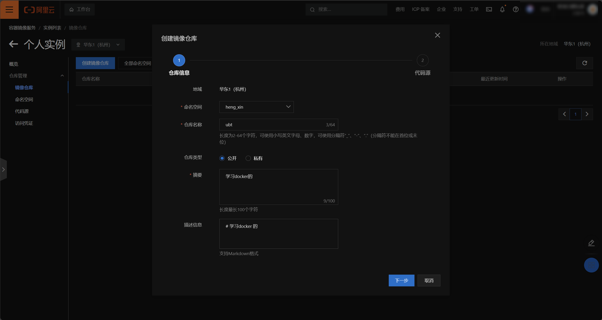
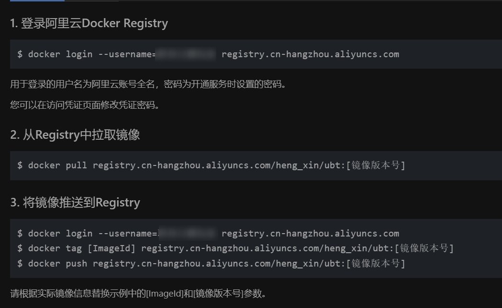

# 五、将本地镜像推送到阿里云
我们自己制作好镜像以后，我们也可以推送到远端，这样别人也可以去使用我们的镜像。

| ##container## |
|:--:|
||

接下来我们将本地镜像推送到阿里云。在推送之前，我们首先要进入阿里云开发者平台创建仓库镜像。

**第一步: 选择控制台，进入容器镜像服务**

**第二步: 选择个人实例**

| ##container## |
|:--:|
||

**第三步: 进入个人实例，创建命名空间, 并且设置为公开**

**第四步: 创建镜像仓库**
| ##container## |
|:--:|
||
|代码源选择: 本地仓库|

接下来，我们就用这几个命令来进行镜像的推送。
| ##container## |
|:--:|
||

首先我们先登录:

```bash
docker login --username=??? registry.cn-hangzhou.aliyuncs.com # 复制第一条, 并且写上你的代码
```

然后:

```bash
[root@localhost data]# docker images -a
REPOSITORY   TAG       IMAGE ID       CREATED         SIZE
hx/ubt       0.7.2.1   f428112c05db   3 minutes ago   72.8MB
[root@localhost data]# docker tag f428112c05db registry.cn-hangzhou.aliyuncs.com/heng_xin/ubt:0.7.2.1 # 可以重命名镜像, 以及版本
[root@localhost data]# docker images -a
REPOSITORY                                       TAG       IMAGE ID       CREATED         SIZE
hx/ubt                                           0.7.2.1   f428112c05db   4 minutes ago   72.8MB
registry.cn-hangzhou.aliyuncs.com/heng_xin/ubt   0.7.2.1   f428112c05db   4 minutes ago   72.8MB
[root@localhost data]# docker push registry.cn-hangzhou.aliyuncs.com/heng_xin/ubt:0.7.2.1 # 上传镜像
The push refers to repository [registry.cn-hangzhou.aliyuncs.com/heng_xin/ubt]
96387706263a: Pushed 
0.7.2.1: digest: sha256:5dca8a30e6b1c1c6694f0f0c3a9428ccb21861b60b9db7f21184d3edc99a7fe2 size: 528
```

注: Docker的`tag`操作本身**不会占用任何磁盘空间**³。当你执行`docker tag`时，实际上在Docker镜像仓库中创建了一个新的名称，该名称指向原始镜像的ID³。因此，它并不会占用任何额外的磁盘空间，并且你可以使用该新的名称来引用该镜像³。总的来说，Docker的`tag`操作不会占用任何磁盘空间³。这就像在Git中给不同时间段的代码打上不同的`tag`一样⁴。希望这个答案对你有所帮助！<sup>[By 必应 GPT-4]</sup>

拉取镜像: (记得把本地的先删除了~)

```bash
[root@localhost data]# docker pull registry.cn-hangzhou.aliyuncs.com/heng_xin/ubt:0.7.2.1
0.7.2.1: Pulling from heng_xin/ubt
63f0e65e26b0: Pull complete 
Digest: sha256:5dca8a30e6b1c1c6694f0f0c3a9428ccb21861b60b9db7f21184d3edc99a7fe2
Status: Downloaded newer image for registry.cn-hangzhou.aliyuncs.com/heng_xin/ubt:0.7.2.1
registry.cn-hangzhou.aliyuncs.com/heng_xin/ubt:0.7.2.1
```
