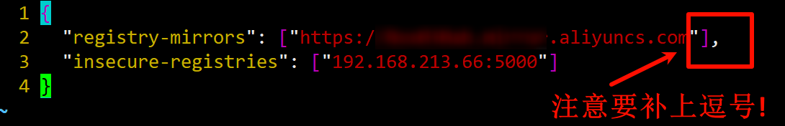

# 六、将本地镜像推送到私有库
Dockerhub、阿里云这样的公共镜像仓库可能不太方便，涉及机密的公司不可能提供镜像给公网，所以需要创建一个本地私人仓库供给团队使用，基于公司内部项目构建镜像。**Docker Registry**是官方提供的工具，可以用于构建私有镜像仓库。

所以我们需要先搭建私服库。

## 6.1 搭建私服
**第一步: 下载镜像Docker Registry**

```bash
docker pull registry
```

**第二步: 运行私服容器**

运行私有库Registry，相当于本地有个私有Docker hub

```bash
# 后台运行 + 指定端口映射 + 挂载数据卷
docker run -d -p 5000:5000 -v /krisswen/myregistry/:/tmp/registry --privileged=true registry # 先这么运行，不用管为什么
```

## 6.2 将镜像推送到私服库
案例演示创建一个新镜像，ubuntu安装`ifconfig`命令

```bash
[root@localhost ~]# docker pull ubuntu # 安装一个新的乌班图
[root@localhost ~]# docker run -it ubuntu /bin/bash
root@f31cdb9d7ef3:/# ifconfig
bash: ifconfig: command not found # 确实不能使用这个命令

# 安装这个命令
root@f31cdb9d7ef3:/# apt-get update
root@f31cdb9d7ef3:/# apt-get install net-tools

# 安装完成后:
root@f31cdb9d7ef3:/# ifconfig
eth0: flags=4163<UP,BROADCAST,RUNNING,MULTICAST>  mtu 1500
        inet 172.17.0.3  netmask 255.255.0.0  broadcast 172.17.255.255
        ether 02:42:ac:11:00:03  txqueuelen 0  (Ethernet)
        RX packets 8571  bytes 32436599 (32.4 MB)
        RX errors 0  dropped 0  overruns 0  frame 0
        TX packets 7368  bytes 406361 (406.3 KB)
        TX errors 0  dropped 0 overruns 0  carrier 0  collisions 0

lo: flags=73<UP,LOOPBACK,RUNNING>  mtu 65536
        inet 127.0.0.1  netmask 255.0.0.0
        inet6 ::1  prefixlen 128  scopeid 0x10<host>
        loop  txqueuelen 1000  (Local Loopback)
        RX packets 0  bytes 0 (0.0 B)
        RX errors 0  dropped 0  overruns 0  frame 0
        TX packets 0  bytes 0 (0.0 B)
        TX errors 0  dropped 0 overruns 0  carrier 0  collisions 0
```
我们`Ctrl + P + Q`退出容器。接下来我们开始进行镜像推送。

**第一步: 安装镜像**

```bash
docker commit -m="提交的描述信息" -a="作者" 容器ID 要创建的目标镜像名:[标签名]
```

```bash
[root@localhost ~]# docker commit -m="ifconfig" -a="Heng_Xin" f31cdb9d7ef3 ubt:0.7.2.1
```

**第二步: 使用`curl`工具验证私服库上有什么镜像**

```bash
# ip 应该为你的 Linux 的 ip
[root@localhost ~]# curl -XGET http://192.168.213.66:5000/v2/_catalog
{"repositories":[]}
```
可以看到，目前私服库没有任何镜像上传过。

**第三步: 将新镜像`ubt:0.7.2.1`修改符合私服规范的Tag**


```bash
docker tag <镜像名称/id>:Tag Host:Port/<镜像名称>:Tag
```

```bash
[root@localhost ~]# docker tag ubt:0.7.2.1 192.168.213.66:5000/heng_xin/ubt:114.514
[root@localhost ~]# docker images
REPOSITORY                                       TAG       IMAGE ID       CREATED         SIZE
192.168.213.66:5000/heng_xin/ubt                 114.514   e62dd9e82f57   6 minutes ago   124MB
```

**第四步: 修改docker配置文件使之支持http**
docker默认不允许http方式推送镜像，通过配置来取消这个限制。

vim命令`vim /etc/docker/daemon.json`后, 新增如下内容: (注: ip 应该是你的 Linux 的 ip)

```bash
"insecure-registries": ["192.168.213.66:5000"]
```

| ##container## |
|:--:|
||

最好是重新启动docker。并且保证linux防火墙没有对5000端口拦截。

**第五步: push推送到私服库**

**由于重新启动了docker，之前运行的`docker registry`容器也停止了，需要重新启动这个容器。**

```bash
[root@localhost ~]# docker ps -a # 找到之前的那个
[root@localhost ~]# docker start dec21fe489b3 # 启动即可
```

```bash
[root@localhost ~]# docker push 192.168.213.66:5000/heng_xin/ubt:114.514
The push refers to repository [192.168.213.66:5000/heng_xin/ubt]
e9572dd86289: Pushed 
9f54eef41275: Pushed 
114.514: digest: sha256:9f65e11fc928910c7c393cd830fb2794e0f8fa7c5474258d8724ce550e1d17dc size: 741
```

**第六步: 验证私服库上是否存在镜像**

```bash
[root@localhost ~]# curl -XGET http://192.168.213.66:5000/v2/_catalog
{"repositories":["heng_xin/ubt"]}
```

我们发现没有问题。

**第七步: 从私服上拉取镜像**

(在此之前我已经确保 rm, rmi -f 了全部 本地的乌班图容器/镜像)

```bash
[root@localhost ~]# docker pull 192.168.213.66:5000/heng_xin/ubt:114.514
114.514: Pulling from heng_xin/ubt
7b1a6ab2e44d: Already exists 
cf70ab646270: Pull complete 
Digest: sha256:9f65e11fc928910c7c393cd830fb2794e0f8fa7c5474258d8724ce550e1d17dc
Status: Downloaded newer image for 192.168.213.66:5000/heng_xin/ubt:114.514
192.168.213.66:5000/heng_xin/ubt:114.514
[root@localhost ~]# docker images
REPOSITORY                         TAG       IMAGE ID       CREATED          SIZE
192.168.213.66:5000/heng_xin/ubt   114.514   e62dd9e82f57   17 minutes ago   124MB
```
我们发现，镜像成功拉取下来了。