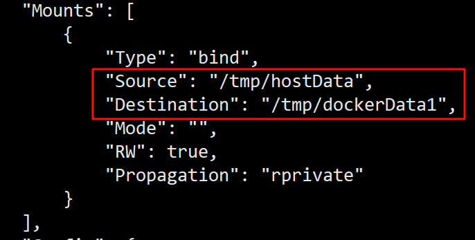

# 七、Docker容器数据卷
## 7.1 数据卷的基本概念
还记得我们上节课运行私有参库容器的命令吗?

```bash
# 后台运行 + 指定端口映射 + 挂载数据卷
docker run -d -p 5000:5000 -v /krisswen/myregistry/:/tmp/registry --privileged=true registry
```
现在疑问来了，这个-v参数是什么意思？就是实现数据卷的挂载。我们以上面这个命令为例:

> - `/krisswen/myregistry/`: 定义的是宿主机的目录，该目录如果不存在，会被自动创建。
>
> - `/tmp/registry`: 容器内部的数据目录。(不存在也会自动创建)
>
> - `--privileged=true`: 必须要加上，否则数据卷挂载失败。因为 CentOS7 安全模块会比之前系统版本加强，不安全的会先禁止，所以目录挂载的情况被默认为不安全的行为，在 SELinux 里面挂载目录被禁止掉了，如果要开启，我们一般使用`--privileged=true`命令，扩大容器的权限解决挂载目录没有权限的问题，也即使用该参数，container 内的 root 拥有真正的 root 权限，否则，container 内的 root 只是外部的一个普通用户权限。

### 什么是容器卷?

容器卷就是目录或文件，存在于一个或多个容器中，由 Docker 挂载到容器，但不属于联合文件系统，因此能够绕过`Union File System`提供一些用于持续存储或共享数据的特性。卷的设计目的就是数据的持久化，完全独立于容器的生存周期，**因此 Docker 不会在容器删除时删除其挂载的数据卷**。一句话: 数据卷有点类似我们 Redis 里面的 rdb 和 aof 文件。

### 数据卷能干嘛?

Docker 容器产生的数据，如果不备份，那么当容器实例删除后，容器内的数据自然也就没有了。为了能保存数据在 Docker 中我们使用卷。

### 数据卷的特点
1. 数据卷可在容器之间共享或重用数据
2. 卷中的更改可以直接实时生效
3. 数据卷中的更改不会包含在镜像的更新中
4. 数据卷的生命周期一直持续到没有容器使用它为止

## 7.2 数据卷的基本案例
我们还是以ubuntu容器为例，在宿主机和容器之间添加数据卷。添加数据卷的命令是

```bash
docker run -it --privileged=true -v /宿主机绝对路径目录:/容器内目录 镜像名
```

示例:
```bash
[root@localhost ~]# docker run -it --privileged=true -v /tmp/hostData:/tmp/dockerData1 ubuntu /bin/bash
root@26bd696ab04f:/# cd tmp/
root@26bd696ab04f:/tmp# ll
drwxr-xr-x 2 root root  6 Apr 23 06:40 dockerData1/

# 可以发现确实是自动创建了目录
[root@localhost tmp]# ll
drwxr-xr-x 2 root root  6 4月  23 14:40 hostData

# 宿主机在挂载的目录写点东西:
[root@localhost hostData]# vim tmp.cpp

# 再去容器里面, 确实可以看到这个文件, 以及内容
[root@localhost hostData]# docker exec -it 26bd696ab04f /bin/bash
root@26bd696ab04f:/# cd tmp/
root@26bd696ab04f:/tmp/dockerData1# ls
tmp.cpp
root@26bd696ab04f:/tmp/dockerData1# cat tmp.cpp 
#include <ctsdio>

int main() {
    printf("Hello Docker -v !\n");
    return 0;
}
```

我们发现只要宿主机和容器之间的目录形成挂载关系，不管是容器内数据发生变化，还是宿主机内部数据发生变化，都会被另一方即时同步！

如果我们把容器停止掉然后在宿主机修改数据呢?

```bash
[root@localhost hostData]# docker stop 26bd696ab04f # 停止容器
26bd696ab04f
[root@localhost hostData]# vim tmpAwA.cpp # 修改内容
[root@localhost hostData]# docker start 26bd696ab04f # 启动容器
26bd696ab04f
[root@localhost hostData]# docker exec -it 26bd696ab04f /bin/bash
root@26bd696ab04f:/# cd tmp/dockerData1/
root@26bd696ab04f:/tmp/dockerData1# cat tmpAwA.cpp # 确实可以收到更新!
#include "tmp.cpp"

int main() {
    printf("Error main Fun is no one!!!\n");
    return 0;
}
```

我们发现即时容器停止了，当再次启动容器之后，文件依然还是可以同步。

### 如何查看据卷是否挂载成功?

```bash
docker inspect <容器id> # 查看容器的详细信息
```

| ##container## |
|:--:|
||

注意: 上面的挂载，默认在容器内部的目录都可以进行读写操作。如果我们只想在容器内部进行读操作呢? 我们需要加上 **`:ro`标识** (ro 即 Read-only)

例如:
```bash
[root@localhost ~]# docker run -it --privileged=true -v /tmp/hostData:/tmp/dockerData1:ro ubuntu /bin/bash
root@8bd6a402af97:/tmp/dockerData1# touch fk.py
touch: cannot touch 'fk.py': Read-only file system # 没有权限
```

此时如果宿主机写入内容，可以同步给容器内，容器可以读取到。

### 容器的数据卷被继承和共享

- 如果我们把两个容器都挂载到同一个目录, 那这两个容器不就可以通过访问文件来进行交流了吗?

- 因此, 我们提供了一个快速的进行共享的命令:

`<本容器name>`继承`<父类name>`的**卷规则**:

```bash
docker run -it --privileged=true --volumes-from <父类name> --name <本容器name> <镜像>
```

此处的`--name`就是: 下面的`NAMES`

```bash
[root@localhost hostData]# docker ps
CONTAINER ID   IMAGE     COMMAND       CREATED          STATUS          PORTS     NAMES
26bd696ab04f   ubuntu    "/bin/bash"   25 minutes ago   Up 16 minutes             nice_mestorf
```

可参考-> [Docker---数据卷容器（volumes-from容器间传递共享）](https://blog.csdn.net/geek_xiong/article/details/92030035)

示例:

```bash
[root@localhost hostData]# docker run -it --privileged=true --volumes-from nice_mestorf --name sub ubuntu
root@0b74aa0a4189:/# cd tmp/dockerData1/
root@0b74aa0a4189:/tmp/dockerData1# ls
tmp.cpp  tmpAwA.cpp
```
我们发现容器2有和容器1一样的数据卷，因为容器1的数据卷目录被容器2继承了。


```bash
root@0b74aa0a4189:/tmp/dockerData1# ls
tmp.cpp  tmpAwA.cpp
root@0b74aa0a4189:/tmp/dockerData1# touch subFile.py
root@0b74aa0a4189:/tmp/dockerData1# [root@localhost hostData]# # 退出容器2
[root@localhost hostData]# docker exec -it 26bd696ab04f /bin/bash # 进入容器1
root@26bd696ab04f:/# cd /tmp/dockerData1/
root@26bd696ab04f:/tmp/dockerData1# ls # 发现容器2创建的, 容器1也可以访问
subFile.py  tmp.cpp  tmpAwA.cpp
```
这样我们就实现了不同容器之间的数据共享。