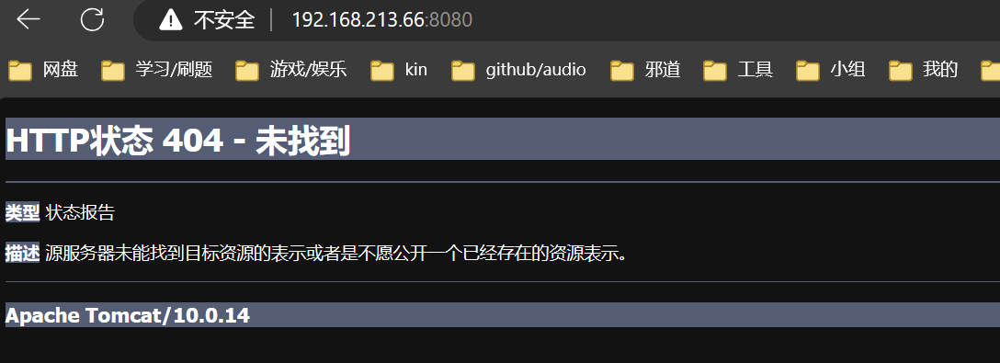
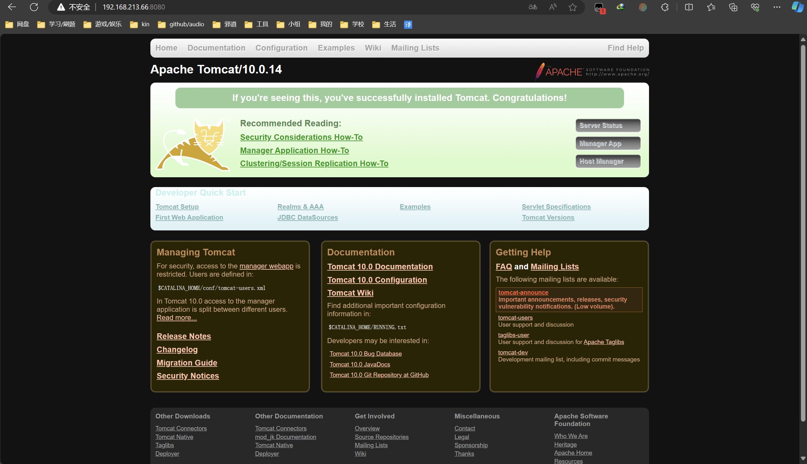
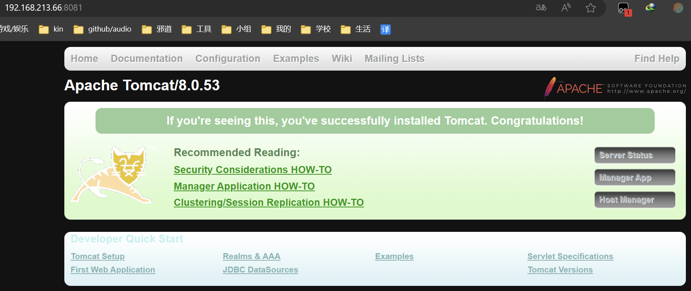

# 安装tomcat
## 1. 搜索镜像

```bash
docker search tomcat
```

## 2. 拉取镜像

```bash
docker pull tomcat
```

## 3. 查看是否有拉取到的tomcat

docker images查看是否有拉取到的tomcat

```bash
[root@localhost ~]# docker images tomcat
REPOSITORY   TAG       IMAGE ID       CREATED       SIZE
tomcat       latest    fb5657adc892   2 years ago   680MB
```

## 4. 使用tomcat镜像创建容器实例(也叫运行镜像)

```bash
docker run -d -p 8080:8080 --name t1 tomcat
```

此时我们访问8080:

| ##container## |
|:--:|
||

为什么会出现404？我们的tomcat不是已经成功启动了吗？

这是因为我们拉取的是最新的tomcat镜像，最新的tomcat对首页访问的规则做了修改。

所以我们先进入tomcat容器的内部:


```bash
[root@localhost ~]# docker exec -it t1 /bin/bash # 进入容器的内部
root@9627ad80180c:/usr/local/tomcat# ls -l
total 132
-rw-r--r-- 1 root root 18994 Dec  2  2021 BUILDING.txt
-rw-r--r-- 1 root root  6210 Dec  2  2021 CONTRIBUTING.md
-rw-r--r-- 1 root root 60269 Dec  2  2021 LICENSE
-rw-r--r-- 1 root root  2333 Dec  2  2021 NOTICE
-rw-r--r-- 1 root root  3378 Dec  2  2021 README.md
-rw-r--r-- 1 root root  6905 Dec  2  2021 RELEASE-NOTES
-rw-r--r-- 1 root root 16517 Dec  2  2021 RUNNING.txt
drwxr-xr-x 2 root root  4096 Dec 22  2021 bin
drwxr-xr-x 1 root root    22 Apr 23 08:52 conf
drwxr-xr-x 2 root root  4096 Dec 22  2021 lib
drwxrwxrwx 1 root root    80 Apr 23 08:52 logs
drwxr-xr-x 2 root root   159 Dec 22  2021 native-jni-lib
drwxrwxrwx 2 root root    30 Dec 22  2021 temp
drwxr-xr-x 2 root root     6 Dec 22  2021 webapps
drwxr-xr-x 7 root root    81 Dec  2  2021 webapps.dist
drwxrwxrwx 2 root root     6 Dec  2  2021 work
root@9627ad80180c:/usr/local/tomcat# cd webapps

# 发现webapps是空的
root@9627ad80180c:/usr/local/tomcat/webapps# ls -l
total 0
```

真正有货的是webapps.dist目录:

```bash
root@9627ad80180c:/usr/local/tomcat# cd webapps.dist/
root@9627ad80180c:/usr/local/tomcat/webapps.dist# ls -l
total 4
drwxr-xr-x  3 root root  223 Dec 22  2021 ROOT
drwxr-xr-x 15 root root 4096 Dec 22  2021 docs
drwxr-xr-x  7 root root   99 Dec 22  2021 examples
drwxr-xr-x  6 root root   79 Dec 22  2021 host-manager
drwxr-xr-x  6 root root  114 Dec 22  2021 manager
```

所以我们现在把已经存在的webapps目录删除，然后将webapps.dist目录重命名为webapps目录。

```bash
root@9627ad80180c:/usr/local/tomcat# rm -rf webapps
root@9627ad80180c:/usr/local/tomcat# mv webapps.dist/ webapps
```

此时再访问就没有问题了!

| ##container## |
|:--:|
||

但是这样进入容器修改容器的规则很麻烦，我们可不可以安装一个免修改的tomcat镜像呢？是可以的。

```bash
docker pull billygoo/tomcat8-jdk8 # 下载一个 tomcat8 镜像
docker run -d -p 8081:8080 --name mytomcat8 billygoo/tomcat8-jdk8
```

| ##container## |
|:--:|
||

~~具体怎么样就看你是不是版本控了...~~