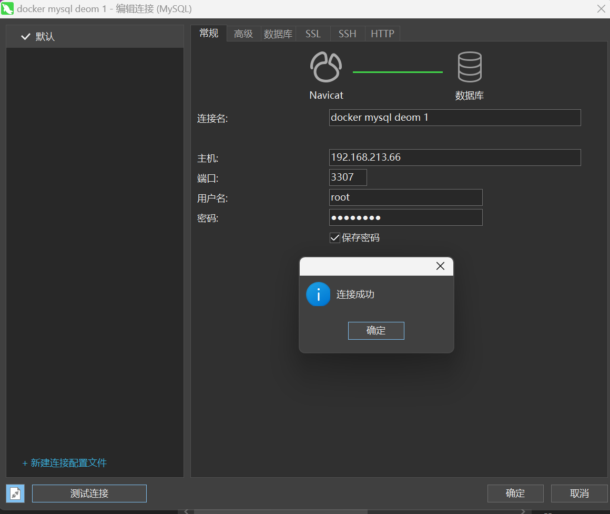
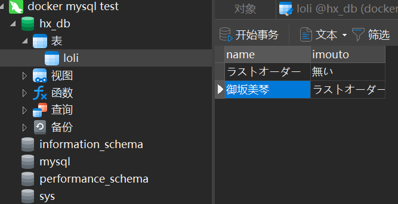
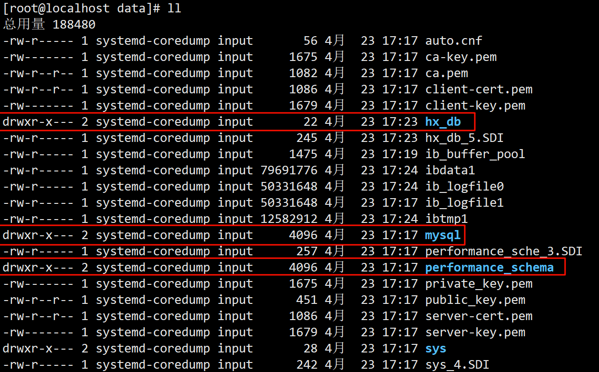

# 安装mysql
## 8.2.1 简单版本安装
### 1. 拉取镜像

```bash
docker pull mysql:8.0.1
```

### 2. 查看镜像是否拉取成功

```bash
[root@localhost ~]# docker images mysql:8.0.1
REPOSITORY   TAG       IMAGE ID       CREATED       SIZE
mysql        8.0.1     7896f0417528   6 years ago   262MB
```

### 3. 运行镜像
运行mysql的镜像的命令是什么？我们进入 https://hub.docker.com/ 搜索mysql镜像，可以看到这个命令的描述:

```bash
docker run --name some-mysql -e MYSQL_ROOT_PASSWORD=my-secret-pw -d mysql:tag

# 其中 some-mysql 是要分配给容器的名称，
# my-secret-pw 是要为 MySQL 根用户设置的密码，
# tag 是指定所需 MySQL 版本的标签
```

所以:

```bash
docker run -p 3307:3306 -e MYSQL_ROOT_PASSWORD=root -d mysql:8.0.1
```

注意: 一定要保证linux里面没有运行的mysql，如果有的话，端口映射3307。否则会报异常。

### 4. 进入容器内部, 登录mysql数据库

```bash
[root@localhost ~]# docker exec -it a8634ed14ce8 /bin/bash
root@a8634ed14ce8:/# mysql -u root -p
Enter password: # 之前我设置的密码是 root
Welcome to the MySQL monitor.  Commands end with ; or \g.
Your MySQL connection id is 4
Server version: 8.0.1-dmr MySQL Community Server (GPL)

Copyright (c) 2000, 2017, Oracle and/or its affiliates. All rights reserved.

Oracle is a registered trademark of Oracle Corporation and/or its
affiliates. Other names may be trademarks of their respective
owners.

Type 'help;' or '\h' for help. Type '\c' to clear the current input statement.

mysql> 
```

### 5. 使用mysql可视化工具来连接mysql

| ##container## |
|:--:|
||

我们发现连接成功。

大家思考，目前运行的容器有没有什么问题？首先我们在运行容器的时候，没有指定字符编码集，可能会存在插入中文出现乱码的情况，还有就是如果我们删除容器之后，容器里面存在的数据怎么办？所以我们需要对我们安装步骤进行优化。

首先我们删除之前运行的mysql容器

## 8.2.2 实战版本安装 (推荐)
### 1. 运行mysql容器 + 挂载数据卷

```bash
# 如果报错了请先尝试去除`\`
docker run -d -p 3307:3306 --privileged=true \
-v /opt/mysql/log:/var/log/mysql \
-v /opt/mysql/data:/var/lib/mysql \ 
-v /opt/mysql/conf:/etc/mysql/conf.d \
-e MYSQL_ROOT_PASSWORD=root \
--name mysql mysql:8.0.1 \
```

### 2. 新建my.cnf

```bash
cd /opt/mysql/conf/
vim my.cnf
```

我们编辑:

```cnf
[client]
default_character_set=utf8
[mysqld]
collation_server = utf8_general_ci
character_set_server = utf8
```

### 3. 重新启动mysql容器实例再重新进入并查看字符编码
由于修改了配置，我们最好将容器重新启动一下:

```bash
[root@localhost conf]# docker restart 0e4c8b1cd7ed
```

### 4. 进入容器，并登陆mysql数据库

```bash
[root@localhost conf]# docker exec -it  0e4c8b1cd7ed /bin/bash
root@0e4c8b1cd7ed:/# mysql -u root -p
Enter password: 
Welcome to the MySQL monitor.  Commands end with ; or \g.
Your MySQL connection id is 4
Server version: 8.0.1-dmr MySQL Community Server (GPL)

Copyright (c) 2000, 2017, Oracle and/or its affiliates. All rights reserved.

Oracle is a registered trademark of Oracle Corporation and/or its
affiliates. Other names may be trademarks of their respective
owners.

Type 'help;' or '\h' for help. Type '\c' to clear the current input statement.

mysql> show variables like 'character%';
+--------------------------+----------------------------+
| Variable_name            | Value                      |
+--------------------------+----------------------------+
| character_set_client     | utf8                       |
| character_set_connection | utf8                       |
| character_set_database   | utf8                       |
| character_set_filesystem | binary                     |
| character_set_results    | utf8                       |
| character_set_server     | utf8                       |
| character_set_system     | utf8                       |
| character_sets_dir       | /usr/share/mysql/charsets/ |
+--------------------------+----------------------------+
8 rows in set (0.01 sec)

mysql> 
```

可以看到字符集是OK的啦

### 5. 创建数据表，插入数据

| ##container## |
|:--:|
||

我们进入数据卷挂载的目录查看数据是否存在:

```bash
cd /opt/mysql/data
```

| ##container## |
|:--:|
||


```bash
[root@localhost hx_db]# ll # 存放对应数据表的数据
总用量 128
-rw-r----- 1 systemd-coredump input 131072 4月  23 17:24 loli.ibd
```

我们发现我们创建的数据成功的保存到数据卷对应的挂载目录了。