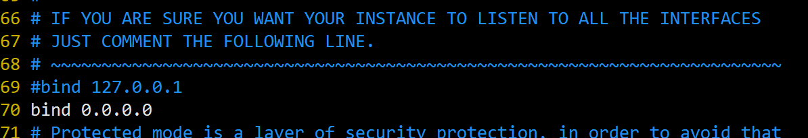
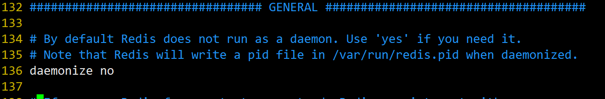
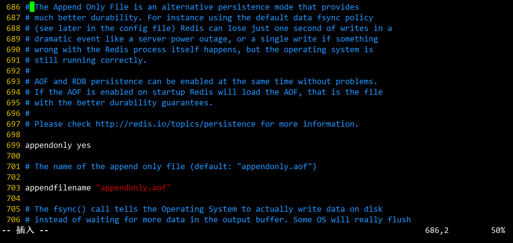

# 安装redis
## 8.3.1 简单安装
> fxxk, 懒

## 8.3.2 实战版安装
### 1. 拉取镜像

版本你来定
```bash
docker pull redis
```

### 2. 在宿主机下面创建目录

```bash
cd /opt
mkdir -p app/redis
```
### 3. 将一个`redis.conf`文件模板拷贝进`/opt/app/redis`目录下

```bash
cp redis.conf /opt/app/redis/
cd /opt/app/redis
```

[下载文件: redis.conf](redis.conf)

```bash
[root@localhost redis]# ll
总用量 64
-rw-r--r-- 1 root root 63292 4月  23 17:49 redis.conf
```

### 4. 修改redis.conf文件
1. 运行外部连接

| ##container## |
|:--:|


2. 将`daemonize yes`注释起来或者`daemonize no`设置，因为该配置和`docker run`中`-d`参数冲突，会导致容器一直启动失败

| ##container## |
|:--:|


3. 开启redis数据持久化 `appendonly yes`

| ##container## |
|:--:|


### 5. 运行镜像

```bash
docker run -p 6379:6379 --name myredis \
--privileged=true \
-v /opt/app/redis/redis.conf:/etc/redis/redis.conf \
-v /opt/app/redis/data:/data \
-d redis redis-server \
/etc/redis/redis.conf \
```

### 6. 安全性 - 设置密码
[Redis设置密码，查看密码，修改密码，忘记密码。](https://blog.csdn.net/weixin_46304253/article/details/109023839)

