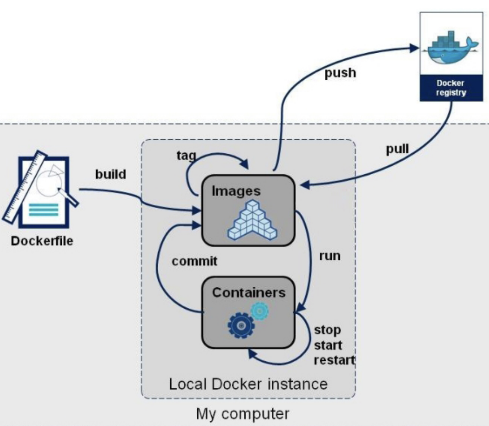
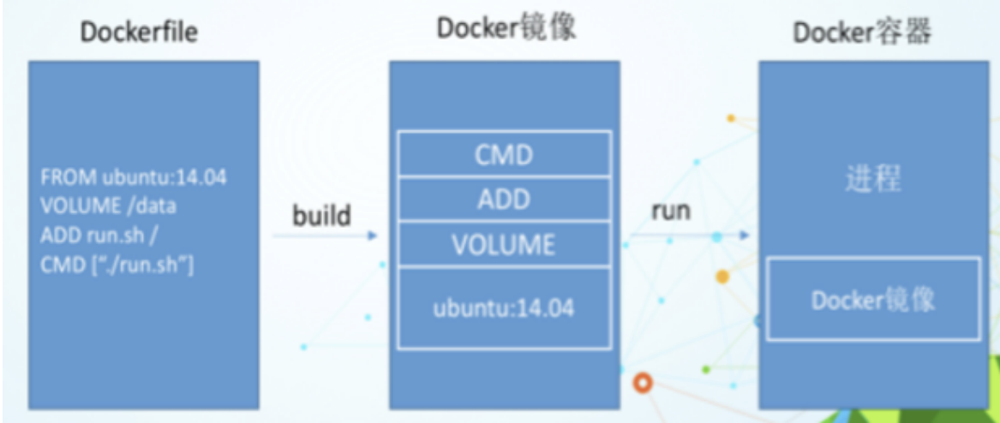

# 二、DockerFile
## 2.1 什么是DockerFile

DockerFile 是用来构建 Docker 镜像的文本文件，是由一条条构建镜像所需的指令和参数构成的脚本。所以我们得知，DockerFile 是用来构建 Docker 镜像的。

以前我们可以通过`docker commit`命令将一个容器重新打成一个新的镜像。但是在微服务中，我们可能需要配置很多参数，并且这些参数可能是实时动态变化的，而且微服务还需要和许多中间件之间建立联系。这个时候使用`docker commit`将微服务制作成镜像就不太方便了，这个时候 DockerFile 就可以解决问题。对于 DockerFile 的学习，我们可以参照官网: [DockerFile官方文档](https://docs.docker.com/engine/reference/builder/)

| ##container## |
|:--:|
||

那我们如何通过 DockerFile 构建镜像? 我们只需要3个步骤即可:
- 编写`DockerFile`文件
- `docker build`命令构建镜像
- `docker run`镜像运行容器实例

## 2.2 DockerFile构建过程解析
### 2.2.1 DockerFile基础知识

1. 每条**保留字指令都必须为大写字母**且后面要跟随至少一个参数。
    - 什么是保留字指令？我们可以在官网上查看: [DockerFile官方文档](https://docs.docker.com/engine/reference/builder/)
  
2. 指令按照**从上到下，顺序执行**。
3. `#`表示注释。
4. 每条指令都会创建一个新的镜像层并对镜像进行提交。

### 2.2.2 Docker执行DockerFile的大致流程
1. Docker 从基础镜像运行一个容器
2. 执行一条指令并对容器作出修改
3. 执行类似`docker commit`的操作提交一个新的镜像层
4. Docker 再**基于刚提交的镜像运行一个新容器**
5. 执行 DockeFile 中的下一条指令直到所有指令都执行完成

**总结:**
从应用软件的角度来看，DockerFile、Docker镜像与Docker容器分别代表软件的三个不同阶段:
- DockerFile是软件的原材料
- Docker镜像是软件的交付品
- Docker容器则可以认为是软件镜像的运行态，也即依照镜像运行的容器实例
    - DockerFile面向开发，Docker镜像成为交付标准，Docker容器则涉及部署与运维，三者缺一不可，合力充当Docker体系的基石。

| ##container## |
|:--:
||

1. DockerFile，需要定义一个 DockerFile，DockerFile 定义了镜像需要的一切东西。

    DockerFile 涉及的内容包括执行代码或者是文件、环境变量、依赖包、运行时环境、动态链接库、操作系统的发行版、服务进程和内核进程(当应用进程需要和系统服务和内核进程打交道，这时需要考虑如何设计 namespace 的权限控制)等等;

2. Docker镜像，在用DockerFile定义一个文件之后，`docker build`时会产生一个Docker镜像，当运行 Docker 镜像时会真正开始提供服务;

3. Docker容器，容器是直接提供服务的。