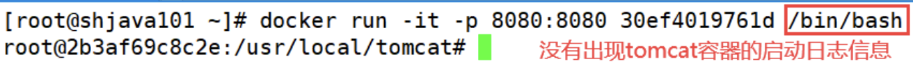

# 2.3 DockerFile常用保留字指令
我们参考[tomcat9.0的DockeFile](https://github.com/docker-library/tomcat/blob/master/9.0/jre8/temurin-focal/Dockerfile):

```DockerFile
#
# NOTE: THIS DOCKERFILE IS GENERATED VIA "apply-templates.sh"
#
# PLEASE DO NOT EDIT IT DIRECTLY.
#

FROM eclipse-temurin:8-jre-focal

ENV CATALINA_HOME /usr/local/tomcat
ENV PATH $CATALINA_HOME/bin:$PATH
RUN mkdir -p "$CATALINA_HOME"
WORKDIR $CATALINA_HOME

# let "Tomcat Native" live somewhere isolated
ENV TOMCAT_NATIVE_LIBDIR $CATALINA_HOME/native-jni-lib
ENV LD_LIBRARY_PATH ${LD_LIBRARY_PATH:+$LD_LIBRARY_PATH:}$TOMCAT_NATIVE_LIBDIR

# see https://www.apache.org/dist/tomcat/tomcat-9/KEYS
# see also "versions.sh" (https://github.com/docker-library/tomcat/blob/master/versions.sh)
ENV GPG_KEYS 48F8E69F6390C9F25CFEDCD268248959359E722B A9C5DF4D22E99998D9875A5110C01C5A2F6059E7 DCFD35E0BF8CA7344752DE8B6FB21E8933C60243

ENV TOMCAT_MAJOR 9
ENV TOMCAT_VERSION 9.0.88
ENV TOMCAT_SHA512 b2668f50339afdd266dbdf3ff20a98632a5552910179eda272b65ea0b18be4bef8fa9988e3cfc77e4eae4b74ae1e7abe2483b0e427a07628ed50fed3a13eefb9

COPY --from=tomcat:9.0.88-jdk8-temurin-focal $CATALINA_HOME $CATALINA_HOME
RUN set -eux; \
    apt-get update; \
    xargs -rt apt-get install -y --no-install-recommends < "$TOMCAT_NATIVE_LIBDIR/.dependencies.txt"; \
    rm -rf /var/lib/apt/lists/*

# verify Tomcat Native is working properly
RUN set -eux; \
    nativeLines="$(catalina.sh configtest 2>&1)"; \
    nativeLines="$(echo "$nativeLines" | grep 'Apache Tomcat Native')"; \
    nativeLines="$(echo "$nativeLines" | sort -u)"; \
    if ! echo "$nativeLines" | grep -E 'INFO: Loaded( APR based)? Apache Tomcat Native library' >&2; then \
        echo >&2 "$nativeLines"; \
        exit 1; \
    fi

EXPOSE 8080

# upstream eclipse-temurin-provided entrypoint script caused https://github.com/docker-library/tomcat/issues/77 to come back as https://github.com/docker-library/tomcat/issues/302; use "/entrypoint.sh" at your own risk
ENTRYPOINT []

CMD ["catalina.sh", "run"]
```

<div style="margin-top: 80px;">

---
</div>

## 2.3.1 FROM 关键字
**基础镜像，当前新镜像是基于哪个镜像的，指定一个已经存在的镜像作为模板，第一条必须是`FROM`。**

比如我们上图的tomcat镜像，第一句就是`FROM eclipse-temurin:8-jre-focal`. 这句话的意思就是这个tomcat镜像是基于`eclipse-temurin:8-jre-focal`这个镜像制作的。

<div style="margin-top: 80px;">

---
</div>

## 2.3.2 MAINTAINER
描述镜像维护者的姓名和邮箱地址。

<div style="margin-top: 80px;">

---
</div>

## 2.3.3 RUN
容器构建的时候需要运行的命令。也就是 DockerFile 在构建(build)的时候需要执行的命令。运行命令的格式有两种。一种是shell格式，一种是exec格式。

- shell格式 
    - RUN 命令行命令 等同于在终端操作的shell命令。
    - 比如: `RUN yum -y install vim`. 就相当于在构建镜像的时候安装vim工具。

- exec格式
    - 具体语法格式如下:
   
    ```DockerFile
    RUN ["可执行文件", "参数1", "参数2"]
    # 例如:
    # RUN ["./test.php", "dev", "offline"] 等价于 RUN ./test.php dev offline
    ```

**总结: `RUN`是在`Docker build`的时候运行。**

<div style="margin-top: 80px;">

---
</div>

## 2.3.4 EXPOSE
当前容器对外暴露的端口。

<div style="margin-top: 80px;">

---
</div>

## 2.3.4 WORKDIR
**指定在创建容器后，终端默认登陆的进来工作目录，一个落脚点。**

我们以tomcat镜像为例，让我们启动运行一个tomcat容器之后，我们观察进入容器之后的默认目录:

```shell
[root@loli ~]# docker run -it -p 8080:8080 tomcat /bin/bash
root@99d0a0da1a9f:/usr/local/tomcat# pwd
/usr/local/tomcat
```

我们发现现在进入tomcat容器之后的默认目录就是`/usr/local/tomcat`。

<div style="margin-top: 80px;">

---
</div>

## 2.3.5 USER
指定该镜像以什么样的用户去执行，如果都不指定，默认是root。一般我们都是以root用户去运行我们的镜像。

<div style="margin-top: 80px;">

---
</div>

## 2.3.6 ENV
**用来在构建镜像过程中设置环境变量**。这个环境变量可以在后续的任何`RUN`指令中使用，这就如同在命令前面指定了环境变量前缀一样；

也可以在其它指令中直接使用这些环境变量。我们以tomcat的环境变量为例:
```DockerFile
ENV CATALINA_HOME /usr/local/tomcat
WORKDIR $CATALINA_HOME
```
这就证明了为什么tomcat容器运行之后的默认落脚点是`/usr/local/tomcat`。

## 2.3.7 VOLUME
容器数据卷，用于数据保存和持久化工作。

<div style="margin-top: 80px;">

---
</div>

## 2.3.8 ADD
将宿主机目录下的文件拷贝进镜像且会自动处理URL和解压tar压缩包。

<div style="margin-top: 80px;">

---
</div>

## 2.3.9 COPY
类似ADD，拷贝文件和目录到镜像中。 将从构建上下文目录中 <源路径> 的文件/目录复制到新的一层的镜像内的 <目标路径> 位置。

语法格式:

```DockerFile
COPY src dest # 或者
COPY ["src","dest"]
# src: 源文件或者源目录
# dest: 容器内的指定路径，该路径不用事先建好，路径不存在的话，会自动创建。
```

<div style="margin-top: 80px;">

---
</div>

## 2.3.10 CMD
指定容器启动后的要干的事情。CMD后面跟的指令格式和RUN类似，也有两种格式:

```DockerFile
# shell格式:
CMD <命令>

# exec 格式:
CMD ["可执行文件", "参数1", "参数2"]

# 在ENTRYPOINT指令指定后, 用 CMD 指定具体的参数
```

我们以tomcat容器为例，我们首先启动tomcat容器:

| ##container## |
|:--:|
||
|注意, 有所不同|

我们发现启动tomcat容器的时候，显示了很多启动日志信息。为什么这样呢，就是因为tomcat的 DockerFile 里面的最后一句话: `CMD ["catalina.sh", "run"]`也就是运行了`catalina.sh`命令。

**需要注意的是: Dockerfile 中可以有多个 CMD 指令，但只有最后一个生效，CMD 会被`docker run`之后的参数替换。**

这句话是什么意思呢?

我们以如下这条命令为例启动tomcat，我们在最后面加上了一句`/bin/bash`命令:

| ##container## |
|:--:|
|此时我们发现，tomcat容器启动之后，相关的启动日志信息没有出现:|
||

这就说明了`catalina.sh`命令没有运行，为什么?

因为相当于使用CMD运行了`/bin/bash`命令，覆盖了`catalina.sh`命令。如下所示:

```DockerFile
CMD ["catalina.sh","run"]
CMD ["/bin/bash","run"]
```

最后一定要注意区分RUN和CMD命令的区别:

**RUN命令是`docker build`(构建)的时候运行。CMD是`docker run`的时候运行**。

<div style="margin-top: 80px;">

---
</div>

### 2.3.11 ENTRYPOINT
也是用来指定一个容器启动时要运行的命令，它类似于 CMD 指令，但是 ENTRYPOINT 不会被`docker run`后面的命令覆盖，而且这些命令行参数会被当作参数送给 ENTRYPOINT 指令指定的程序。

命令格式:

```DockerFile
ENTRYPOINT ["<executeable>", "<paraml>", "<param2>", ...]
```

ENTRYPOINT 可以和 CMD 一起用，一般是变参才会使用 CMD ，这里的 CMD 等于是在给 ENTRYPOINT 传参。当指定了 ENTRYPOINT 后，CMD 的含义就发生了变化，不再是直接运行其命令而是将 CM D的内容作为参数传递给 ENTRYPOINT 指令。

案例如下: 假设已通过 Dockerfile 构建了 nginx:test 镜像:


```DockerFile
FROM nginx

ENTRYPOINT ["nginx", "-c"] # 定参
CMD ["/etc/nginx/nginx.conf"] # 变参
```

| 是否传参 | Docker命令 | 衍生出的实际命令 |
| :---: | :---: | :---: |
| 否 | `docker run nginx:test` | `nginx -c /etc/nginx/nginx.conf` |
| 是 | `docker run nginx:test -c /etc/nginx/new.conf` | `nginx -c /etc/nginx/new.conf` |
