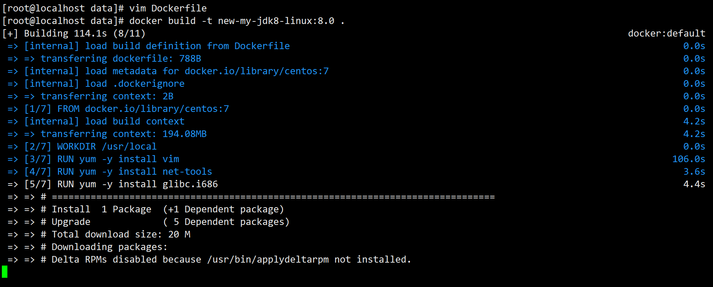

# 2.4 DockerFile案例
需求: 自定义镜像centos。要求Centos7镜像具备vim+ifconfig+jdk8

## 2.4.1 前期准备工作
前期准备工作: 准备centos7镜像

```shell
docker pull centos:7
```

我们直接运行这个镜像, 我们发现这个centos容器里面vim、ifconfig工具以及java8的环境都没有。因为我们现在运行的centos7容器只具备最基本的环境。我们需要自己进行相关功能的加强。

## 2.4.2 编写dockerfile文件

1. 新建一个文件夹,并上传一个[linux版本的jdk](https://repo.huaweicloud.com/java/jdk/8u202-b08/)。

2. 编写Dockerfile文件

注意, `D`必须要大写, 其他的也不能变!
```shell
vim Dockerfile
```

然后写下下面内容:
```DockerFile
FROM centos:7

MAINTAINER Heng_Xin<282000500@qq.com>

ENV MYPATH /usr/local
WORKDIR $MYPATH

# 安装vim编辑器
RUN yum -y install vim
# 安装ifconfig命令查看网络IP
RUN yum -y install net-tools
# 安装java8及lib库
RUN yum -y install glibc.i686
RUN mkdir /usr/local/java
# ADD 是相对路径java, 把jdk-8u202-linux-x64.tar.gz添加到容器中,安装包必须要和Dockerfile文件在同一位置
ADD jdk-8u202-linux-x64.tar.gz /usr/local/java/
# 配置java环境变量
ENV JAVA_HOME /usr/local/java/jdk1.8.0_202
ENV JRE_HOME $JAVA_HOME/jre
ENV CLASSPATH $JAVA_HOME/lib/dt.jar:$JAVA_HOME/lib/tools.jar:$JRE_HOME/lib:$CLASSPATH
ENV PATH $JAVA_HOME/bin:$PATH

# 设置对外开放的端口
EXPOSE 80

CMD echo $MYPATH
CMD echo "success--------------ok"
CMD /bin/bash
```

3. 运行Dockerfile

格式为: (注意, 绝对不能少后面的`.`)
```shell
docker build -t 镜像名称:标签名称 .
```

| ##container## |
|:--:|
|熟悉的界面 + 漫长的等待|
||

制作好后, 就是这样:
```shell
[root@localhost data]# docker images
REPOSITORY                         TAG       IMAGE ID       CREATED          SIZE
new-my-jdk8-linux                  8.0       b71229568f1c   29 seconds ago   998MB
```

4. 运行镜像

```shell
[root@localhost data]# docker run -it new-my-jdk8-linux:8.0 /bin/bash
[root@df7211eb5726 local]# ls # 落脚点正确, 且有java文件夹
bin  etc  games  include  java  lib  lib64  libexec  sbin  share  src
[root@df7211eb5726 local]# vim awa.qwq # 可以使用
[root@df7211eb5726 local]# 
```
我们发现进入容器之后，vim工具、ifconfig工具，还有jdk环境都有了。说明我们使
用dockerfile制作的镜像没有问题！