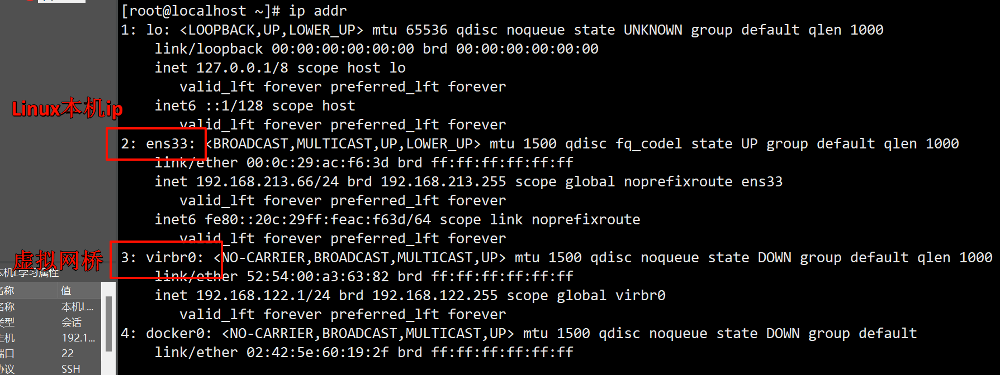

# 三、Docker网络
为什么需要学习docker网络？我们先试想这么一个场景:

我们在Docker里面运行了tomcat和mysql两个容器，在tomcat容器里面部署了一个web项目，当我们web项目启动之后需要调用mysql里面的数据，此时需要什么网络去连接tomcat和mysql容器？这就是docker网络需要研究的内容。

## 3.1 Docker网络的基本概述
接下来我们来认识一下什么是Docker网络:

当我们没有启动docker的时候，我们使用`ifconfig`命令查看 Linux 网络情况:

| ##container## |
|:--:|
||
|(忘记关闭docker服务了, 关闭的话是看不到`4: docker0`的)|

在CentOS7的安装过程中如果有选择相关虚拟化的的服务安装系统后，启动网卡时会发现有一个以网桥连接的私网地址的virbr0网卡(virbr0网卡：它还有一个固定的默认IP地址192.168.122.255)，是做虚拟机网桥的使用的，其作用是为连接其上的虚机网卡提供 NAT访问外网的功能。

当我们启动docker的时候，我们使用`ifconfig`命令查看centos7网络情况:
| ##container## |
|:--:|
||

这个`docker0`是什么？

也是一个虚拟网桥。通过虚拟网桥可以实现宿主机和docker容器之间的通信。同时容器与容器之间的通信也需要通过虚拟网桥实现。

当我们安装docker之后，默认会帮助我们创建3种网络模式:

```shell
[root@localhost ~]# docker network ls
NETWORK ID  NAMEDRIVER SCOPE
f38a85f4e508bridge bridge local
dc0aa33635b7hosthostlocal
60b8afbeefb2nonenulllocal
```

下面我们分别对这三种默认的网络模式做一个简单的介绍:

可以类比: [Linux的基本常识(VM的使用)](../../../../001-Linux/002-Linux基础篇/001-基本常识/001-Linux的基本常识【VM的使用】/index.md)-VM-Linux网络连接三种方式

|网络模式|描述|
|:-:|--|
|bridge|为每个容器分配并设置 IP，将容器连接到名为 `docker0` 的虚拟网桥，这是**默认模式**。|
|host| 容器不会虚拟出自己的网卡或设置 IP，而是使用宿主机的 IP 和端口。可以使用 `--network host` 参数指定此模式。|
|none|容器有独立的网络命名空间，但没有进行任何网络设置，如分配 veth pair 或连接到网络桥接。一般很少使用。可以使用 `--network none` 参数指定此模式。|
|container|新创建的容器不会创建自己的网卡或设置自己的 IP，而是与指定的容器共享 IP 和端口范围。|