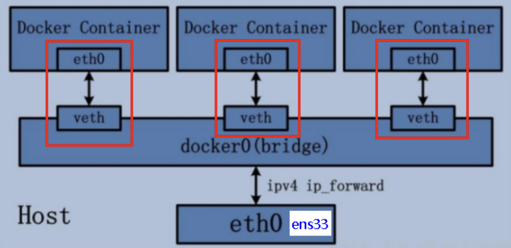
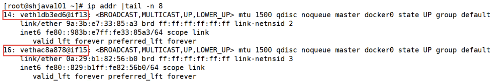
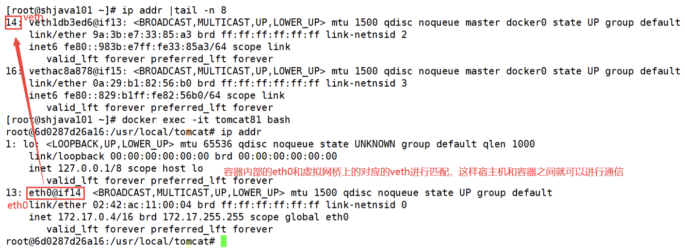
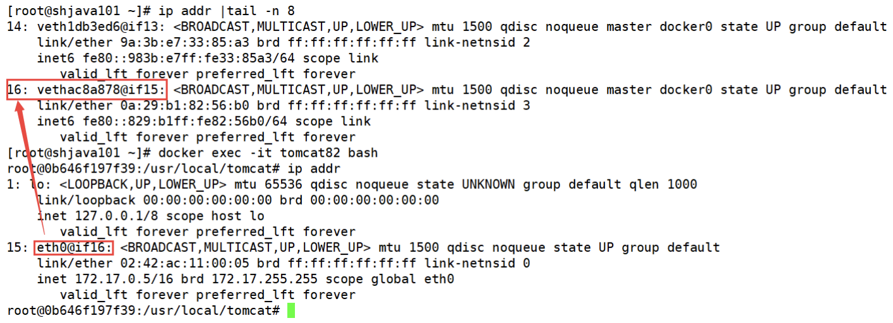
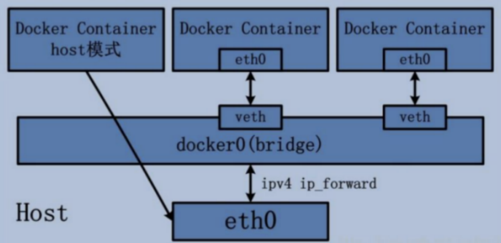
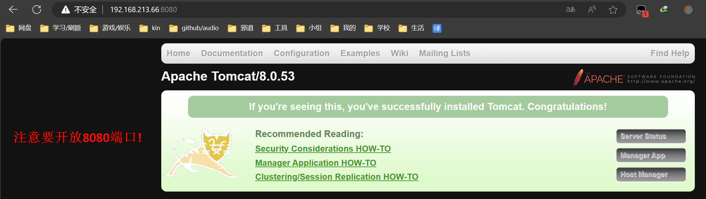
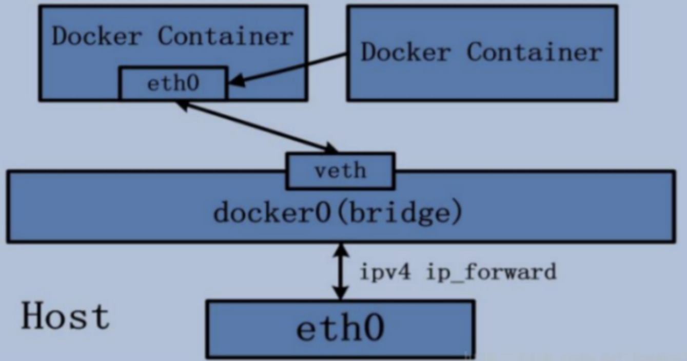
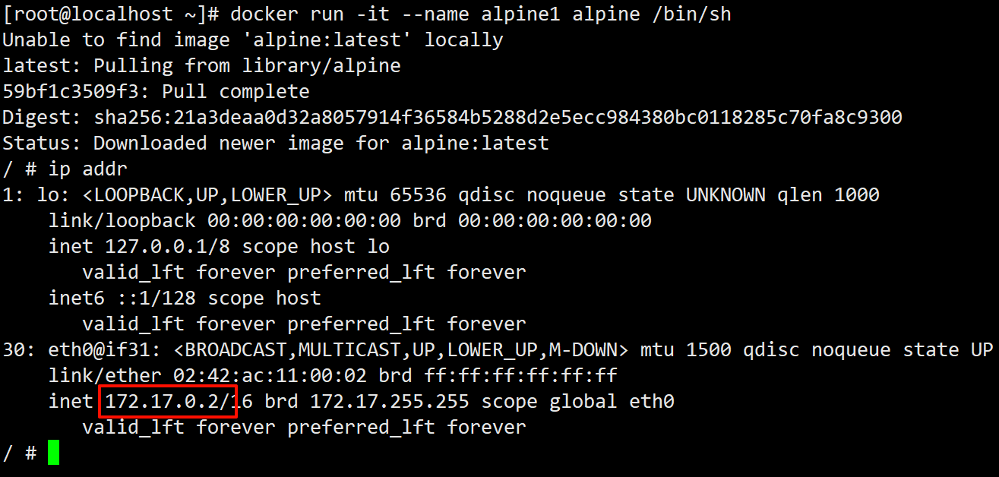
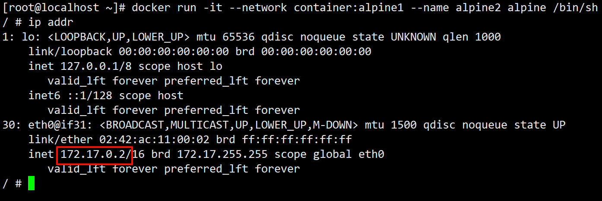

# 3.4 docker网络模式的详细介绍
## 3.4.1 bridge模式
- 什么是bridge模式?

    Docker 服务默认会创建一个 docker0 网桥（其上有一个 docker0 内部接口），该桥接网络的名称为docker0，它在内核层连通了其他的物理或虚拟网卡，这就将所有容器和本地主机都放到同一个物理网络。Docker 默认指定了 docker0 接口 的 IP 地址和子网掩码，让主机和容器之间可以通过网桥相互通信。

- bridge模式的详细解读

    1. Docker使用Linux桥接，在宿主机虚拟一个Docker容器网桥(docker0)，Docker启动一个容器时会根据Docker网桥的网段分配给容器一个IP地址，称为`Container-IP`，同时Docker网桥是每个容器的默认网关。因为在同一宿主机内的容器都接入同一个网桥，这样容器之间就能够通过容器的`Container-IP`直接通信。

    2. `docker run`的时候，没有指定network的话默认使用的网桥模式就是bridge，使用的就是docker0。在宿主机`ifconfig`,就可以看到docker0和自己create的network(后面讲)eth0，eth1，eth2……代表网卡一，网卡二，网卡三……，lo代表127.0.0.1，即localhost，inet addr用来表示网卡的IP地址

    3. 网桥docker0创建一对对等虚拟设备接口一个叫veth，另一个叫eth0，成对匹配。

        1. 整个宿主机的网桥模式都是docker0，类似一个交换机有一堆接口，每个接口叫veth，在本地主机和容器内分别创建一个虚拟接口，并让他们彼此联通(这样一对接口叫veth pair);

        2. 每个容器实例内部也有一块网卡，每个接口叫eth0；

        3. docker0上面的每个veth匹配某个容器实例内部的eth0，两两配对，一一匹配。

    通过上述，将宿主机上的所有容器都连接到这个内部网络上，两个容器在同一个网络下,会从这个网关下各自拿到分配的ip，此时两个容器的网络是互通的。

| ##container## |
|:--:|
||

---

现在我们通过一个案例来验证默认的bridge网络模式:

我们分别启动两台tomcat容器:

```bash
docker run -d -p 8081:8080 --name tomcat81 billygoo/tomcat8-jdk8
docker run -d -p 8082:8080 --name tomcat82 billygoo/tomcat8-jdk8
```
我们使用`ip addr`命令查看centos7网络情况:

| ##container## |
|:--:|


这个时候我们发现我们多了两行网络信息(图上红色标注部分)。其实这个就是我们上面讲到的虚拟网桥上的veth。

接下来我们分别进入两个tomcat容器的内部:

首先我们进入tomcat81容器内部: `docker exec -it tomcat81 bash`

| ##container## |
|:--:|


接着我们进入容器tomcat82内部: `docker exec -it tomcat82 bash`

| ##container## |
|:--:|


<div style="margin-top: 80px;">

---
</div>

## 3.4.2 host模式
直接使用宿主机的 IP 地址与外界进行通信，不再需要额外进行 NAT 转换。容器将不会获得一个独立的`Network Namespace`，而是和宿主机共用一个`NetworkNamespace`。**容器将不会虚拟出自己的网卡而是使用宿主机的IP和端口**。

| ##container## |
|:--:|


现在我们基于host模式启动一个tomcat容器:

```bash
docker run -d -p 8083:8080 --network host --name tomcat83 billygo[root@localhost ~]# docker run -d -p 8083:8080 --network host --name tomcat83 billygoo/tomcat8-jdk8
WARNING: Published ports are discarded when using host network mode
baa3abc65becb5c4db473bc1e586c13ac96216cc9bfc6e85ec4de3ccd37f69b8

[root@localhost ~]# docker ps
CONTAINER ID   IMAGE                   COMMAND             CREATED          STATUS          PORTS     NAMES
baa3abc65bec   billygoo/tomcat8-jdk8   "catalina.sh run"   20 seconds ago   Up 19 seconds             tomcat83
```

此时我们发现会报一个警告！通过`docker ps`发现容器成功启动，但是对应的端口映
射并没有出现，这是为什么呢？

原因: docker启动时指定`--network=host`或`-net=host`，如果还指定了-p映射端口，那这个时候就会有此警告，并且通过`-p`设置的参数将不会起到任何作用，**端口号会以主机端口号为主**。

解决方案: **启动容器的时候，不再指定端口映射**。

```bash
[root@localhost ~]# docker run -d --network host --name tomcat83 billygoo/tomcat8-jdk8
a6ed50f3af547446a3752e7cd1dd26690cb8fe6d09e0951c5bc918545e556bff
```

现在我们再查看这个容器的详细信息:

```bash
[root@localhost ~]# docker inspect tomcat83 | tail -n 21
            "Networks": {
                "host": {
                    "IPAMConfig": null,
                    "Links": null,
                    "Aliases": null,
                    "MacAddress": "",
                    "NetworkID": "dc0aa33635b7e7add40774fc4f88db810ccb99cb752bd3003cb5bf90944a8382",
                    "EndpointID": "f664c3cb8ef9bfe0233b04837caa261e296212becdd66169d373a7e3f0221e8c",
                    "Gateway": "",
                    "IPAddress": "", # 没有ip和网关, 因为和宿主机共享
                    "IPPrefixLen": 0,
                    "IPv6Gateway": "",
                    "GlobalIPv6Address": "",
                    "GlobalIPv6PrefixLen": 0,
                    "DriverOpts": null,
                    "DNSNames": null
                }
            }
        }
    }
]
```

现在访问tomcat的ip就是本地宿主机ip+tomcat8080端口访问。

| ##container## |
|:--:|


<div style="margin-top: 80px;">

---
</div>

## 3.4.3 none模式
在none模式下，并不为Docker容器进行任何网络配置。 也就是说，这个Docker容器没有网卡、IP、路由等信息，只有一个lo需要我们自己为Docker容器添加网卡、配置IP等。

```bash
[root@localhost ~]# docker run -d --network none --name tomcat83 billygoo/tomcat8-jdk8
85c0b72357f93c5b8cc52d411a4c1fdc54d0792fb4ca9723a96b02ae8ce584b8
[root@localhost ~]# ip addr
1: lo: <LOOPBACK,UP,LOWER_UP> mtu 65536 qdisc noqueue state UNKNOWN group default qlen 1000
    link/loopback 00:00:00:00:00:00 brd 00:00:00:00:00:00
    inet 127.0.0.1/8 scope host lo
       valid_lft forever preferred_lft forever
    inet6 ::1/128 scope host 
       valid_lft forever preferred_lft forever
```

我们发现这个容器没有进行任何网络相关的设置。需要我们自己手动进行网络设置。这种网络模式很少用，了解即可。

<div style="margin-top: 80px;">

---
</div>

## 3.4.4 container模式
**新建的容器和已经存在的一个容器共享一个网络ip配置而不是和宿主机共享**。新创建的容器不会创建自己的网卡，配置自己的IP，而是和一个指定的容器共享IP、端口范围等。同样，**两个容器除了网络方面，其他的如文件系统、进程列表等还是隔离的**。

| ##container## |
|:--:|


为了方便演示，我们启动两个Alpine操作系统的容器。

什么是Alpine操作系统?
> Alpine Linux 是一款独立的、非商业的通用 Linux 发行版，专为追求安全性、简单性和资源效率的用户而设计。可能很多人没听说过这个 Linux 发行版本，但是经常用 Docker 的朋友可能都用过，因为他小，简单，安全而著称，所以作为基础镜像是非常好的一个选择，可谓是麻雀虽小但五脏俱全，镜像非常小巧，不到 6M的大小，所以特别适合容器打包。

现在我们分别启动2个终端, 在1终端:

```bash
docker run -it --name alpine1 alpine /bin/sh
```

终端2:
```bash
docker run -it --network container:alpine1 --name alpine2 alpine /bin/sh

# container:alpine1 是指:
# 使用container网络模式, 并且和name为alpine1的容器进行共享
```

可以看到ip是一样的:


| ##container## |
|:--:|
||
||

我们发现容器2的网络地址和容器1里面的是一样的。说明容器2共享了容器1的网络信息。

<div style="margin-top: 80px;">

---
</div>

## 3.4.5 自定义网络模式
上面讲过，默认使用bridge网络模式，容器内部的ip在某些情况下会发生变化，如果此时通过容器的ip地址进行通信可能会遇到问题，如果我们想和某个容器之间建立通信的话，应该怎么做呢？可以使用容器名称建立通信(类似于微服务中通过服务名称实现服务之间的远程调用)。

接下来我们通过一个案例演示自定义网络模式。

我们还是分别启动两台容器:

```bash
docker run -it --name alpine-1 alpine /bin/sh
docker run -it --name alpine-2 alpine /bin/sh
```

然后使用`ip addr`查询ip, 然后互相`ping` ip, 是可以ping通的, 但是ping 容器名称却不行:

```bash
/ # ping 172.17.0.2
PING 172.17.0.2 (172.17.0.2): 56 data bytes
64 bytes from 172.17.0.2: seq=0 ttl=64 time=0.219 ms
64 bytes from 172.17.0.2: seq=1 ttl=64 time=0.288 ms
64 bytes from 172.17.0.2: seq=2 ttl=64 time=0.422 ms
^C
--- 172.17.0.2 ping statistics ---
8 packets transmitted, 3 packets received, 0% packet loss
round-trip min/avg/max = 0.161/0.251/0.422 ms
/ # ping alpine-1
ping: bad address 'alpine-1'
/ # ping alpine-2
ping: bad address 'alpine-2'
```

此时我们可以使用**自定义网络**来解决这个问题。

先自定义网络:
```bash
docker network create hx_net
```

使用自定义网络来启动容器:
```bash
docker run -it --network hx_net --name alpine-1 alpine /bin/sh
docker run -it --network hx_net --name alpine-2 alpine /bin/sh
```

此时使用`ping <容器名称>`就可以ping通了:

```bash
/ # [root@localhost ~]# docker run -it --network hx_net --name alpine-2 alpine /bin/sh
/ # ping alpine-1
PING alpine-1 (172.19.0.2): 56 data bytes
64 bytes from 172.19.0.2: seq=0 ttl=64 time=0.214 ms
64 bytes from 172.19.0.2: seq=1 ttl=64 time=0.198 ms
64 bytes from 172.19.0.2: seq=2 ttl=64 time=0.166 ms
^C
--- alpine-1 ping statistics ---
3 packets transmitted, 3 packets received, 0% packet loss
round-trip min/avg/max = 0.166/0.192/0.214 ms
```

**小结: 自定义网络本身就维护好了主机名和ip的对应关系(ip和域名都能通)**

这样就不怕因为ip变化而出现的问题了, 直接通过容器名来映射(类似于访问域名)