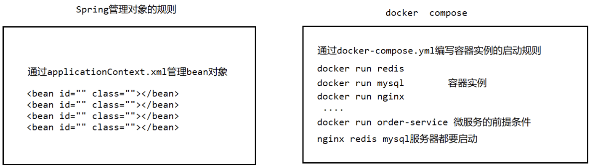

# 四、Docker-compose容器编排
## 4.1 Docker Compose的基本概述
Docker-Compose是Docker官方的开源项目，负责**实现对Docker容器集群的快速编排**。Compose 是 Docker 公司推出的一个工具软件，可以管理多个 Docker 容器组成一个应用。你需要定义一个 YAML 格式的配置文件`docker-compose.yml`，**写好多个容器之间的调用关系**。然后，只要一个命令，就能同时启动/关闭这些容器。

我们可以通过一幅图来理解什么是Docker-Compose。

| ##container## |
|:--:|


~~现在大家应该知道docker compose能干嘛了吧。~~

> docker建议我们每一个容器中只运行一个服务,因为docker容器本身占用资源极少,所以最好是将每个服务单独的分割开来但是这样我们又面临了一个问题？
>
> 如果我需要同时部署好多个服务,难道要每个服务单独写Dockerfile然后在构建镜像,构建容器,这样非常复杂,所以docker官方给我们提供了docker-compose多服务部署的工具
>
> 例如: 要实现一个Web微服务项目，除了Web服务容器本身，往往还需要再加上后端的数据库mysql服务容器，redis服务器，注册中心eureka，甚至还包括负载均衡容器等等...


> Compose允许用户通过一个单独的`docker-compose.yml`模板文件(YAML 格式)来定义一组相关联的应用容器为一个项目(project)。
>
> 可以很容易地用一个配置文件定义一个多容器的应用，然后使用一条指令安装这个应用的所有依赖，完成构建。Docker-Compose 解决了容器与容器之间如何管理编排的问题。

如果你之前有了解, 那么肯定`使用时会发现，有时候的指令是docker-compose，有时候是docker compose`然后产生这个疑问: -> [docker-compose和docker compose的区别](https://www.cnblogs.com/zhaodalei/p/17553269.html)

> 官方文档中其实已经给出了答案: Compose分为V1和V2版本，安装方式分为两种，一种是独立安装，一种是插件安装
>
> 结论:
> 1. 独立安装的Compose，不论是V1还是V2版本，指令都是docker-compose（中间是短横线）
>
> 2. 插件安装的Compose，在V2版本，指令是docker compose（中间是空格），最新版的docker安装时会自动以插件的形式安装docker compose
>
> 3. 支持同时采用两种方式安装Compose，安装后可以同时使用docker-compose和docker compose

### Docker Compose 的安装

```bash
curl -L https://github.com/docker/compose/releases/download/v2.17.2/docker-compose-`uname -s`-`uname -m` > /usr/local/bin/docker-compose
chmod +x /usr/local/bin/docker-compose # 添加权限
docker-compose --version # 看看是否安装成功
```

```bash
rm -rf docker-compose # 卸载
```
