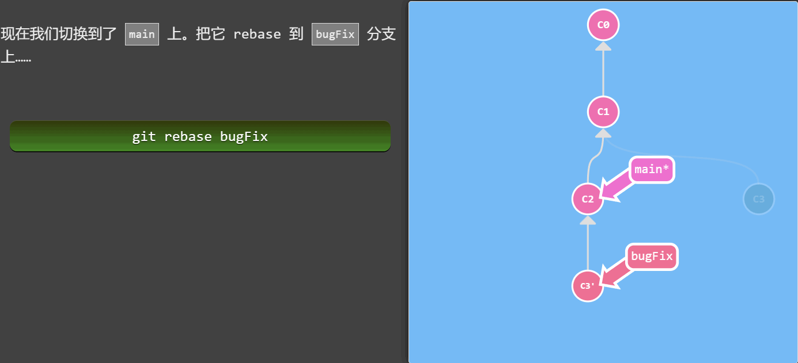

# Git常用命令
## 在线可视化学习网站
- [全宇宙第一学习Git的方法](https://learngitbranching.js.org/?demo=&locale=zh_CN) <- 花一天通关它, 比什么都强!

## 命令大局观

| ##container## |
|:--:|
||

## 本地命令
### 个人信息配置
在git服务器中，任意非本地`git repo`中，使用以下命令配置全局配置:

```bash
git config --global user.name "Heng_Xin"
git config --global user.email "282000500@qq.com"
```

查看上述配置是否生效

```bash
git config user.name
```

### 暂存区的修改
#### git add 添加文件到暂存区

```bash
git add <文件>
```

```bash
# 添加所有文件进入暂存区
git add .
```

#### git rm 删除暂存区文件

```bash
# 在工作区/暂存区删除文件, 但还会保持在本地 (也就是不更新它)
git rm --cached <文件名>
```

注: 记得加上`--cached`, 不然就是删除本地文件了

#### git commit 提交到本地仓库

```bash
# 提交修改到本地仓库, 并且附上描述
git commit -m "描述"
```

```bash
# 改写提交
# 重写上一次的提交信息
git commit --amend
```

### 查看提交类命令
#### git log 查看历史提交日志

```bash
git log
```

```bash
# 查看单个文件可回滚版本
git log <filename>
```

常用参数:
- `--pretty=oneline`: 单行显示版本

#### git reflog 查看提交历史

```bash
# git reflog可以查看当前版本库的提交历史，
# 凡是对仓库版本进行迭代的都会出现在这个里面，
# 包括你回滚版本都会出现在这个历史中
git reflog
```

### 分支操作命令
#### git checkout 创建本地分支

```bash
git branch <新分支名称>

git checkout -b <新分支名称> # 创建完成分支后会自动切换过去
```

#### git branch 查看分支

```bash
git branch # (不跟参数) 查看当前分支
```

常用参数:
- `-v`: 查看本地分支 + 上次提交的信息
- `-vv`: 查看本地分支 + 上次提交的信息 + 本地和远程分支的关系
- `-vv -a`: 查看本地分支 + 上次提交的信息 + 本地和远程分支的关系 + 远程分支
- `-a`: 查看本地已下载的全部分支(包含本地全部分支和最后一次更新的远程仓库的分支信息)

#### 切换本地分支

```bash
git checkout <name>
```

#### 合并分支
##### git merge 带合并历史的合并

当我们新建分支并做完工作之后，想要把分支提交至master(主人)，只需要切换到master仓库，并执行`git merge 分支名`就可以了

1. 切换到目标仓库(main)
2. 合并: `git merge debug`

那么:

| ##container## |
|:--:|
||
||

```bash
git merge <分支名>
```

##### git rebase 简洁合并
Rebase 实际上就是取出一系列的提交记录，“复制”它们，然后在另外一个地方逐个的放下去。

Rebase 的优势就是可以创造更线性的提交历史，这听上去有些难以理解。如果只允许使用 Rebase 的话，代码库的提交历史将会变得异常清晰。

| ##container## |
|:--:|
||
||

```bash
git rebase
```

#### 删除本地分支

```bash
# 删除本地分支
git branch -D <分支名>
```

#### 认识HEAD -- 在提交树上移动
我们首先看一下 “HEAD”。 HEAD 是一个对当前所在分支的符号引用 —— 也就是指向你正在其基础上进行工作的提交记录。

HEAD 总是指向当前分支上最近一次提交记录。大多数修改提交树的 Git 命令都是从改变 HEAD 的指向开始的。

HEAD 通常情况下是指向分支名的（如 bugFix）。在你提交时，改变了 bugFix 的状态，这一变化通过 HEAD 变得可见。

| ##container## |
|:--:|
||
||

##### 相对引用 `^`/`~`
通过指定提交记录哈希值的方式在 Git 中移动不太方便。在实际应用时，并没有像本程序中这么漂亮的可视化提交树供你参考，所以你就不得不用`git log`来查查看提交记录的哈希值。

并且哈希值在真实的 Git 世界中也会更长（注: 基于 SHA-1，共 40 位）。例如前一关的介绍中的提交记录的哈希值可能是 `fed2da64c0efc5293610bdd892f82a58e8cbc5d8`。舌头都快打结了吧...

比较令人欣慰的是，Git 对哈希的处理很智能。你只需要提供能够唯一标识提交记录的前几个字符即可。因此我可以仅输入`fed2`而不是上面的一长串字符。

正如我前面所说，通过哈希值指定提交记录很不方便，所以 Git 引入了相对引用。这个就很厉害了!

使用相对引用的话，你就可以从一个易于记忆的地方（比如 bugFix 分支或 HEAD）开始计算。

相对引用非常给力，这里我介绍两个简单的用法:

- 使用`^`向上移动 1 个提交记录
- 使用`~<num>`向上移动多个提交记录，如 `~3`

| ##container## |
|:--:|
||

##### 链式相对引用与父节点偏移
Git 默认选择合并提交的“第一个” parent 提交，在操作符`^`后跟一个数字可以改变这一默认行为。

| ##container## |
|:--:|
|普通的演示: 选择头上的父节点|
||
|选择第二个父节点(没有可视化怎么办?)|
||
|链式使用|
||

#### 撤销变更
##### git reset 改写历史

| ##container## |
|:--:|
||

```bash
git reset <撤销到哪个提交>
```

##### git revert 更推荐的

| ##container## |
|:--:|
||

```bash
git revert <撤销到哪个提交>
```

#### 移动提交记录
##### git cherry-pick
如果你想将一些提交复制到 **当前所在的位置(HEAD)** 下面的话， Cherry-pick 是最直接的方式了。

| ##container## |
|:--:|
||

```bash
git cherry-pick <分支1> [分支2, ..., ...分支n]
```

##### git rebase -i 交互式

当你知道你所需要的提交记录（并且还知道这些提交记录的哈希值）时, 用 cherry-pick 再好不过了 —— 没有比这更简单的方式了。

但是如果你不清楚你想要的提交记录的哈希值呢? 幸好 Git 帮你想到了这一点, 我们可以利用交互式的 rebase —— 如果你想从一系列的提交记录中找到想要的记录, 这就是最好的方法了

如果你在命令后增加了这个选项, Git 会打开一个 UI 界面并列出将要被复制到目标分支的备选提交记录，它还会显示每个提交记录的哈希值和提交说明，提交说明有助于你理解这个提交进行了哪些更改。

在实际使用时，所谓的 UI 窗口一般会在文本编辑器 —— 如 Vim —— 中打开一个文件。 

```bash
git rebase -i <祖先结点> # 到时候你可以操作当前结点到祖先结点路径上的所有结点
```

#### git tag 定下一个锚点
相信通过前面课程的学习你已经发现了：分支很容易被人为移动，并且当有新的提交时，它也会移动。分支很容易被改变，大部分分支还只是临时的，并且还一直在变。

你可能会问了：有没有什么可以永远指向某个提交记录的标识呢，比如软件发布新的大版本，或者是修正一些重要的 Bug 或是增加了某些新特性，有没有比分支更好的可以永远指向这些提交的方法呢？

当然有了！Git 的 tag 就是干这个用的啊，它们可以（在某种程度上 —— 因为标签可以被删除后重新在另外一个位置创建同名的标签）永久地将某个特定的提交命名为里程碑，然后就可以像分支一样引用了。

更难得的是，它们并不会随着新的提交而移动。你也不能切换到某个标签上面进行修改提交，它就像是提交树上的一个锚点，标识了某个特定的位置。

| ##container## |
|:--:|
||

```bash
git tag <tagName> <提交记录>
```

#### git describe 查询最近的锚点

由于标签在代码库中起着“锚点”的作用，Git 还为此专门设计了一个命令用来描述离你最近的锚点（也就是标签），它就是 git describe！

Git Describe 能帮你在提交历史中移动了多次以后找到方向；当你用 git bisect（一个查找产生 Bug 的提交记录的指令）找到某个提交记录时，或者是当你坐在你那刚刚度假回来的同事的电脑前时， 可能会用到这个命令。

`git describe`的语法是:

```bash
git describe <ref>
```

`<ref>` 可以是任何能被 Git 识别成提交记录的引用，如果你没有指定的话，Git 会使用你目前所在的位置（HEAD）。

它输出的结果是这样的:

- `<tag>_<numCommits>_g<hash>`

`tag`表示的是离`ref`最近的标签，`numCommits`是表示这个`ref`与`tag`相差有多少个提交记录，`hash`表示的是你所给定的`ref`所表示的提交记录哈希值的前几位。

当`ref`提交记录上有某个标签时，则只输出标签名称

| ##container## |
|:--:|
||

## 远程命令
### git clone

拉取远程仓库到本地, 一般是复制粘贴的, 例如:

```bash
git clone git@github.com:HengXin666/ThreadPool.git
```

### git fetch

| ##container## |
|:--:|
||

`git fetch` 完成了仅有的但是很重要的两步:

- 从远程仓库下载本地仓库中缺失的提交记录
- 更新远程分支指针(如 o/main)

`git fetch`实际上将本地仓库中的远程分支更新成了远程仓库相应分支最新的状态。

如果你还记得上一节课程中我们说过的，远程分支反映了远程仓库在你最后一次与它通信时的状态，`git fetch`就是你与远程仓库通信的方式了！希望我说的够明白了，你已经了解`git fetch`与远程分支之间的关系了吧。

**git fetch 不会做的事**

`git fetch`并不会改变你本地仓库的状态。它不会更新你的 main 分支，也不会修改你磁盘上的文件。

理解这一点很重要，因为许多开发人员误以为执行了`git fetch`以后，他们本地仓库就与远程仓库同步了。它可能已经将进行这一操作所需的所有数据都下载了下来，但是并没有修改你本地的文件。(而 git pull 才是!)

> 所以, 你可以将 git fetch 的理解为单纯的下载操作。

### git pull 拉取远程分支并且与当前本地分支合并

`git pull` = `git fetch; git merge;`

| ##container## |
|:--:|
||
||

`git pull --rebase` = `git fetch; git rebase;`

| ##container## |
|:--:|
||

注:
```bash
# 拉取全部
git pull

# 仅拉取指定分支
git pull origin <远程分支名>
```

### git push 推送到远程仓库
如题, 只不过要保证推送的是最新的, 即每次推送前需要先`pull`一下, 不然可能会报错.

```bash
# 推送全部 (不推荐)
git push

# 仅推送指定分支
git push origin <本地分支名>
```

> 更多技巧请去那个网站体验, 完! 如(`git pull origin <远程分支名>:<本地跟踪分支名>`)