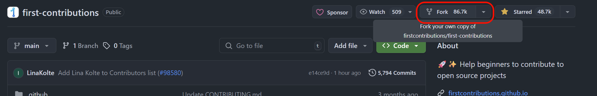
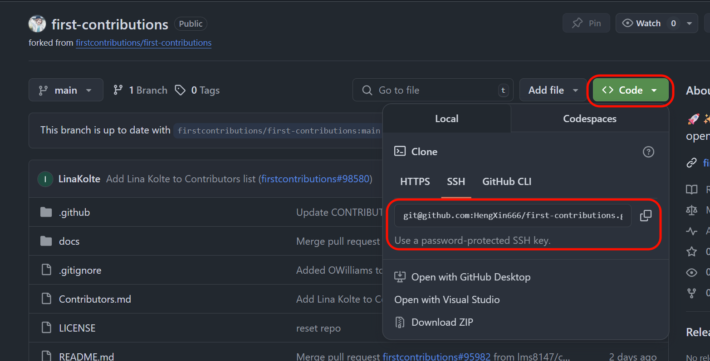
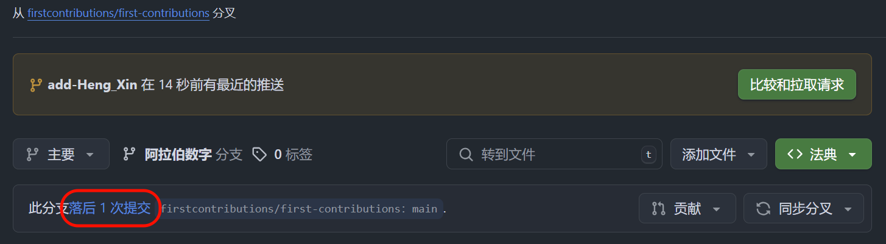
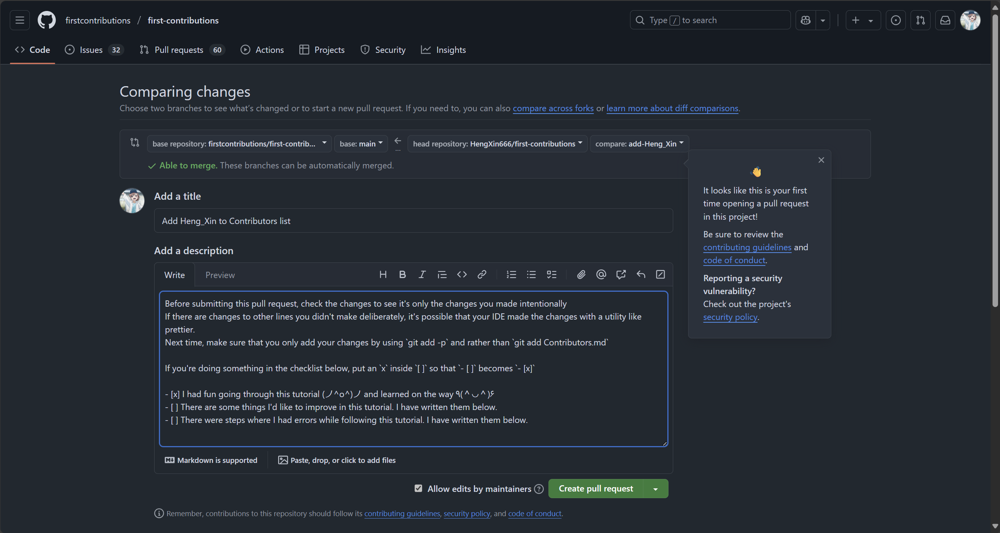
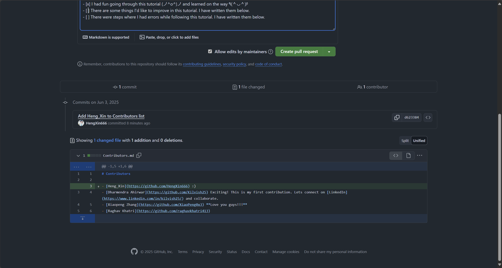
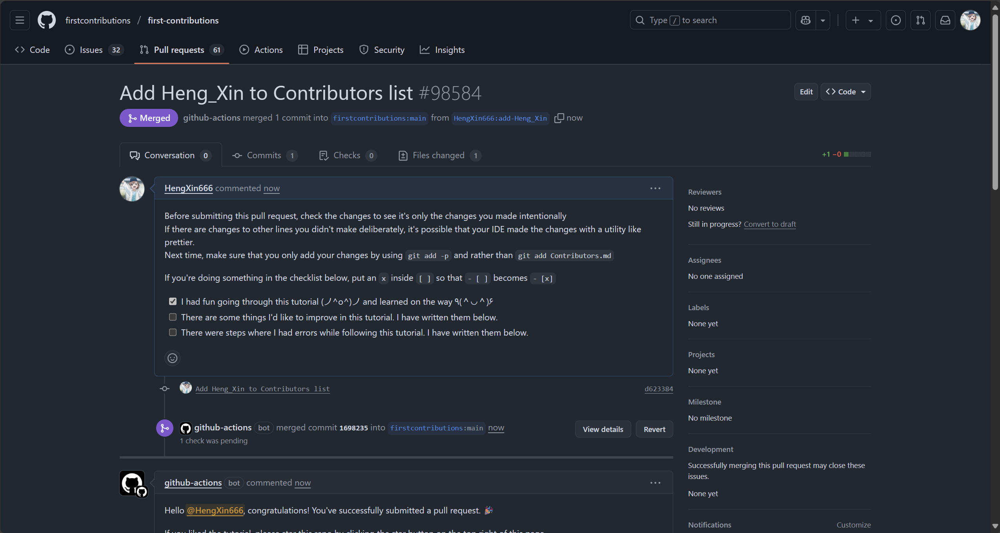

# 如何提PR

## 一、什么是PR

PR (Pull Request), 即 `拉取请求`.

为什么需要PR呢?

> 举个例子:
>
> 你发现了一个开源项目, 不错; 但是有些缺少的功能、BUG, 你希望自己可以对项目进行贡献, 然后你会发现没有权限!
>
> 这很正常, 毕竟你也不希望一夜之间, 整个Github被 `Rust` 重写了吧? 得有审核的吧!
>
> PR, 就是给该项目管理者审核贡献代码的.
>
> (等你PR混熟了, 说不定他们就给你项目权限了, 就不需要次次都PR了~)

## 二、如何提PR

这里我们以 [first-contributions](https://github.com/firstcontributions/first-contributions) 项目为例子, 介绍一下, 一个标准的提PR的流程~ ~~(当然, 他们的自述文档就有说明了, 这里也是记录自己的实操吧~)~~

### 2.0 提 Issues

对于一些内容, 我们可以先从 issues 中, 看看有没有类似的问题, 是否有人已经开始着手解决了.

如果没有类似的问题, 那么可以先礼貌的提一个 issues, 看看对方的反应.

如果对面认为有计划, 但优先级不高, 那你可以礼貌的回复, 自己可以尝试, 并且提PR.

以确保最终你的PR被接受, 而不是一直堆积在请求中, 白费自己的经历...

> [!TIP]
> 举个例子, 如果你希望使用 `Rust` 重构项目, 那你最好是先提 issues, 再提 PR, 而不是上来就是 PR.
>
> 换位思考一下, 如果你的C++项目被人使用 `Rust` 重构了, 并且提了PR, 你怎么想的?
>
> 当然, 以上只是玩笑, ~~真正的 `Rust` 牢哥, 可能连 Fork 都不干, 直接重写然后 @ 你的项目了...~~

### 2.1 Fork 项目

Fork 项目, 到自己的仓库.



### 2.2 Clone 项目

在自己的仓库中, clone到本地, 这样才有写入的权限.



```bash
git clone git@github.com:HengXin666/first-contributions.git
cd first-contributions # 进入到项目里面
```

### 2.3 创建自己的分支

从 **开发分支** (这里是`main`), 创建一个新的分支, 并且切换过去.

> [!TIP]
> 注意, 分支名称应该遵循该项目的命名规范, 如`dev-xxx`/`add-xxx`等

```bash
git checkout -b add-Heng_Xin
```

### 2.4 对项目进行贡献, 并上传到自己的远程仓库

此处是在项目中加入:

```text
- [Heng_Xin](https://github.com/HengXin666) :)
```

然后 `git add .`

然后 `git commit -m 'Add Heng_Xin to Contributors list'`

然后 `git push`

### 2.5 可能会出现的, 需要先同步



点击`同步分支`就OK.

### 2.6 提交 PR

前往你的 Github 代码仓库, 你会看到一个 `Compare & pull request` 的按钮。点击该按钮。

就会进入下面的界面:



> [!TIP]
> 上面界面就有说明哦, 是从 xxx仓库的xxx分支, 发送到 yyy仓库的yyy分支哦, 也就是说, 你不需要分支对应哦~

并且会列出你的更改:



### 2.7 等待 PR 审核

提交PR后, 一般还需要和项目维护者沟通, 因为一般情况下, 他们并不一定喜欢你的PR, 会来拷打你qwq? (因此您还需要给项目提一个`issues`, 以确保项目维护者的意愿)



### 2.8 收拾残局

然后你可以可以删除对应的开发分支了~ (注意要PR通过了再搞哦, 不然你之后如果还没有通过, 但是却又发现问题了, 需要修改, 就麻烦了哦~)

```shell vscode
# 删除本地分支
git branch -d feat/xxx  # -d 表示已合并才能删

# 删除远程分支
git push origin --delete feat/xxx
```

是否删除远程仓库呢?

> 不建议!
>
> - 如果你还打算继续给这个项目贡献, 保留 Fork 比较方便
>
> -  GitHub 会自动提示你 Sync Fork (保持与上游仓库同步)
>
> - 如果你删掉了 Fork, 下次提 PR 又要重新 Fork, 一些记录还会丢失

以上~
