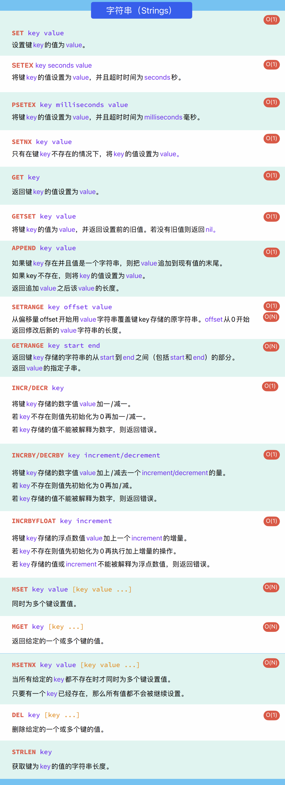
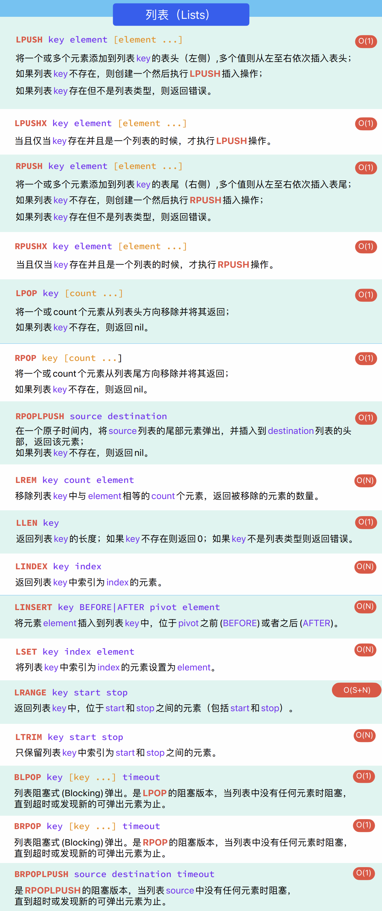
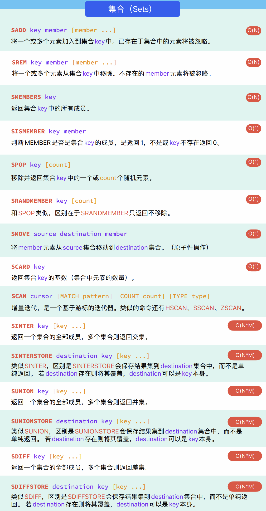
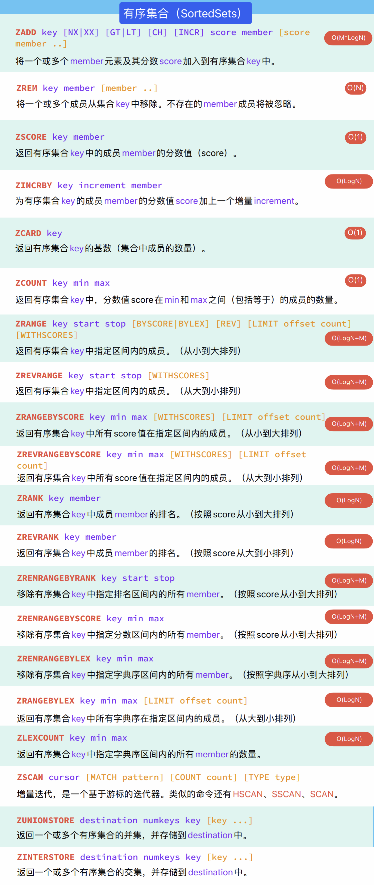
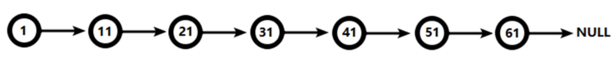
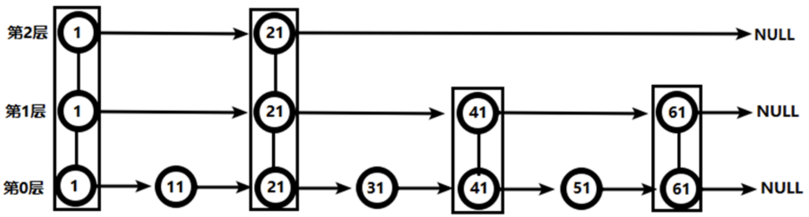
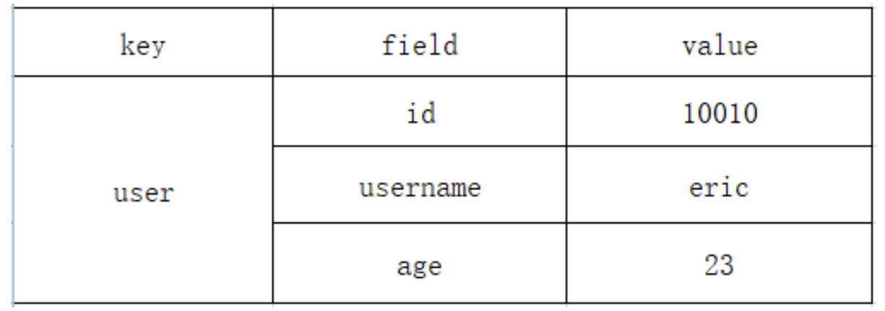
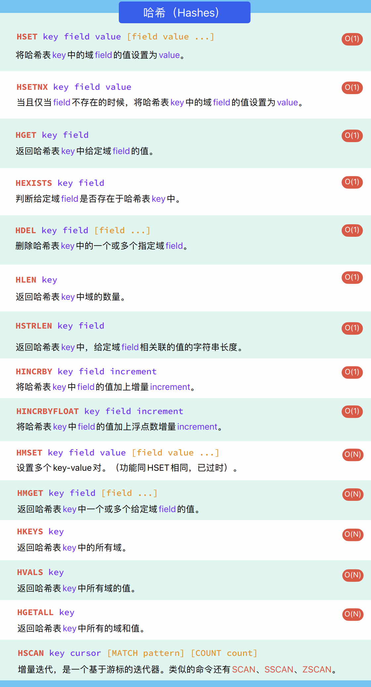

# 三、Redis常用数据类型操作
## 3.1 常用命令

```bash
select 0 # 切换到指定的数据库(比如这里是0号数据库 (默认是有 0 ~ 15 共16个数据库))
dbsize   # 查看当前数据库的key的数量
flushdb  # 清空当前数据库
flushall # 清空所有的数据库
```

同mysql一样, 指令是不区分大小写的

<div style="margin-top: 80px;">

---
</div>

## 3.2 基于key(键)的操作

> [!TIP]
> <span style="color:red">值得注意的是, 在Redis中, 所有数据实际上都是以`字符串`的形式存储</span>

```bash
# 查看当前数据库中所有的key值
keys *

# 设置key值 值是string类型, 重复set一个key, 会覆盖原来的值, 而不是报错
set <key-name> <key-val> [key-val_2 ... keu-val_n]

# 查看指定key的数据类型
type <key-name>

# 判断指定的key是否存在 存在就为1 不存在就为0
exists <key-name>

# 删除指定的key值, 成功为1, 否则为 0
del key <key-name>

# 给key设置过期时间, 单位秒
expire <key-name> <time>

# 查看指定key值的存活时期 不存在就为负数(-1 非会过期内容, -2 已过期/键不存在)
ttl <key-name>
```

<div style="margin-top: 80px;">

---
</div>

## 3.3 string的操作
- String是Redis最基本的类型

- String类型是二进制安全的。意味着Redis的string可以包含任何数据。比如jpg图片或者序列化的对象。

- String类型是Redis最基本的数据类型，一个Redis中字符串value最多可以是512M。

| ##container## |
|:--:|
||

注: 

1. 对于一些范围, 例如`getrange`指定 $[start, end]$ 如果希望是全长, 可以写 $[0, -1]$ `0`代表起始, `-1`代表末尾

2. 对于整数的加减, 需要保证数值在`long long`的表示范围内

3. 浮点数可以使用科学计数`-2e-12`(可能需要新版本), 不建议使用, 因为会有精度问题<sup>[[Redis——INCRBYFLOAT命令的精度问题](https://blog.csdn.net/dangfulin/article/details/110872480)]</sup>

注意:
- `incr`/`decr`命令是**原子操作**。也就是指不会被线程调度机制打断的操作。这种操作一旦开始，就一直运行到结束，中间不会有任何线程上下文切换。在单线程中， 能够在单条指令中完成的操作都可以认为是"原子操作"。

> 问题: Java中的`i++`属于原子性操作吗? 不是
> 
> ```C++
> i++; 不是原子操作
> 第一步：取值 i = 0;
> 第二步：自加操作 i++;
> 第三步：将自加的操作结果赋予给i。
> ```
>
> i = 0，两个线程对i分别进行i++100次。值是多少? (2-200)
>
> 首先在两个线程互不干扰的情况下，分别对i++执行，一个线程执行完再执行另一个线程，这样就会使i自增200次，即最终为200，这是理想状态下的互不干涉，最坏情况则为，第一个线程执行了99次，当A线程的i++执行到99次时，此时cpu1寄存器中值为99，内存为99
>
> 当B线程cpu2寄存器的1，写回内存覆盖内存的99，变成1
>
> 如果可以这样，那A线程也可以同样再覆盖一次B线程，最终结果就是2。

<div style="margin-top: 80px;">

---
</div>

## 3.4 List的操作
List列表是单键多值的列表。Redis 列表是简单的字符串列表，按照插入顺序排序。你可以添加一个元素到列表的头部（左边）或者尾部（右边）。它的底层实际是个双向链表，对两端的操作性能很高，但是通过索引下标操作中间的节点性能会较差。

### 3.4.1 相关命令

| ##container## |
|:--:|
||

### 3.4.2 list的数据结构
List的数据结构为快速链表`quickList`。

首先**在列表元素较少的情况下会使用一块连续的内存存储**，这个结构是`ziplist`，也即是压缩列表。它将所有的元素紧挨着一起存储，分配的是一块连续的内存。

当数据量比较多的时候才会改成`quicklist`。

因为普通的链表需要的附加指针空间太大，会比较浪费空间。比如这个列表里存的只是int类型的数据，结构上还需要两个额外的指针`prev`和`next`。

Redis将链表和`ziplist`结合起来组成了`quicklist`。也就是将多个`ziplist`使用双向指针串起来使用。这样既满足了快速的插入删除性能，又不会出现太大的空间冗余。

| ##container## |
|:--:|
||

### 3.4.3 与`std::deque`的对比

> 对比 C++`std::deque`双端队列<sup>[[STL常用数据结构](../../../../002-程序语言/001-C++/002-tmp丶C++丶memo/002-STL库/001-STL常用数据结构/index.md)]</sup>
>
> `quicklist`在某种程度上确实类似于C++的`std::deque`（双端队列）。`std::deque`允许在两端进行高效的插入和删除操作，这与`quicklist`的设计目标相符。然而，它们的内部实现有所不同。
>
> `std::deque`在内部使用了一个中心控制块来跟踪多个固定大小的数组，这些数组中存储了实际的元素。这种设计使得`std::deque`可以在两端进行高效的插入和删除操作，同时还能提供对中间元素的随机访问。(简单理解: *`deque`类似于二维数组, 但是每个一维数组之间不连续*)
>
> 而`quicklist`则是Redis为了优化列表存储而设计的一种数据结构。它是链表和`ziplist`的结合体。`quicklist`将多个`ziplist`（即压缩列表，是一种特殊的线性表，它将所有元素存储在一块连续的内存区域中）使用双向指针串起来使用。这样既满足了快速的插入删除性能，又不会出现太大的空间冗余。

<div style="margin-top: 80px;">

---
</div>

## 3.5 set操作
Redis的`set`对外提供的功能与list类似是一个列表的功能，特殊之处在于set是可以自动去重的，当你需要存储一个列表数据，又不希望出现重复数据时，set是一个很好的选择，并且set提供了判断某个成员是否在一个set集合内的命令，这个也是list所不能提供的。

Redis的`set`是string类型的无序集合。它底层其实是一个`value`为`null`的hash表，所以添加，删除，查找的复杂度都是 $O(1)$。

### 3.5.1 相关命令

> set 的命令几乎都是 **`s`** 开头的

| ##container## |
|:--:|
||

### 3.5.2 set的数据结构
set数据结构是dict字典，字典是用哈希表实现的。

Java中HashSet的内部实现使用的是HashMap，只不过所有的value都指向同一个对象。Redis的set结构也是一样，它的内部也使用hash结构，所有的value都指向同一个内部值。

<div style="margin-top: 80px;">

---
</div>

## 3.6 zset(有序集合(SortedSets))操作
Redis有序集合`zset`与普通集合`set`非常相似，是一个没有重复元素的字符串集合。不同之处是有序集合的每个成员都关联了一个评分（score）,这个评分（score）被用来按照<span style="color:red">从最低分到最高分</span>的方式排序集合中的成员。<span style="color:yellow">集合的成员是唯一的，但是评分可以是重复了</span>。

因为元素是有序的, 所以你也可以很快的根据 **评分(score)** 或者 **次序(position)** 来获取一个范围的元素。访问有序集合的中间元素也是非常快的,因此你能够使用有序集合作为一个没有重复成员的智能列表。

### 3.6.1 相关命令

> zset 的命令几乎都是 **`z`** 开头的

| ##container## |
|:--:|
||

### 3.6.2 zset的数据结构
zset底层使用了两个数据结构:
1. `hash`: hash的作用就是关联元素value和权重score，保障元素value的唯一性，可以通过元素value找到相应的score值。

2. `跳跃表`: 跳跃表的目的在于给元素value排序，根据score的范围获取元素列表。

> 什么是跳跃表?
>
> 有序集合在生活中比较常见，例如根据成绩对学生排名，根据得分对玩家排名等。对于有序集合的底层实现，可以用数组、平衡树、链表等。数组不便元素的插入、删除；平衡树或红黑树虽然效率高但结构复杂；链表查询需要遍历所有效率低。Redis采用的是跳跃表。跳跃表效率堪比红黑树，实现远比红黑树简单。

实例:

对比有序链表和跳跃表，从链表中查询出51。

- 有序链表:

| ##container## |
|:--:|
||

要查找值为51的元素，需要从第一个元素开始依次查找、比较才能找到。共需要6次比较。

- 跳跃表:

| ##container## |
|:--:|
||

- 从第2层开始，1节点比51节点小，向后比较。
- 21节点比51节点小，继续向后比较，后面就是NULL了，所以从21节点向下到第1层
- 在第1层，41节点比51节点小，继续向后，61节点比51节点大，所以从41向下
- 在第0层，51节点为要查找的节点，节点被找到，共查找4次。

**从此可以看出跳跃表比有序链表效率要高。**

<div style="margin-top: 80px;">

---
</div>

## 3.7 hash的操作
Redis hash 是一个键值对集合。Redis hash是一个string类型的`field`和`value`的映射表，hash特别适合用于存储对象。类似Java里面的`Map<String,Object>`

需求: 在redis里面保存一个用户对象(`{id:1001,username:"eric",age=23}`)。

**方案1**:
- 将user对象转换成一个json字符串，使用string来存储这个json字符串。

缺点: 每次修改这个对象里面的数据，都需要把这个字符串转换成java对象修改，修改之后再转换成json字符串，比较麻烦，`不适合频繁修改数据的场景`。

**方案2**:
- 通过key和对象属性拼接的方式存储数据

```C++
    key       value
user:id       1001
user:username eric
user:age      23
```

缺点: 存储的数据分散，如果对象的属性过多，在redis中的key也会非常的多。

**方案3**:
- 通过redis中的hash类型的数据保存

| ##container## |
|:--:|
||

优点: **通过 key(用户ID) + field(属性标签) 就可以操作对应属性数据了，既不需要重复存储数据，也不会带来序列化和并发修改控制的问题**。

### 3.7.1 相关命令

> hash 的命令几乎都是 **`h`** 开头的

| ##container## |
|:--:|
||

### 3.7.2 hash的数据结构
Hash类型对应的数据结构是两种:
- ziplist（压缩列表），
- hashtable（哈希表）。

当field-value长度较短且个数较少时，使用`ziplist`，否则使用`hashtable`。