# 四、Redis配置文件的介绍
## 4.1 数据单位配置
配置大小单位, 开头定义了一些基本的度量单位，只支持`bytes`.

| ##container## |
|:--:|
|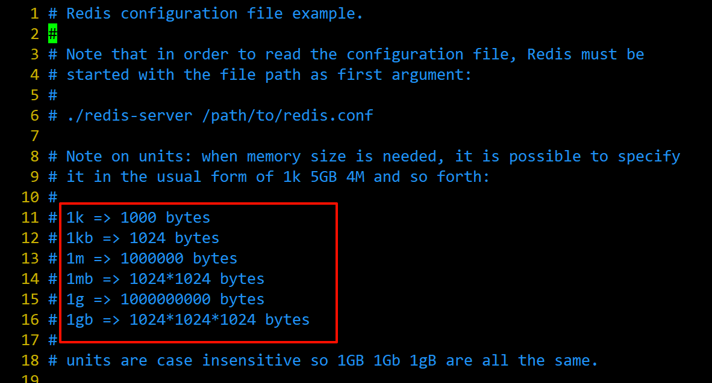|

<div style="margin-top: 80px;">

---
</div>

## 4.2 INCLUDES配置

我们可以把一些配置信息定义在子配置文件里面，再在`redis.conf`中引入进来。

| ##container## |
|:--:|
|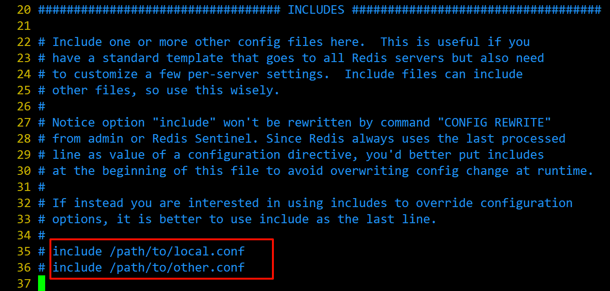|

<div style="margin-top: 80px;">

---
</div>

## 4.3 网络相关的配置
### 4.3.1 bind
默认情况`bind=127.0.0.1`只能接受本机的访问请求。不写的情况下，无限制接受任何ip地址的访问。

生产环境肯定要写你应用服务器的地址；服务器是需要远程访问的，所以需要将其注释掉。

如果开启了`protected-mode`，那么在没有设定`bind ip`且没有设密码的情况下，Redis只允许接受本机的响应。

| ##container## |
|:--:|
|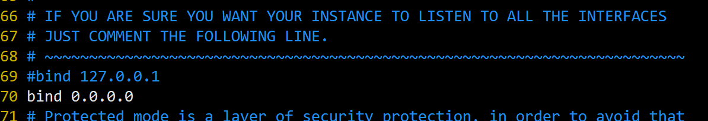|

### 4.3.2 protected-mode

将本机访问保护模式设置`no`。这样其他机器就可以远程连接redis。

| ##container## |
|:--:|
|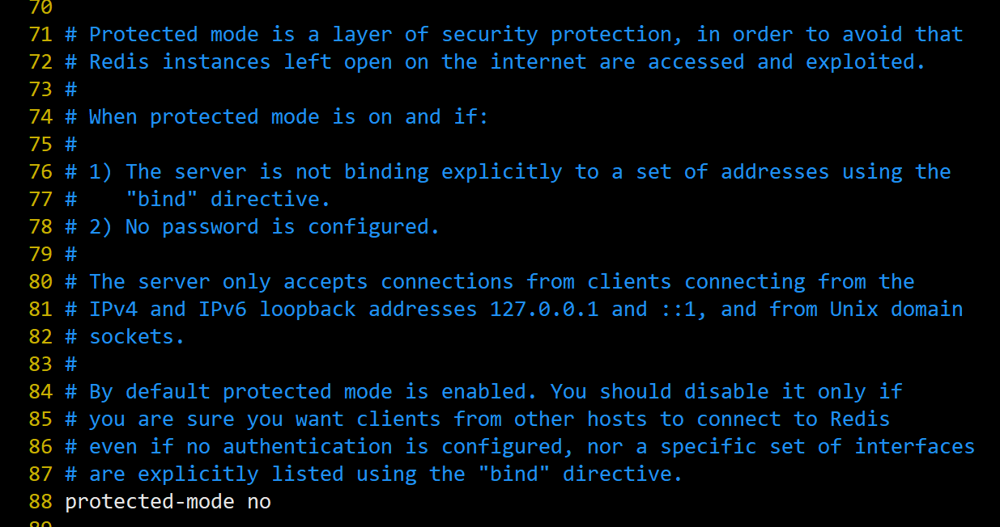|

### 4.3.3 port

redis的默认端口号: `6379`

| ##container## |
|:--:|
|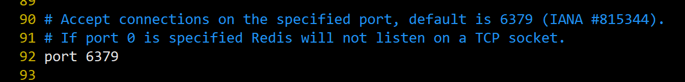|

### 4.3.4 tcp-backlog
设置tcp的`backlog`，`backlog`其实是一个**连接队列**， $$backlog队列总和=未完成三次握手队列 + 已经完成三次握手队列$$

在高并发环境下你需要一个**高**`backlog`值来避免慢客户端连接问题。

注意Linux内核会将这个值减小到`/proc/sys/net/core/somaxconn`的值(128)，所以需要确认增大`/proc/sys/net/core/somaxconn和/proc/sys/net/ipv4/tcp_max_syn_backlog`(128)两个值来达到想要的效果。

| ##container## |
|:--:|
|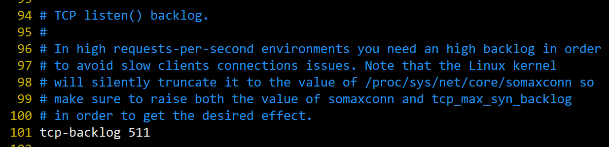|

### 4.3.5 timeout
一个空闲的客户端维持多少秒会关闭，0表示关闭该功能。即永不关闭。

| ##container## |
|:--:|
|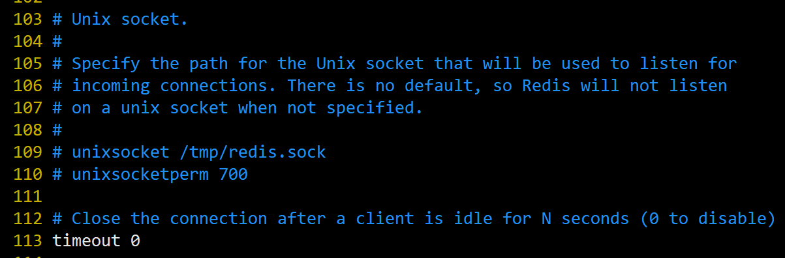|

### 4.3.6 tcp-keepalive
对访问客户端的一种心跳检测，每隔`n`秒检测一次。

单位为`秒`，如果设置为`0`，则**不会**进行`Keepalive`检测，默认值为`300`。

| ##container## |
|:--:|
|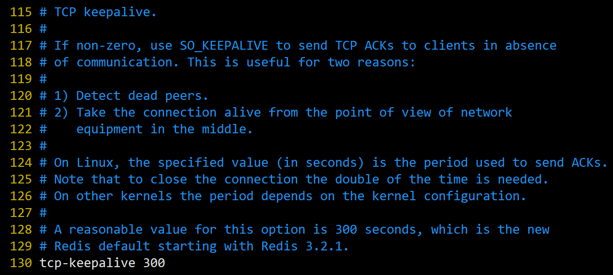|

## 4.4 GENERAL通用配置
### 4.4.1 daemonize
是否为后台进程，设置为`yes`，守护进程，后台启动。

| ##container## |
|:--:|
|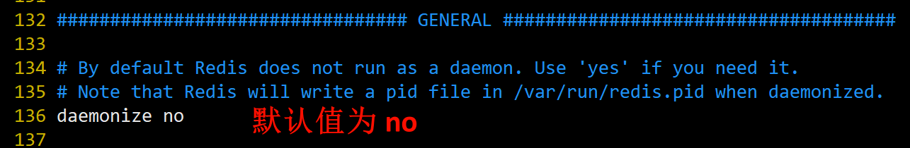|

### 4.4.2 pidfile
存放pid文件的位置，每个实例会产生一个不同的pid文件。

| ##container## |
|:--:|
|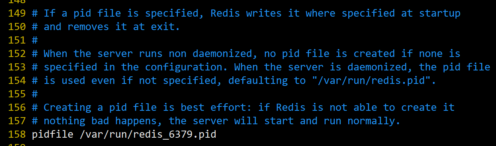|

### 4.4.3 loglevel
指定日志记录级别，Redis总共支持四个级别: `debug`、`verbose`、`notice`、`warning`，默认为`notice`

| ##container## |
|:--:|
|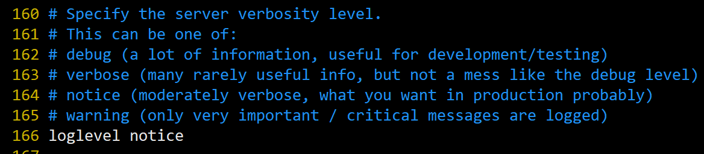|

### 4.4.4 logfile
日志文件的名称。

| ##container## |
|:--:|
|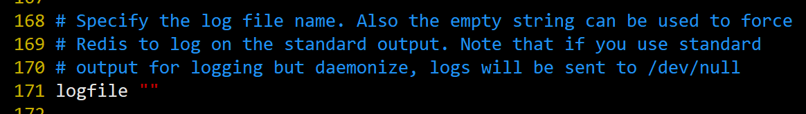|

### 4.4.5 databases
设定库的数量 默认`16`，默认数据库为`0`，可以使用`SELECT <dbid>`命令在连接指定数据库id。

| ##container## |
|:--:|
|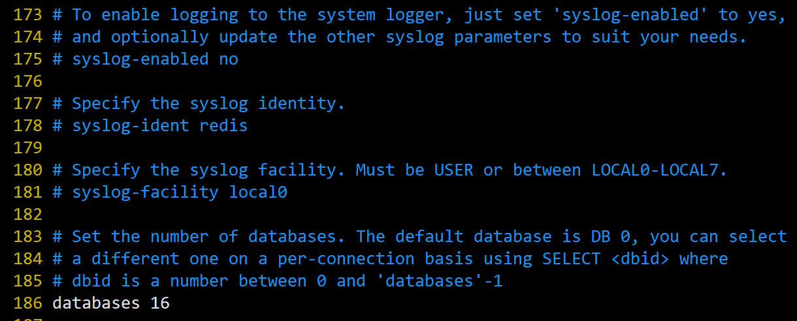|

## 4.5 SECURITY安全配置
### 4.5.1 设置密码

| ##container## |
|:--:|
|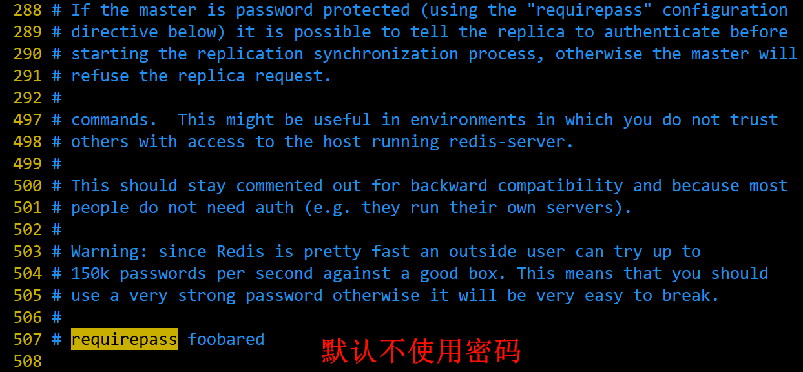|

如果想要设置密码访问redis，需要进行如下配置:

```bash
127.0.0.1:6379> config get requirepass
1)"requirepass"
2)"" # 密码默认为空
127.0.0.1:6379> config set requirepass 123456
OK
127.0.0.1:6379> auth 123456 # 一旦设置密码，所有的redis操作都要先验证密码
OK
127.0.0.1:6379> get k1
"v1"
```

<div style="margin-top: 80px;">

---
</div>

## 4.6 LIMITS配置
### 4.6.1 maxclients
**maxclients**: 设置redis同时可以与多少个客户端进行连接。默认情况下为`10000`个客户端。如果达到了此限制，redis则会拒绝新的连接请求，并且向这些连接请求方发出“`max number of clients reached`”以作回应。

| ##container## |
|:--:|
|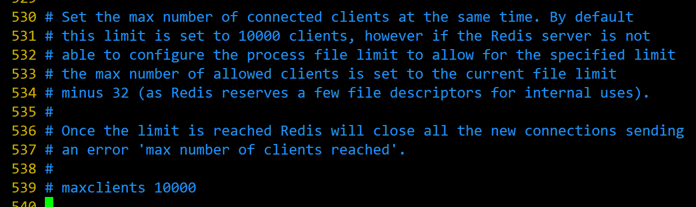|

### 4.6.2 maxmemory
建议**必须设置**，否则，**将内存占满，造成服务器宕机**。

设置redis可以使用的内存量。一旦到达内存使用上限，redis将会试图移除内部数据，移除规则可以通过`maxmemory-policy`来指定。

如果redis无法根据移除规则来移除内存中的数据，或者设置了“不允许移除”，那么redis则会针对那些需要申请内存的指令返回错误信息，比如SET、LPUSH等。

但是对于无内存申请的指令，仍然会正常响应，比如GET等。如果你的redis是主redis(说明你的redis有从redis)，那么在设置内存使用上限时，需要在系统中留出一些内存空间给同步队列缓存，只有在你设置的是“不移除”的情况下，才不用考虑这个因素。

| ##container## |
|:--:|
|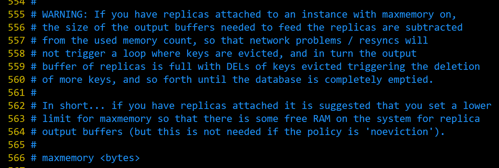|

### 4.6.3 maxmemory-policy
内存最大后的移除策略:

- **volatile-lru**: 使用LRU算法移除key，只对设置了过期时间的键；(最近最少使用)

- **allkeys-lru**: 在所有集合key中，使用LRU算法移除key

- **volatile-random**: 在过期集合中移除随机的key，只对设置了过期时间的键

- **allkeys-random**: 在所有集合key中，移除随机的key

- **volatile-ttl**: 移除那些TTL值最小的key，即那些最近要过期的key

- **noeviction**: 不进行移除。针对写操作，只是返回错误信息

注: **LRU(Least Recently Used)** 最近最少使用算法 在 数据结构与算法::[队列](../../../../001-计佬常識/001-数据结构与算法/003-【数据结构】线性表/014-队列/index.md) 中有讲述

| ##container## |
|:--:|
|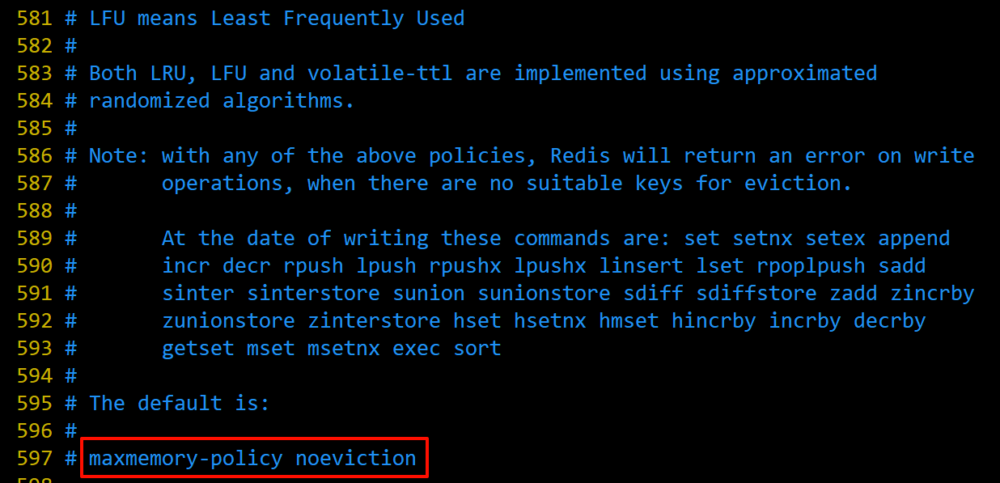|