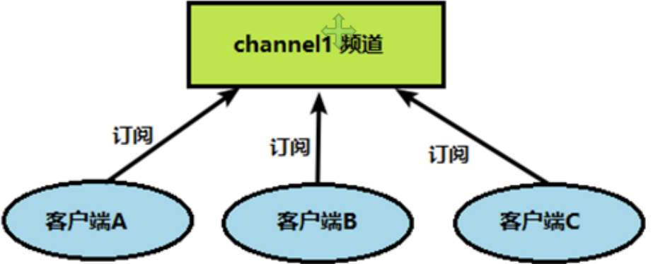
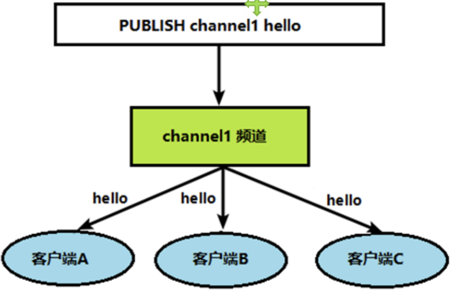

# 五、Redis的发布和订阅
## 5.1 什么是redis的发布和订阅
Redis **发布订阅(pub/sub)** 是一种消息通信模式: **发送者(生产者)(pub)** 发送消息，**订阅者(消费者)(sub)** 接收消息。

Redis 客户端可以订阅任意数量的频道。

完成Redis的发布和订阅需要两个步骤:

1. 客户端(订阅者)需要订阅频道:

| ##container## |
|:--:|
||

2. 当发送者(生产者)给这个频道发布消息后，消息就会发送给订阅的客户端。

| ##container## |
|:--:|
||

## 5.2 发布订阅的实现
- 打开一个`客户端1`订阅`channel1`

```bash
[root@localhost redis]# docker exec -it hx_redis /bin/bash
root@d98f8f759c6e:/data# redis-cli
127.0.0.1:6379> subscribe channel1 # 订阅 channel1
Reading messages... (press Ctrl-C to quit)
1) "subscribe"
2) "channel1"
3) (integer) 1
```

- 打开`客户端2`，发送消息`hello`

```bash
[root@localhost ~]# docker exec -it hx_redis /bin/bash
root@d98f8f759c6e:/data# redis-cli
127.0.0.1:6379> PUBLISH channel1 hello
(integer) 1
```

- 再次查看`客户端1`

```bash
[root@localhost redis]# docker exec -it hx_redis /bin/bash
root@d98f8f759c6e:/data# redis-cli
127.0.0.1:6379> subscribe channel1
Reading messages... (press Ctrl-C to quit)
1) "subscribe"
2) "channel1"
3) (integer) 1
1) "message" # 收到订阅消息
2) "channel1"# 订阅的是 channel1
3) "hello"   # 消息内容
```
