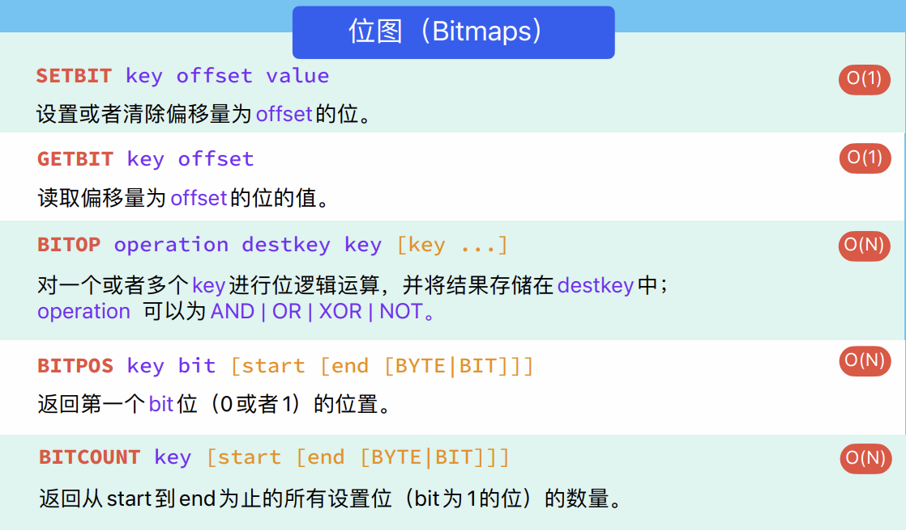
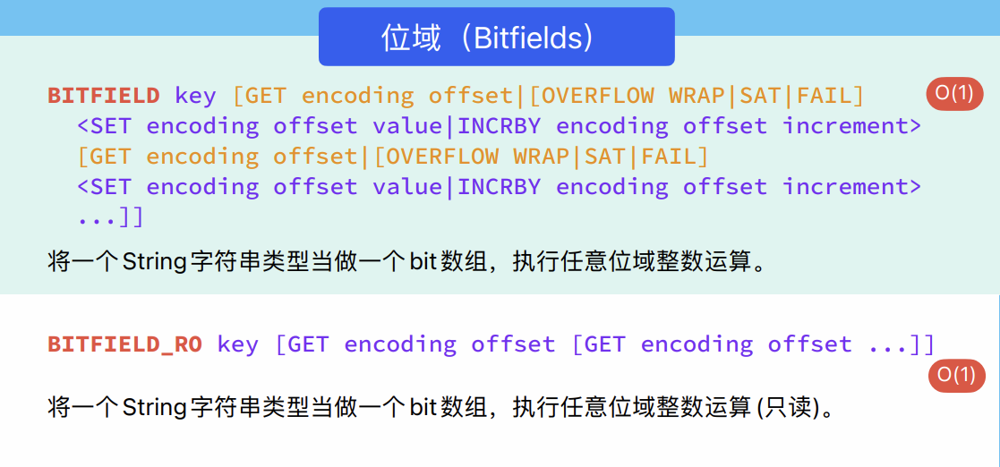
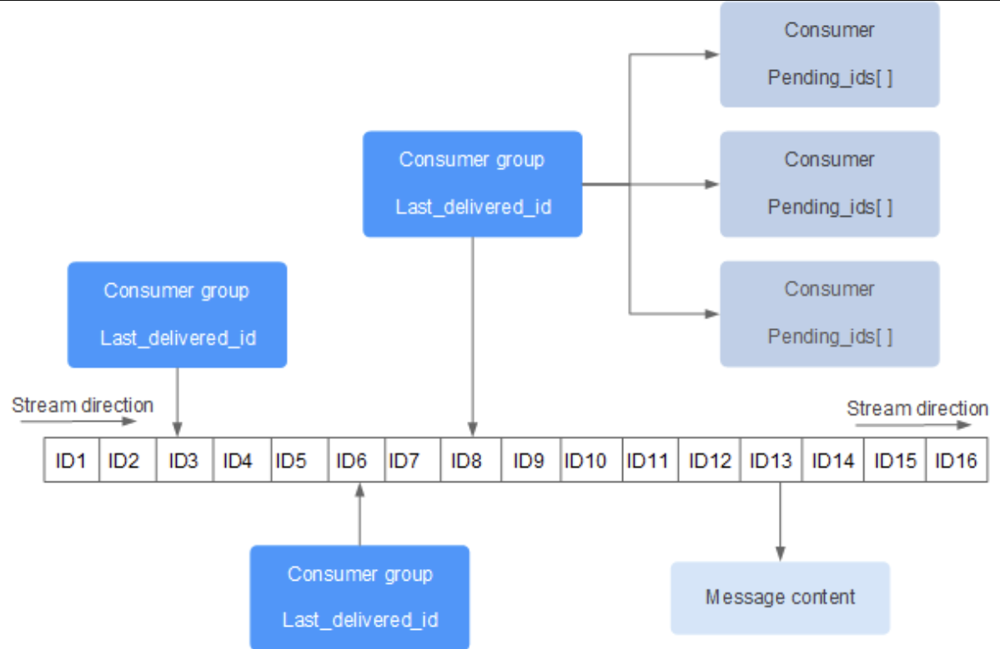
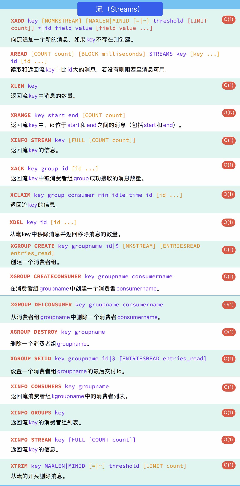
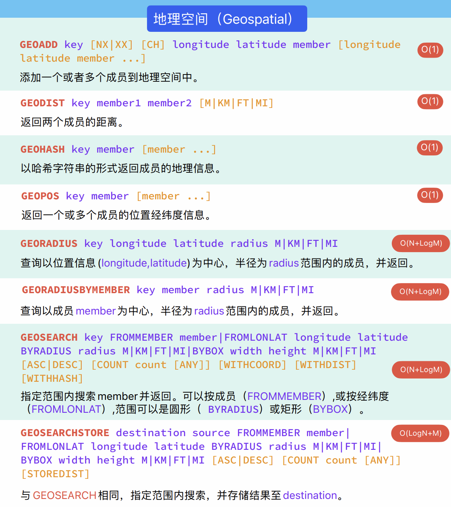
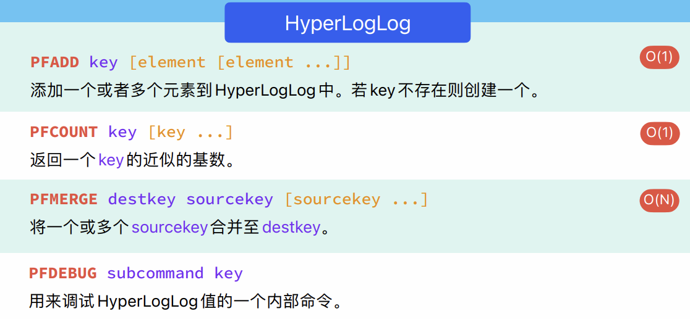

# 六、Redis的新的数据类型
## 6.1 Bitmap(位图)
现在我们来看一个场景，就是各大app都有签到的功能，大家可以思考，用户签到的功能是如何实现的。首先想到的就是设计一张签到表，将用户的签到信息持久化的保存在数据表里面。我们可以设计这么一张表:

```sql
CREATE TABLE `tb_sign` (
    'id` bigint(20) unsigned NOT NULL AUTO_INCREMENT COMMENT '主键',
    "user_id' bigint(20) unsigned NOT NULL COMMENT '用户id',
    'year' year(4) NOT NULL COMMENT '签到的年',
    'month' tinyint(2) NOT NULL COMMENT '签到的月',
    'date' date NOT NULL COMMENT '签到的日期',
    'is_backup' tinyint(1) unsigned DEFAULT NULL COMMENT '是否补签',
    PRIMARY KEY ('id')
) ENGINE=InnoDB DEFAULT CHARSET=utf8mb4;
```
用户一次签到，就是一条记录,然后将记录持久化的保存在数据表里面。大家设想一下这么个场景: 假如有1000万用户，平均每人每年签到次数为10次，则这张表一年的数据量为 1亿条。每签到一次需要使用（8 + 8 + 1 + 1 + 3 + 1）共22 字节的内存，一个月则最多需要600多字节。可以想象到1000万用户一年的数据量需要的内存空间该有多大。

我们如何能够简化一点呢？其实可以考虑小时候一个挺常见的方案，就是小时候，咱们准备一张小小的卡片，你只要签到就打上一个勾，我最后判断你是否签到，其实只需要到小卡片上看一看就知道了

我们可以采用类似这样的方案来实现我们的签到需求。

我们按月来统计用户签到信息，签到记录为1，未签到则记录为0.

把每一个bit位对应当月的每一天，形成了映射关系。用0和1标示业务状态，这种思路就称为位图(BitMap)。这样我们就用极小的空间，来实现了大量数据的表示

Redis中是利用`string`类型数据结构实现`BitMap`，因此最大上限是512M，转换为bit则是 $2^{32}$ 个bit位。而不是`vector<bool>`

### 6.1.1 相关命令

| ##container## |
|:--:|
||

因为是`string`的拓展, 所以也可以直接使用`set <key> "\xF0"`来进行设置(小技巧: `\x`是使用16进制表示)

<div style="margin-top: 80px;">

---
</div>

## 6.2 Bitfields(位域)
在 Redis 中，**位域(Bitfield)** 的底层实现也是基于字符串(String)类型。位域是 Redis 中用于操作位图的高级命令，可以对位图中的位进行各种操作。位域能将很多小的整数存储到一个较大的位图中，这样就可以更加高效的使用内存。

| ##container## |
|:--:|
||

最大支持到`i64`(不支持`u64`)

使用`i%d`/`u%d`表示读取二进制位数, 而`#`理论上是分段的, 如果没有被设置分段则默认是全部为(`#0`)

示例:
```C++
127.0.0.1:6379> bitfield k set u8 #0 1 // 00000001
1) (integer) 0
127.0.0.1:6379> get k
"\x01"
127.0.0.1:6379> bitfield k set i16 #1 15 // 00000001000000000000000000001111
1) (integer) 0
127.0.0.1:6379> bitfield k get i16 #1
1) (integer) 15
127.0.0.1:6379> bitfield k get i8 #1
1) (integer) 0
127.0.0.1:6379> bitfield k get i8 #0
1) (integer) 1
127.0.0.1:6379> bitfield k get i15 #0
1) (integer) 128
127.0.0.1:6379> get k
"\x01\x00\x00\x0f"

// 对于普通类型(string)也可以使用(同位图)
127.0.0.1:6379> set k2 "\xFF"
OK
127.0.0.1:6379> bitfield k2 get i8 #0
1) (integer) -1
127.0.0.1:6379> bitfield k2 get u8 #0
1) (integer) 255
127.0.0.1:6379> bitfield k2 get u7 #0
1) (integer) 127
```

> 疑问: 但是好像超过`#0`的区间, 比如: 我分`i8`给`#0`, `i16`给`#1`, 我仍然可以`get u16 #0`来越界?
>
> 在 Redis 中，虽然你可以在不同的段（segments）中分配不同的位数（比如将 i8 分配给 #0，将 i16 分配给 #1），但这并不意味着 Redis 会对访问进行范围检查来确保不越界。Redis 的位域命令是基于用户提供的偏移量进行操作的，而 Redis 不会强制限制你的偏移量不得越界。
>
> 因此，如果你在一个段中设置了特定范围的位数，但是你尝试使用越界的偏移量来读取位，Redis 不会报错，而是会尝试读取对应偏移量的位。这可能导致你访问的是其他段的数据，或者是位图中不存在的数据，这取决于你提供的偏移量。
>
> 这种行为可能会导致意外的结果，因此在使用 Redis 的位域命令时，你应该小心确保提供的偏移量在合理范围内，以避免意外的越界访问。<sup>[By GPT-3.5]</sup>

<div style="margin-top: 80px;">

---
</div>

## 6.3 Streams(流)
Redis`Stream`是 Redis 5.0 版本新增加的数据结构。

Redis`Stream`主要用于消息队列（MQ，Message Queue），Redis 本身是有一个 Redis 发布订阅 (pub/sub) 来实现消息队列的功能，但它有个缺点就是消息无法持久化，如果出现网络断开、Redis 宕机等，消息就会被丢弃。

简单来说发布订阅 (pub/sub) 可以分发消息，但无法记录历史消息。

而 Redis`Stream`**提供了消息的持久化和主备复制功能，可以让任何客户端访问任何时刻的数据，并且能记住每一个客户端的访问位置，还能保证消息不丢失**。

### 6.3.1 Streams的数据结构

Redis`Stream`的结构如下所示，它有一个消息链表，将所有加入的消息都串起来，每个消息都有一个唯一的 ID 和对应的内容:

| ##container## |
|:--:|
||

每个 Stream 都有唯一的名称，它就是 Redis 的 key，在我们首次使用 xadd 指令追加消息时自动创建。

上图解析:
- **Consumer Group**: 消费组，使用`XGROUP CREATE`命令创建，一个消费组有多个消费者(Consumer)。

- **last_delivered_id**: 游标，每个消费组会有个游标`last_delivered_id`，任意一个消费者读取了消息都会使游标`last_delivered_id`往前移动。

- **pending_ids**: 消费者(Consumer)的状态变量，作用是维护消费者的未确认的 id。
    - `pending_ids`记录了当前已经被客户端读取的消息，但是还没有`ack`(Acknowledge character: 确认字符）。

### 6.3.2 相关命令

> 流的命令都是以`X`开头的

| ##container## |
|:--:|
||

示例:

```C++
// xadd <键> 消息id(需要递增)-消息序号 <field> <值>
> xadd k 1 awa hello
1-0
> xadd k 1-1 awa hello
1-1
> xadd k * awa hello // 使用 * 来添加, 系统会保证id的递增
1714405559439-0
> xadd k * awa hello
1714405560760-0
> xadd k * awa hello
1714405562577-0
> xadd k * awa hello
1714405565874-0

// 自己添加键要保证id递增 
> xadd k 1-2 awa hello
ERR The ID specified in XADD is equal or smaller than the target stream top item

127.0.0.1:6379> xread streams k 0 // 查看id从小到大第0个开始的所有消息
1) 1) "k"
   2) 1) 1) "1-0"
         2) 1) "awa"
            2) "hello"
      2) 1) "1-1"
         2) 1) "awa"
            2) "hello"
      3) 1) "1714405559439-0"
         2) 1) "awa"
            2) "hello"
      4) 1) "1714405560760-0"
         2) 1) "awa"
            2) "hello"
      5) 1) "1714405562577-0"
         2) 1) "awa"
            2) "hello"
      6) 1) "1714405565874-0"
         2) 1) "awa"
            2) "hello"
```

<p style="text-align:center"> <iframe src="//player.bilibili.com/player.html?aid=444898573&bvid=BV1Jj411D7oG&cid=1169344809&p=11" scrolling="no" border="0" frameborder="no" framespacing="0" allowfullscreen="true"> </iframe> </p>

因为有更专业的中间件消息队列, 这个Redis就显得比较鸡肋了, 因为你都用了Redis了, 那就不妨再用个RabbitMQ什么的

可以看看: [把Redis当作队列来用，真的合适吗？](https://cloud.tencent.com/developer/article/1819027)

<div style="margin-top: 80px;">

---
</div>

## 6.4 Geospatial(GEO)(地理空间)
Redis GEO 主要用于存储地理位置信息，并对存储的信息进行操作，该功能在 Redis 3.2 版本新增。

底层数据结构: [地理位置数据存储方案——Redis GEO](https://cloud.tencent.com/developer/article/2030223), [Redis Geo：掌握地理空间数据的艺术](https://blog.csdn.net/Mrxiao_bo/article/details/135455166)

| ##container## |
|:--:|
||

<div style="margin-top: 80px;">

---
</div>

## 6.5 HyperLogLog
### 6.5.1 HyperLogLog简介
在工作当中，我们经常会遇到与统计相关的功能需求，比如统计网站PV（PageView页面访问量）,可以使用Redis的`incr`、`incrby`轻松实现。

但像UV（UniqueVisitor，独立访客）、独立IP数、搜索记录数等需要去重和计数的问题如何解决？**这种求集合中不重复元素个数的问题称为基数问题**。

解决基数问题有很多种方案:
1. 数据存储在MySQL表中，使用`distinct count`计算不重复个数
2. 使用Redis提供的`hash`、`set`、`bitmaps`等数据结构来处理

以上的方案结果精确，但随着数据不断增加，导致占用空间越来越大，对于非常大的数据集是不切实际的。

能否能够降低一定的精度来平衡存储空间? Redis推出了`HyperLogLog`

Redis `HyperLogLog`是用来做基数统计的算法，`HyperLogLog`的优点是，在输入元素的数量或者体积非常非常大时，计算基数所需的空间总是固定的、并且是很小的。

在 Redis 里面，每个`HyperLogLog`键只需要花费 12 KB 内存，就可以计算接近 $2^{64}$ 个不同元素的基数。这和计算基数时，元素越多耗费内存就越多的集合形成鲜明对比。

但是，**因为`HyperLogLog`只会根据输入元素来计算基数，而不会储存输入元素本身，所以`HyperLogLog`不能像集合那样，返回输入的各个元素**。

什么是基数?
- 比如数据集`{1, 3, 5, 7, 5, 7, 8}`，那么这个数据集的基数集为`{1, 3, 5 ,7, 8}`, 基数(不重复元素)为`5`。**基数估计就是在误差可接受的范围内，快速计算基数**。

### 6.5.2 相关命令

| ##container## |
|:--:|
||

### 6.5.3 HyperLogLog算法的原理

> 底层原理: [HyperLogLog 算法的原理讲解以及 Redis 是如何应用它的](https://www.cnblogs.com/linguanh/p/10460421.html)