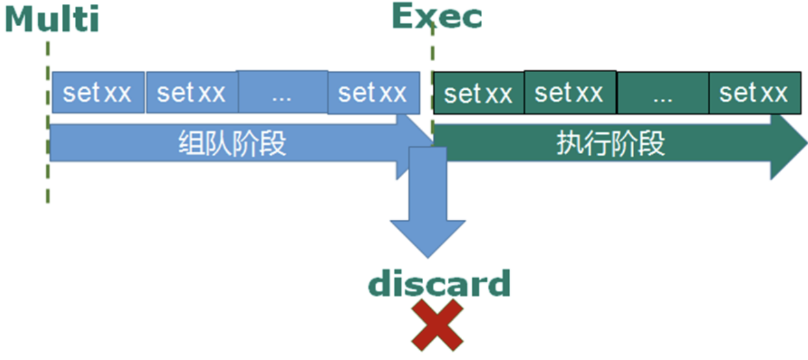
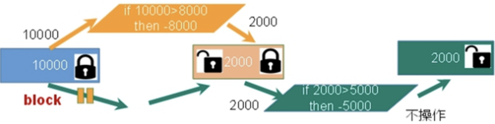
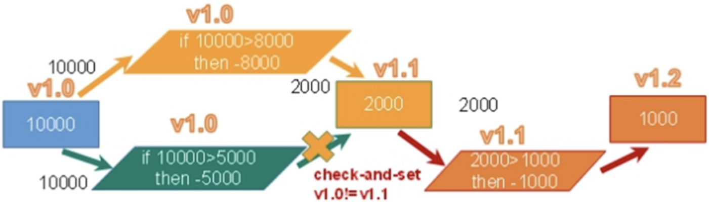

# 七、Redis的事务操作
Redis事务是一个单独的隔离操作: 事务中的所有命令都会序列化、按顺序地执行。事务在执行的过程中，不会被其他客户端发送来的命令请求所打断。Redis事务的主要作用就是串联多个命令防止别的命令插队。

## 7.1 事务的基本操作
### 7.1.1 Redis事务命令的使用
- `multi`: 从输入`multi`命令开始，输入的命令都会依次进入命令队列中，但不会执行。

- `exec`: 输入`exec`后，Redis会将之前的命令队列中的命令依次执行。

- `discard`: 放弃将队列中的命令执行

| ##container## |
|:--:|
||

示例:

```bash
127.0.0.1:6379> multi # 开启事务
OK
127.0.0.1:6379(TX)> set k1 v1
QUEUED
127.0.0.1:6379(TX)> set k2 v2
QUEUED
127.0.0.1:6379(TX)> get k1
QUEUED
127.0.0.1:6379(TX)> get k2 # 再没有执行事务之前, 我们再另一个客户端 get k1 是获取不到的
QUEUED
127.0.0.1:6379(TX)> exec # 执行事务, 上面的会依次从队列中取出然后执行
1) OK
2) OK
3) "v1"
4) "v2"
```

```bash
127.0.0.1:6379> multi
OK
127.0.0.1:6379(TX)> set hx1 qwq
QUEUED
127.0.0.1:6379(TX)> set hx2 awa
QUEUED
127.0.0.1:6379(TX)> get hx1
QUEUED
127.0.0.1:6379(TX)> discard # 打断事务，事务中的所有命令都不会执行
OK
127.0.0.1:6379> get hx1 # 并没有被赋值
(nil)
```

### 7.1.2 事务的错误处理
1. 组队中某个命令出现了报告错误(组队时出现错误)，执行时**整个的所有队列都会被取消**。

```bash
127.0.0.1:6379> multi
OK
127.0.0.1:6379(TX)> set k1 v1
QUEUED
127.0.0.1:6379(TX)> set k2 # 由于命令出了语法问题，所以在入列的时候就会报错
(error) ERR wrong number of arguments for 'set' command
127.0.0.1:6379(TX)> get k1
QUEUED
127.0.0.1:6379(TX)> get k2
QUEUED
127.0.0.1:6379(TX)> exec # 由于组队的时候就出现了错误，所以所有的redis指令都不会执行
(error) EXECABORT Transaction discarded because of previous errors.
```

2. 组队中(入列时)命令没有问题，**在执行的时候出了问题，则只有报错的命令不会被执行，而其他的命令都会执行，不会回滚**。

```bash
127.0.0.1:6379> multi
OK
127.0.0.1:6379(TX)> set k1 v1
QUEUED
127.0.0.1:6379(TX)> incr k1 # 语法没有问题，在执行的时候会出问题，因为只有数字才能自增
QUEUED
127.0.0.1:6379(TX)> set k2 v2
QUEUED
127.0.0.1:6379(TX)> get k1
QUEUED
127.0.0.1:6379(TX)> get k2
QUEUED
127.0.0.1:6379(TX)> exec
1) OK
2) (error) ERR value is not an integer or out of range
3) OK
4) "v1"
5) "v2"
```

## 7.2 事务的冲突
### 7.2.1 事务冲突出现的场景
想想一个场景:
- 有很多人有你的账户,同时去参加双十一抢购

假设你有一个账户，此时你有三个女友(A B C)都知道你账户，现在她们拿着你的银行账户同时进行消费。
- 一个请求想给金额减8000；一个请求想给金额减5000；一个请求想给金额减1000

| ##container## |
|:--:|
||

### 7.2.2 解决事务的冲突问题
#### 7.2.2.1 悲观锁
| ##container## |
|:--:|
||

**悲观锁(Pessimistic Lock)**, 顾名思义，就是很悲观，每次去拿数据的时候都认为别人会修改，所以**每次在拿数据的时候都会上锁**，这样别人想拿这个数据就会block直到它拿到锁。传统的关系型数据库里边就用到了很多这种锁机制，比如行锁，表锁等，读锁，写锁等，都是`在做操作之前先上锁`。

#### 7.2.2.2 乐观锁
| ##container## |
|:--:|
||

**乐观锁(Optimistic Lock)**, 顾名思义，就是很乐观，每次去拿数据的时候都认为别人不会修改，所以**不会上锁**，但是**在更新的时候会判断一下在此期间别人有没有去更新这个数据**，可以使用版本号等机制。

**乐观锁适用于多读的应用类型，这样可以提高吞吐量**。Redis就是利用这种check-and-set机制实现事务的。

### 7.2.3 使用watch命令实现Redis乐观锁
在执行`multi`之前，先执行`watch key1 [key2 ... keyn]`, 可以监视一个(或多个)`key`，如果在事务执行之前这个(或这些)`key`被其他命令所改动，那么事务将被打断。

现在我们使用两个客户端来演示redis的乐观锁:

- 在客户端1 设置一个balance，然后watch这个key

```bash
127.0.0.1:6379> set hx 100
OK
127.0.0.1:6379> watch hx
OK
```

- 在客户端2 也watch这个key

```bash
127.0.0.1:6379> watch hx
OK
```

- 在客户端1 开启事务，并修改账户余额信息，但是不提交事务

```bash
127.0.0.1:6379> multi
OK
127.0.0.1:6379(TX)> decrby hx 20
QUEUED
```

- 在客户端2 开启事务，并修改账户余额信息，但是不提交事务

```bash
127.0.0.1:6379> multi
OK
127.0.0.1:6379(TX)> decrby hx 30
QUEUED
```

- 客户端1 提交事务, 查看效果

```bash
127.0.0.1:6379(TX)> exec
1) (integer) 80
127.0.0.1:6379> get hx
"80"
```

- 客户端2 提交事务,查看效果

```bash
127.0.0.1:6379(TX)> exec # 事务中的命令没有被执行，因为客户端2监控的key值发生了变化
(nil)
127.0.0.1:6379> get hx
"80"
```

### 7.2.4 Redis事务的特性
- 单独的隔离操作
    - 事务中的所有命令都会序列化、按顺序地执行。事务在执行的过程中，不会被其他客户端发送来的命令请求所打断。

- 没有隔离级别的概念
    - 队列中的命令没有提交之前都不会实际被执行，因为事务提交前任何指令都不会被实际执行。

- 不保证原子性
    - 事务中如果有一条命令执行失败，其后的命令仍然会被执行，<span style="color:red">没有回滚</span>。
