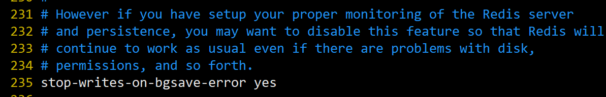

# 八、Redis持久化操作
Redis 提供了2个不同形式的持久化方式。
- RDB（Redis DataBase）
- AOF（Append Of File）

## 8.1 RDB持久化
### 8.1.1 什么是RDB持久化
在指定的时间间隔内将内存中的数据集快照写入磁盘，也就是行话讲的`Snapshot`快照，它恢复时是将快照文件直接读到内存里。

### 8.1.2 RDB持久化流程
Redis会单独创建(fork)一个子进程来进行持久化，会先将数据写入到一个临时文件中，待持久化过程都结束了，再用这个临时文件替换上次持久化好的文件。整个过程中，主进程是不进行任何IO操作的，这就确保了极高的性能 如果需要进行大规模数据的恢复，且对于数据恢复的完整性不是非常敏感，那RDB方式要比AOF方式更加的高效。**RDB的缺点是最后一次持久化后的数据可能丢失**。

| ##container## |
|:--:|
||

### 8.1.3 RDB持久化触发策略
RDB 持久化提供了两种触发策略：一种是手动触发，另一种是自动触发。

- 手动触发策略

手动触发是通过`SAVE`命令或者`BGSAVE`命令将内存数据保存到磁盘文件中。如下所示:

- save: 会阻塞当前Redis服务器，直到持久化完成，线上应该禁止使用。
- bgsave: 该触发方式会fork一个子进程，由子进程负责持久化过程，因此阻塞只会发生在fork子进程的时候。

```bash
127.0.0.1:6379> save
OK
127.0.0.1:6379> bgsave
Background saving started
127.0.0.1:6379> lastsave
(integer) 1714448201
```

- 自动触发

自动触发策略，是指 Redis 在指定的时间内，数据发生了多少次变化时，会自动执行`BGSAVE`命令。自动触发的条件包含在了 Redis 的配置文件中，如下所示:

| ##container## |
|:--:|
||

上图所示，`save m n`的含义是在时间`m`秒内，如果 Redis 数据至少发生了`n`次变化，那么就自动执行`BGSAVE`命令。配置策略说明如下:
1. `save 900 1`: 表示在 900 秒内，至少更新了 1 条数据，Redis 自动触发 BGSAVE 命令，将数据保存到硬盘。

2. `save 300 10`: 表示在 300 秒内，至少更新了 10 条数据，Redis 自动触 BGSAVE 命令，将数据保存到硬盘。

3. `save 60 10000`: 表示 60 秒内，至少更新了 10000 条数据，Redis 自动触发 BGSAVE 命令，将数据保存到硬盘。只要上述三个条件任意满足一个，服务器就会自动执行 BGSAVE 命令。当然您可以根据实际情况自己调整触发策略。

### 8.1.4 dump.rdb文件
在`redis.conf`中配置文件名称，默认为`dump.rdb`。

| ##container## |
|:--:|
||

`rdb`文件的保存路径，也可以修改。默认为Redis启动时命令行所在的目录下, 我们也可以自定义目录位置。

| ##container## |
|:--:|
||

### 8.1.5 stop-writes-on-bgsave-error
当Redis无法写入磁盘的话，直接关掉Redis的写操作。推荐`yes`。

| ##container## |
|:--:|
||

### 8.1.6 RDB持久化特点
- 优势:
  - 适合大规模的数据恢复
  - 对数据完整性和一致性要求不高更适合使用
  - 节省磁盘空间
  - 恢复速度快

- 劣势:
    - Fork的时候，内存中的数据被克隆了一份，大致2倍的膨胀性需要考虑。
    - 虽然Redis在fork时使用了**写时拷贝技术**, 但是如果数据庞大时还是比较消耗性能。
    - 在备份周期在一定间隔时间做一次备份，所以如果Redis意外down掉的话，就会丢失最后一次快照后的所有修改。

## 8.2 AOF持久化
AOF: append only file

### 8.2.1 什么是AOF持久化
以日志的形式来记录每个写操作(增量保存)，将Redis执行过的所有写指令记录下来(**读操作不记录**)，**只许追加文件但不可以改写文件**，redis启动之初会读取该文件重新构建数据，换言之，redis 重启的话就根据日志文件的内容将写指令从前到后执行一次以完成数据的恢复工作。

注意: **AOF默认不开启**。可以在`redis.conf`中配置文件名称，默认为`appendonly.aof`。**AOF文件的保存路径，同RDB的路径一致**。

AOF和RDB同时开启，系统默认取AOF的数据(数据不会存在丢失)。

### 8.2.2 AOF持久化规则
- appendfsync always
    - 始终同步，每次Redis的写入都会立刻记入日志；性能较差但数据完整性比较好

- appendfsync everysec
    - 每秒同步，每秒记入日志一次，如果宕机，本秒的数据可能丢失。

- appendfsync no
    - redis不主动进行同步，把同步时机交给操作系统。

### 8.2.3 ReWrite重写机制
AOF采用文件追加方式，文件会越来越大为避免出现此种情况，新增了重写机制, 当AOF文件的大小超过所设定的阈值时，Redis就会启动AOF文件的内容压缩，只保留可以恢复数据的最小指令集. 可以使用命令`bgrewriteaof`

如何重写?

AOF文件持续增长而过大时，会fork出一条新进程来将文件重写(也是先写临时文件最后再rename)，redis4.0版本后的重写，是指上就是把rdb 的快照，以二级制的形式附在新的aof头部，作为已有的历史数据，替换掉原来的流水账操作。

`no-appendfsync-on-rewrite`:

- 如果`no-appendfsync-on-rewrite=yes`, 不写入aof文件只写入缓存，用户请求不会阻塞，但是在这段时间如果宕机会丢失这段时间的缓存数据。（降低数据安全性，提高性能）

- 如果`no-appendfsync-on-rewrite=no`, 还是会把数据往磁盘里刷，但是遇到重写操作，可能会发生阻塞。（数据安全，但是性能降低）

触发机制，何时重写？

<b>

Redis会记录上次重写时的AOF大小，默认配置是当AOF文件大小是上次`rewrite`后大小的一倍且文件大于64M时触发

重写虽然可以节约大量磁盘空间，减少恢复时间。但是每次重写还是有一定的负担的，因此设定Redis要满足一定条件才会进行重写。

`auto-aof-rewrite-percentage`: 设置重写的基准值，文件达到100%时开始重写(文件是原来重写后文件的2倍时触发)

`auto-aof-rewrite-min-size`: 设置重写的基准值，最小文件64MB。达到这个值开始重写。

</b>

例如:
- 文件达到70MB开始重写，降到50MB，下次什么时候开始重写？100MB

系统载入时或者上次重写完毕时，Redis会记录此时AOF大小，设为`base_size`,如果Redis的AOF $当前大小 \ge base\_size + base\_size \times 100\%(默认) \ and \ 当前大小 \ge 64 MB(默认)$ 的情况下，Redis会对AOF进行重写。

### 8.2.4 使用AOF持久化流程

| ##container## |
|:--:|
||

1. `bgrewriteaof`触发重写，判断是否当前有`bgsave`或`bgrewriteaof`在运行，如果有，则等待该命令结束后再继续执行。

2. 主进程fork出子进程执行重写操作，保证主进程不会阻塞。

3. 子进程遍历redis内存中数据到临时文件，客户端的写请求同时写入 **`aof_buf`缓冲区** 和 **`aof_rewrite_buf`重写缓冲区** 保证原AOF文件完整以及新AOF文件生成期间的新的数据修改动作不会丢失。

4. 1. 子进程写完新的AOF文件后，向主进程发信号，父进程更新统计信息。
   2. 主进程把`aof_rewrite_buf`中的数据写入到新的AOF文件。

5. 使用新的AOF文件覆盖旧的AOF文件，完成AOF重写。

### 8.2.5 AOF持久化特点
- 优势
    - 备份机制更稳健，丢失数据概率更低。
    - 可读的日志文本，通过操作AOF稳健，可以处理误操作。

- 劣势
    - 比起RDB占用更多的磁盘空间
    - 恢复备份速度要慢。
    - 每次读写都同步的话，有一定的性能压力。

### 8.2.6 用哪个
官方推荐两个都启用。

- RDB持久化方式能够在指定的时间间隔能对你的数据进行快照存储

- AOF持久化方式记录每次对服务器写的操作,当服务器重启的时候会重新执行这些命令来恢复原始的数据,AOF命令以redis协议追加保存每次写的操作到文件末尾.

- Redis还能对AOF文件进行后台重写,使得AOF文件的体积不至于过大

- 只做缓存: 如果你只希望你的数据在服务器运行的时候存在,你也可以不使用任何持久化方式.

- 同时开启两种持久化方式
    - 在这种情况下,当redis重启的时候会优先载入AOF文件来恢复原始的数据, 因为在通常情况下AOF文件保存的数据集要比RDB文件保存的数据集要完整.

    - RDB的数据不实时，同时使用两者时服务器重启也只会找AOF文件。那要不要只使用AOF呢? 建议不要，因为RDB更适合用于备份数据库(AOF在不断变化不好备份)，快速重启，而且不会有AOF可能潜在的bug，留着作为一个万一的手段。