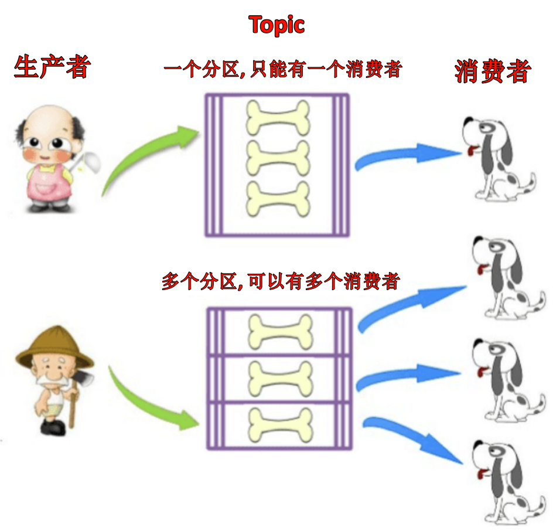

# 一、RocketMQ的基本概述
## 1.1 MQ的基本概述
**MQ，Message Queue**，是一种提供消息队列服务的**中间件**，也称为消息中间件。是一套提供了消息生产、存储、消费全过程API的软件系统。消息即数据。一般消息的体量不会很大。

中间件可以分为很多种类型(缓存中间件 redis memcache, 数据库中间件 mycat canal, 消息中间件mq)，面向消息的**中间件**(message-oriented middleware)可以利用**高效可靠的消息传递机制进行与平台无关(跨平台)的数据交流**，并基于数据通信来进行分布式系统的集成。通过**提供消息传递和消息排队模型**在分布式环境下提供应用解耦，弹性伸缩，冗余存储，流量削峰，异步通信，数据同步等。

### 1.1.1 MQ的作用
#### 异步通信
消息发送者可以发送一个消息而无需等待响应，消息发送者把消息发送到一条虚拟的通道(主题或队列)上;消息接收者则订阅或监听该通道。一条信息可能最终转发给一个或多个消息接收者，这些接收者都无需对消息发送者做出回应。整个过程都是异步的。

案例: 一个系统和另一个系统间进行通信的时候，假如系统A希望发送一个消息给系统B，让它去处理，但是系统A不关注系统B到底怎么处理或者有没有处理好，所以系统A把消息发送给MQ，然后就不管这条消息的“死活” 了，接着系统B从MQ里面消费出来处理即可。至于怎么处理，是否处理完毕，什么时候处理，都是系统B的事，与系统A无关。

| ##container## |
|:--:|
||

这样的一种通信方式，就是所谓的“异步”通信方式，对于系统A来说，只要把消息发给MQ,然后系统B就会异步处去进行处理了，系统A不能“同步”的等待系统B处理完。这样的好处是什么呢? 提高系统间的通信效率。

#### 应用解耦
上游系统对下游系统的调用若为同步调用，则会大大降低系统的吞吐量与并发度，且系统耦合度太高。而异步调用则会解决这些问题。所以两层之间若要实现由同步到异步的转化，一般性做法就是，在这两层间添加一个MQ层。

| ##container## |
|:--:|
||

#### 限流削峰
MQ可以将系统的超量请求暂存其中，以便系统后期可以慢慢进行处理，从而避免了请求的丢失或系统被压垮。

| ##container## |
|:--:|
||

### 1.1.2 常见的MQ产品

| 特性  | ActiveMQ | RabbitMQ| RocketMQ| Kafka    |
|:--:|:--:|:--:|:--:|:--:|
| 开发语言   | Java| Erlang  | Java    | Scala    |
| 单机吞吐量 | 万级| 万级    | 10万级  | 10万级   |
| 时效性| ms级| us级(微秒级)| ms级    | ms级以内|
| 可用性| 高(主从架构)  | 高(主从架构)| 非常高(分布式架构)| 非常高(分布式架构)|
| 功能特性 | 成熟的产品，早期得到很多公司的应用，但因为吞吐量较低，现在用的较少。 | 基于Erlang语言开发，并发性能强，性能极好，延时很低，管理界面丰富。 | MQ功能完善，扩展性佳。 | 只支持主要的MQ功能，像一些消息查询，消息回溯功能没有提供，毕竟为大数据准备的，在大数据领域应用广泛。 |

## 1.2 什么是RocketMQ
- [RocketMQ官网](https://rocketmq.apache.org/)

RocketMQ是一个统一消息引擎、轻量级数据处理平台。RocketMQ是一款阿里巴巴开源的消息中间件。2016 年 11 月 28 日，阿里巴巴向 Apache 软件基金会捐赠RocketMQ，成为 Apache 孵化项目。2017 年 9 月 25 日，Apache 宣布 RocketMQ孵化成为 Apache 顶级项目(TLP)，成为国内首个互联网中间件在 Apache 上的顶级项目。

RocketMQ的发展历程:
> - 2007 年，阿里开始五彩石项目，Notify作为项目中交易核心消息流转系统，应运而生。Notify系统是 RocketMQ 的雏形。
>
> - 2010 年，B2B 大规模使用 ActiveMQ 作为阿里的消息内核。阿里急需一个具有海量堆积能力的消息系统。
>
> - 2011 年初，Kafka 开源。淘宝中间件团队在对 Kafka 进行了深入研究后，开发了一款新的 MQ，MetaQ。
>
>  - 2012 年，MetaQ 发展到了 v3.0 版本，在它基础上进行了进一步的抽象，形成了 RocketMQ，然后就将其进行了开源。
>
>  - 2015 年，阿里在 RocketMQ 的基础上，又推出了一款专门针对阿里云上用户的消息系统 Aliware MQ。
>
>  - 2016 年双十一，RocketMQ 承载了万亿级消息的流转，跨越了一个新的里程碑。11 月 28 日，阿里巴巴向 Apache 软件基金会捐赠 RocketMQ，成为 Apache 孵化项目。
>
>  - 2017 年 9 月 25 日，Apache 宣布 RocketMQ 孵化成为 Apache 顶级项目（TLP），成为国内首个互联网中间件在 Apache 上的顶级项目。

## 1.3 RocketMQ的整体架构
| ##container## |
|:--:|
||

如上图所示，整体可以分成4个角色，分别是: NameServer，Broker，Producer，Consumer。

- **Producer**: 消息的发送者，生产者。举例: 发件人

- **Consumer**: 消息接收者，消费者。举例: 收件人

- **Broker**: 暂存和传输消息的通道。举例: 快递

- **NameServer**: 管理Broker，举例：各个快递公司的管理机构,相当于broker的注册中心，保留了broker的信息。(MQ做高可用会用到NameServer)。

- **Queue**: 队列，消息存放的位置，一个Broker中可以有多个队列。

- **Topic**: 主题，消息的分类。

- **ProducerGroup**: 生产者组 。RocketMQ中的消息生产者都是以生产者组（Producer Group）的形式出现的。生产者组是同一类生产者的集合，这类Producer发送相同Topic类型的消息。一个生产者组可以同时发送多个主题的消息。

- **ConsumerGroup**: 消费者组，RocketMQ中的消息消费者都是以 **消费者组(Consumer Group)** 的形式出现的。消费者组是同一类消费者的集合，这类Consumer消费的是同一个Topic类型的消息。消费者组使得在消息消费方面，实现`负载均衡`(将一个Topic中的不同的Queue平均分配给同一个Consumer Group的不同的Consumer，注意，并不是将消息负载均衡)和`容错`(一个Consmer挂了，该Consumer Group中的其它Consumer可以接着消费原Consumer消费的Queue)的目标变得非常容易。

现在我们对这些概念进行详细的介绍:

#### 1.3.1 Topic (主题)
> 用来区分不同类型的消息。

| ##container## |
|:--:|
||

Topic表示一类消息的集合，每个主题包含若干条消息，每条消息只能属于一个主题，是RocketMQ进行消息订阅的基本单位。1个Topic里面可以有多条消息(topic:message 是1:n)，但是1条消息只能隶属于一个Topic(message:topic 1:1)。

**一个生产者可以同时发送多种Topic的消息**；而**一个消费者只对某种特定的Topic感兴趣**，即只可以`订阅`和`消费`一种Topic的消息。(producer:topic 1:n consumer:topic 1:1)

#### 1.3.2 Tag (标签)
> 为消息设置的标签，用于同一主题下区分不同类型的消息。来自同一业务单元的消息，可以根据不同业务目的在同一主题下设置不同标签。标签能够有效地保持代码的清晰度和连贯性，并优化RocketMQ提供的查询系统。消费者可以根据Tag实现对不同子主题的不同消费逻辑，实现更好的扩展性。

Topic是消息的一级分类，Tag是消息的二级分类:
> Topic: 货物
> - tag = 家用电器
> - tag = 数码产品
> - tag = 日用品

在消费者这边可以这样定义:
> - topic = 货物 tag = 家用电器
> - topic = 货物 tag = 家用电器 | 数码产品
> - topic = 货物 tag = *

#### 1.3.3 Queue (队列)
> 存储消息的物理实体。一个Topic中可以包含多个Queue，每个Queue中存放的就是该Topic的消息。一个Topic的Queue也被称为一个Topic中消息的分区(Partition)。

一个Topic的Queue中的消息只能被一个消费者组中的一个消费者消费。一个Queue中的消息不允许同一个消费者组中的多个消费者同时消费。一个Queue中的消息允许不同消费者组里面的多个消费者同时消费。

| ##container## |
|:--:|
||

为什么一个Topic中可以包含多个Queue，主要是为了提高消息被消费的效率。

在学习参考其它相关资料时，还会看到一个概念: **分片(Sharding)**。分片不同于分区。在RocketMQ中，分片指的是存放相应Topic的Broker。每个分片中会创建出相应数量的分区，即Queue，每个Queue的大小都是相同的。

| ##container## |
|:--:|
||

#### 1.3.4 消息标识（MessageId/Key)
> RocketMQ中每个消息拥有**唯一**的 MessageId，且可以携带具有业务标识的 Key，以方便对消息的查询。不过需要注意的是，MessageId 有两个: 在生产者`send()`消息时会自动生成一个 MessageId (msgId)，当消息到达 Broker 后，Broker 也会自动生成一个 offsetMsgId。msgId、offsetMsgId 与 key 都称为消息标识。

- **msgId**: 由`producer`端生成，其生成规则为: $$producerIp + 进程pid + MessageClientIDSetter类的ClassLoader的hashCode + 当前时间 + AutomicInteger自增计数器$$

- **offsetMsgId**: 由`broker`端生成，其生成规则为: $$brokerIp + 物理分区的offset(Queue中的偏移量)$$

- **key**: 由用户指定的业务相关的唯一标识

#### 1.3.5 Name Server
> NameServer 是一个`Broker`与`Topic`路由的注册中心，支持Broker的动态注册与发现。

RocketMQ的思想来自于Kafka，而Kafka是依赖了Zookeeper的。所以，在RocketMQ的早期版本，即在MetaQ v1.0与v2.0版本中，也是依赖于Zookeeper的。从MetaQ v3.0，即RocketMQ开始去掉了Zookeeper依赖，使用了自己的NameServer。

NameServer 主要包含两个功能:
- `Broker管理`: 接受`Broker`集群的注册信息并且保存下来作为路由信息的基本数据；提供心跳检测机制，检查`Broker`是否还存活。

- `路由信息管理`: 每个`NameServer`中都保存着`Broker`集群的整个路由信息和用于客户端查询的队列信息。`Producer`和`Conumser`通过`NameServer`可以获取整个`Broker`集群的路由信息，从而进行消息的投递和消费。

**路由注册**

NameServer通常也是以集群的方式部署，不过，**NameServer是无状态的，即NameServer集群中的各个节点间是无差异的，各节点间相互不进行信息通讯**。所以nameserver节点之间是相互独立，没有数据同步，一个挂了不会有任何影响。在Broker节点启动时，轮询NameServer列表，与每个NameServer节点建立**长连接**，发起注册请求。在NameServer内部维护着一个Broker列表，用来动态存储Broker的信息。

> 注意，这是与其它像zk、Eureka、Nacos等注册中心不同的地方。这种NameServer的无状态方式，有什么优缺点:
> - 优点: NameServer集群搭建简单，扩容简单。
>
> - 缺点: 对于Broker，必须明确指出所有NameServer地址。否则未指出的将不会去注册。也正因为如此，NameServer并不能随便扩容。因为，若Broker不重新配置，新增的NameServer对于Broker来说是不可见的，其不会向这个NameServer进行注册。

Broker节点为了证明自己是活着的，为了维护与NameServer间的长连接，会将最新的信息以心跳包的方式上报给NameServer，每 30 秒发送一次心跳。心跳包中包含 BrokerId、Broker地址(IP + Port)、Broker名称、Broker所属集群名称等等。NameServer在接收到心跳包后，会更新心跳时间戳，记录这个Broker的最新存活时间。

**路由剔除**

由于Broker关机、宕机或网络抖动等原因，NameServer没有收到Broker的心跳，NameServer可能会将其从Broker列表中剔除。

NameServer中有一个定时任务，每隔 10 秒就会扫描一次Broker表，查看每一个Broker的最新心跳时间戳距离当前时间是否超过 120 秒，如果超过，则会判定Broker失效，然后将其从Broker列表中剔除。

**路由发现**

RocketMQ的路由发现采用的是Pull模型。当Topic路由信息出现变化时，NameServer不会主动推送给客户端，而是客户端定时拉取主题最新的路由。默认客户端每 30 秒会拉取一次最新的路由。

> 扩展:
> 1. Push模型：推送模型。其实时性较好，是一个“发布-订阅”模型，需要维护一个长连接。而长连接的维护是需要资源成本的。该模型适合于的场景:
>        - 实时性要求较高
>        - Client数量不多，Server数据变化较频繁
>
> 2. Pull模型: 拉取模型。存在的问题是，实时性较差。
>
> 3. Long Polling模型: 长轮询模型。其是对Push与Pull模型的整合，充分利用了这两种模型的优势，屏蔽了它们的劣势。

**客户端NameServer选择策略**

客户端(这里的客户端指的是producer和consumer)在配置时必须要写上NameServer集群的地址，那么客户端到底连接的是哪个NameServer节点呢？**客户端首先会生产一个随机数，然后再与NameServer节点数量取模，此时得到的就是所要连接的节点索引，然后就会进行连接**。如果连接失败，则会采用`round-robin`策略，逐个尝试着去连接其它节点。

首先采用的是`随机策略`进行的选择，失败后采用的是`轮询策略`。

#### 1.3.6 Broker
> Broker充当着消息中转角色，负责存储消息、转发消息。Broker在RocketMQ系统中负责接收并存储从生产者发送来的消息，同时为消费者的拉取请求作准备。Broker同时也存储着消息相关的元数据，包括消费者组消费进度偏移offset、主题、队列等。

下图为Broker Server的功能模块示意图:

| ##container## |
|:--:|
||

- **Remoting Module**: 整个Broker的实体，负责处理来自clients端的请求。而这个Broker实体则由以下模块构成。

- **Client Manager**: 客户端管理器。负责接收、解析客户端(Producer/Consumer)请求，管理客户端。例如，维护Consumer的Topic订阅信息

- **Store Service**: 存储服务。提供方便简单的API接口，处理消息存储到物理硬盘和消息查询功能。

- **HA Service**: 高可用服务，提供Master Broker 和 Slave Broker之间的数据同步功能。

- **Index Service**: 索引服务。根据特定的Message key，对投递到Broker的消息进行索引服务，同时也提供根据Message Key对消息进行快速查询的功能。

**Broker集群部署**

| ##container## |
|:--:|
||

为了增强Broker性能与吞吐量，Broker一般都是以集群形式出现的。各集群节点中可能存放着相同Topic的不同Queue。不过，这里有个问题，如果某Broker节点宕机，如何保证数据不丢失呢？其解决方案是，将每个Broker集群节点进行横向扩展，即将Broker节点再建为一个HA集群，解决单点问题。

Broker节点集群是一个主备集群，即集群中具有Master与Slave两种角色。Master负责处理读写操作请求，Slave负责对Master中的数据进行备份。当Master挂掉了，Slave则会自动切换为Master去工作。所以这个Broker集群是主备集群。一个Master可以包含多个Slave，但一个Slave只能隶属于一个Master。Master 与 Slave 的对应关系是通过指定相同的BrokerName、不同的BrokerId 来确定的。BrokerId为 0 表示Master，非 0 表示Slave。每个Broker与NameServer集群中的所有节点建立长连接，定时注册Topic信息到所有NameServer。

到目前我们可以总结RocketMQ的工作流程:

- 启动NameServer，NameServer启动后开始监听端口，等待Broker、Producer、Consumer连接。

- 启动Broker时，Broker会与所有的NameServer建立并保持长连接，然后每 30 秒向NameServer定时发送心跳包。

- 发送消息前，可以先创建Topic，创建Topic时需要指定该Topic要存储在哪些Broker上，当然，在创建Topic时也会将Topic与Broker的关系写入到NameServer中。不过，这步是可选的，也可以在发送消息时自动创建Topic。

- Producer发送消息，启动时先跟NameServer集群中的其中一台建立长连接，并从NameServer中获取路由信息，即当前发送的Topic消息的Queue与Broker的地址（IP+Port）的映射关系。然后根据算法策略从队选择一个Queue，与队列所在的Broker建立长连接从而向Broker发消息。当然，在获取到路由信息后，Producer会首先将路由信息缓存到本地，再每 30 秒从NameServer更新一次路由信息。

- Consumer跟Producer类似，跟其中一台NameServer建立长连接，获取其所订阅Topic的路由信息，然后根据算法策略从路由信息中获取到其所要消费的Queue，然后直接跟Broker建立长连接，开始消费其中的消息。Consumer在获取到路由信息后，同样也会每 30 秒从NameServer更新一次路由信息。不过不同于Producer的是，Consumer还会向Broker发送心跳，以确保Broker的存活状态。

**Topic的创建方式**

手动创建Topic时，有两种模式:
- 集群模式: 该模式下创建的Topic在该集群中，所有Broker中的Queue数量是相同的。
- Broker模式: 该模式下创建的Topic在该集群中，每个Broker中的Queue数量可以不同。

自动创建Topic时，默认采用的是Broker模式，会为每个Broker默认创建 4 个Queue。

**读写队列**

从物理上来讲，读/写队列是同一个队列。所以，不存在读/写队列数据同步问题。读/写队列是逻辑上进行区分的概念。一般情况下，读/写队列数量是相同的。

> 例如，创建Topic时设置的写队列数量为 8 ，读队列数量为 4 ，此时系统会创建 8 个Queue，分别是0 1 2 3 4 5 6 7。Producer会将消息写入到这 8 个队列，但Consumer只会消费0 1 2 3这4 个队列中的消息，4 5 6 7 中的消息是不会被消费到的。
再如，创建Topic时设置的写队列数量为 4 ，读队列数量为 8 ，此时系统会创建 8 个Queue，分别是0 1 2 3 4 5 6 7。Producer会将消息写入到0 1 2 3 这 4 个队列，但Consumer只会消费0 1 2 3 4 5 6 7这 8 个队列中的消息，但是4 5 6 7中是没有消息的。此时假设Consumer Group中包含两个Consumer，Consumer1消费0 1 2 3，而Consumer2消费4 5 6 7。但实际情况是，Consumer2是没有消息可消费的。

也就是说，当读/写队列数量设置不同时，总是有问题的。那么，为什么要这样设计呢?

其这样设计的目的是为了，**方便Topic的Queue的缩容**。

例如，原来创建的Topic中包含 16 个Queue，如何能够使其Queue缩容为 8 个，还不会丢失消息? 可以动态修改写队列数量为 8 ，读队列数量不变。此时新的消息只能写入到前 8 个队列，而消费都消费的却是 16 个队列中的数据。当发现后 8 个Queue中的消息消费完毕后，就可以再将读队列数量动态设置为 8。整个缩容过程，没有丢失任何消息。

perm用于设置对当前创建Topic的操作权限: 2 表示只写， 4 表示只读， 6 表示读写。