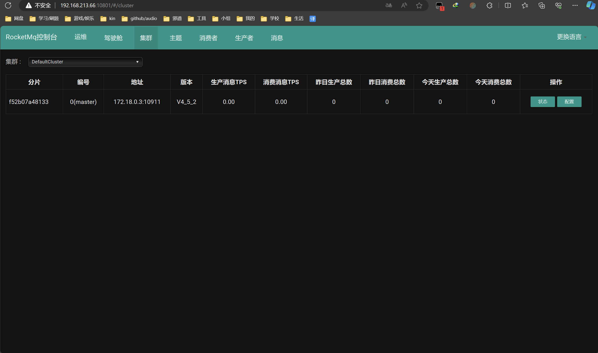

# 二、RocketMQ的安装
了解了mq的基本概念和角色以后，我们开始安装rocketmq，建议在linux上。

## 2.1 RocketMQ服务安装
> 直接安装在Linux, 这里不示范, 你直接百度吧

1. 下载地址: https://rocketmq.apache.org/dowloading/releases/ 注意选择版本，后面使用alibaba时对应。

2. 将rocketmq安装包上传至linux服务器

将下载好的安装包上传至`/opt/rocketmq`目录里面。

3. 解压压缩包
这些目录或文件的作用如下:
- Benchmark: 包含一些性能测试的脚本；
- Bin: 可执行文件目录；
- Conf: 配置文件目录；
- Lib: 第三方依赖；
- LICENSE: 授权信息;
- NOTICE: 版本公告；

4. 配置环境变量
`vim /etc/profile`

```txt
export NAMESRV_ADDR = 自己linux的ip:9876
```

5. 修改nameServer的运行脚本

进入bin目录下，修改runserver.sh文件,将71行和76行的Xms和Xmx等改小一点。

6. 修改broker的运行脚本

进入bin目录下，修改runbroker.sh文件,修改67行

7. 修改broker的配置文件

8. 启动

## 2.2 RocketMQ控制台安装
> 依旧可以直接docker安装, Linux的你就看看吧

Rocketmq 控制台可以可视化MQ的消息发送！旧版本源码是在rocketmq-external里的rocketmq-console，新版本已经单独拆分成dashboard。

- 网址: https://github.com/apache/rocketmq-dashboard
- 下载地址: https://github.com/apache/rocketmq-dashboard/archive/refs/tags/rocketmq-dashboard-1.0.0.zip

下载后解压出来，在根目录下执行: `mvn clean package -Dmaven.test.skip=true`

进入target目录找到指定的jar包, 将这个jar包上传至linux目录, 然后运行:

```bash
# 修改ip, 修改版本
nohup java -jar ./rocketmq-dashboard-1.0.0.jar -server.port=8888 - rocketmq.config.namesrvAddr=192.168.10.139:9876 > ./rocketmq-4.9.2/logs/dashboard.log &
```

此时我们可以访问到rocketmq的访问控制台

## 2.3 基于Docker快速安装RocketMQ
首先我们看看整个安装目录:

其中logs和store是构建过程中才出现的，因此，只需要在指定的目录下构建broker.conf 和docker-compose.yml即可，这两个配置的具体配置如下:

- broker.conf

```bash
# 是否允许 Broker 自动创建订阅组，建议线下开启，线上关闭
autoCreateSubscriptionGroup=true
# Broker 对外服务的监听端口
listenPort=10911
# 删除文件时间点，默认凌晨4点
deleteWhen=04
# 文件保留时间，默认48小时
fileReservedTime=120
# commitLog 每个文件的大小默认1G
mapedFileSizeCommitLog=1073741824
# ConsumeQueue 每个文件默认存 30W 条，根据业务情况调整
mapedFileSizeConsumeQueue=300000
# destroyMapedFileIntervalForcibly=120000
# redeleteHangedFileInterval=120000
# 检测物理文件磁盘空间
diskMaxUsedSpaceRatio=88
# 存储路径
# storePathRootDir=/home/wen/rocketmq-all-4.1.0-incubating/store
# commitLog 存储路径
# storePathCommitLog=/home/wen/rocketmq-all-4.1.0-incubating/store/commitlog
# 消费队列存储
# storePathConsumeQueue=/home/wen/rocketmq-all-4.1.0-
incubating/store/consumequeue
# 消息索引存储路径
# storePathIndex=/home/wen/rocketmq-all-4.1.0-incubating/store/index
# checkpoint 文件存储路径
# storeCheckpoint=/home/wen/rocketmq-all-4.1.0-incubating/store/checkpoint
# abort 文件存储路径
# abortFile=/home/wen/rocketmq-all-4.1.0-incubating/store/abort
# 限制的消息大小
maxMessageSize=65536
# flushCommitLogLeastPages=4
# flushConsumeQueueLeastPages=2
# flushCommitLogThoroughInterval=10000
# flushConsumeQueueThoroughInterval=60000
# Broker 的角色
# - ASYNC_MASTER 异步复制Master
# - SYNC_MASTER 同步双写Master
# - SLAVE
brokerRole=ASYNC_MASTER
# 刷盘方式
# - ASYNC_FLUSH 异步刷盘
# - SYNC_FLUSH 同步刷盘
flushDiskType=ASYNC_FLUSH
# 发消息线程池数量
# sendMessageThreadPoolNums=128
# 拉消息线程池数量
# pullMessageThreadPoolNums=128

# 需要填上你的Linux ip 让外界访问
brokerIP1 = 192.168.213.66

# 自动创建组
autoCreateTopicEnable=true
```

- docker-compose.yml

```yml
version: '3.5'

services:
  rmqnamesrv:
    image: foxiswho/rocketmq:server
    container_name: rmqnamesrv
    ports:
      - 9876:9876
    volumes:
      - ./data/logs:/opt/logs
      - ./data/store:/opt/store
    networks:
      rmq:
        aliases:
          - rmqnamesrv

  rmqbroker:
    image: foxiswho/rocketmq:broker
    container_name: rmqbroker
    ports:
      - 10909:10909
      - 10911:10911
    volumes:
      - ./data/logs:/opt/logs
      - ./data/store:/opt/store
      - ./data/brokerconf/broker.conf:/etc/rocketmq/broker.conf
    environment:
      NAMESRV_ADDR: "rmqnamesrv:9876"
      JAVA_OPTS: "-Duser.home=/opt"
      JAVA_OPT_EXT: "-server -Xms128m -Xmx128m -Xmn128m"
    command: mqbroker -c /etc/rocketmq/broker.conf
    depends_on:
      - rmqnamesrv
    networks:
      rmq:
        aliases:
          - rmqbroker

  rmqconsole:
    image: styletang/rocketmq-console-ng
    container_name: rmqconsole
    ports:
      - 10801:8080
    environment:
      JAVA_OPTS: "-Drocketmq.namesrv.addr=rmqnamesrv:9876 -Dcom.rocketmq.sendMessageWithVIPChannel=false"
    depends_on:
      - rmqnamesrv
    networks:
      rmq:
        aliases:
          - rmqconsole

networks:
  rmq:
    name: rmq
    driver: bridge
```
要注意，这三个镜像的端口映射，不要使用正在运行的端口

- 启动容器

```bash
docker-compose up -d
```

可以查看三个容器，构建完成，这时我们浏览器打开访问:

| ##container## |
|:--:|
||

## 2.4 基于Docker搭建RocketMQ集群
> RocketMQ的Broker集群模式分为很多种，比如多master，多master多slave。

因为搭建了也不会用, 用到再学, 再见!