# 三、RocketMQ快速入门
> 此处使用 Java 代码演示, C++配置环境费时间!
>
> 此处使用之前的docker-compose环境!
## 3.1 RocketMQ发送同步消息
在发送消息和消费消息之前，首先我们得清除两个实例，一个是消息生产者，一个是消息消费者。接下来我们创建一个普通的maven工程，基于原生的RocketMQ API完成消息生产者和消费者的搭建。首先我们创建maven项目,引入相关依赖:

```xml
<dependencies>
    <dependency>
        <groupId>org.apache.rocketmq</groupId>
        <artifactId>rocketmq-client</artifactId>
        <version>4.9.2</version>
    </dependency>
    <dependency>
        <groupId>junit</groupId>
        <artifactId>junit</artifactId>
        <version>4.12</version>
    </dependency>
    <dependency>
        <groupId>org.projectlombok</groupId>
        <artifactId>lombok</artifactId>
        <version>1.18.22</version>
    </dependency>

    <!--布隆过滤器的依赖-->
    <dependency>
        <groupId>cn.hutool</groupId>
        <artifactId>hutool-all</artifactId>
        <version>5.7.11</version>
    </dependency>
</dependencies>
```

**第一步: 定义消息生产者**

生产者生产和发送消息的流程:

```java
/**
 * 消息生产者:发送的是同步消息
 * 消息生产者发送消息的流程:
 *   1. 创建消息生产者,并指定消息生产者组名
 *   2. 指定nameserver的地址
 *   3. 启动broker
 *   4. 创建消息对象，指定主题Topic、Tag和消息体等
 *   5. 发送消息
 *   6. 关闭生产者producer
 * @throws Exception
 */
@Test
public void test01() throws Exception {
    // 1.创建消息生产者,并指定消息生产者组名
    DefaultMQProducer producer = new DefaultMQProducer("test-group");
    // 2.指定nameserver的地址
    producer.setNamesrvAddr("192.168.213.66:9876");
    // 3.启动生产者
    producer.start();
    // 4.创建消息体
    for (int i = 1; i <= 10; ++i) {
        Message msg = new Message("topicTest",("Hello, RocketMQ......" + i).getBytes());
        // 5.发送消息
        SendResult send = producer.send(msg);
        System.out.println(send);
    }
    // 6.关闭生产者实例
    producer.shutdown();
}
```

运行生产者程序，然后查询RocketMQ控制台面板:

| ##container## |
|:--:|
|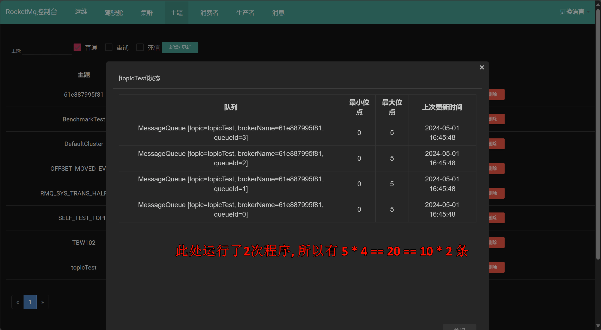|

我们发现，RocketMQ默认在TopicTest中创建了4个队列，分别把我们生产的10条消息均为的投递在4个队列里面。

点击路由:

| ##container## |
|:--:|
|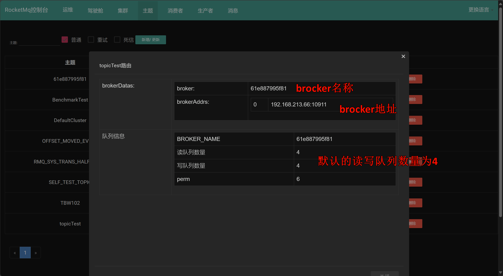|

在学习RocketMQ架构的时候，我们知道broker的信息需要在NameServer中注册，所以我们可以在面板上看到注册到Broker的信息，比如Broker的名称和ip地址。

我们还可以在面板上去查看CONSUMER TOPIC的配置信息，也可以通过面板发送消息。

| ##container## |
|:--:|
||


**第二步: 定义消息消费者**

```java
/**
 * 消费者消费消息的流程:
 * 1.创建消费者consumer,指定消费者组名
 * 2.指定nameServer的地址
 * 3.创建监听订阅主题Topic和Tag
 * 4.接收并处理消息
 * 5. 启动消费者consumer
 * @throws Exception
 */
@Test
public void testConsumer() throws Exception{
    // 1. 创建消费者，并指定消费者组名
    DefaultMQPushConsumer consumer = new DefaultMQPushConsumer("consumer-group");
    // 2. 设置nameserver的地址
    consumer.setNamesrvAddr("192.168.213.66:9876");
    // 3. 订阅一个主题来消费消息 参数1: 主题名称, 参数2: 订阅表达式 ; * 表示没有设置过滤参数 表示当前消费者可以订阅主题里面的任何消息
    consumer.subscribe("topicTest", "*");
    // 4. 注册一个监听器(MessageListenerConcurrently 监听器 多线程消费 默认是20个线程)
    consumer.registerMessageListener(new MessageListenerConcurrently() {
        // 消费消息触发的回调函数
        public ConsumeConcurrentlyStatus consumeMessage(List<MessageExt> msgs, ConsumeConcurrentlyContext consumeConcurrentlyContext) {
            String message = new String(msgs.get(0).getBody());
            System.out.println(Thread.currentThread().getName() + "消费的消息是:" + message);
            // 返回消费的状态  CONSUME_SUCCESS 消息消费成功
            return ConsumeConcurrentlyStatus.CONSUME_SUCCESS;
        }
    });
    consumer.start();
    System.in.read(); // 挂起JVM
}
```

运行后查看控制台:

| ##container## |
|:--:|
|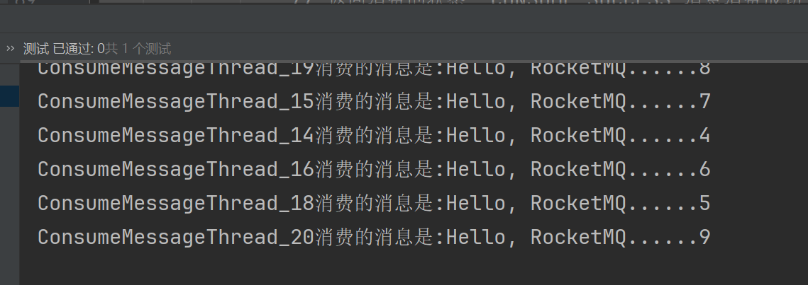|

我们发现消息成功被消费.

**使用RocketMQ发送消息需要注意的细节:**

1. 生产者投递消息

我们发现，生产者一共生产并发送了20条消息，并且这20条消息已经投递在了Topic中的4个队列里面去了。生产者将遵循**轮询**的策略将消息大致均匀的投递在了4个队列里面。

| ##container## |
|:--:|
|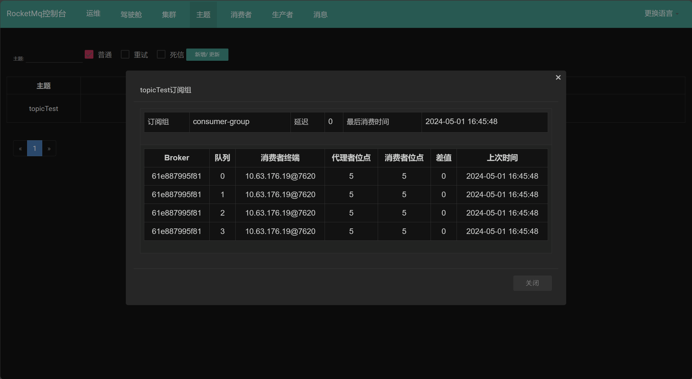|

2. 消费者消费消息

同一个组内的消费者订阅关系必须保持一致。也就是说同一个消费者组内的消费者订阅的topic必须是一样的。

| ##container## |
|:--:|
|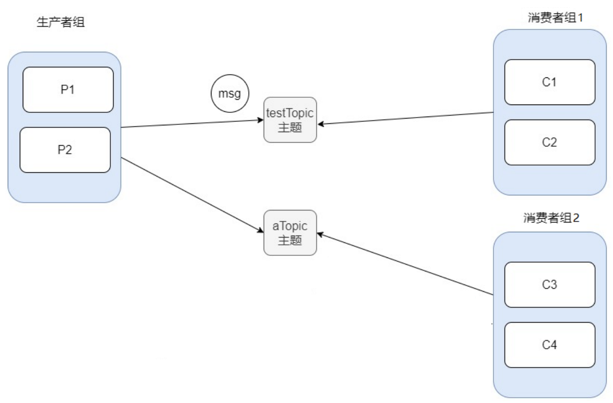|

也就是说消费者C1消费testTpoic主题里面的消息，不能出现消费者C2消费aTopic里面的消息。消费者消费消息支持两种模式: **集群消费(Clustering)** 和 **广播消费(Broadcasting)**。

**集群消费: 消息被负载均衡到了同一个消费组的多个消费者实例上**。

| ##container## |
|:--:|
|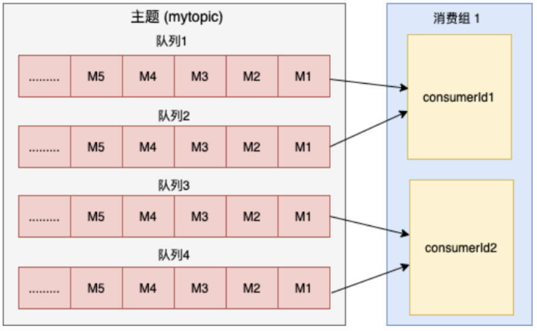|

这里要保证，队列的数量一定要大于或等于消费组中消费者数量，否则就会出现有消费者消费不到消息的情况。

广播消费: 当使用广播消费模式时，每条消息推送给集群内所有的消费者，保证消息至少被每个消费者消费一次。

接下来我们停止掉服务消费方，然后生产者发送消息，我们打开RocketMQ控制台面板CONSUMER管理按钮:

| ##container## |
|:--:|
||

这里有代理者位点，消费者位点，什么意思?

代理者位点就是生产者实际生产消息投递到队列的位置(索引)，消费者位点就是消费者实际消费队列里面消息的位置(索引)。差值就是代理者位点减去消费者位点的差值，通过差值可以判定未被消费的消息数量。

现在我们关闭消费者，调用生产者代码再次发送消息:

| ##container## |
|:--:|
|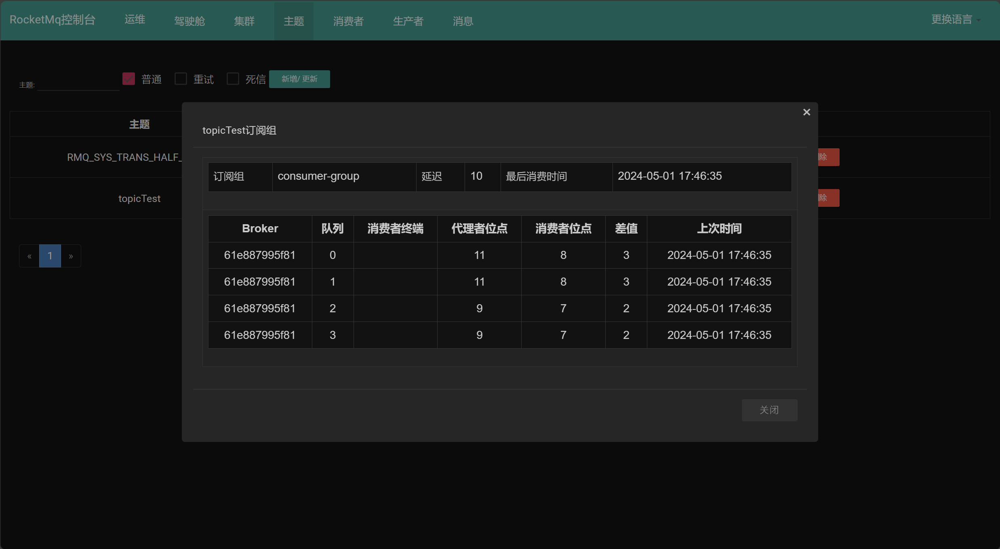|

下面我们通过一幅图更好的理解代理者位点和消费者位点:

| ##container## |
|:--:|
|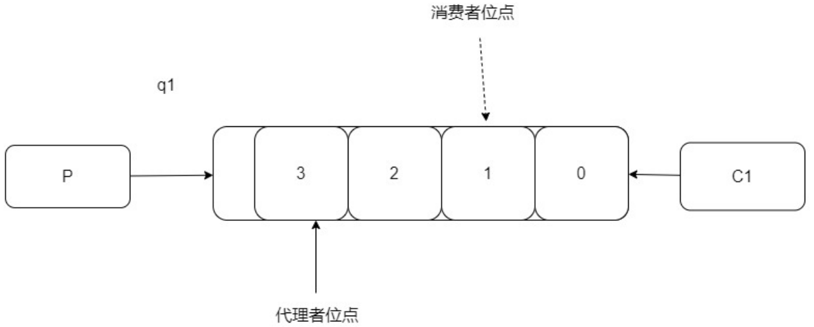|

在这里我们还给大家介绍一下RocketMQ消费消息的模式:

MQ的消费模式可以大致分为两种，一种是推**Push**，一种是拉**Pull**。
> Push是服务端【MQ】主动推送消息给客户端，优点是**实时性**较好，但如果客户端没有做好流控，一旦服务端推送大量消息到客户端时，就会导致客户端消息堆积甚至崩溃。
>
> Pull是客户端需要主动到服务端取数据，优点是客户端可以依据自己的消费能力进行消费，但拉取的频率也需要用户自己控制，拉取频繁容易造成服务端和客户端的压力，拉取间隔长又容易造
成消费不及时。

**需要注意的是: Push模式一次性可以拿到很多消息，但是只有消费者成功消费了所有消息，mq里面才会移动消费者位点**。

| ##container## |
|:--:|
|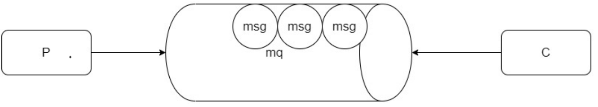|

Push模式也是基于pull模式的，只是客户端内部封装了api(基于长轮询策略)，一般场景下，上游消息生产量小或者均速的时候，选择push模式。在特殊场景下，例如电商大促，抢优惠券等场景可以选择pull模式

**上面的快速入门就是发送同步消息，发送过后会有一个返回值，也就是mq服务器接收到消息后返回的一个确认，这种方式非常安全，但是性能上并没有这么高，而且在mq集群中，也是要等到所有的从机都复制了消息以后才会返回，所以针对重要的消息可以选择这种方式**。

| ##container## |
|:--:|
|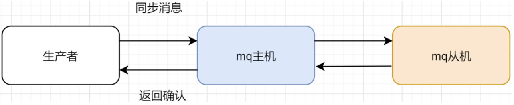|

## 3.2 RocketMQ发送异步消息

异步消息通常用在对响应时间敏感的业务场景，即发送端不能容忍长时间地等待Broker的响应。发送完以后会有一个异步消息通知。

**消息生产者:**

```java
/**
 * 发送异步消息的生产者
 * @throws Exception
 */
@Test
public void testSendAsyncMessage() throws Exception{
    // 1.创建一个生产者,并指定生产者组名
    DefaultMQProducer producer = new DefaultMQProducer("async-group");
    // 2.指定nameserver地址
    producer.setNamesrvAddr("192.168.213.66:9876");
    // 3.启动生产者
    producer.start();
    // 4.准备消息
    Message message = new Message("asyncTopic", "这是一个异步消息".getBytes());
    // 5.发送异步消息 (是一个重载方法, 第二个参数需要我们实现一个接口)
    producer.send(message, new SendCallback() {
        // 消息发送成功,触发的回调方法
        public void onSuccess(SendResult sendResult) {
            System.out.println("消息发送成功:" + sendResult);
        }
y
        // 消息发送失败,触发的回调方法
        public void onException(Throwable throwable) {
            System.out.println("消息发送失败:" + throwable.getMessage());
        }
    });
    System.out.println("主线程先执行");
    System.in.read(); // 阻塞主进程 让子进程进行消息的发送
    // 关闭生产者实例
    producer.shutdown();
}
```

消息消费者:

```java
/**
 * 发送异步消息的消费者
 * @throws Exception
 */
@Test
public void testAsyncConsumer() throws Exception{
    // 创建消费者组
    DefaultMQPushConsumer consumer = new DefaultMQPushConsumer("async-consumer-group");
    // 设置nameserver的地址
    consumer.setNamesrvAddr("192.168.213.66:9876");
    // 订阅主题里面的消息
    consumer.subscribe("asyncTopic", "*");
    // 注册监听器  MessageListenerConcurrently并发消费
    consumer.registerMessageListener(new MessageListenerConcurrently() {
        public ConsumeConcurrentlyStatus consumeMessage(List<MessageExt> msgs, ConsumeConcurrentlyContext consumeConcurrentlyContext) {
            String message = new String(msgs.get(0).getBody());
            System.out.println(Thread.currentThread().getName() + "消费的消息是:" + message);
            return ConsumeConcurrentlyStatus.CONSUME_SUCCESS;
        }
    });
    // 启动消费者
    consumer.start();
    System.in.read();
}
```

## 3.3 RocketMQ发送单向消息

这种方式主要用在不关心发送结果的场景，这种**方式吞吐量很大，但是存在消息丢失的风险**，例如日志信息的发送。

```java
// 发送单向消息
@Test
public void testOneWayProducer() throws Exception{
    // 创建生产者，并指定生产者组名
    DefaultMQProducer producer = new DefaultMQProducer("oneway-producer-group");
    // 设置nameserver的地址
    producer.setNamesrvAddr("192.168.213.66:9876");
    // 启动生产者
    producer.start();
    // 准备消息
    Message message = new Message("oneWayTopic", "这是一个单向消息".getBytes());
    // 发送单向消息
    producer.sendOneway(message); // 返回值为 void (不需要接收端回应 === 不知道对方有没有接收)
    // 关闭生产者
    producer.shutdown();
}
```

对应的消费者, 只需要把之前的消费者代码的消费者组和主题修改一下即可!

## 3.4 RocketMQ发送延迟消息
消息放入mq后，过一段时间，才会被监听到，然后消费。比如下订单业务，提交了一个订单就可以发送一个延时消息，30min后去检查这个订单的状态，如果还是未付款就取消订单释放库存。

```java
// 发送延时消息的生产者
@Test
public void testDelayMessageProducer() throws Exception{
    // 创建生产者,并且指定生产者组名称
    DefaultMQProducer producer = new DefaultMQProducer("delay-provider-group");
    // 设置nameserver的地址
    producer.setNamesrvAddr("192.168.213.66:9876");
    // 启动生产者
    producer.start();
    //构建消息体
    Message message = new Message("delayTopic", "发送了延迟消息".getBytes());
    // 给消息设置延时属性
    // messageDelayLevel = "1s 5s 10s 30s 1m 2m 3m 4m 5m 6m 7m 8m 9m 10m 20m 30m 1h 2h 总共18个级别
    message.setDelayTimeLevel(3); // 延时10s
    // 发送延时消息
    producer.send(message);
    // 打印发送消息的时间
    System.out.println("发送消息的时间是:" + new Date());
    // 关闭生产者实例
    producer.shutdown();
}
```

```java
// 定义发送延时消息的消费者
@Test
public void testDelayMessageConsumer() throws Exception{
    // 创建消费者,并指定消费者组名
    DefaultMQPushConsumer consumer = new DefaultMQPushConsumer("delay-consumer-group");
    // 设置nameserver地址
    consumer.setNamesrvAddr("192.168.213.66:9876");
    // 订阅一个主题
    consumer.subscribe("delayTopic", "*");
    // 注册监听器
    consumer.registerMessageListener(new MessageListenerConcurrently() {
        public ConsumeConcurrentlyStatus consumeMessage(List<MessageExt> msgs, ConsumeConcurrentlyContext consumeConcurrentlyContext) {
            // 打印输出消息
            String message = new String(msgs.get(0).getBody());
            System.out.println(Thread.currentThread().getName() + "消费的消息是:" + message + "接收消息的时间是:" + new Date());
            return ConsumeConcurrentlyStatus.CONSUME_SUCCESS;
        }
    });
    // 启动消费者
    consumer.start();
    System.in.read();
}
```
现在我们先启动消费者，再启动生产者，查看效果(注意: 第一次测试可能会有时间误差，因为我们在安装RocketMQ的时候，对broker的内存做了调整，所以mq性能会有折扣，我们再次发送消息就可以看到效果了):

| ##container## |
|:--:|
|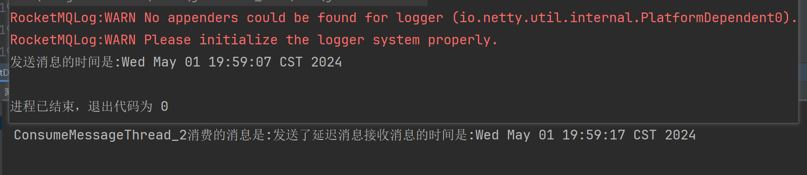|

## 3.5 RocketMQ发送批量消息
Rocketmq可以一次性发送一组消息，那么这一组消息会被当做一个消息消费。

```java
// 发送批量消息的生产者
@Test
public void testBatchMessageProducer() throws Exception{
    // 创建生产者,并指定生产者组
    DefaultMQProducer producer = new DefaultMQProducer("batch-provider-group");
    // 设置nameserver地址
    producer.setNamesrvAddr("192.168.213.66:9876");
    // 启动生产者
    producer.start();
    // 准备一组消息
    List<Message> msgs = Arrays.asList(
            new Message("batchTopic", "一组消息中的消息A".getBytes()),
            new Message("batchTopic", "一组消息中的消息B".getBytes()),
            new Message("batchTopic", "一组消息中的消息C".getBytes())
    );
    // 发送消息
    SendResult send = producer.send(msgs);
    System.out.println(send);
    // 关闭生产者
    producer.shutdown();
}
```

```java
// 发送批量消息的消费者
@Test
public void testBatchMessageConsumer() throws Exception{
    // 创建默认消费者组
    DefaultMQPushConsumer consumer = new DefaultMQPushConsumer("batch-consumer-group");
    // 设置nameserver的地址
    consumer.setNamesrvAddr("192.168.213.66:9876");
    // 订阅主题进行消费
    consumer.subscribe("batchTopic", "*");
    // 注册监听器进行消息消费
    consumer.registerMessageListener(new MessageListenerConcurrently() {
        public ConsumeConcurrentlyStatus consumeMessage(List<MessageExt> msgs, ConsumeConcurrentlyContext consumeConcurrentlyContext) {
            // 将消息打印输出
            String message = new String(msgs.get(0).getBody());
            System.out.println(Thread.currentThread().getName() + "消费的消息是:" + message);
            return ConsumeConcurrentlyStatus.CONSUME_SUCCESS;
        }
    });
    // 启动消费者
    consumer.start();
    System.in.read();
}
```

## 3.6 RocketMQ发送顺序消息
假设现在有这样一个场景: 有一个业务流程为: 下订单、发短信、发货。每个业务流程都会发送下订单的消息、发短信的消息、发货的消息。在消费者端，我们需要保证订单消息、发短信消息、发货消息按照顺序进行消费。

有小伙伴会有疑问，我们MQ队列不是具备先进先出(FIFO)的特性吗? MQ本身就保证了消息投递和消费的顺序性。其实不然。因为在实际场景中我们的消息投递并不是投递在一个队列里面。通过前面的学习我们指定，RocketMQ为了提高消息的吞吐量，在Broker里面默认创建4个队列。在发送消息的时候，采取轮询的方式将消息投递在队列里面，发送模式如下:

| ##container## |
|:--:|
|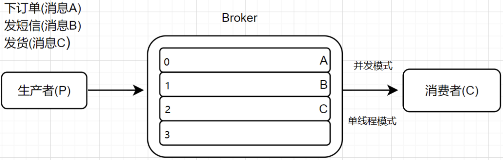|

此时3条消息分布在不同的队列里面。消费者端我们默认使用**并发模式**进行消费，也就是多个线程一起来消费队列里面的消息，此时如果多个线程并发消费队列里面的消息，并不能保证消费顺序是A B C。

那有人说，我们可以使用单线程模式的方式进行消费啊，但是如果消费者先消费队列1里面的消息，再消费队列2里面的消息，最后再消费队列0里面的消息，依然不能保证消息消费的顺序性。

但是如果控制发送的顺序消息只依次发送到同一个queue中，消费的时候只从这个queue上依次拉取，则就保证了顺序。当发送和消费参与的queue只有一个，则是全局有序；如果多个queue参与，则为分区有序，即相对每个queue，消息都是有序的。

| ##container## |
|:--:|
|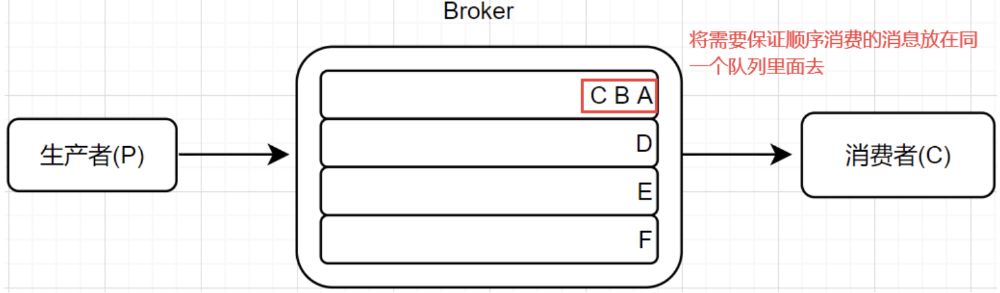|

现在我们就给大家演示发送顺序消息并消费这些消息:

场景需求:
> 模拟一个订单的发送流程，创建两个订单，发送的消息分别是
> - 订单号111 消息流程 下订单->物流->签收
> - 订单号112 消息流程 下订单->物流->拒收

第一步: 创建订单实体

```java
@Data
@NoArgsConstructor
@AllArgsConstructor
public class Order {

    /**
     * 订单id
     */
    private Integer orderId;

    /**
     * 订单编号
     */
    private Integer orderNumber;

    /**
     * 订单价格
     */
    private Double price;

    /**
     * 订单号创建时间
     */
    private Date createTime;

    /**
     * 订单描述
     */
    private String desc;
}
```

第二步: 创建消息生产者

```java
@Test
public void testOrderlyProducer() throws Exception{
    // 创建生产者
    DefaultMQProducer producer = new DefaultMQProducer("orderly-producer");
    // 设置nameserver地址
    producer.setNamesrvAddr("192.168.213.66:9876");
    // 启动生产者
    producer.start();
    // 生成订单信息
    List<Order> orderList = Arrays.asList(
           new Order(1,111,59.0,new Date(),"下订单"),
           new Order(2,111,59.0,new Date(),"物流"),
           new Order(3,111,59.0,new Date(),"签收"),
           new Order(4,112,66.0,new Date(),"下订单"),
           new Order(5,112,66.0,new Date(),"物流"),
           new Order(6,112,66.0,new Date(),"拒收")
    );
    // 循环发送消息
    orderList.forEach(order -> {
        Message message = new Message("orderTopic", order.toString().getBytes());
        // 发送消息 相同的订单编号的消息放在同一个队列里面。
        try {
            producer.send(message, new MessageQueueSelector() {
                @Override
                public MessageQueue select(List<MessageQueue> mqs, Message message, Object arg) {
                    // 获取当前主题有多少个队列
                    int queueNumber = mqs.size();
                    // arg这个参数的值就是order.getOrderNumber()的值
                    int i = (Integer) arg;
                    // 获取指定索引对应的队列
                    int index = i % queueNumber;
                    return mqs.get(index);
                }
            }, order.getOrderNumber());
        } catch (Exception e) {
            e.printStackTrace();
        }
    });
    // 关闭生产者
    producer.shutdown();
}
```

我们启动生产者，查看消息投递情况:

| ##container## |
|:--:|
|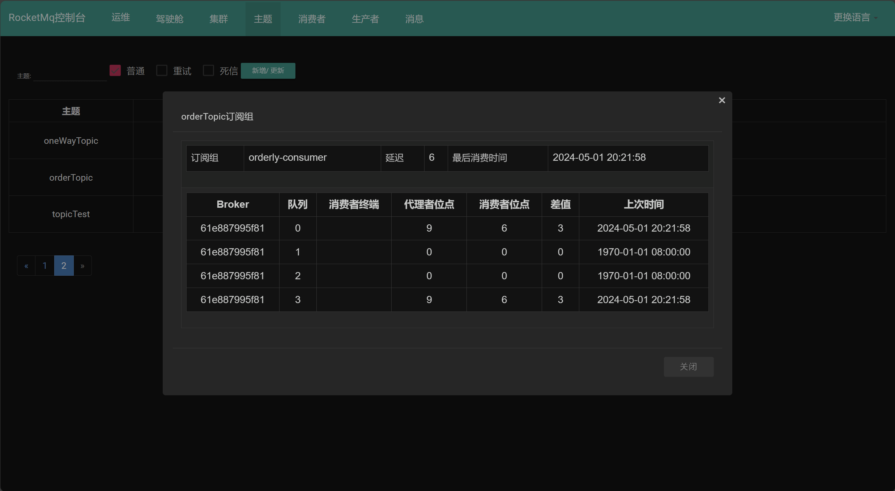|
|(此处已经多测试了几次)|

第三步: 创建消息消费者

```java
// 创建一个消费者进行消息顺序消费
@Test
public void testOrderlyMessageConsumer() throws Exception{
    DefaultMQPushConsumer consumer = new DefaultMQPushConsumer("orderly-consumer");
    consumer.setNamesrvAddr("192.168.213.66:9876");
    //订阅主题
    consumer.subscribe("orderTopic", "*");
    // 注册一个监听 MessageListenerOrderly 进行顺序消费的监听器
    consumer.registerMessageListener(new MessageListenerOrderly() {
        @Override
        public ConsumeOrderlyStatus consumeMessage(List<MessageExt> msgs, ConsumeOrderlyContext consumeOrderlyContext) {
            consumeOrderlyContext.setAutoCommit(true);
            System.out.println(Thread.currentThread().getName() + "消费的是:" + new String(msgs.get(0).getBody()));
            return ConsumeOrderlyStatus.SUCCESS;
        }
    });
    consumer.start();
    System.in.read();
}
```

## 3.7 RocketMQ发送事务消息
事务消息是常见的两段式提交:

1. 第一阶段将消息发送至RMQ_SYS_TRANS_HALF_TOPIC，也叫半消息队列，而不是实际的消费队列。

2. 第二阶段当生产者的`TransactionListener.executeLocalTransaction()`方法或`TransactionListener.checkLocalTransaction()`返回`LocalTransactionState.COMMIT_MESSAGE`。则消息才会投送到实际的Topic被消费。

```java
// 事务消息的 Producer 需要单独创建
private static final TransactionMQProducer transactionProducer;

static {
    transactionProducer = new TransactionMQProducer(MQConstants.PRODUCER_GROUP);
    transactionProducer.setNamesrvAddr(MQConstants.NAMESRVADDR);
    transactionProducer.setTransactionListener(new TransactionListenerImpl());
    try {
        transactionProducer.start();
    } catch (MQClientException e) {
        e.printStackTrace();
    }
}

/**
 * 发送事务
 */
private static void sendTransaction(String msg) {
    try {
        String keys = String.valueOf(System.currentTimeMillis());
        Message message = new Message(MQConstants.TOPIC, "TagA", msg.getBytes(RemotingHelper.DEFAULT_CHARSET));
        message.setKeys(keys);
        // 发送事务消息
        SendResult sendResult = transactionProducer.sendMessageInTransaction(message, null);
        log.info("发送事务消息:{}", keys);
        // 执行本地事务...

    } catch (UnsupportedEncodingException | MQClientException e) {
        e.printStackTrace();
    }
}

static class TransactionListenerImpl implements TransactionListener {
    /**
     * 当发送事务准备(半)消息成功时,将调用此方法来执行本地事务。
     * <p>该方法和发送消息是同一线程, 当调用 {@link TransactionMQProducer#sendMessageInTransaction(Message, Object)}方法后
     * 就会调用该方法.
     * <p>如果发送消息在事务内, 调用此方法应该永远返回 {@link LocalTransactionState#UNKNOW}, 将消息的事务交给
     * {@link TransactionListener#checkLocalTransaction(MessageExt)}方法校验并提交, 否则可能本地事务回滚而消息事务提交.
     */
    @Override
    public LocalTransactionState executeLocalTransaction(Message msg, Object arg) {
        // 决定是否提交消息事务
        log.warn("executeLocalTransaction: 消息[{}]的决定是否提交事务, 事务ID:{}", msg.getKeys(), msg.getTransactionId());
        return LocalTransactionState.UNKNOW;
    }

    /**
     * 检查本条消息的事务结果，是否可以提交事务
     * <p>本地事务状态类型：
     * <br/>1.UNKNOW           : 中间状态，它代表需要检查消息队列来确定状态。
     * <br/>2.COMMIT_MESSAGE   : 提交事务，消费者可以消费此消息
     * <br/>3.ROLLBACK_MESSAGE : 回滚事务，它代表该消息将被删除，不允许被消费。
     *
     * @param msg 消息
     * @return 本地事务状态
     */
    @Override
    public LocalTransactionState checkLocalTransaction(MessageExt msg) {
        Integer status = RandomUtil.randomInt(0, 2);
        log.warn("检查本地事务: [{}]消息的事务检查结果:{}", msg.getKeys(), status);
        switch (status) {
            case 0:
                return LocalTransactionState.UNKNOW;
            case 1:
                return LocalTransactionState.COMMIT_MESSAGE;
            case 2:
                return LocalTransactionState.ROLLBACK_MESSAGE;
            default:
                return LocalTransactionState.COMMIT_MESSAGE;
        }
    }
}
```

示例2:

```java
public class TransactionalMessageProducerExample {

    private static final String NAMESRVADDR = "192.168.213.66:9876";
    private static final String PRODUCER_GROUP = "transactional-producer-group";

    public static void main(String[] args) throws InterruptedException, MQClientException {
        // 创建事务消息生产者
        TransactionMQProducer producer = new TransactionMQProducer(PRODUCER_GROUP);
        // 设置NameServer地址
        producer.setNamesrvAddr(NAMESRVADDR);

        // 设置事务监听器
        producer.setTransactionListener((TransactionListener) new TransactionListenerImpl());

        // 启动生产者
        producer.start();

        // 发送事务消息
        sendTransactionalMessage(producer);

        // 等待一段时间
        TimeUnit.SECONDS.sleep(5);

        // 关闭生产者
        producer.shutdown();
    }

    private static void sendTransactionalMessage(TransactionMQProducer producer) {
        try {
            // 准备消息
            Message message = new Message("transactional-topic", "TagA", "这是一个事务消息".getBytes());

            // 发送事务消息
            SendResult sendResult = producer.sendMessageInTransaction(message, null);
            System.out.println("发送事务消息成功：" + sendResult);
        } catch (MQClientException e) {
            e.printStackTrace();
        }
    }

    static class TransactionListenerImpl implements TransactionListener {
        private ExecutorService executorService = Executors.newFixedThreadPool(2);

        @Override
        public LocalTransactionState executeLocalTransaction(Message message, Object arg) {
            // 执行本地事务，这里只是示例，实际中应该根据业务逻辑执行相应的本地事务操作
            System.out.println("执行本地事务...");
            // 模拟本地事务执行成功
            // 返回COMMIT_MESSAGE表示事务提交; 返回ROLLBACK_MESSAGE表示事务回滚
            return LocalTransactionState.COMMIT_MESSAGE;
        }

        @Override
        public LocalTransactionState checkLocalTransaction(MessageExt messageExt) {
            // 检查本地事务的执行状态
            // 模拟本地事务执行成功
            // 返回COMMIT_MESSAGE表示事务提交; 返回ROLLBACK_MESSAGE表示事务回滚; 返回UNKNOW表示状态未知，需要RocketMQ检查
            return LocalTransactionState.COMMIT_MESSAGE;
        }
    }
}
```

> ##yellow##
> 🟡️ 注意
> 
> 1.  消息事务使用TransactionMQProducer。
> 2.  消息事务需要设置监听器，监听器返回该消息的事务状态，UNKNOW、COMMIT_MESSAGE、ROLLBACK_MESSAGE。
>     1.  executeLocalTransaction：与业务在同一线程。
>     2.  checkLocalTransaction：由Broker异步回调。
> 3.  发送事务消息需要注意是在本地事务提交前还是提交后。
>     1.  如果是提交前，executeLocalTransaction推荐返回UNKNOW。
>     2.  如果是提交后，executeLocalTransaction可以查询本地事务的提交结果。
> 4.  异步回调默认每分钟一次，可以通过broker.conf中的transactionCheckInterval来配置，单位毫秒。
> 5.  异步回调最多回调十五次，可以通过broker.conf中的transactionCheckMax来配置。
> 6.  Broker回调是根据ProducerGroupName寻找的，如果原始生产者无法连接，则会寻找相同生产者组的其他实例。