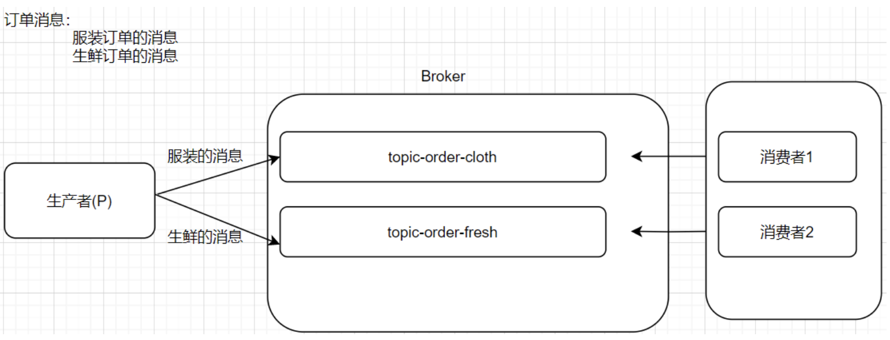
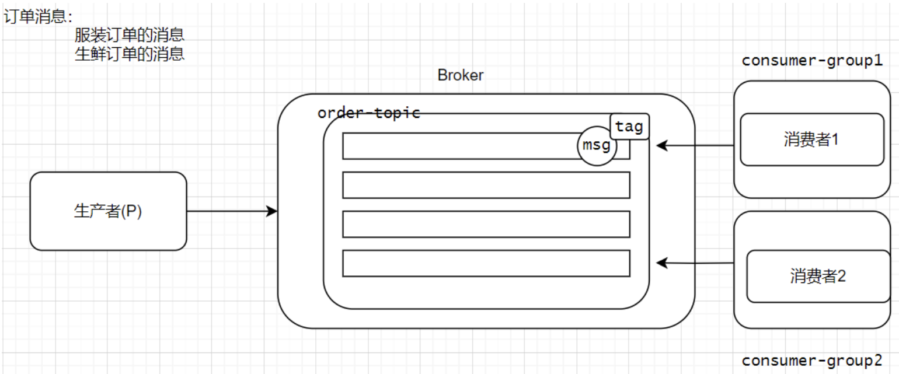
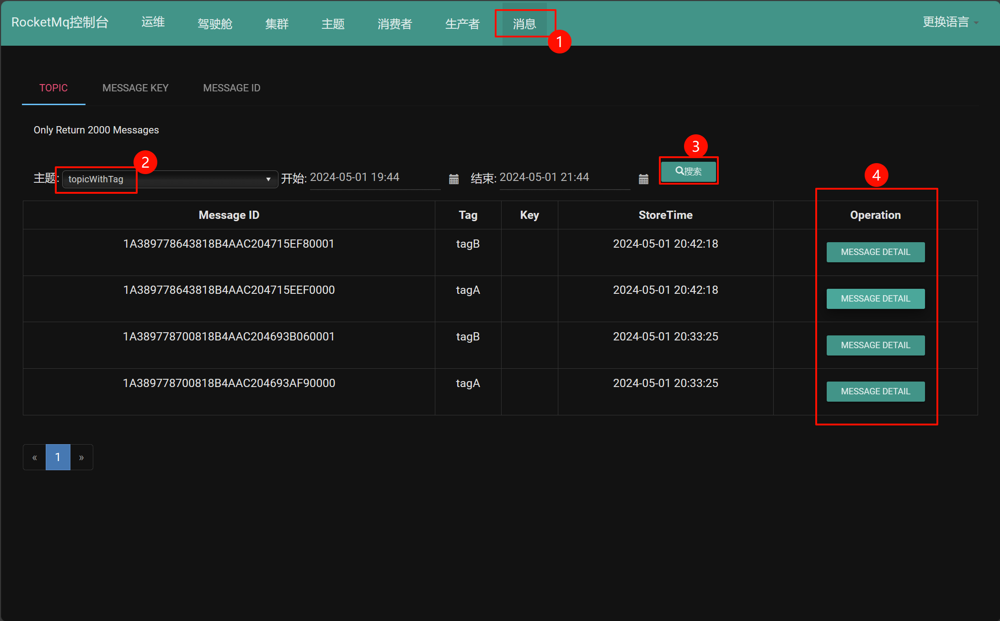
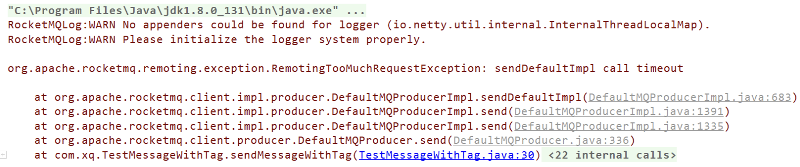
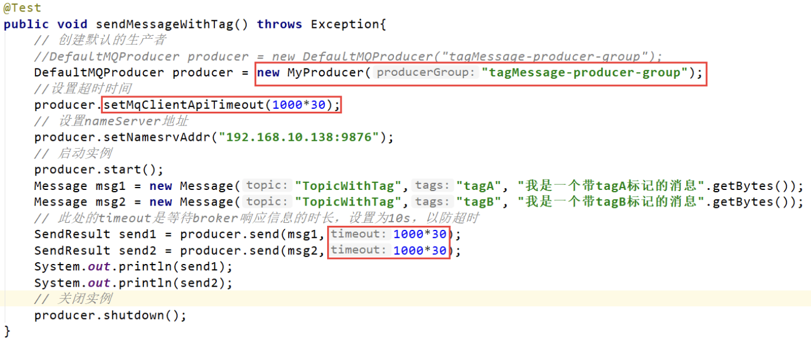
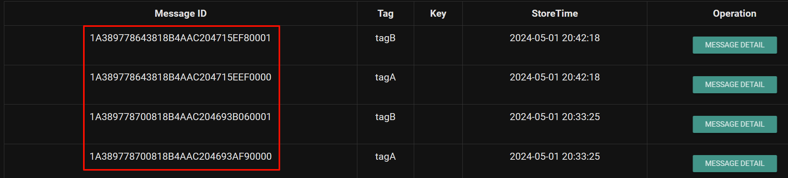
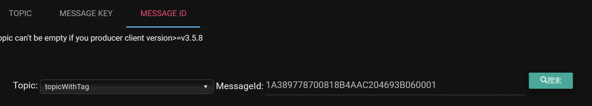
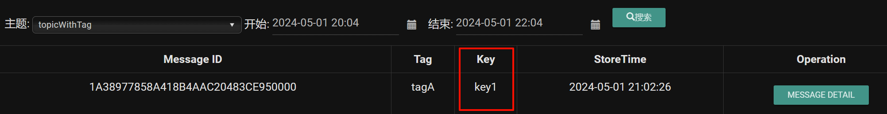

# 四、RocketMQ中的标签(Tag)和key
假设现在有这么一个场景，在电商业务中，我们的消息还可以进一步被细化。比如订单消息，订单消息又可以分为很多类，比如服装的订单，还有生鲜的订单。不同类型的订单消息，需要交给不同的消费者进行处理。这个时候怎么实现？有人说我们可以创建不同的topic，不同的topic让不同的消费者来订阅不就可以了吗？具体操作如下所示:

| ##container## |
|:--:|
||

但是这样设计会有什么问题？如果不同订单类型的消息越来越多，比如日用百货类型、数码类型...的消息，我们还要创建对应的topic？这样就显得很麻烦了。此时我们可以使用消息的Tag属性来解决这个问题。因为都是同一类型的消息(都是订单消息)，我们可以对订单消息进一步的细化，就通过这个Tag属性来细化。

| ##container## |
|:--:|
||

现在我就给大家演示带有标签的消息如何发送和消费。

## 4.1 实现带有标签消息的生产和消费
发送带有标签消息的生产者:

```java
// 生产带有tag标签的消息
@Test
public void testSendMessageWithTag() throws Exception{
    // 创建生产者，并指定组名
    DefaultMQProducer producer = new DefaultMQProducer("tagMessage-producer-group");
    // 设置nameserver地址
    producer.setNamesrvAddr("192.168.213.66:9876");
    // 启动生产者
    producer.start();
    // 准备消息
    Message msg1 = new Message("topicWithTag","tagA","这是一个带有tagA标签的消息".getBytes());
    Message msg2 = new Message("topicWithTag","tagB","这是一个带有tagB标签的消息".getBytes());
    // 发送消息
    SendResult send1 = producer.send(msg1);
    SendResult send2 = producer.send(msg2);
    System.out.println(send1);
    System.out.println(send2);
    // 关闭生产者
    producer.shutdown();
}
```

创建消费带有标签消息的消费者1:

```java
// 消费者1
@Test
public void testTagConsumer1() throws Exception{
    // 创建消费者1
    DefaultMQPushConsumer consumer = new DefaultMQPushConsumer("tagMessage-consumer-group1");
    // 设置nameserver地址
    consumer.setNamesrvAddr("192.168.213.66:9876");
    // 订阅主题 并指定消息的tag  tagA 和 tagB的消息都可以消费
    consumer.subscribe("topicWithTag","tagA || tagB");
    // 注册一个监听
    consumer.registerMessageListener(new MessageListenerConcurrently() {
        @Override
        public ConsumeConcurrentlyStatus consumeMessage(List<MessageExt> msgs, ConsumeConcurrentlyContext consumeConcurrentlyContext) {
            System.out.println("消费者1消费的消息是:" + new String(msgs.get(0).getBody()));
            System.out.println(msgs.get(0).getTags());
            return ConsumeConcurrentlyStatus.CONSUME_SUCCESS;
        }
    });
    // 启动消费者
    consumer.start();
    System.in.read();
}
```

创建消费带有标签消息的消费者2:
```java
// 消费者2
@Test
public void testTagConsumer2() throws Exception{
    // 创建消费者2
    DefaultMQPushConsumer consumer = new DefaultMQPushConsumer("tagMessage-consumer-group2");
    // 设置nameserver地址
    consumer.setNamesrvAddr("192.168.213.66:9876");
    // 订阅主题 并指定消息的tag
    consumer.subscribe("topicWithTag","tagA");
    // 注册一个监听
    consumer.registerMessageListener(new MessageListenerConcurrently() {
        @Override
        public ConsumeConcurrentlyStatus consumeMessage(List<MessageExt> msgs, ConsumeConcurrentlyContext consumeConcurrentlyContext) {
            System.out.println("消费者2消费的消息是:" + new String(msgs.get(0).getBody()));
            System.out.println(msgs.get(0).getTags());
            return ConsumeConcurrentlyStatus.CONSUME_SUCCESS;
        }
    });
    // 启动消费者
    consumer.start();
    System.in.read();
}
```

我们也可以在RocketMQ控制台面板上查看消息是否被消费:

| ##container## |
|:--:|
||

那么什么时候该用 Topic，什么时候该用 Tag?

总结: 不同的业务应该使用不同的Topic如果是相同的业务里面有不同表的表现形式，那么我们要使用tag进行区分。

可以从以下几个方面进行判断:
1. 消息类型是否一致：如普通消息、事务消息、定时（延时）消息、顺序消息，不同的消息类型使用不同的 Topic，无法通过 Tag 进行区分。

2. 业务是否相关联：没有直接关联的消息，如淘宝交易消息，京东物流消息使用不同的 Topic 进行区分；而同样是天猫交易消息，电器类订单、女装类订单、化妆品类订单的消息可以用 Tag 进行区分。

3. 消息优先级是否一致：如同样是物流消息，盒马必须半小时内送达，天猫超市 24 小时内送达，淘宝物流则相对会慢一些，不同优先级的消息用不同的 Topic 进行区分。

4. 消息量级是否相当：有些业务消息虽然量小但是实时性要求高，如果跟某些万亿量级的消息使用同一个 Topic，则有可能会因为过长的等待时间而“饿死”，此时需要将不同量级的消息进行拆分，使用不同的 Topic。

**总的来说，针对消息分类，您可以选择创建多个 Topic，或者在同一个 Topic 下创建多个 Tag。但通常情况下，不同的 Topic 之间的消息没有必然的联系，而 Tag 则用来区分同一个 Topic 下相互关联的消息，例如全集和子集的关系、流程先后的关系。**

我们可以参考RocketMQ官网来更好的理解RocketMQ订阅关系的一致性: https://rocketmq.apache.org/zh/docs/4.x/bestPractice/07subscribe/

## 4.2 解决消息发送过程中可能会出现超时的问题
使用生产者发送消息的时候，可能会出现这样的异常:

| ##container## |
|:--:|
||

> 也有可能是访问对象没有开防火墙/为内网

此时我们可以做如下设置:

**第一步: 新建自定义MyProducer 类，继承DefaultMQProducer，重写cloneClientConfig，新增实例化MyProducer对象时用到的构造方法**

MyProducer 代码如下:

```java
public class MyProducer extends DefaultMQProducer {
    public MyProducer(String producerGroup) {
        super(producerGroup);
    }
  
    @Override
    public ClientConfig cloneClientConfig() {
        ClientConfig config = super.cloneClientConfig();
        config.setMqClientApiTimeout(super.getMqClientApiTimeout());
        return config;
    }
}
```

**第二步: 改造生产者的代码**

| ##container## |
|:--:|
||

## 4.3 RocketMQ消息中的key
在RocketMQ中我们发送的消息都是有一个key的。这个key就是这个消息的唯一标识，我们可以通过这个key定位到具体的某一条消息。比如汽车，每一台汽车都有一个车架号，这个车架号就是这台车的唯一标识。如果我们在发送消息的时候，不指定消息的key，那么RocketMQ会给消息随机生成一个MessageId来帮助我们去定位消息。当然，我们在后面还可以**基于消息的key实现消息的去重，避免消息重复消费**。

| ##container## |
|:--:|
||

我们可以通过这个key去定位具体的消息:

| ##container## |
|:--:|
|点击搜索即可|
||

我们也可以在发送消息的时候，自定义消息的key。后续我们可以根据自己定义的key去定位消息。

```java
// 发送带有key的消息
@Test
public void sendMessageWithKey() throws Exception{
    // 创建生产者，并指定组名
    DefaultMQProducer producer = new DefaultMQProducer("key-producer-group");
    // 设置nameserver地址
    producer.setNamesrvAddr("192.168.213.66:9876");
    // 启动生产者
    producer.start();
    // 准备消息
    Message msg1 = new Message("topicWithTag", "tagA", "key1", "这是一个带有tagA标签的消息".getBytes());
    // 发送消息
    SendResult send1 = producer.send(msg1);
    System.out.println(send1);
    // 关闭生产者
    producer.shutdown();
}
```

| ##container## |
|:--:|
||

编写带有key的消息的消费者:

```java
@Test
public void consumerMessageWithKey() throws Exception{
    // 创建消费者
    DefaultMQPushConsumer consumer = new DefaultMQPushConsumer("key-consumer-group");
    // 设置nameserver地址
    consumer.setNamesrvAddr("192.168.213.66:9876");
    // 订阅主题 只选择某一key的消息 (需要开启sql模式于配置文件!)
    consumer.subscribe("topicWithTag", MessageSelector.bySql("KEY='ykey1'"));
    // 注册一个监听
    consumer.registerMessageListener(new MessageListenerConcurrently() {
        @Override
        public ConsumeConcurrentlyStatus consumeMessage(List<MessageExt> msgs, ConsumeConcurrentlyContext consumeConcurrentlyContext) {
            System.out.println("消费者消费的消息是:" + new String(msgs.get(0).getBody()));
            System.out.println(msgs.get(0).getKeys());
            return ConsumeConcurrentlyStatus.CONSUME_SUCCESS;
        }
    });
    // 启动消费者
    consumer.start();
    System.in.read();
}
```