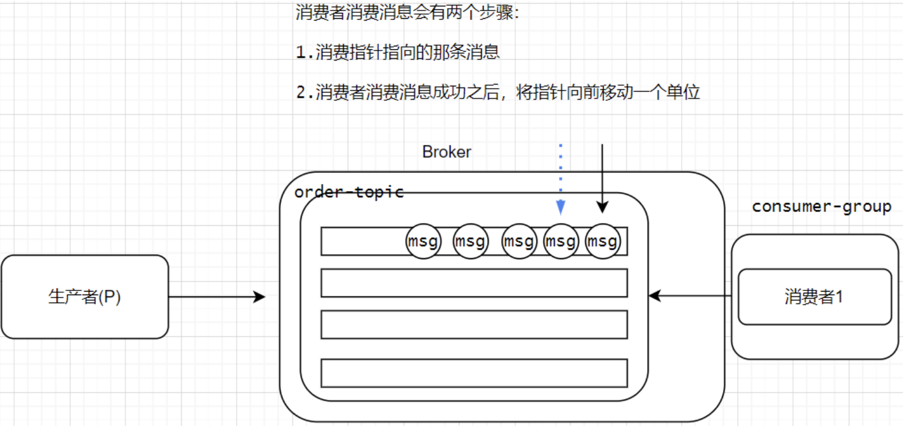

# 五、RocketMQ消息重复消费问题
## 5.1 为什么会出现消息重复消费的问题
在 **负载均衡模式(CLUSTERING)** 下, 如果一个 Topic 被多个 ConsumerGroup 消费，会出现消息重复消费的问题。在 CLUSTERING 模式下，即使在同一个消费者组里面，一个队列只会分配给一个消费者，看起来好像是不会重复消费。但是，有个特殊情况: **一个消费者新上线后，同组的所有消费者要重新负载均衡(反之一个消费者掉线后，也一样)**。一个队列所对应的新的消费者要获取之前消费的`offset`(偏移量，也就是消息消费的点位)，此时之前的消费者可能已经消费了一条消息，但是并没有把`offset`提交给`broker`，那么新的消费者可能会重新消费一次。

| ##container## |
|:--:|
||

那么如果在 CLUSTERING(负载均衡)模式 下，并且在同一个消费者组中，不希望一条消息被重复消费，改怎么办呢? 我们可以想到去重操作，找到消息唯一的标识，可以是`msgId`也可以是你自定义的唯一的`key`，这样就可以去重了。

## 5.2 搭建消息重复消费案例

```java
/**
 * 创建消息生产者 发送重复消息
 * @throws Exception
 */
@Test
public void testRepeatProducer() throws Exception{
    // 创建生产者
    DefaultMQProducer producer = new DefaultMQProducer("repeat-group-producer");
    // 设置nameserver地址
    producer.setNamesrvAddr("192.168.213.66:9876");
    // 启动生产者
    producer.start();
    // 生成消息的key
    String keyId = UUID.randomUUID().toString();
    System.out.println(keyId);
    // 准备消息
    Message msg = new Message("topicRepeat", "tagA", keyId, "这是一个重复消息".getBytes());
    Message repeatMsg = new Message("topicRepeat", "tagA", keyId, "这是一个重复消息".getBytes());
    // 发送消息
    SendResult send1 = producer.send(msg);
    SendResult send2 = producer.send(repeatMsg);
    System.out.println(send1);
    System.out.println(send2);
    // 关闭生产者实例
    producer.shutdown();
}
```

如果使用普通的消费者, 那么会输出两条`key`一样的id, 这可不行!

## 5.3 基于布隆过滤器解决消息重复消费
使用去重方案解决，例如将消息的唯一标识（key）存起来，然后每次消费之前先判断是否存在这个唯一标识，如果存在则不消费，如果不存在则消费，并且消费以后将这个标记保存。比如我们可以在数据库里面设计一个消息去重表，在消息去重表里面维护消息的key，消息body字段。并且将去重表的key字段设置成unique。每次在消费消息之前，先进行插入操作，如果插入失败(说明消息重复)不做任何消费操作，如果数据插入成功(说明消息不重复)，则执行业务操作。但是如果消息的体量是非常大的，可能在生产环境中会到达上千万甚至上亿条。使用数据表进行消息去重就不太合适了。

**我们可以选择布隆过滤器(BloomFilter)。**

布隆过滤器（Bloom Filter）是1970年由布隆提出的。它实际上是一个很长的二进制向量和一系列随机映射函数。布隆过滤器可以用于检索一个元素是否在一个集合中。它的优点是空间效率和查询时间都比一般的算法要好的多

- [布隆过滤器的文档](https://hutool.cn/docs/#/bloomFilter/%E6%A6%82%E8%BF%B0)

基于布隆过滤器的去重特性，我们可以在消费者端进行消息去重。

第一步: 引入布隆过滤器相关依赖(一开始已经给了)

```xml
<dependency>
    <groupId>cn.hutool</groupId>
    <artifactId>hutool-all</artifactId>
    <version>5.7.11</version>
</dependency>
```

第二步: 改造消费者代码

```java
// 初始化布隆过滤器
public static BitMapBloomFilter bloomFilter = new BitMapBloomFilter(100);

@Test
public void testRepeatConsumer() throws Exception{
    // 创建消费者组
    DefaultMQPushConsumer consumer = new DefaultMQPushConsumer("repeat-group-consumer");
    // 设置nameserver地址
    consumer.setNamesrvAddr("192.168.213.66:9876");
    // 设置订阅的主题
    consumer.subscribe("topicRepeat","tagA");
    // 注册一个监听,对消息进行消费
    consumer.registerMessageListener(new MessageListenerConcurrently() {
        @Override
        public ConsumeConcurrentlyStatus consumeMessage(List<MessageExt> msgs, ConsumeConcurrentlyContext consumeConcurrentlyContext) {
            String keys = msgs.get(0).getKeys(); // 获取消息的key
            // 判断这个key在布隆过滤器里面是否存在
            if(bloomFilter.contains(keys)) {
                // 之前已经消费过 是重复消费 不要再次消费消息
                return ConsumeConcurrentlyStatus.CONSUME_SUCCESS;
            }
            // 先将key值存储在布隆过滤器中
            bloomFilter.add(keys);
            // 消费消息
            System.out.println("消费者消费的消息是:" + new String(msgs.get(0).getBody()));
            System.out.println("消费的消息的标签是:" + msgs.get(0).getTags());
            return ConsumeConcurrentlyStatus.CONSUME_SUCCESS;
        }
    });
    // 启动消费者
    consumer.start();
    System.in.read();
}
```

再次运行生产者和消费者，我们发现控制台只会消费1条消息了。