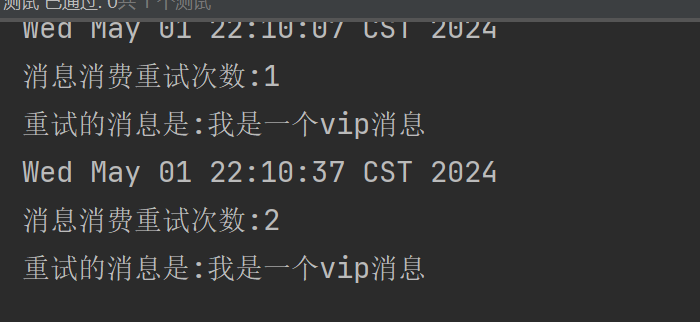

# 六、RocketMQ的消息重试和死信队列
## 6.1 消息发送重试
Producer对发送失败的消息进行重新发送的机制，称为消息发送重试机制，也称为消息重投机制。对于消息重投，我们需要明白几点:
> - 生产者在发送消息时，若采用同步或异步发送方式，发送失败会重试，但oneway消息发送方式发送失败是没有重试机制的。
>
> - 只有普通消息具有发送重试机制，顺序消息是没有的。
>
> - 消息重投机制可以保证消息尽可能发送成功、不丢失，但可能会造成消息重复。消息重复在RocketMQ中是无法避免的问题。
>
> - 消息发送重试有三种策略可以选择：同步发送失败策略、异步发送失败策略、消息刷盘失败策略。

**同步发送消息失败策略**:

对于普通消息，消息发送默认采用`round-robin`策略来选择所发送到的队列。如果发送失败，默认重试 2 次。但在重试时是不会选择上次发送失败的`Broker`，而是选择其它`Broker`。当然，若只有一个`Broker`其也只能发送到该`Broker`，但其会尽量发送到该`Broker`上的**其它**`Queue`。

```java
DefaultMQProducer producer = new DefaultMQProducer("retry-producer-group");
producer.setNamesrvAddr("192.168.213.66:9876");
// 设置同步发送失败时重试发送的次数，默认为 2 次
producer.setRetryTimesWhenSendFailed(3);
```

**异步发送消息失败策略**:

异步发送失败重试时，异步重试不会选择其他`broker`，仅在同一个`broker`上做重试，所以该策略无法保证消息不丢。

```java
DefaultMQProducer producer = new DefaultMQProducer("retry-producer-group");
producer.setNamesrvAddr("192.168.213.66:9876");
// 指定异步发送失败后进行重试发送的次数，默认为 2 次
producer.setRetryTimesWhenSendAsyncFailed(2);
```

**消息刷盘失败策略**:

消息刷盘**超时**(Master或Slave)或`slave`**不可用**(`slave`在做数据同步时向`master`返回状态不是`SEND_OK`)时，默认是**不会**将消息尝试发送到其他Broker的。不过，对于**重要消息**可以通过在Broker的配置文件设置`retryAnotherBrokerWhenNotStoreOK`属性为`true`来开启。

## 6.2 消息消费重试机制
**顺序消息的消费重试**:

对于顺序消息，当Consumer消费消息失败后，为了保证消息的顺序性，其会自动不断地进行消息重试，直到消费成功。消费重试默认间隔时间为 1000 毫秒。重试期间应用会出现消息消费被阻塞的情况。

```java
DefaultMQPushConsumer consumer = new DefaultMQPushConsumer("retry-consumer-group");
// 顺序消息消费失败的消费重试时间间隔，单位毫秒，默认为 1000 ，其取值范围为[10,30000]
consumer.setSuspendCurrentQueueTimeMillis(100);
```
> 由于对顺序消息的重试是无休止的，不间断的，直至消费成功，所以，对于顺序消息的消费，务必要保证应用能够及时监控并处理消费失败的情况，避免消费被永久性阻塞。
>
> 注意，顺序消息没有发送失败重试机制，但具有消费失败重试机制。

**无序消息的消费重试**:

对于无序消息（普通消息、延时消息、事务消息），当Consumer消费消息失败时，可以通过设置返回状态达到消息重试的效果。不过需要注意，无序消息的重试`只对集群消费方式生效`，广播消费方式不提供失败重试特性。即对于广播消费，消费失败后，失败消息不再重试，继续消费后续消息。

对于`无序消息集群`消费下的重试消费，每条消息默认最多重试 16 次，但每次重试的间隔时间是不同的，会逐渐变长。每次重试的间隔时间如下表。
下面是根据您提供的重试次数和相应的间隔时间整理的表格：

| 重试次数 | 间隔时间| 重试次数 | 间隔时间|
|:--:|:--:|:--:|:--:|
| 1| 10秒 | 9| 7分钟 |
| 2| 30秒 | 10 | 8分钟 |
| 3| 1分钟| 11 | 9分钟 |
| 4| 2分钟| 12 | 10分钟|
| 5| 3分钟| 13 | 20分钟|
| 6| 4分钟| 14 | 30分钟|
| 7| 5分钟| 15 | 1小时 |
| 8| 6分钟| 16 | 2小时 |

> 若一条消息在一直消费失败的前提下，将会在正常消费后的`第 4 小时 46 分`后进行第 16 次重试。若仍然失败，则将消息投递到`死信队列`。

当然我们也可以修改消息消费的重试次数:

```java
DefaultMQPushConsumer consumer = new DefaultMQPushConsumer("retry-consumer-group");
// 修改消费重试次数
consumer.setMaxReconsumeTimes(10);
```

## 6.3 消息重试案例搭建
创建消息生产者:

```java
// 创建消息生产者
@Test
public void retryProducer() throws Exception{
    DefaultMQProducer producer = new DefaultMQProducer("retry-producer-group");
    producer.setNamesrvAddr("192.168.213.66:9876");
    producer.start();
    // 生产者设置消息发送失败的重试次数
    producer.setRetryTimesWhenSendFailed(2); // 发送同步消息失败重试的次数设置
    producer.setRetryTimesWhenSendAsyncFailed(2); // 发送异步消息失败重试的次数设置
    // 准备消息
    Message message = new Message("retryTopic", "vip1", UUID.randomUUID().toString(), "我是一个vip消息".getBytes());
    // 发送消息
    producer.send(message);
    // 关闭生产者实例
    producer.shutdown();
}
```

创建消息消费者:

```java
// 创建消息消费者
@Test
public void retryConsumer() throws Exception{
    DefaultMQPushConsumer consumer = new DefaultMQPushConsumer("retry-consumer-group");
    consumer.setNamesrvAddr("192.168.213.66:9876");
    // 设置订阅的主体
    consumer.subscribe("retryTopic", "*");
    // 设置消费者重试次数
    consumer.setMaxReconsumeTimes(2);
    // 注册监听器
    consumer.registerMessageListener(new MessageListenerConcurrently() {
        @Override
        public ConsumeConcurrentlyStatus consumeMessage(List<MessageExt> msgs, ConsumeConcurrentlyContext consumeConcurrentlyContext) {
            MessageExt messageExt = msgs.get(0);
            System.out.println(new Date());
            System.out.println("消息消费重试次数:" + messageExt.getReconsumeTimes());
            System.out.println("重试的消息是:" + new String(messageExt.getBody()));
            // 返回 RECONSUME_LATER 都会进行消费重试
            return ConsumeConcurrentlyStatus.RECONSUME_LATER;
        }
    });
    // 启动生产者
    consumer.start();
    System.in.read();
}
```

现在分别启动生产者、启动消费者查看控制台效果:

| ##container## |
|:--:|
||

前面我们知道，默认会进行16次重试消费，如果依然重试不成功，消息就会进入死信队列。所以我们可以创建一个消费者专门来消费死信队列里面的消息。死信队列其实就是一个特殊的Topic。名称是: `%DLQ%consumerGroup`

```java
@Test
public void retryDeadConsumer() throws Exception{
    DefaultMQPushConsumer consumer = new DefaultMQPushConsumer("retry-dead-group");
    consumer.setNamesrvAddr("192.168.213.66:9876");
    consumer.subscribe("%DLQ%retry-consumer-group", "*");
    // 注册监听器
    consumer.registerMessageListener(new MessageListenerConcurrently() {
        @Override
        public ConsumeConcurrentlyStatus consumeMessage(List<MessageExt> msgs, ConsumeConcurrentlyContext consumeConcurrentlyContext) {
            MessageExt messageExt = msgs.get(0);
            System.out.println(new Date());
            System.out.println("消费死信队列里面的消息是:" + new String(messageExt.getBody()));
            // 返回RECONSUME_LATER 都会进行消费重试
            return ConsumeConcurrentlyStatus.CONSUME_SUCCESS;
        }
    });
    // 启动生产者
    consumer.start();
    System.in.read();
}
```

有一种方案: 我们还可以自定义重试次数，如果超过了重试次数，我们直接记录消息，进行 人工处理。

> 具体代码: 略, 核心就是`messageExt.getReconsumeTimes()`(尝试)的次数如果大于某个设定值, 就报人工处理!

## 6.4 认识死信队列
什么是死信队列: 当一条消息初次消费失败，消息队列会自动进行消费重试；达到最大重试次数后，若消费依然失败，则表明消费者在正常情况下无法正确地消费该消息，此时，消息队列不会立刻将消息丢弃，而是将其发送到该消费者对应的特殊队列中。这个队列就是死信队列（Dead-Letter Queue，DLQ），而其中的消息 则称为死信消息（Dead-Letter Message，DLM）。**一句话: 死信队列是用于处理无法被正常消费的消息的**。

死信队列具有如下特性:
> - 死信队列中的消息不会再被消费者正常消费，即DLQ对于消费者是不可见的
>
> - 死信存储有效期与正常消息相同，均为 3 天(`commitlog`文件的过期时间)，3 天后会被自动删除
>
> - 死信队列就是一个特殊的Topic，名称为`%DLQ%consumerGroup@consumerGroup`，即每个消费者组都有一个死信队列
>
> - 如果一个消费者组未产生死信消息，则不会为其创建相应的死信队列

**死信队列的处理**:

实际上，当一条消息进入死信队列，就意味着系统中某些地方出现了问题，从而导致消费者无法正常消费该消息，比如代码中原本就存在Bug。因此，对于死信消息，通常需要开发人员进行特殊处理。最关键的步骤是要排查可疑因素，解决代码中可能存在的Bug，然后再将原来的死信消息再次进行投递消费。