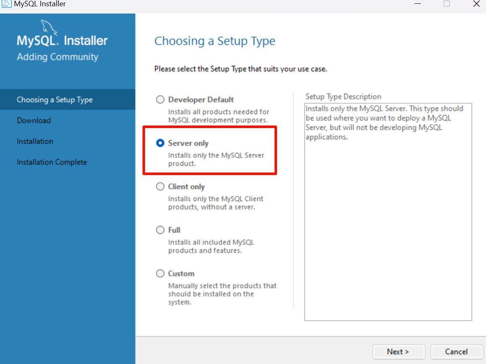
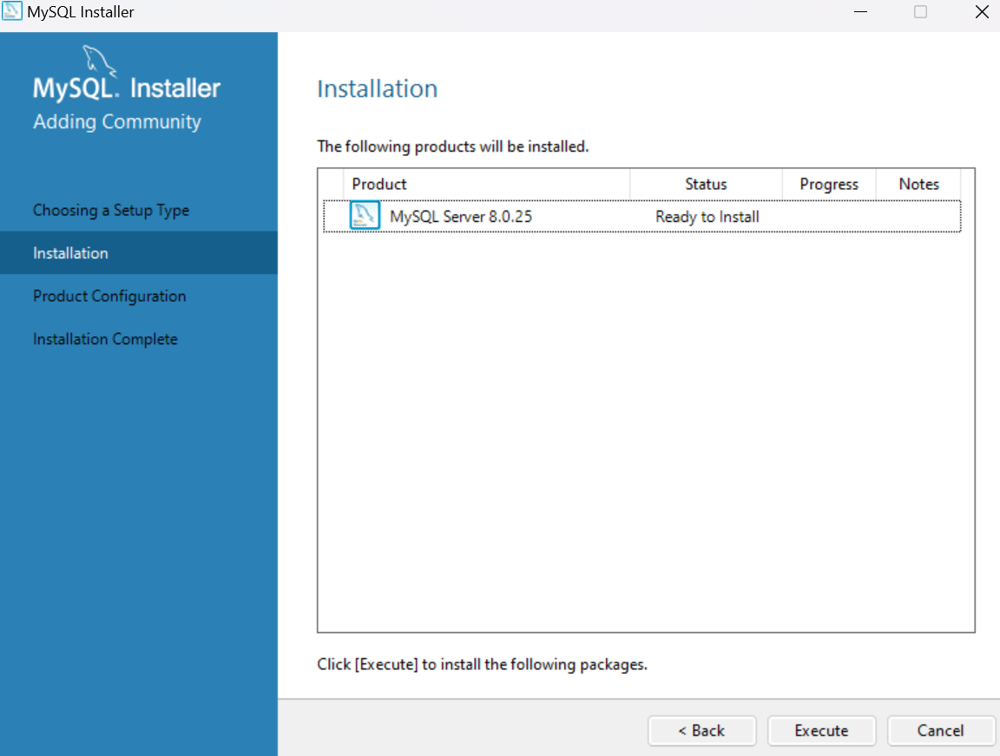
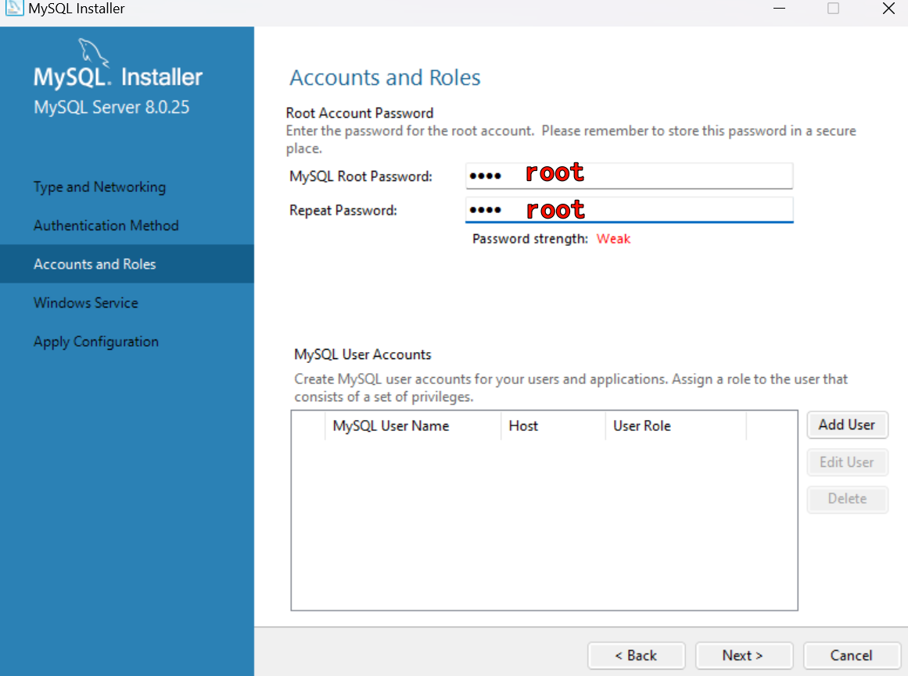
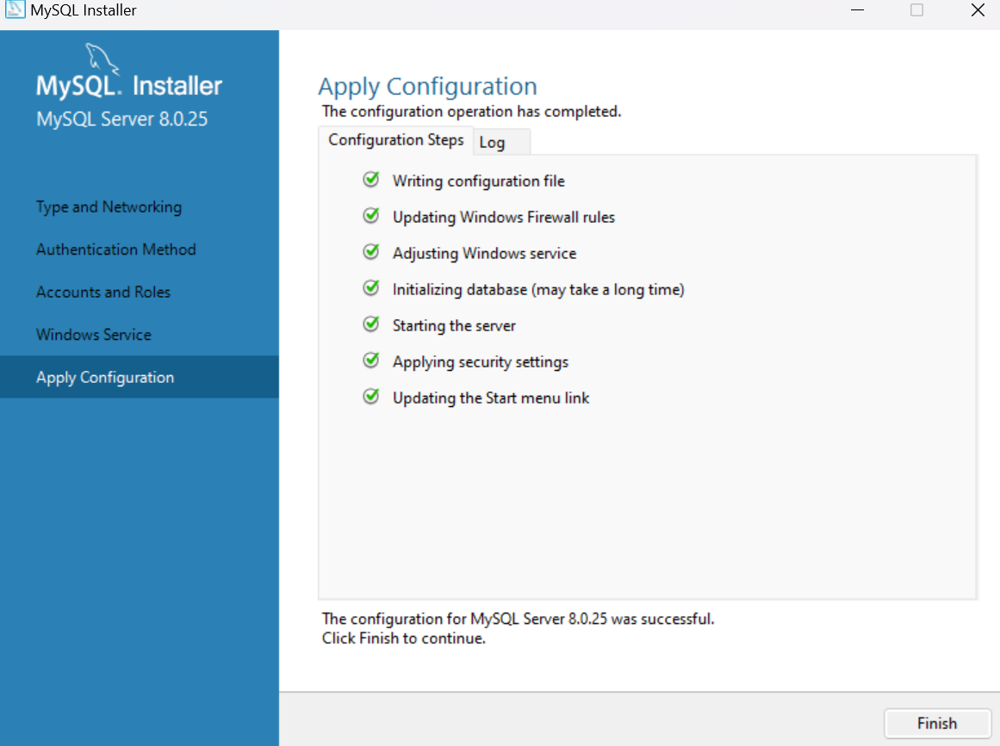

#  MySQL介绍和安装
## MySQL 介绍
MySQL 是目前最流行的开源的、免费的关系型数据库，适用于中小型甚至大型互联网应用，能够在`windows`和`linux`平台上部署

MySQL, Oracle 属于Oracle公司

## MySQL 安装
### win
#### 通过安装包安装
建议初始密码设置为root (后面可以改)

选择安装服务端



如果没有下载就下载



然后直接`next`



没有问题就安装完成了



#### 简单测试使用: 连接数据库
打开默认安装路径 `C:\Program Files\MySQL\MySQL Server 8.0\bin`

打开命令窗口，在命令窗口中按如下语法输入命令:
```cmd
mysql -h MySQL数据库服务器的IP地址 -u 用户名 -p
```

```cmd
C:\Program Files\MySQL\MySQL Server 8.0\bin>mysql -h localhost -u root -p
Enter password: ****
Welcome to the MySQL monitor.  Commands end with ; or \g.
Your MySQL connection id is 11
Server version: 8.0.25 MySQL Community Server - GPL

Copyright (c) 2000, 2021, Oracle and/or its affiliates.

Oracle is a registered trademark of Oracle Corporation and/or its
affiliates. Other names may be trademarks of their respective
owners.

Type 'help;' or '\h' for help. Type '\c' to clear the current input statement.

mysql>
```
- `localhost`是指连接到本地主机
- 看到`mysql>`就是已经连接了!