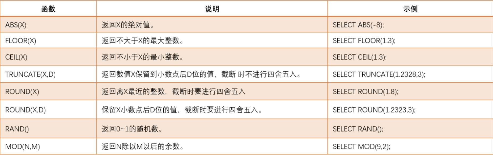
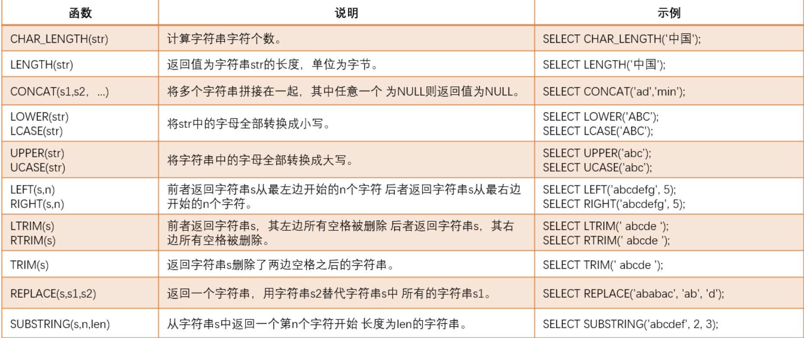
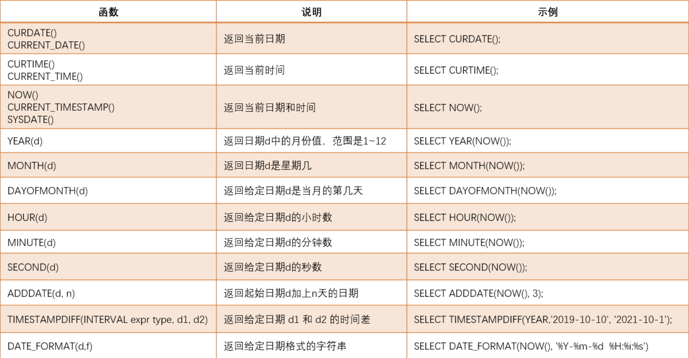
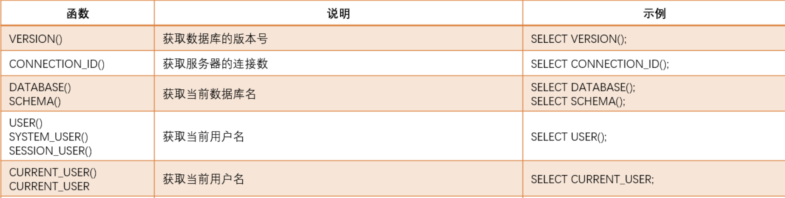

# 常用数学函数



示例:
```sql
SELECT ABS(-1); -- 绝对值

SELECT FLOOR(1.3); -- 返回不大于它的最大整数

SELECT CEIL(1.3); -- 返回不小于它的最小整数

SELECT TRUNCATE(0.721,1); -- 取整, 截断的

SELECT ROUND(1.1), ROUND(-1.123, 1); -- 四舍五入数字部分

SELECT RAND(); -- 随机数

SELECT MOD(4, 3); -- 取模
```

# 常用字符函数



示例:

```sql
SELECT CHAR_LENGTH('字符串'); -- 查询字符个数

SELECT LENGTH('字符串'); -- 查询字节个数

SELECT CONCAT('字符串','拼接',' 可变参数哦~','...'); -- 拼接字符串

SELECT LOWER('strSTR') as '转小写', UPPER('strSTR') as '变大写'; -- 大小写转化

SELECT LEFT('abcdef',2), RIGHT('abcdef', 2); -- 取头尾字符

SELECT LTRIM('  空格  不见  '), RTRIM('  空格  不见  '), TRIM('  空格  不见  '); -- 去左/右/左右空格

SELECT REPLACE('str to STR','str','STR'); -- 把字符串的 str 替换为 STR

SELECT SUBSTRING('abcdfeg', 2, 3); -- 返回从第2个字符开始, 长度为3的字符串
```

综合练习:
```sql
-- 查询计科和软工各有多少人
SELECT LEFT(class, 2), COUNT(*) FROM stu GROUP BY LEFT(class, 2);

-- 查询名字有4个字的学生信息
SELECT * FROM stu WHERE CHAR_LENGTH(`name`) = 4;

-- 查询成绩能够被10整除的考试信息
SELECT * FROM score WHERE MOD(score, 10) = 0;
```

# 日期和时间函数



示例:
```sql
-- 返回当前的日期/时间/日期时间
SELECT CURDATE() as '日期', CURTIME() as '时间', NOW() as '日期时间';

-- 截取日期的 年/月/日
SELECT     YEAR(NOW()),
                MONTH(NOW()),
                DAY(NOW());

-- 计算天数
SELECT    DAYOFYEAR(NOW()) as '一年的第几天',
                DAYOFMONTH(NOW()) as '一个月的第几天', 
                DAYOFWEEK(NOW()) as '一周的第几天(周日为第一天)';

-- 截取日期的 时/分/秒                
SELECT HOUR(NOW()), MINUTE(NOW()), SECOND(NOW());

-- 对日期的 日 进行加减
SELECT ADDDATE(NOW(), 3), ADDDATE(NOW(),-3);

-- 计算时间差: 最后一个参数 减去 前一个参数
SELECT TIMESTAMPDIFF(DAY, '2020-01-21', NOW());

-- 格式化时间
SELECT DATE_FORMAT(NOW(), '%Y-%m-%d 二十四小时制[%H:%i:%s] 十二小时制[%h:%i:%s]');
```

补充, 查找: [mysql日期范围查找（两个日期之间的记录）](https://blog.csdn.net/lzxlfly/article/details/97577575)
```sql
where time between time and time

SELECT * FROM k_student WHERE create_time  between '2019-07-25 00:00:33' and '2019-07-25 00:54:33'
```


练习:

```sql
-- 查询年龄在20岁以上的学生信息
SELECT * FROM stu WHERE TIMESTAMPDIFF(YEAR, birthday, NOW()) > 20;

-- 查询今天过生日的学生信息
SELECT * FROM stu WHERE MONTH(birthday) = MONTH(NOW()) AND DAY(birthday) = DAY(NOW());

-- 查询本周(指 周一到周日, 而不是 周日到周六)过生日的学生信息 (不考虑跨年的情况=-=)
SELECT * FROM stu WHERE DAYOFYEAR(ADDDATE(NOW(), 2 - DAYOFWEEK(NOW()))) <= DAYOFYEAR(birthday) AND DAYOFYEAR(birthday) <= DAYOFYEAR(ADDDATE(NOW(), 8 - DAYOFWEEK(NOW())));
```

# 条件判断函数
## IF函数

```sql
-- 如果条件满足，则使用表达式1,否则使用表达式2
IF(条件, 表达式1, 表达式2)
```

示例:

```sql
-- IF 函数: 显示学生成绩(及格与不及格)
SELECT *, IF(score >= 60, '及格', '不及格') as 成绩 FROM score;
```

## IFNULL函数

```sql
-- 如果字段值为空，则使用表达式，否则，使用字段值
IFNULL(字段, 表达式)
```

示例:

```sql
-- 将未参加考试的学生成绩展示为缺考
SELECT *, IFNULL(score, '缺考') as 成绩 FROM score;
```

## CASE...WHEN 语句
### CASE WHEN
语法

```sql
CASE WHEN 条件1 THEN 表达式1 [WHEN 条件2 THEN 表达式2 ...] ELSE 表达式n END
```

如果条件1满足，则使用表达式1；【如果条件2满足，则使用表达式2， ... 】否则，使用表达式n。相当于Java中的多重if..else语句。


示例:
```sql
-- CASE WHEN
SELECT id, `stu_name`, (CASE WHEN (course = 'Java') THEN score ELSE 0 END) as 'Java' FROM score;

-- 行转列
SELECT id, `stu_name`, 
MAX(CASE WHEN (course = 'Java') THEN score ELSE 0 END) as 'Java',
MAX(CASE WHEN (course = 'Html') THEN score ELSE 0 END) as 'Html',
MAX(CASE WHEN (course = 'Jsp') THEN score ELSE 0 END) as 'Jsp',
MAX(CASE WHEN (course = 'Spring') THEN score ELSE 0 END) as 'Spring'
FROM score GROUP BY `stu_name`;
```

## CASE ... WHEN语句

语法

```sql
CASE 表达式 WHEN 值1 THEN 表达式1 [WHEN 值2 THEN 表达式2 ...] ELSE 表达式n END
```

示例:

```sql
-- CASE ... WHEN
SELECT id, `stu_name`, CASE course WHEN 'Java' THEN score ELSE 0 END as 'Java' FROM score;

-- 行转列
SELECT id, `stu_name`, 
MAX(CASE course WHEN 'Java' THEN score ELSE 0 END) as 'Java',
MAX(CASE course WHEN 'Html' THEN score ELSE 0 END) as 'Html',
MAX(CASE course WHEN 'Jsp' THEN score ELSE 0 END) as 'Jsp',
MAX(CASE course WHEN 'Spring' THEN score ELSE 0 END) as 'Spring'
FROM score GROUP BY `stu_name`;
```

## 区别

```sql
--- 需要等于, 才会执行后面的 类似于swith
SELECT name, 
       CASE grade
           WHEN 'A' THEN 'Excellent'
           WHEN 'B' THEN 'Good'
           ELSE 'Average'
       END AS performance
FROM students;

-- 不一定是等于, 可以是自己定义的式子, 类似与if
SELECT name,
       CASE 
           WHEN score >= 90 THEN 'Excellent'
           WHEN score >= 80 THEN 'Good'
           ELSE 'Average'
       END AS performance
FROM students;
```

练习

```sql
-- 查询各班级性别人数，查询结果格式: |班级|男|女|其他|
SELECT class AS '班级',
SUM(CASE sex WHEN 0 THEN 1 ELSE 0 END) as '男',
SUM(CASE sex WHEN 1 THEN 1 ELSE 0 END) as '女',
SUM(CASE sex WHEN 2 THEN 1 ELSE 0 END) as '其他'
FROM stu GROUP BY class;
```

# 其他函数
## 数字格式化函数

```sql
-- 将数字X格式化，将X保留到小数点后D位，截断时要进行四舍五入。
FORMAT(X,D)
```

## 系统信息函数




示例:
```sql
-- 获取数据库版本号
SELECT VERSION();

-- 获取服务器连接数
SELECT CONNECTION_ID();

-- 获取当前库名
SELECT DATABASE(), SCHEMA();

-- 获取当前用户名
SELECT USER(), SYSTEM_USER(), SESSION_USER(), CURRENT_USER(), CURRENT_USER; 
```
