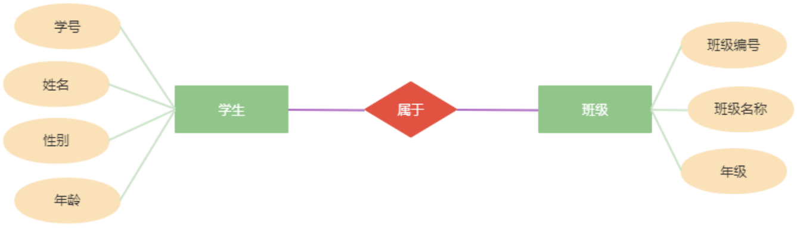
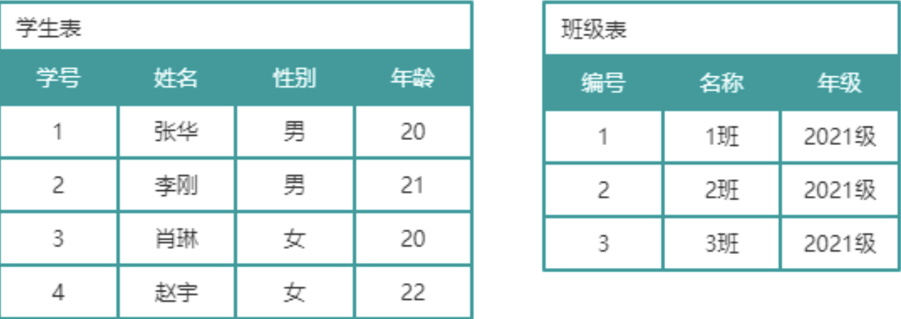
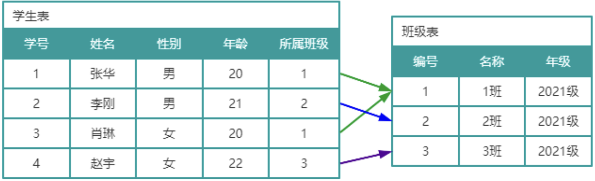
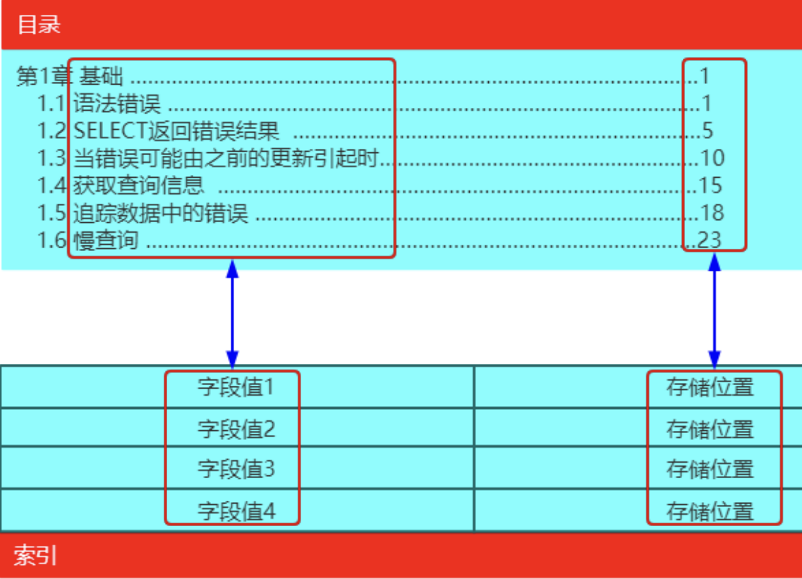
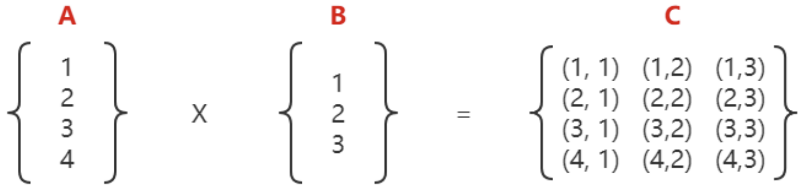

# 多表查询
## 表与表之间的关系
### 1. 表与表之间的关系
数据表是用来描述实体信息的，比如可以使用数据表来描述学生信息，也可以用数据表来描述班级信息，这样就会存在学生表和班级表。而学生和班级显然存在着一种关系：

| ##container## |
|:--:|
||

这种关系在数据库中体现就称之为表与表之间的关系。数据库通过主外键关联关系来体现表与表之间的关联关系。

### 2. 主外键关联关系
| ##container## |
|:--:|
||

如图所示，此时学生表和班级表并没有任何关系，然而实际上学生和班级是存在归属关系。可以在学生表中添加一个字段，表名该学生所属班级，该字段值使用的是班级表中的主键，在学生表中称之为外键。这样学生表中的所属班级（外键）与班级表中的编号（主键）就产生关联关系，这种关联关系称为主外键关联关系。

| ##container## |
|:--:|
||

### 3. 主外键关联关系的定义

```sql
DROP TABLE IF EXISTS cls;
CREATE TABLE cls(
    number INT(11) AUTO_INCREMENT NOT NULL PRIMARY KEY COMMENT '班级编号，主键',
    name VARCHAR(20) NOT NULL COMMENT '班级名称',
    grade VARCHAR(20) NOT NULL COMMENT '年级'
)ENGINE=InnoDB CHARSET=UTF8 COMMENT='班级表';

DROP TABLE IF EXISTS student;
CREATE TABLE student(
    number BIGINT(20) AUTO_INCREMENT NOT NULL COMMENT '学号，主键',
    name VARCHAR(20) NOT NULL COMMENT '姓名',
    sex VARCHAR(2) DEFAULT '男' COMMENT '性别',
    age TINYINT(3) DEFAULT 0 COMMENT '年龄',
    cls_number INT(11) NOT NULL COMMENT '所属班级',
    -- 设置主键
    PRIMARY KEY(number),
    -- 字段cls_number与cls表中的number字段相关联
    FOREIGN KEY(cls_number) REFERENCES cls(number) -- 关联后, 如果插入数据的`number`在`cls_number`中不存在, 则会报错, 相当于多了一层保障
)ENGINE=InnoDB CHARSET=UTF8 COMMENT='学生表';
```

### 4. 约束
#### 4.1 主键约束

```sql
-- 添加主键约束：保证数据的唯一性
ALTER TABLE 表名 ADD PRIMARY KEY(字段名1,字段名2, ..., 字段名n)
-- 删除主键约束
ALTER TABLE 表名 DROP PRIMARY KEY;
```

#### 4.2 外键约束

```sql
-- 添加外键约束
ALTER TABLE 表名1 ADD CONSTRAINT 外键名称 FOREIGN KEY(表名1的字段名) REFERENCES 表名
2(表名2的字段名);
-- 删除外键约束
ALTER TABLE 表名 DROP FOREIGN KEY 外键名称;
```

#### 4.3 唯一约束

```sql
-- 为字段添加唯一约束
ALTER TABLE 表名 ADD CONSTRAINT 约束名称 UNIQUE(字段名1, 字段名2, ..., 字段名n);
-- 删除字段的唯一约束
ALTER TABLE 表名 DROP KEY 约束名称;
```

#### 4.4 非空约束

```sql
-- 为字段添加非空约束
ALTER TABLE 表名 MODIFY 字段名 列类型 NOT NULL;
-- 删除字段非空约束
ALTER TABLE 表名 MODIFY 字段名 列类型 NULL;
```

#### 4.5 默认值约束

```sql
-- 为字段添加默认值
ALTER TABLE 表名 ALTER 字段名 SET DEFAULT 默认值;
-- 删除字段的默认值
ALTER TABLE 表名 ALTER 字段名 DROP DEFAULT;
```

#### 4.6 自增约束

```sql
-- 为字段添加自增约束
ALTER TABLE 表名 MODIFY 字段名 列类型 AUTO_INCREMENT;
-- 为字段删除自增约束
ALTER TABLE 表名 MODIFY 字段名 列类型;
```

## 索引
### 1. 什么是索引
在关系数据库中，索引是一种单独的、物理的对数据库表中一列或多列的值进行排序的一种存储结构，它是表中一列或多列值的集合和相应的指向表中物理标识这些值的数据页的逻辑指针清单。

| ##container## |
|:--:|
||
|索引可以对比书籍的目录来理解|

### 2. 索引的作用
- 保证数据的准确性
- 提高检索速度
- 提高系统性能

### 3. 索引的类型
- 唯一索引（UNIQUE）：不可以出现相同的值，可以有`NULL`值
- 普通索引（INDEX）：允许出现相同的索引内容
- 主键索引（PRIMARY KEY）：不允许出现相同的值
- 全文索引（FULLTEXT INDEX）：可以针对值中的某个单词，但效率确实不敢恭维
- 组合索引：实质上是将多个字段建到一个索引里，列值的组合必须唯一
    - 即 `ALTER TABLE 表名 ADD CONSTRAINT 约束名称 UNIQUE(字段名1, 字段名2, ..., 字段名n); n >= 2时候`

### 4. 索引的创建、查看、删除

```sql
-- 创建索引
ALTER TABLE 表名 ADD INDEX 索引名称 (字段名1, 字段名2, ..., 字段名n);
-- 创建全文索引
ALTER TABLE 表名 ADD FULLTEXT 索引名称 (字段名1, 字段名2, ..., 字段名n);
-- 查看索引
SHOW INDEX FROM 表名;
-- 删除索引
ALTER TABLE 表名 DROP INDEX 索引名称;
```

### 5. 使用索引的注意事项
- 虽然索引大大提高了查询速度，但也会降低更新表的速度，比如对表进行`INSERT`,`UPDATE`和`DELETE`操作，此时，数据库不仅要保存数据，还要保存一下索引文件
- 建立索引会占用磁盘空间的索引文件。如果索引创建过多（尤其是在字段多、数据量大的表上创建索引），就会导致索引文件过大，这样反而会降低数据库性能。因此，索引要建立在经常进行查询操作的字段上
- 不要在列上进行运算（包括函数运算），这会忽略索引的使用
    - 当在查询中对列进行运算或者使用函数处理时（例如`SELECT * FROM table WHERE YEAR(column) = 2021`），数据库系统需要对每一行的`column`列应用`YEAR()`函数后，再与`2021`进行比较。这个过程中，即使`column`列上有索引，数据库系统也无法直接利用该索引，因为索引是针对列原始数据构建的，而不是运算或函数处理后的结果。

    - 这就意味着，尽管存在索引，数据库仍然需要对每一行数据进行运算，这实际上退化成了全表扫描，从而大大降低了查询效率。
        - 如何避免:
          
          避免在`WHERE`子句中对列进行运算：尽量让WHERE子句中的条件直接对列进行比较，而不是列的运算或函数处理结果。
          
          预计算：如果某些运算或函数处理是必需的，可以考虑将结果预先计算并存储在数据库中的另一个列中，并对这个列建立索引。
          
          使用函数索引（如果支持）：一些数据库管理系统支持在函数的结果上创建索引，这被称为函数索引或表达式索引。但这种支持不是所有数据库系统都有，且具体实现可能有所不同。 
- 不建议使用`like`操作，如果非使用不可，注意正确的使用方式。`like '%查询内容%'`不会使用索引，而`like '查询内容%'`可以使用索引
- 避免使用`IS NULL`、`NOT IN`、`<>`、`!=`、`OR`操作，这些操作都会忽略索引而进行全表扫描

## 多表查询
### 1. 笛卡尔积
笛卡尔积又称为笛卡尔乘积，由笛卡尔提出，表示两个集合相乘的结果。

| ##container## |
|:--:|
||
|4 x 3 = 12|

笛卡尔积与多表查询有什么关系呢？每一张表可以看做是一个数据的集合，多表关联串时，这些表中的数据就会形成笛卡尔积。

```sql
-- 没有指定的进行多表查询, 会变成笛卡尔积
SELECT COUNT(*) FROM stu as '1k条', score as '4k条'; -- 输出: 1k x 4k
```

### 2. 内连接
内连接相当于在笛卡尔积的基础上加上了连接条件。当没有连接条件时，内连接上升为笛卡尔积。

```sql
-- 语法一 (效率高)
SELECT 字段名1, 字段名2, ..., 字段名n FROM 表1 [INNER] JOIN 表2 [ON 连接条件];

-- 语法二 (效率更低)
SELECT 字段名1, 字段名2, ..., 字段名n FROM 表1, 表2 [WHERE 关联条件 AND 查询条件];

-- 不过我没有太看出区别
```

示例:

```sql
SELECT COUNT(*) FROM stu INNER JOIN score ON stu.id = score.stu_id;

SELECT COUNT(*) FROM stu a, score b WHERE a.id = b.stu_id;
```

### 3.外连接
外连接涉及到两张表：主表和从表，要查询的信息主要来自于哪张表，哪张表就是主表。

<span style="color:red">外连接查询的结果为主表中所有的记录。如果从表中有和它匹配的，则显示匹配的值，这部分相当于内连接查询出来的结果；如果从表中没有和它匹配的，则显示`null`。</span>

<span style="color:red">外连接查询的结果 = 内连接的结果 + 主表中有的而内连接结果中没有的记录</span>

外连接分为左外连接和右外连接两种。
- 左外连接使用`LEFT JOIN`关键字，`LEFT JOIN`左边的是主表；右外连接使用`RIGHT JOIN`关键字，`RIGHT JOIN`右边的是主表。

#### 3.1 左外连接

```sql
SELECT 字段名1, 字段名2, ..., 字段名n FROM 主表 LEFT JOIN 从表 [ON 连接条件];
```

示例:

```sql
-- 外连接
SELECT * FROM stu LEFT JOIN score ON stu.id = score.stu_id; -- WHERE score IS NULL;
```

#### 3.2 右外连接

```sql
SELECT 字段名1, 字段名2, ..., 字段名n FROM 从表 RIGHT JOIN 主表 [ON 连接条件];
```
示例:

```sql
SELECT * FROM score RIGHT JOIN stu ON stu.id = score.stu_id; -- WHERE score.course = 'Jvav';
```

## 子查询
### 1. 什么是子查询
子查询就是嵌套在其他查询中的查询。因此，子查询出现的位置只有3种情况：在`SELECT... FROM` 之间、在`FROM...WHERE`之间、在`WHERE`之后。

### 2. SELECT ... FROM之间
<b style="color:red">执行时机是在查询结果出来之后</b>

示例:

```sql
-- 额外创建了一个映射表: dict
-- id  type
-- 0    男
-- 1    女
-- 2    其他

-- 查询stu表所有学生信息，并将性别按男、女、其他展示
SELECT
a.id,
a.`name`,
(SELECT dict.type FROM dict WHERE dict.id = a.sex) sex,
a.birthday,
a.class
FROM stu AS a;
```

### 3. FROM ... WHERE 之间
<b style="color:red">执行时机是一开始就执行</b>

```sql
-- 查询年龄与Java成绩都与汤辰宇的年龄与Java成绩相同的学生信息
SELECT stu.*, score.* FROM stu 
INNER JOIN 
    score ON stu.id = score.stu_id 
INNER JOIN 
    (SELECT
      TIMESTAMPDIFF(YEAR, stu.birthday, NOW()) age,
        score.score FROM stu 
    INNER JOIN 
    score 
    ON stu.id = score.stu_id 
    WHERE stu.`name` = '汤辰宇' AND score.course = 'Java') AS tcy 
    ON TIMESTAMPDIFF(YEAR, stu.birthday,NOW()) = tcy.age AND score.score = tcy.score
WHERE score.course = 'Java';
```

### 4. WHERE 之后
<b style="color:red">只能比较一个值</b>

```sql
-- 查询Java成绩最高的学生信息
SELECT stu.*, score.* FROM stu
INNER JOIN score
ON stu.id = score.stu_id
WHERE score.course = 'Java'
AND score.score = (SELECT MAX(score) FROM score WHERE course = 'Java');
```
